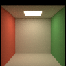
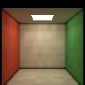
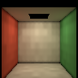
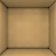
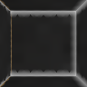
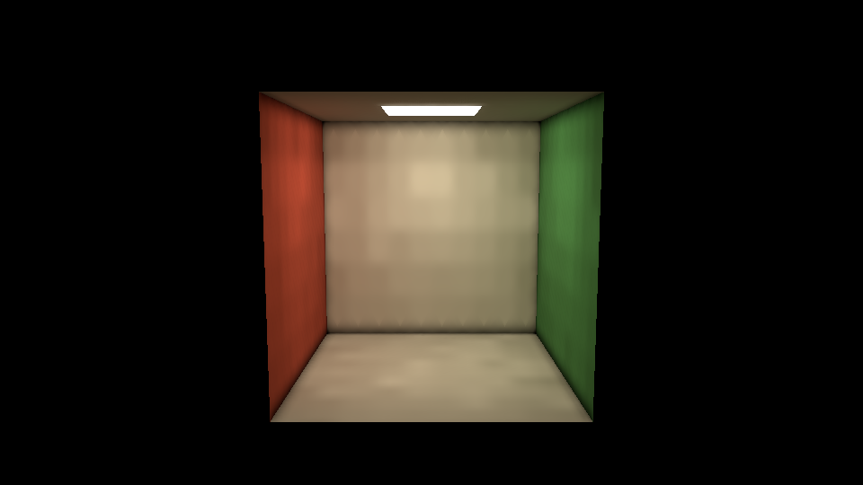

# OpenGL DDGI 验证（2026-09-15）

在 Windows、RTX 3050 Laptop 4 GiB、驱动 616.56、CUDA 13.3、MSVC x64、Ninja Release 上验证。基线为 `60572bf`，本次改动尚未提交。CUDA 构建显式设置 `RENDERER_CUDA=ON`、SM 86；另有 `RENDERER_CUDA=OFF` 的独立构建。两者均保持 `RENDERER_OPTIX=OFF`，本次不验证 OptiX。

## 实现与回归

DDGI 的 12 个测试覆盖数值、动态变化、OpenGL 接入和生命周期。CUDA CTest 为 **10/11 通过**，唯一失败是已有的 `test_realtime_glass_split_preserves_fresnel_energy`：stochastic MSE 26.9986，split MSE 0.0213528，未满足原断言 `< 1e-7`。该测试和 RTRT 玻璃实现未在本次修改中调整。详见 [CUDA CTest 日志](output/ddgi-2026-09-15/cuda-ctest.log)。

无 CUDA 构建的 CTest 为 **10 个通过、1 个跳过、0 个失败**。`rtrt_hybrid_tests` 因无 CUDA 跳过；DDGI 的纯 CPU 参数检查与 OpenGL 不可用设备处理正常，GPU 子测试按构建能力跳过。[无 CUDA CTest 日志](output/ddgi-2026-09-15/no-cuda-ctest.log)。

在 CUDA 构建上以 `DDGI_REQUIRE_GPU=1` 运行 Compute Sanitizer `memcheck --leak-check full --error-exitcode 99`，DDGI **12 个测试通过、0 个失败、0 个跳过**，进程退出码 0，报告 `ERROR SUMMARY: 0 errors` 和 `LEAK SUMMARY: 0 bytes leaked in 0 allocations`。[完整检查日志](output/ddgi-2026-09-15/sanitizer.log)。

实际查看器测试发现并修复了默认 AO/SSR 组合的问题：SSR 的 Hi-Z 阶段结束后视口为 1×1，AO 阶段需要显式恢复全屏视口。新增测试在首次启动默认组合时检查颜色，随后覆盖 AO/SSR 四种组合，防止先切换开关填充 AO 缓冲后掩盖问题。

金属的 DDGI 漫反射为零；恒定环境辐照度等于 πL；辐照度和距离图集边界满足八面体镜像约束。LTC 对应发光连接从探针场剔除，关闭 LTC 后恢复发光贡献。主环境光自动提取与显式方向光加残余 HDR 的探针结果在 `2e-5` 容差内一致，包含环境旋转和强度。SSR GGX/Kulla–Conty 白炉同时测试 DDGI 开启和关闭。

## 画质

Cornell 使用 96×96、8 次反弹、1024 spp CUDA 离线参考；DDGI 使用默认 12×8×12 布局、256 条照明射线、每帧 256 探针，收敛 96 帧。比较后墙固定区域：左上角 `(28,34)`，右下角 `(68,62)`，不含右、下边界，排除可见灯面和轮廓。AO、SSR 在这项参考比较中关闭。

| 后墙线性 RGB MSE | 数值 |
| --- | ---: |
| DDGI 关闭 | 0.11811409 |
| DDGI 开启 | 0.00059049 |

[原始指标](output/ddgi-2026-09-15/cornell.json)。这个数值只描述指定区域，不代表所有材质和场景的误差上界。

| 离线参考 | DDGI | DDGI 关闭 | 间接光 |
| --- | --- | --- | --- |
|  |  |  |  |

两个封闭房间共用单层双面隔墙，左侧有屏外发光面。亮室区域均值 0.333261，暗室 0.000399，暗/亮比 **0.12%**。把外部环境改成白色后，暗室漫反射约 0.0157：距离矩与有限探针仍有残余漏光，体内查询没有环境回退。[房间指标](output/ddgi-2026-09-15/rooms.json)。

| 屏外发光面照亮左室 | 隔墙右室 | 白色外部环境下的右室间接光 |
| --- | --- | --- |
|  |  |  |

## 动态与生命周期

动态测试使用 8×6×8 探针，每帧更新 96 个，每探针 512 条照明射线，4 帧完成一轮。先收敛旧状态，改变一个因素，在 **8 轮/32 帧** 后测量中央固定区域，与新状态重新初始化并收敛 160 帧的结果比较。所有变化都保持探针布局和历史重置计数。

| 变化 | 八轮后区域平均亮度相对误差 |
| --- | ---: |
| 移动点光源 | 0.051% |
| 关闭点光源 | 2.092% |
| 修改墙面材质颜色 | 0.010% |
| 修改环境颜色 | 0.048% |
| 移动球形遮挡物 | 0.060% |

全部低于 10%。[动态原始指标](output/ddgi-2026-09-15/dynamic.json)。另外验证了 HDR 对象替换、相机移动/切换、1×1 窗口缩放、布局修改、手动重置、暂停恢复、场景来源切换、墙内探针重新激活，以及移动物体的 TLAS refit 和固定布局。零偏移且查询点与探针重合时也能正确插值。

查看器连续移动相机 300 帧后，`probe_frames=300`、`probe_resets=1`、`atlas_downloads=0`，确认相机运动保留历史并持续刷新。[相机运动日志](output/ddgi-2026-09-15/viewer-camera.log)。

## RTX 3050 查看器与互操作

内置 Cornell，960×540，默认 DDGI 参数（128+32 射线），默认 GTAO 和 SSR。每条路径运行 300 帧，剔除前 60 帧，记录其余 240 帧。测试包含 `glFinish` 后的完整帧时间。互操作与回退分别运行，以下数值只适用于这次小场景测量。

| 耗时（ms） | 互操作 p50 | 互操作 p95 | 回退 p50 | 回退 p95 |
| --- | ---: | ---: | ---: | ---: |
| 完整帧 | 6.486 | 7.302 | 10.837 | 13.102 |
| CUDA 追踪/分类/重定位 | 0.182 | 0.195 | 0.182 | 0.194 |
| CUDA 图集混合/边界/元数据 | 0.374 | 0.381 | 0.373 | 0.381 |
| 图集导出（CPU 墙钟） | 0.327 | 0.465 | 3.901 | 5.870 |
| OpenGL 查询 | 0.196 | 0.200 | 0.194 | 0.198 |

探针缓冲和导出图集共 **23.79 MiB**。300 帧结束时 1152/1152 探针有效，每帧更新 256 个，最大年龄 4 帧，仅初始化 1 次。互操作 `atlas_downloads=0`；强制回退 `atlas_downloads=300`。[计时汇总](output/ddgi-2026-09-15/performance-summary.json)、[互操作日志](output/ddgi-2026-09-15/viewer-interop.log)、[回退日志](output/ddgi-2026-09-15/viewer-fallback.log)。

固定时间步 GPU 测试要求两条路径的线性 RGBA 逐像素差异不超过 `1e-5`，已通过。独立查看器运行采用实际时间间隔修正历史，因此截图允许少量时间滤波差异：固定房间区域显示 RGB MAE 为 0.00310，区域平均值差异为 **0.113%**。[截图对比指标](output/ddgi-2026-09-15/fallback-comparison.json)。

[强制回退输出](output/ddgi-2026-09-15/fallback.png)。其余验证命令和参数解释见 [DDGI 使用说明](opengl-ddgi.md)。

## 其他模式与无 CUDA 运行

以下查看器测试均运行 120 帧并正常退出：

| 运行配置 | 关键结果 | 日志 |
| --- | --- | --- |
| CUDA `--mode path`（RTRT 别名） | `primary=cuda`、`interop=active`、`downloads=0`，SVGF | [Path/RTRT](output/ddgi-2026-09-15/viewer-path.log) |
| OpenGL `--style toon --ddgi on` | `shader=active`、`ddgi=disabled` | [Toon](output/ddgi-2026-09-15/viewer-toon.log) |
| OpenGL `--style sketch --ddgi on` | `shader=active`、`ddgi=disabled` | [Sketch](output/ddgi-2026-09-15/viewer-sketch.log) |
| OpenGL `--ddgi off` | `shader=active`、`ddgi=disabled` | [关闭 DDGI](output/ddgi-2026-09-15/viewer-off.log) |
| 无 CUDA 构建、OpenGL `--ddgi on` | `shader=active`、`ddgi=unavailable`，原因 `renderer was built without CUDA support` | [无 CUDA](output/ddgi-2026-09-15/viewer-no-cuda.log) |
