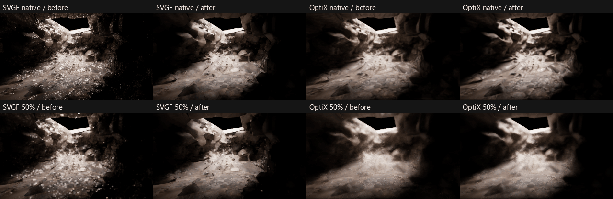
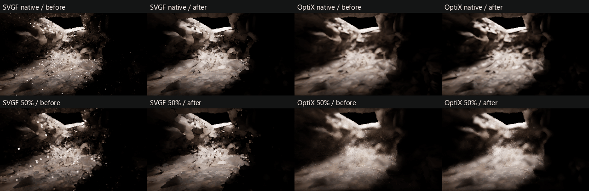
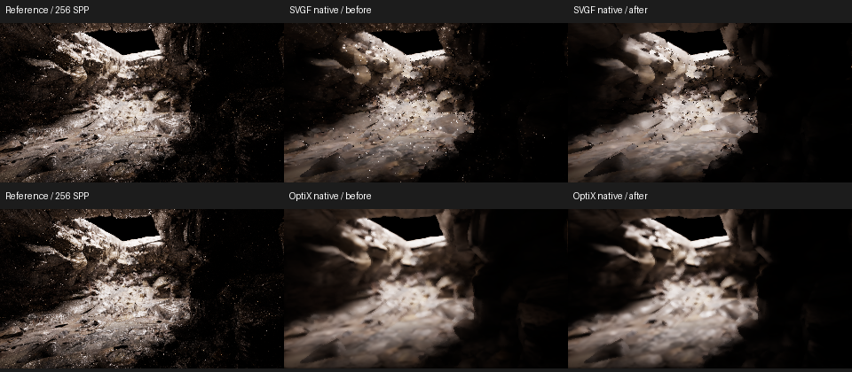

# 湿润溶洞与连续移动验证

本轮修复高频法线的高光混叠、低粗糙度 GGX 数值错误，以及 OptiX 输出历史误裁剪。溶洞的 SVGF 闪烁明显降低；**尚不能宣称 OptiX 在该洞穴的连续运动中完全稳定**：原生分辨率的运动帧差没有改善，50% 内部光照略有改善。不能将这种结果描述为“已经完全消除抖动”，也不能只用静止截图验收运动质量。

基线为 `8575b8b`。环境：Windows、RTX 5080、驱动 616.64、CUDA 13.3、OptiX 9.1、Release。前后均为每帧 1 SPP，默认 8 层路径、相同曝光和相机，不冻结采样。原始汇总见 [summary.json](output/rtrt-motion-stability-2026-09-27/summary.json)，完整日志和浮点帧保存在本地 `build/rtrt-motion-stability/`。

## 实现修复

### 像素足迹与间接高光

溶洞材质使用高频法线贴图，源粗糙度为零。亚像素射线每帧命中不同的法线，极窄的反射瓣会将这种微小变化放大成高亮闪点；单纯延长降噪历史不能消除输入混叠。

新增默认开启的 `Specular antialiasing`，从同对象、同资产、同材质且几何法线与深度兼容的 3×3 邻域估计平均法线及其分布，将法线方差卷入 GGX 粗糙度。着色、采样、PDF 和降噪引导同步使用该表面，上一帧法线也正确变换。只处理带法线或凹凸贴图的不透明表面，排除玻璃及无此类贴图的平滑镜面。此处用屏幕邻域近似像素足迹，细小湿润高光会变软，并非保持所有微细节的无偏积分。公式参考 [Unity CommonMaterial 的法线分布过滤](https://github.com/Unity-Technologies/Graphics/blob/master/Packages/com.unity.render-pipelines.core/ShaderLibrary/CommonMaterial.hlsl)。

新增默认开启的 `Stable indirect highlights`，只在一次漫反射占优或粗糙散射之后，拓宽后续非玻璃的极窄反射瓣。首个可见表面和连续镜面/玻璃链保留原规则，代价是细小间接焦散变软。它是低采样下有偏的路径正则化，思路参见 [pbrt 的 Path Regularization](https://pbr-book.org/4ed/Light_Transport_I_Surface_Reflection/A_Better_Path_Tracer)。两项设置均可独立关闭并随会话保存，源场景材质和离线参考不使用这两项近似。

邻域异常值估计剔除最高一至两个样本，防止多个亮点互相撑大阈值，同时限制其对统计矩的污染。OptiX 输入只对间接漫反射使用该亮点抑制；直接光、反射和透射不按暗邻域直接截断。

法线过滤使用独立读写缓冲，避免相邻线程读到已经修改的法线；内部与原生材质阶段复用同一份临时存储。同一线程块共享邻域数据，减少重复读取。共享内存优化前后，湿润高光与溶洞的 320 张浮点帧逐字节一致。

### OptiX 运动历史

神经输出具有空间相关的平滑残余噪声，3×3 输出邻域的方差可能接近零，但整个区域仍在逐帧变化。此前最终 TAA 会把正确的运动历史反复裁掉。现在非清晰光学表面的裁剪下限同时参考输入噪声和历史混合权重；真实显露、几何变化和编辑仍按原规则拒绝历史。

无镜面分量的材质不再因未使用的低粗糙度参数而丢弃神经历史。对有反射的材质，可信度同时考虑源粗糙度和像素过滤后的粗糙度：拓宽反射瓣不会使首表面运动突然能代表反射内部的景物。透明和低粗糙度反射在移动时继续保守拒绝错误的神经历史。运动方向仍遵循 [NVIDIA OptiX denoiser API](https://raytracing-docs.nvidia.com/optix9/api/group__optix__host__api__denoiser.html) 的约定。

这修复了历史处理中的实现问题，但没有生成反射内部的运动向量。1 SPP 的湿润反射、显露区域及低分辨率细轮廓仍可能波动；这里的剩余问题包含采样不足和当前历史引导方式的限制，并非可用一个更长历史参数保证消除。

### GGX 与采样能量

CPU/CUDA 的 GGX 分母改用避免浮点抵消的等价表达式，移除会截掉粗糙度 0.02 下合法高峰的 `1e-12` 下限。另修复 RTRT 首次散射分量拆分时重复 BRDF 求值、视线归一化舍入不一致的问题；现在复用生成采样 PDF 的同一次求值。这同时减少重复计算，避免极窄反射瓣放大微小数值差异。

低粗糙度高光因此可能比旧版本更亮。新增 GGX 理论峰值回归和白色镜面均匀环境回归：未降噪镜面的归一化平均能量为 `0.999996`。玻璃和镜面响应另有独立验证，不能通过把高光压黑来认定稳定性已改善。

## 同场景连续帧

本机最后会话中的溶洞与磁盘 `cave.rscene` 不同：太阳隐藏，洞口使用矩形面积光；验证读取其快照副本，没有改写用户会话。使用 GAMES202 cave 资产的洞内视角，位置 `(4.189, 1.031, 2.073)`、目标 `(2.922, 0.980, 1.550)`、垂直视场角 75°。面积光 RGB 约 `(72.56, 62.55, 61.46)`，宽高约 6.188，对象缩放 0.64。

320×180 输出，先静止 96 帧，再每帧横移 0.004 单位、连续移动 96 帧。静止统计后 32 帧，运动统计全部 96 帧；运动帧差先用首表面运动向量双线性重投影。指标为曝光 0 的线性 ACES RGB RMSE，未加入显示 gamma。**运动指标包含真实反射、遮挡和覆盖变化，并不等于纯噪声。**

| 配置 | 静止修复前 | 静止修复后 | 运动修复前 | 运动修复后 |
|---|---:|---:|---:|---:|
| SVGF 原生 | 0.0080161 | 0.0023410 | 0.0522537 | 0.0331727 |
| SVGF 50% | 0.0081327 | 0.0029086 | 0.0591083 | 0.0409782 |
| OptiX AI 原生 | 0.0018188 | 0.0015519 | 0.0097573 | 0.0109962 |
| OptiX AI 50% | 0.0020986 | 0.0018159 | 0.0186015 | 0.0173520 |

SVGF 静止帧差下降约 71% / 64%，运动帧差下降约 37% / 31%。OptiX 静止帧差下降约 15% / 13%；原生运动帧差增加约 13%，50% 下降约 7%。不能从这组数据宣称洞穴 OptiX 运动问题已完全修好。

下列动画每帧播放 80 ms，使用整段共用的固定调色板，便于观察闪动；数值来自浮点帧。列顺序为 SVGF 前/后、OptiX 前/后；上排原生，下排 50% 光照加原生材质。





另用修正 GGX 后的离线 CUDA Path 对第 176～191 帧逐帧生成独立 256 SPP 参考。参考本身仍含噪声，下面的时序残差指“实时相邻帧变化减去参考相邻帧变化”，不是精确的噪声分离。

| 配置 | 对参考显示 RMSE 前/后 | 时序残差 RMSE 前/后 | 平均辐亮度/参考 前/后 |
|---|---:|---:|---:|
| SVGF 原生 | 0.08319 / 0.07531 | 0.06960 / 0.05818 | 0.760 / 0.886 |
| SVGF 50% | 0.09502 / 0.08505 | 0.07410 / 0.06269 | 0.740 / 0.840 |
| OptiX 原生 | 0.06830 / 0.07036 | 0.04957 / 0.04986 | 0.907 / 0.980 |
| OptiX 50% | 0.08391 / 0.08551 | 0.05195 / 0.05164 | 0.924 / 0.995 |

OptiX 平均能量更接近参考，但空间误差略有增加，时序残差基本相当；画面仍可见神经降噪的模糊。高光过滤和路径正则化存在质量取舍。



四倍速度（每帧 0.016 单位）和 1920×1080 原生分辨率均另行验证有限、非负输出及真实神经降噪启用。1080p 的静止/运动 RMSE：SVGF `0.0005227 / 0.0095017`，OptiX `0.0010974 / 0.0071185`。它们没有同规格旧版质量序列，不报告改善百分比；快速移动轨迹看见的景物不同，也不直接与慢速数值比较。

完整 1080p 输出：[SVGF](output/rtrt-motion-stability-2026-09-27/cave-1080-svgf.png)、[OptiX](output/rtrt-motion-stability-2026-09-27/cave-1080-optix.png)。

## 专项回归与限制

- 湿润高光：96×96、方向光强度 80、256×256 高频法线贴图、粗糙度 0.02、暗底色；静止/移动各 128 帧。后 64 帧中央区域 ACES 帧差，SVGF 从 `0.001005 / 0.005969` 降至 `0.0000557 / 0.0000590`，OptiX 从 `0.001158 / 0.003937` 降至 `0.000475 / 0.002576`。新回归要求四者均低于 `0.003`。
- 上述极窄高光的独立 4096 SPP 参考平均辐亮度约 `9.158`，过滤后约 `6.48～7.33`，仍有约 20%～29% 的偏差。足迹近似和异常值抑制并非无偏保证。旧版本还含 GGX 峰值截断错误，不能以旧版亮度为正确能量标准。
- OptiX 持续移动的纯漫反射平面：原生/50% 的线性帧差 RMSE `0.000390 / 0.000702`，对解析环境光参考 RMSE `0.000622 / 0.001187`；运动期间没有重置历史。
- 离屏反射目标移动：SVGF/OptiX、粗糙度 0.45/0.02、原生/50% 共八组，均在八帧内将旧目标区域降到原亮度的 10% 以下，没有通过全局历史重置完成响应。
- 独立镜面/粗糙反射/玻璃压力测试通过。镜面能量比为 `0.988 / 0.964`，玻璃 `0.99988 / 0.99991`；粗糙反射仍有约 17%～18% 能量偏低。镜面仍存在有限采样的异常高亮像素，不称为零亮点。

## 性能

Cornell 960×540，交替运行前后版本三组，每组预热 24 帧、记录 96 帧，取各组 GPU P50 的中位数。该场景没有法线贴图，会跳过新的足迹滤波与临时缓冲。

| 配置 | 修复前 P50 ms | 修复后 P50 ms |
|---|---:|---:|
| 原生，静止 | 4.0218 | 3.9084 |
| 原生，移动 | 3.8446 | 3.9026 |
| 50%，静止 | 1.6119 | 1.5964 |
| 50%，移动 | 1.6086 | 1.6087 |

数值处于小幅波动范围，不据此宣称普遍性能提升。这是同步 GPU 阶段计时，不能直接换算成 Viewer FPS。

溶洞 Viewer 使用 1920×1080 原生光照、每帧 1 SPP、持续横移。前后交替运行三组，每次 240 帧，预热 60 帧后记录 180 帧；表中为三组分位数的中位数。完整帧计时包含 UI、呈现和 `glFinish`。

| 降噪器 | 修复前 P50 / P95 ms | 修复后 P50 / P95 ms |
|---|---:|---:|
| SVGF | 27.1639 / 28.6649 | 28.3590 / 28.8518 |
| OptiX AI | 26.6847 / 27.0555 | 29.1422 / 29.5819 |

修复增加约 1.20 / 2.46 ms 的 P50 开销；该配置均未达到 60 FPS。所有运行均使用实际 OptiX 求交、SER 和 CUDA–OpenGL 互操作，整帧下载为零。共享邻域的优化将此前一次测量中约 30.00 / 30.77 ms 的 P50 降低，但该单次数据不作为正式前后性能结论。

法线过滤临时存储为每像素 16 字节，原生与内部阶段复用；1080p 有相关贴图时增加约 31.64 MiB。没有相关贴图时不分配。神经路径还增加一次输入统计/间接亮点预处理，稳定性有额外计算代价。

## 构建与复现

```powershell
cmake --build --preset default-release
$env:RTRT_REQUIRE_OPTIX='1'
$env:RTRT_REQUIRE_OPTIX_DENOISER='1'
ctest --preset default-release --output-on-failure

$env:RTRT_VALIDATION_DIR="$PWD/build/rtrt-motion-check"
$env:RTRT_STABILITY_SEQUENCE='1'
build/default/bin/realtime_tests.exe --filter wet_normal_highlight_stability,optix_continuous_motion_diffuse_history,smooth_mirror_raw_furnace

# 默认加载磁盘的 cave.rscene（太阳照明）；可用会话 document.snapshot JSON 覆盖场景。
$env:RTRT_CAVE_SEQUENCE='1'
# $env:RTRT_CAVE_SCENE='path/to/document-snapshot.json'
build/default/bin/realtime_tests.exe --filter cave_continuous_motion
# RTRT_CAVE_WIDTH=1920；RTRT_CAVE_SPEED=0.016；RTRT_CAVE_VARIANT=0/1/2/3
# 四个 variant 依次是 SVGF 原生/50%、OptiX 原生/50%。

cmake --build --preset no-cuda-release
ctest --preset no-cuda-release --output-on-failure
```

默认 Release 的 CTest 11/11 通过；无 CUDA 构建 11 项通过，OptiX 互操作 1 项按预期跳过。设置两个 `RTRT_REQUIRE_*` 环境变量后执行 GPU 测试，确保没有把回退当成 OptiX 验证。

最终共享内存版本在 `RTRT_OPTIX_VALIDATE=1` 下，使用 Compute Sanitizer `--tool memcheck --check-optix-leaks --leak-check full --error-exitcode 99` 检查湿润高光、单像素/不完整线程块、未降噪镜面能量三项回归：3/3 通过，0 错误，0 字节泄漏。这是上述范围的结果，不代替所有场景的内存检查。日志位于 `build/rtrt-motion-stability/tiled-memcheck*.log`。

本轮没有把反射内部的运动、蒙皮变形历史或神经模型自身的重建误差视为已经解决。当前修复针对可复现的输入混叠、统计误判和数值错误；在 1 SPP、极湿润低粗糙度表面持续运动时，仍需在更多有效光线样本、正确的反射运动引导和细节保留之间继续权衡。
