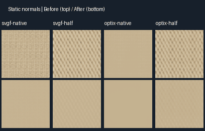
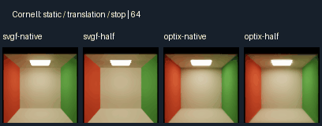
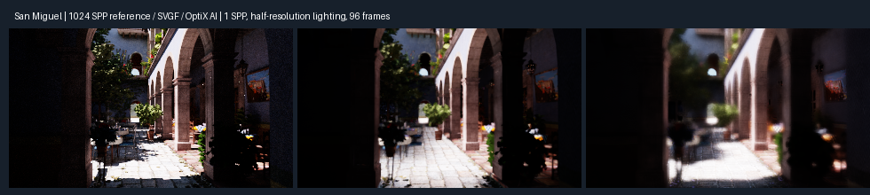

# SVGF / OptiX AI 时序稳定性修复

修复基于 `codex/optix-rtrt-optimization` 上已完成的性能优化。本轮前后对照使用相同场景、相机、1 SPP、路径深度和降噪设置，未通过增加采样数获得结果。环境为 Windows、RTX 5080、驱动 616.64、CUDA 13.3、OptiX 9.1、`default-release`。原始指标见 [summary.json](output/rtrt-stability-2026-09-26/summary.json)。

## 问题与修复

1. **静止画面的历史误拒绝。** 原生分辨率的输出历史使用着色法线，法线贴图随亚像素抖动变化时会被误认为显露了新表面。轮廓两侧的代表性几何样本也会交替改变。输出 TAA 现在使用几何法线；相机与场景完全不变时，直接积累同一输出像素的覆盖历史，不再用单次抖动命中的表面拒绝它。
2. **把噪声当作画面变化。** 静止场景中的历史会被逐帧邻域裁剪和反应掩码反复重置。现在在确认相机、投影、场景、材质与光照不变后保留静止历史，并逐步延长其长度；运动或编辑时立即恢复原来的重投影、裁剪与反应路径。未增加空间滤波核或滤波轮数。
3. **采样抖动与重建开关不一致。** 半分辨率时关闭 TAAU、保留 TAA 开关，原实现仍抖动采样，却不进行对应的时序重建。现在只由当前分辨率实际使用的重建开关决定 jitter，确定性场景的连续帧像素差为零。
4. **OptiX 历史引导网格不一致。** 神经历史在抖动后的输入网格上，旧可信度校验却读取不抖动的 TAA 输出网格，低分辨率时尺寸也不同。现在按与 `previousOutput` 相同的网格、运动和 jitter 逐个验证双线性历史样本；原生材质的神经阶段独立保存上一帧几何引导。
5. **OptiX 输出历史被合成操作改写。** 背景还原和原生材质合成曾直接覆盖神经输出，而对应的内部引导层仍来自神经网络。现在把最终合成写回独立合成图，完整保留配对的神经输出与内部引导层。原生材质的着色法线也不再被几何法线覆盖。

OptiX 的运动方向与世界空间法线约定保持符合固定版本的 [NVIDIA OptiX 9.1 类型定义](https://github.com/NVIDIA/optix-dev/blob/f1f6dd803f3159992d248178f6e09421c6eb8b6d/include/optix_types.h)。当前/历史几何法线采用八面体 UNORM16 编码，保证共用的 `RtGuide` 仍为 96 字节，避免扩大所有光照与空间滤波的访存量。输出历史新增长度与材质身份信息。

## 连续帧结果

法线细节回归使用 96×96 输出、确定性方向光、256×256 高频法线贴图，连续渲染 96 帧，统计第 65～96 帧中央 80×80 像素的相邻帧线性 RGB RMSE。它隔离了随机光照噪声，直接复现静止画面的采样闪动。

| 配置 | 修复前 RMSE | 修复后 RMSE | 下降 |
|---|---:|---:|---:|
| SVGF 原生 | 0.108444 | 0.002439 | 97.8% |
| SVGF 50% 光照 / 原生材质 | 0.055346 | 0.003343 | 94.0% |
| OptiX AI 原生 | 0.007299 | 0.0000923 | 98.7% |
| OptiX AI 50% 光照 / 原生材质 | 0.047454 | 0.003429 | 92.8% |

下面的动画上排为修复前，下排为修复后，四列顺序与表格一致。GIF 使用固定调色板，仅供查看；数值由未量化的浮点帧计算。



Cornell 连续序列另测静止 96 帧、平移相机 32 帧、停止 64 帧，期间不切镜、不重置历史。四种配置的静止显示域 RMSE 为 0.00082～0.00153；停止后为 0.00081～0.00153，均通过小于 0.0025 的回归门槛。关闭半分辨率 TAAU 的四种确定性配置，12 帧最大像素变化均为 0。



| 参考图 / 稳定性指标 | 修复前 | 修复后 |
|---|---:|---:|
| Cornell 原生 SVGF 对 1024 SPP 参考的 MSE | 0.0139416 | 0.0101892 |
| Cornell 50% SVGF 对参考的 MSE | 0.0124518 | 0.0087516 |
| Cornell 原生 SVGF 相邻帧 MSE | 0.00115537 | 0.00003754 |
| San Miguel 50% SVGF 对参考的 HDR MSE | 0.0496455 | 0.0424209 |
| San Miguel 50% SVGF 对参考的显示域 MSE | 0.0193247 | 0.0160835 |
| San Miguel 50% SVGF 相邻帧 MSE | 0.00669280 | 0.00001335 |
| San Miguel 50% SVGF 8×8 块帧差 MSE | 0.0006157 | 0.00000118 |

Cornell 使用 96×96、48 帧；San Miguel 使用 320×180、96 帧、既有 1080p 质量配置和独立 1024 SPP 参考。San Miguel 的 OptiX AI 修复后 HDR MSE 为 0.035816、显示域 MSE 为 0.006217、相邻帧 MSE 为 0.00006684；该复杂场景没有本轮 AI 修复前的同规格序列，所以不报告其改善百分比。



高动态范围镜面 / 粗糙反射 / 玻璃压力测试采用 128×128、96 帧，对照独立 2048 SPP 参考。原生镜面的相邻帧 MSE 从 0.06109 降至 0.005289，玻璃从 0.0007858 降至 0.00003020；半分辨率分别从 0.03106 降至 0.002390、0.0007800 降至 0.00002801。玻璃能量比为 0.99988 / 0.99991，异常亮点计数均为 0。镜面在强光轮廓附近仍有相对于参考的过亮像素，过亮计数有所增加，但整体参考误差和闪烁均下降；不将有限采样和像素覆盖误差描述为完全消失。

## 性能与显存

Cornell 960×540 GPU 测试交替运行前后版本三组，每组预热 24 帧、记录 96 帧，取各组 P50 的中位数。

| 配置 | 修复前 ms | 修复后 ms |
|---|---:|---:|
| 原生，静止 | 3.6479 | 3.6805 |
| 原生，移动 | 3.6529 | 3.6869 |
| 50%，静止 | 1.4854 | 1.5700 |
| 50%，移动 | 1.4828 | 1.5754 |

San Miguel Viewer 采用 1920×1080 输出、50% 内部光照、原生材质和持续相机运动。前后各运行 240 帧，前 60 帧预热；完整帧计时包含 UI、呈现和 `glFinish`，不是后台 GPU 阶段计时。

| 降噪器 | 修复前 P50 / P95 ms | 修复后 P50 / P95 ms |
|---|---:|---:|
| SVGF | 15.3297 / 15.6605 | 15.6294 / 16.0784 |
| OptiX AI | 25.4805 / 25.9656 | 25.8418 / 26.3059 |

本次稳定性修复有少量开销；OptiX AI 在这个配置下仍未达到 60 FPS。四次运行都使用实际 OptiX 求交、SER、CUDA–OpenGL 互操作，整帧下载为 0。1080p SVGF 显式帧缓冲由约 850.34 MiB 增至 881.98 MiB；AI 由 1830.93 MiB 增至 1925.85 MiB，新增部分为输出历史信息及与神经网格一致的原生引导。

## 构建与验证

```powershell
cmake --build --preset default-release
$env:RTRT_REQUIRE_OPTIX='1'
$env:RTRT_REQUIRE_OPTIX_DENOISER='1'
ctest --preset default-release --output-on-failure

# 输出连续帧 PNG / 线性 PFM 和 JSON 指标
$env:RTRT_VALIDATION_DIR="$PWD/build/rtrt-stability-check"
$env:RTRT_STABILITY_SEQUENCE='1'
build/default/bin/realtime_tests.exe --filter subpixel_normal_detail,disabled_temporal_upscale,denoiser_static_edges

# 可选复杂场景和高亮反射压力测试
$env:RTRT_SAN_MIGUEL_QUALITY='1'
$env:RTRT_QUALITY_VARIANT='7'
build/default/bin/realtime_tests.exe --filter san_miguel_quality
$env:RTRT_QUALITY_DENOISER='optix'
build/default/bin/realtime_tests.exe --filter san_miguel_quality
$env:RTRT_FIREFLY_STRESS='1'
build/default/bin/realtime_tests.exe --filter specular_firefly_stress
```

- 默认构建成功，CTest 11/11 通过；包括相机切换、物体运动、遮挡显露、灯光编辑、移动阴影、反射更新、调整分辨率、切换降噪器、原生纹理和玻璃轮廓。
- 启用高亮反射压力测试后，实时测试 31 项通过，性能和复杂场景两项按独立命令验证。
- 无 CUDA 构建成功，CTest 11 项通过、OptiX 互操作 1 项按预期跳过。
- Compute Sanitizer 在 OptiX validation 模式下检查新 TAAU 开关回归和 AI 场景变化 / 遮挡回归：2/2 通过，0 内存错误，0 泄漏。此结论限于这两项检查。

本轮没有提高默认 SPP、关闭抗锯齿、冻结采样随机数或冻结画面。1 SPP、低内部采样率及 AI 模型本身仍会带来噪声、模糊和细轮廓误差；静止、移动、停下和编辑场景的行为分别经过验证。
