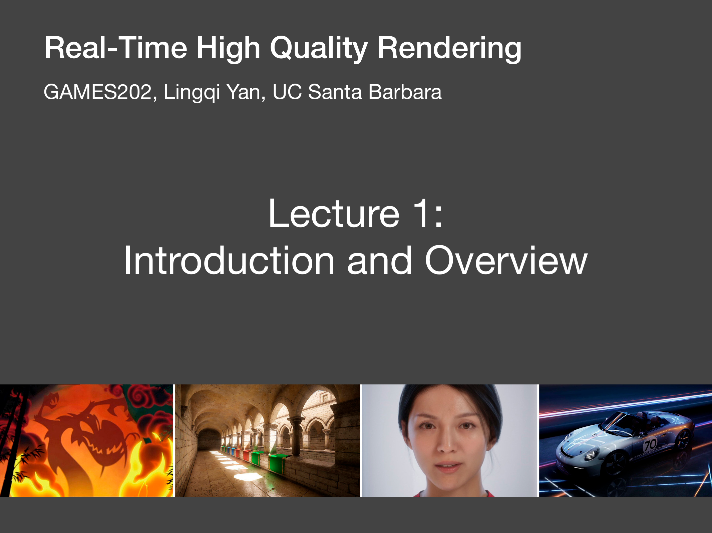
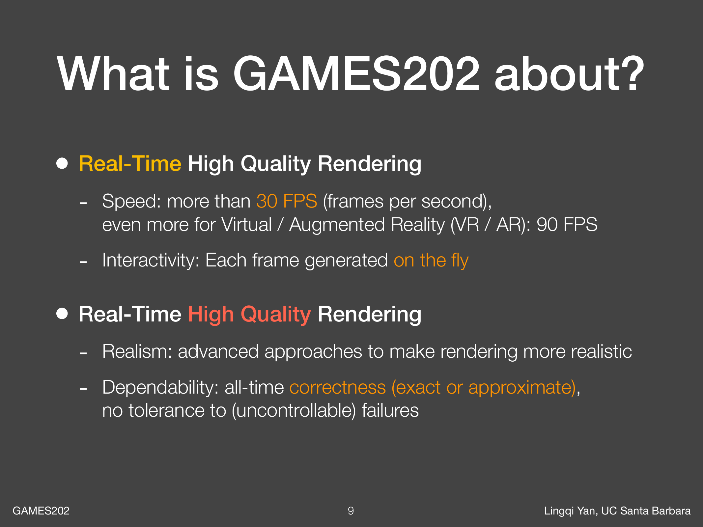
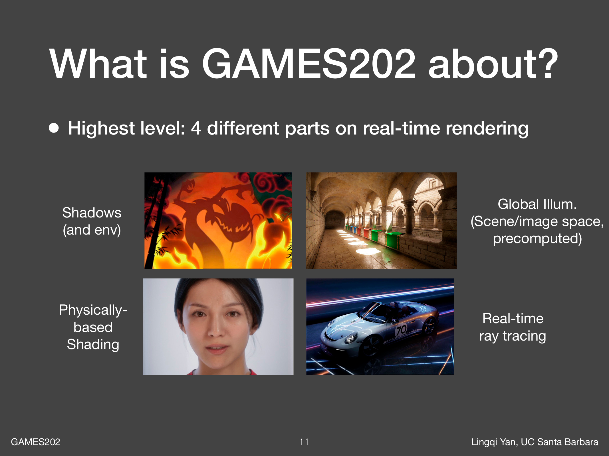
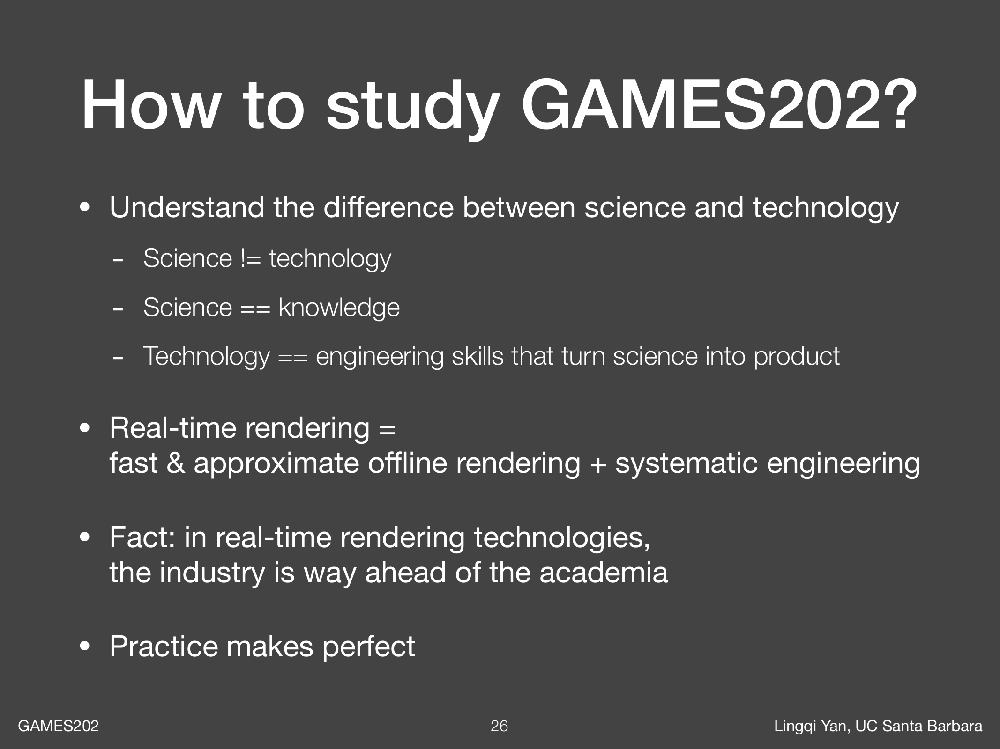
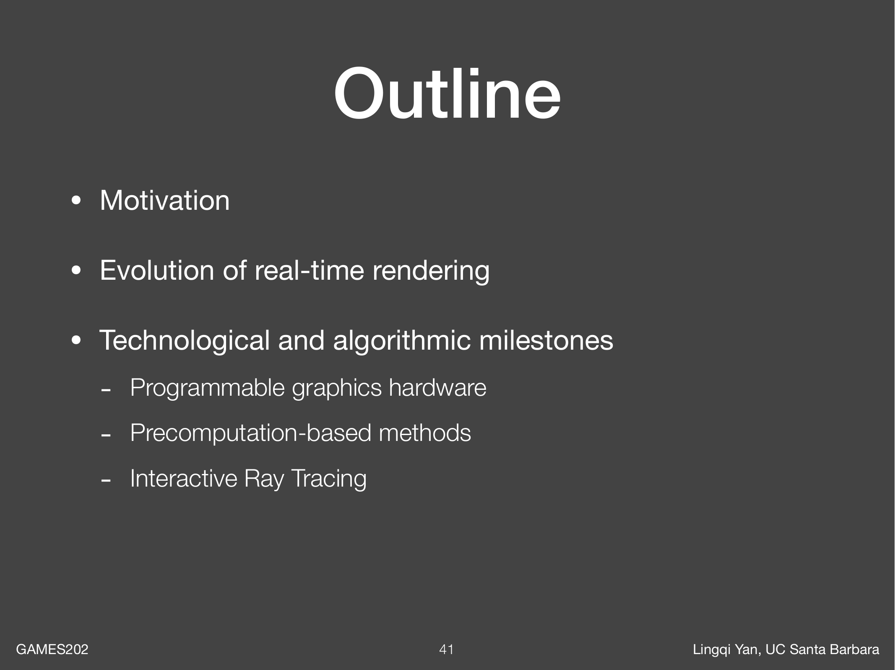
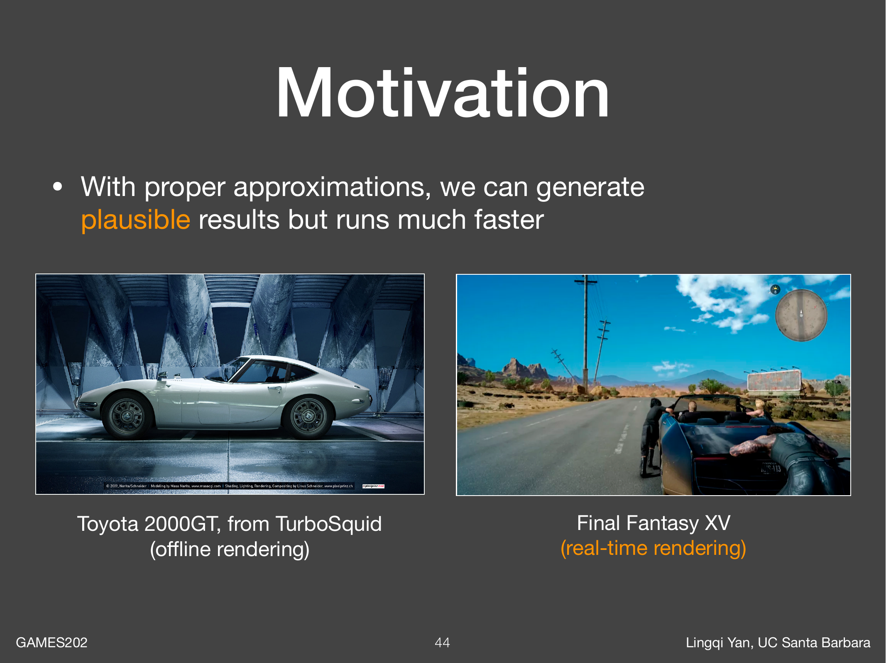
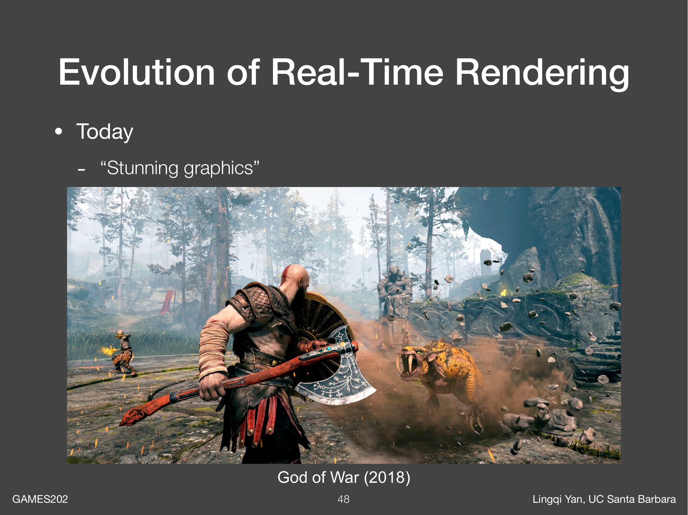
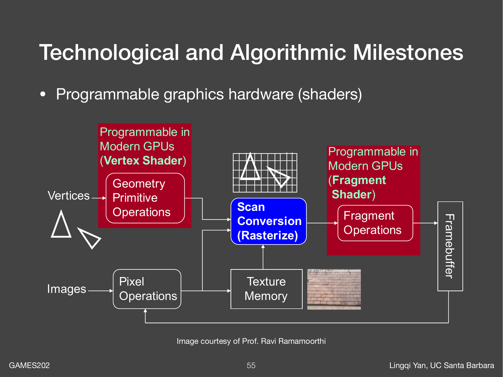
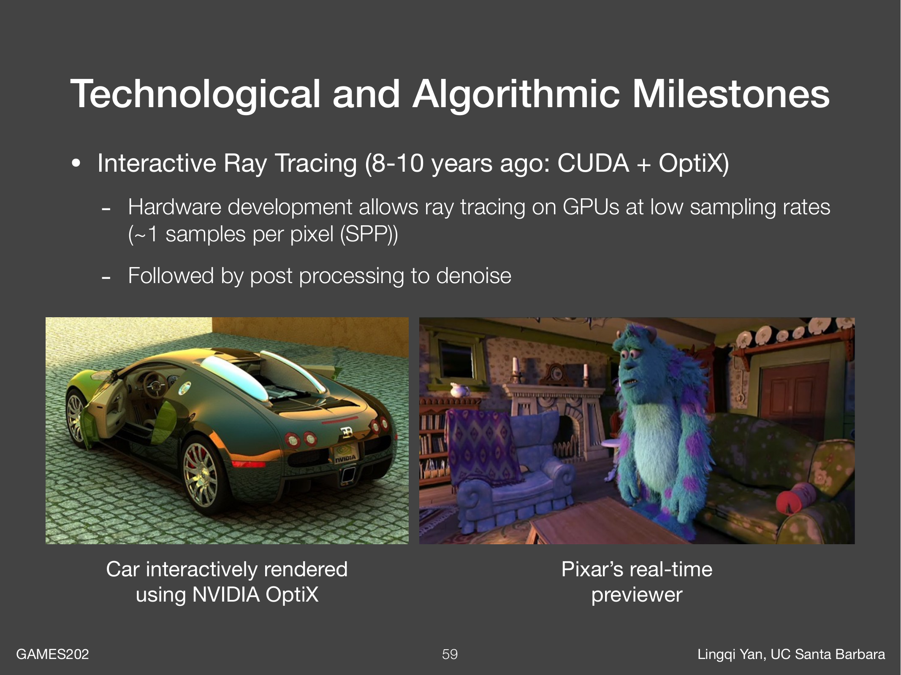

# GAMES202 Lecture 01：实时渲染概述

> 视频：<https://www.bilibili.com/video/BV1YK4y1T7yY>，第 1 集 `Lecture1`  
> 课程主页：<https://sites.cs.ucsb.edu/~lingqi/teaching/games202.html>  
> 本讲主题：Introduction and Overview，也就是先建立 GAMES202 的学习地图。

## 1. 这一讲要解决什么问题

第一讲不是在推导某个具体算法，而是在回答三个更大的问题：

1. GAMES202 到底学什么？
2. 为什么“实时”和“高质量”放在一起会很难？
3. 现代实时渲染是怎样一步步走到今天的？

可以把这一讲理解成课程的导航图。后面每一讲都会落到某个具体技术，比如软阴影、环境光照、全局光照、PBR 材质、实时光线追踪、降噪、抗锯齿等；而本讲先告诉我们这些技术共同服务于一个目标：在极短时间内生成尽可能真实、稳定、可交互的图像。

## 2. 什么是 Real-Time High Quality Rendering

课程名可以拆成两半：

| 关键词 | 含义 | 直观理解 |
| --- | --- | --- |
| Real-Time | 每一帧都必须马上算出来，并且速度通常至少超过 30 FPS | 玩家移动鼠标或相机，画面要立刻响应 |
| High Quality | 图像不仅要快，还要真实、稳定、可信 | 不能靠完全失真的假效果糊弄过去 |

实时渲染的核心压力来自帧时间预算。FPS 越高，每帧可用时间越少：

| 目标帧率 | 每帧时间预算 |
| --- | --- |
| 30 FPS | 约 33.3 ms |
| 60 FPS | 约 16.7 ms |
| 90 FPS | 约 11.1 ms |

这意味着实时渲染不能像离线电影渲染那样花几分钟甚至几小时去算一帧。它必须在十几毫秒内完成几何处理、可见性判断、光照计算、材质计算、后处理等步骤。

这里的 High Quality 也不只是“好看”。它至少包含两层意思：

1. **真实感**：画面中的光影、材质、反射、间接光等要尽量接近真实世界。
2. **可靠性**：算法不能经常出现不可控的错误，比如阴影闪烁、反射断裂、噪声乱跳、物体边缘鬼影严重等。

所以 GAMES202 的问题不是“如何把图渲得最真实”，也不是“如何把图渲得最快”，而是：

> 在实时约束下，怎样用近似、预计算、采样、滤波、时域复用、工程系统等方法，把图像质量推到尽量高？

## 3. 渲染问题的基本图景

从最抽象的角度看，渲染就是：

> 给定 3D 场景，包括几何体、材质、光源、相机等，计算光如何进入眼睛或相机，最终得到一张 2D 图像。

这个说法很简单，但实际很难。因为光线可能会：

- 从光源出发，直接照到物体表面；
- 被物体遮挡，形成阴影；
- 在粗糙或光滑表面上反射；
- 在多个物体之间反复弹射，形成间接光；
- 穿过介质，产生雾、烟、体积散射；
- 被相机采样，形成离散像素，并产生锯齿、噪声等问题。

离线渲染通常会尽量模拟这些物理过程，代价是慢。实时渲染则必须问一个更现实的问题：

> 哪些光照现象必须精确算？哪些可以近似？哪些可以提前算好？哪些可以在屏幕空间猜？哪些可以用上一帧的信息继续修正？

这也是后续课程的主线。

## 4. GAMES202 的四块核心内容

课程把高质量实时渲染拆成四个大方向：

| 方向 | 要解决的问题 | 后续会见到的典型技术 |
| --- | --- | --- |
| 阴影与环境光照 | 光有没有被挡住？环境光从哪里来？ | Shadow Mapping、PCSS、VSSM、Environment Mapping |
| 全局光照 | 光不只从光源直达物体，还会在场景中弹射 | RSM、LPV、VXGI、SSAO、SSDO、SSR、PRT |
| 基于物理的着色 | 材质为什么像金属、塑料、皮肤、布料？ | Microfacet、GGX、Disney BRDF、LTC |
| 实时光线追踪 | 如何把光追放进实时帧预算？ | 低采样率 Ray Tracing、时空复用、降噪 |

### 4.1 阴影与环境光照

阴影的本质是**可见性**：从某个点看向光源，中间有没有被遮挡？

如果没有阴影，物体会像浮在空中，因为人眼很依赖阴影判断物体位置、接触关系和空间层次。实时阴影的难点在于，硬阴影比较容易近似，软阴影则需要表达光源面积、遮挡物距离、半影变化等信息。

环境光照则处理另一类问题：现实世界的光不只来自一个点光源，天空、墙面、窗户、屏幕都可能贡献光。环境贴图和预滤波技术会在后续课程中反复出现。

### 4.2 全局光照

全局光照关注的是**间接光**。例如一个红色墙面被太阳照亮后，会把红色光反射到旁边的白色物体上。这种颜色渗透不是直接光能解释的。

离线渲染可以用路径追踪慢慢积累很多光线路径，但实时渲染必须近似。常见思路包括：

- 在 3D 空间里存储或传播间接光；
- 在屏幕空间利用已经渲染出的深度、法线和颜色估计效果；
- 对静态场景提前预计算一部分光照；
- 用上一帧结果做时域积累。

### 4.3 基于物理的着色

着色回答的是：光打到表面以后，往哪个方向反射多少？

同样一束光照到金属、陶瓷、皮肤、布料上，结果完全不同。PBR 的目标不是随便调一个“好看”的颜色，而是用更接近物理的模型描述材质，例如微表面模型、法线分布函数、菲涅耳项、几何遮蔽项等。

这一部分会帮助我们理解现代游戏和实时引擎里的材质为什么能统一表达很多不同外观。

### 4.4 实时光线追踪

光线追踪的优势是统一、自然，阴影、反射、折射、间接光都可以放在同一个框架里描述。但它的成本非常高。

实时光追通常不会每个像素发很多光线。它常见的策略是：

- 每像素只采很少的样本；
- 接受初始结果有噪声；
- 用空间滤波和时间滤波降噪；
- 结合光栅化结果，做混合式渲染；
- 借助硬件加速结构快速求交。

这也是为什么实时光追不是“把离线光追直接搬到游戏里”，而是一整套采样、复用、过滤和工程权衡。

## 5. 这门课不重点讲什么

GAMES202 的重点是实时渲染背后的科学知识，而不是某个具体工具的使用教程。

它不重点讲：

- Maya、Unreal Engine 等建模或游戏开发流程；
- 电影级离线渲染里的重型光传输算法；
- Neural Rendering；
- OpenGL API 细节；
- shader 逆向；
- CUDA 或高性能计算本身。

这不是说这些内容不重要，而是课程想把精力放在更底层的问题上：为什么这个渲染现象困难？有哪些近似方式？这些近似牺牲了什么？为什么工业界会这么做？

## 6. 应该怎样学习 GAMES202

这一页很关键，因为它给了学习方法。

老师区分了 science 和 technology：

| 概念 | 在这门课里的含义 |
| --- | --- |
| Science | 知识、原理、模型、问题本质 |
| Technology | 把知识变成可用产品的工程技巧 |

实时渲染正好站在两者之间。只懂公式不够，因为真实项目有帧预算、显存、平台差异、稳定性、调参成本；只会调引擎参数也不够，因为遇到新问题时不知道近似从哪里来、错误在哪里、该怎样改。

可以把实时渲染理解成：

> 快速、近似的离线渲染思想 + 系统化工程。

学习时建议每遇到一个算法，都问四个问题：

1. 它想近似哪个真实光照现象？
2. 它把哪些东西简化了？
3. 它节省了什么成本？
4. 它会带来什么 artifact？

例如 Shadow Mapping 节省了从每个点向光源做复杂可见性查询的成本，但会带来分辨率不足、阴影锯齿、shadow acne 等问题。理解 artifact 往往比背算法步骤更重要。

## 7. 今日正式内容：动机、演进、里程碑

课程概览之后，本讲进入正式内容，分成三部分：

1. **动机**：为什么实时渲染值得研究？
2. **演进**：实时渲染从早期简单 3D 图形发展到今天经历了什么？
3. **技术和算法里程碑**：哪些关键技术推动了这个领域？

## 8. 动机：真实感已经能做到，但太慢

离线渲染已经可以生成非常逼真的图像。电影、动画和特效中的许多画面可以做到复杂几何、真实材质、全局光照、软阴影、体积效果等。

问题是：准确算法通常很慢。尤其是光线追踪或路径追踪，需要大量采样才能得到低噪声结果。电影渲染可以接受一帧算很久，因为它最终播放时只需要预先生成好的图像；但游戏、VR、交互式应用不行，用户输入发生后下一帧就要更新。

这张图表达了实时渲染的核心思想：

> 不一定追求物理上完全精确，而是追求在视觉上可信、速度上足够快。

这里的 plausible 可以理解为“看起来合理”。实时渲染常常接受近似，只要这种近似满足几个条件：

- 视觉上不明显穿帮；
- 在相机运动时稳定；
- 在不同场景和参数下可控；
- 成本能放进帧预算；
- 能被美术和工程流程使用。

所以实时渲染不是“偷懒版渲染”，而是在速度、质量、稳定性之间做高难度平衡。

## 9. 实时渲染的演进

早期交互式 3D 图形主要关注：

- 更多几何体；
- 更快的光栅化；
- 纹理贴图；
- 一些简单真实感技巧，比如 shadow mapping、accumulation buffer。

大约二十多年前，很多实时画面还是“几何 + 简单贴图 + 假阴影”。后来可编程着色器出现，实时渲染发生了巨大变化：开发者不再只能使用固定管线，而是可以自己写 shader 表达光照、材质、后处理效果。

今天的实时渲染已经可以服务于：

- 3A 游戏；
- VR/AR；
- 实时预览；
- 虚拟制片；
- 甚至部分动画和影视生产流程。

这说明实时渲染的定位已经不只是“游戏里够用的近似图形”，而逐渐变成高质量视觉内容生产的一部分。

## 10. 里程碑一：可编程图形硬件

早期固定管线像一条预设流水线：输入几何，经过固定变换、光照、光栅化、纹理等步骤，输出图像。开发者能调参数，但很难改变计算逻辑。

可编程硬件出现以后，vertex shader、fragment shader 等阶段可以由开发者编写。这带来了两个巨大变化：

1. **材质和光照更自由**：不再局限于固定的 Phong 或 Blinn-Phong 模型。
2. **视觉效果迭代更快**：很多效果可以在 shader 里实现，而不需要等待硬件或 API 提供固定功能。

从 GAMES202 的角度看，可编程 shader 是实时高质量渲染的基础设施。没有它，后面的 PBR、屏幕空间效果、复杂阴影过滤、后处理抗锯齿等都很难灵活实现。

## 11. 里程碑二：基于预计算的方法

预计算的思想是：

> 如果某些东西运行时太贵，但场景或条件相对固定，就先离线算好，运行时直接查或组合。

典型例子包括：

- 固定场景中的间接光；
- 环境光照的预滤波；
- 球谐函数表示的低频光照；
- Precomputed Radiance Transfer。

它的优势是运行时很快，适合把复杂光照“压缩”成可查询的数据。缺点是灵活性下降：如果几何、材质、光照或相机变化太自由，预计算数据就可能失效或需要重新计算。

所以预计算技术经常适合静态或半静态内容。实时渲染会不断在“提前算好”和“运行时动态算”之间做取舍。

## 12. 里程碑三：交互式光线追踪

GPU、CUDA、OptiX 以及后来的硬件光追单元，让光线追踪逐渐进入实时领域。但实时光追的关键并不只是“硬件更快了”。

真正重要的是整套思路：

1. 用加速结构快速求光线和场景的交点。
2. 每个像素只发很少的光线，降低采样成本。
3. 接受低采样带来的噪声。
4. 用空间滤波、时间累积、运动向量、深度和法线等辅助信息做降噪。

这也是后面实时光线追踪课程的核心：当样本数很少时，如何把不稳定、有噪声的结果变成稳定、可信的画面。

## 13. 本讲里的几个重要心智模型

### 13.1 实时渲染是在管理误差

离线渲染更接近“多算一点，误差更小一点”。实时渲染则经常要先决定哪些误差可以接受。

例如：

- 阴影边缘不完全物理正确，但不能明显锯齿或闪烁；
- 屏幕空间反射无法反射屏幕外物体，但常常足够便宜；
- 全局光照可以低频近似，但颜色渗透和大体明暗关系要可信；
- 实时光追可以低采样，但需要降噪和时域稳定。

### 13.2 质量、速度、稳定性是三角关系

一个效果如果质量很高但太慢，就不能实时。一个效果如果很快但只在少数场景下不穿帮，也很难进入真实项目。一个效果如果平均效果不错但相机移动时闪烁严重，也会破坏体验。

所以高质量实时渲染不是单点算法竞赛，而是综合权衡：

- 算法近似是否合理；
- GPU 是否适合并行执行；
- 数据结构是否高效；
- 结果是否稳定；
- artifact 是否可控；
- 能否融入引擎和美术流程。

### 13.3 工业界常常走在学术界前面

课上提到实时渲染领域里工业界非常领先。原因很直接：游戏和引擎团队每天都在帧预算里解决真实问题，他们会快速组合、修改、近似和工程化各种方法。

这也提醒我们，学习 GAMES202 时不要只看论文公式，还要关心：

- 这个方法是否能跑进 16ms？
- 是否需要大量预处理？
- 是否依赖很多场景假设？
- 是否容易调参？
- artifact 在真实镜头运动中是否明显？

## 14. 常见误解

**误解 1：实时渲染就是低质量渲染。**  
不是。实时渲染追求的是在时间约束下的高质量，很多现代实时画面已经非常接近电影级视觉效果。

**误解 2：硬件变快以后问题就自然解决了。**  
也不是。硬件进步会扩大预算，但更高分辨率、更复杂材质、更大场景、更高帧率也会立刻吃掉预算。算法和工程仍然关键。

**误解 3：近似就是不严谨。**  
近似本身不是问题，不受控制的近似才是问题。实时渲染里好的近似应该知道自己省了什么、错在哪里、什么时候会失败。

**误解 4：学实时渲染就是学某个引擎。**  
引擎是工具，GAMES202 更关注工具背后的方法。理解原理后，换到 Unreal、Unity、自研引擎或 WebGL 里都更容易迁移。

## 15. 学完本讲后应该能回答的问题

1. 为什么 30 FPS、60 FPS、90 FPS 对每帧时间预算要求差别很大？
2. Real-Time 和 High Quality 分别强调什么？
3. GAMES202 的四个核心方向是什么？
4. 为什么实时渲染不是简单地把离线渲染跑快？
5. 什么叫“视觉上可信”的近似？
6. 可编程 shader 为什么是现代实时渲染的重要里程碑？
7. 预计算方法适合什么场景，不适合什么场景？
8. 为什么实时光追通常需要降噪和时间复用？

## 16. 下一讲预告

下一讲会快速回顾若干基础知识，包括：

- 图形渲染管线；
- shader language；
- 渲染方程；
- 微积分基础。

这一讲的任务是建立大局观，下一讲开始补齐后续算法会依赖的基础工具。

