# GAMES202 Lecture 02：图形学基础回顾

> 视频：<https://www.bilibili.com/video/BV1YK4y1T7yY?p=2>  
> 课程主页：<https://sites.cs.ucsb.edu/~lingqi/teaching/games202.html>  
> 本讲主题：Recap of CG Basics，快速回顾后续实时渲染会反复用到的基础工具。

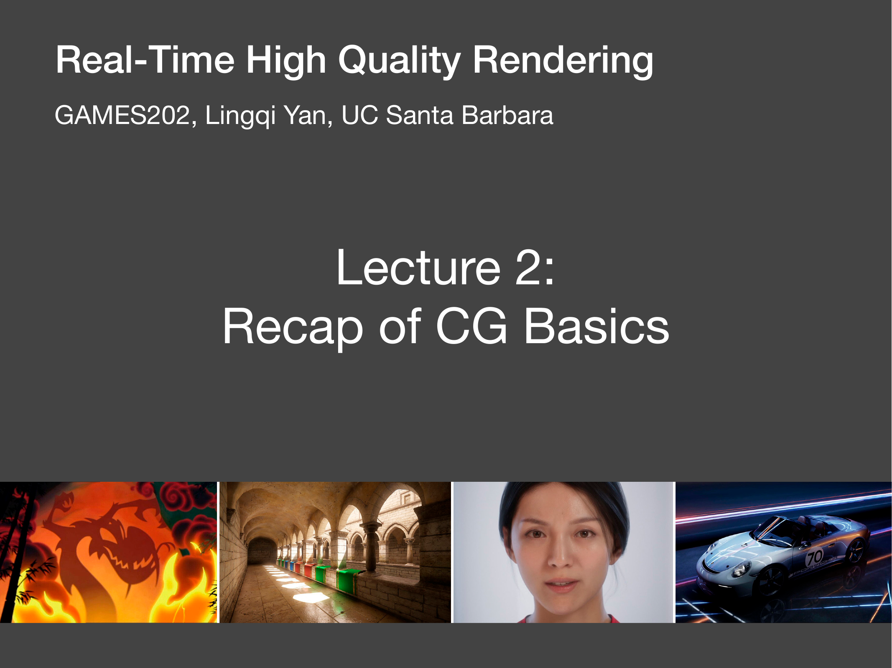

## 1. 这一讲在补什么基础

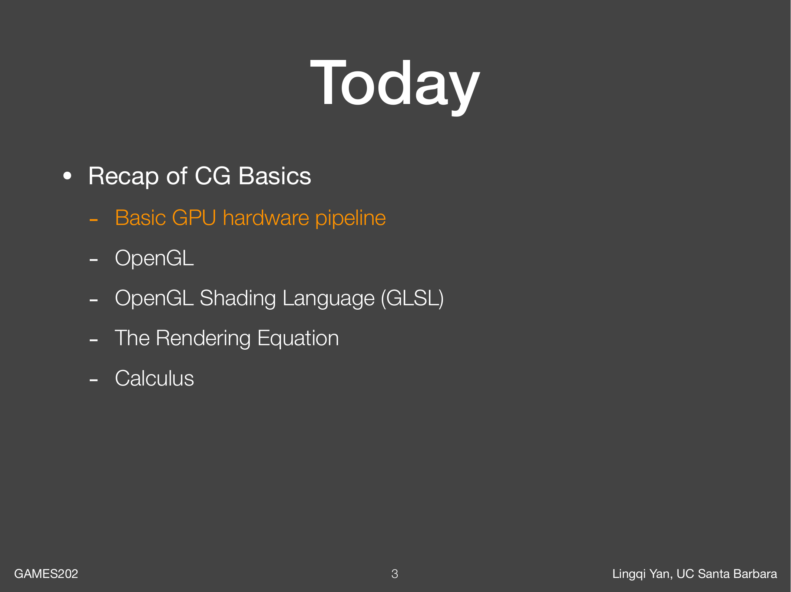

Lecture 1 建立了“高质量实时渲染”的大地图。Lecture 2 则把后续课程会频繁调用的基础知识重新串起来：

1. GPU 图形硬件管线；
2. OpenGL 如何从 CPU 侧驱动这条管线；
3. GLSL shader 负责哪些可编程阶段；
4. 渲染方程如何描述光传输；
5. 微积分和积分思想为什么会自然出现在渲染中。

可以把这一讲看成“工具箱检查”。之后讲 shadow mapping、环境光照、全局光照、PBR、实时光追时，都会默认你知道一帧图像如何从几何体变成屏幕像素，以及光照公式里的每一项大概在表达什么。

## 2. 图形管线：从 3D 顶点到 2D 像素

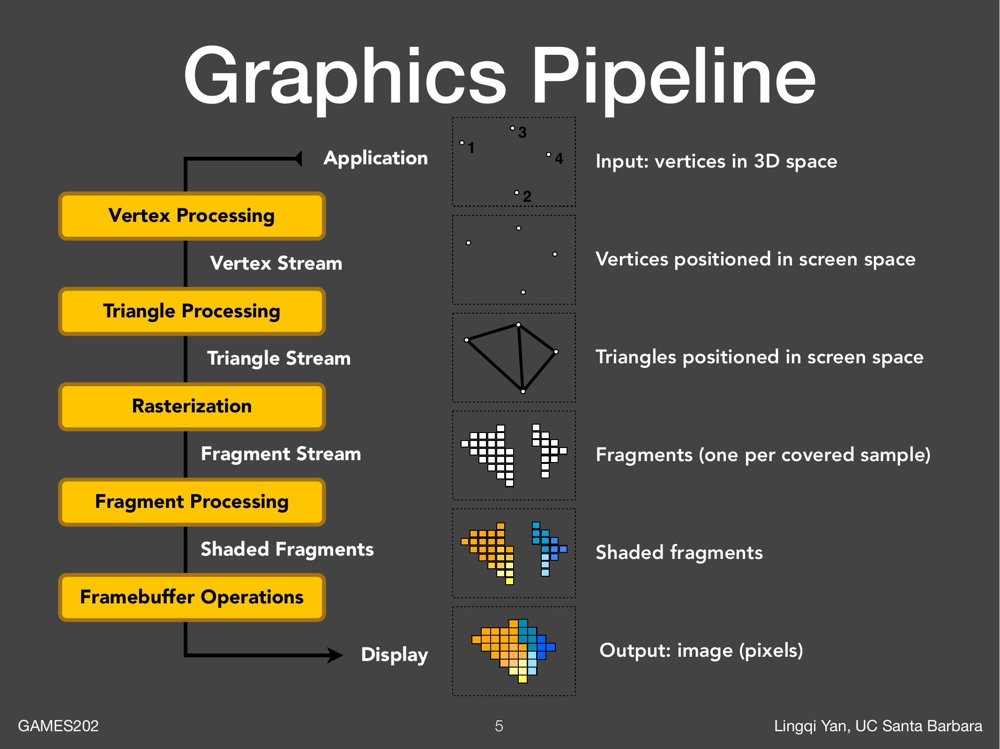

图形管线的输入是 3D 空间中的顶点，输出是屏幕上的像素。中间大致经过：

| 阶段 | 输入 | 输出 | 直观理解 |
| --- | --- | --- | --- |
| Vertex Processing | 3D 顶点 | 屏幕空间顶点 | 把模型中的点放到相机看到的屏幕上 |
| Triangle Processing | 顶点流 | 三角形流 | 根据顶点组装三角形 |
| Rasterization | 屏幕空间三角形 | fragment | 找出三角形覆盖了哪些像素采样点 |
| Fragment Processing | fragment | shaded fragment | 对每个片元计算颜色、法线、材质、光照等 |
| Framebuffer Operations | shaded fragment | framebuffer 像素 | 深度测试、混合、写入颜色和深度 |
| Display | framebuffer | 图像 | 把最终结果显示到屏幕 |

这里最重要的分界是：

- **顶点阶段处理几何位置**；
- **光栅化阶段决定覆盖哪些像素**；
- **片元阶段主要处理每个像素该是什么颜色**；
- **framebuffer 阶段决定是否写入最终图像**。

实时渲染之所以快，很大程度上是因为这条管线高度并行。大量顶点可以并行处理，大量 fragment 也可以并行着色。

## 3. Vertex Processing：MVP 变换

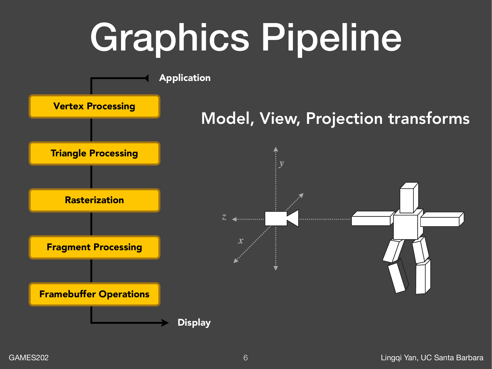

顶点处理最核心的是坐标变换，也就是常说的 MVP：

```text
clip_position = Projection * View * Model * local_position
```

它可以拆成三步：

| 矩阵 | 作用 | 例子 |
| --- | --- | --- |
| Model | 从模型局部坐标变到世界坐标 | 把一个茶壶放到桌面上 |
| View | 从世界坐标变到相机坐标 | 相机站在哪里、朝哪里看 |
| Projection | 从相机空间投影到裁剪空间 | 透视投影或正交投影 |

为什么要分这么多坐标系？因为每个坐标系关心的问题不一样：

- 模型空间适合描述物体自身；
- 世界空间适合描述物体之间的位置关系；
- 相机空间适合判断从相机看出去的位置；
- 裁剪空间和屏幕空间适合进入光栅化。

后面很多实时渲染技术都会反复用这些矩阵，比如 shadow mapping 里要把点变到光源视角，屏幕空间反射里要从屏幕坐标反推世界坐标，TAA 里要用上一帧和当前帧的矩阵计算运动向量。

## 4. Rasterization：三角形覆盖了哪些采样点

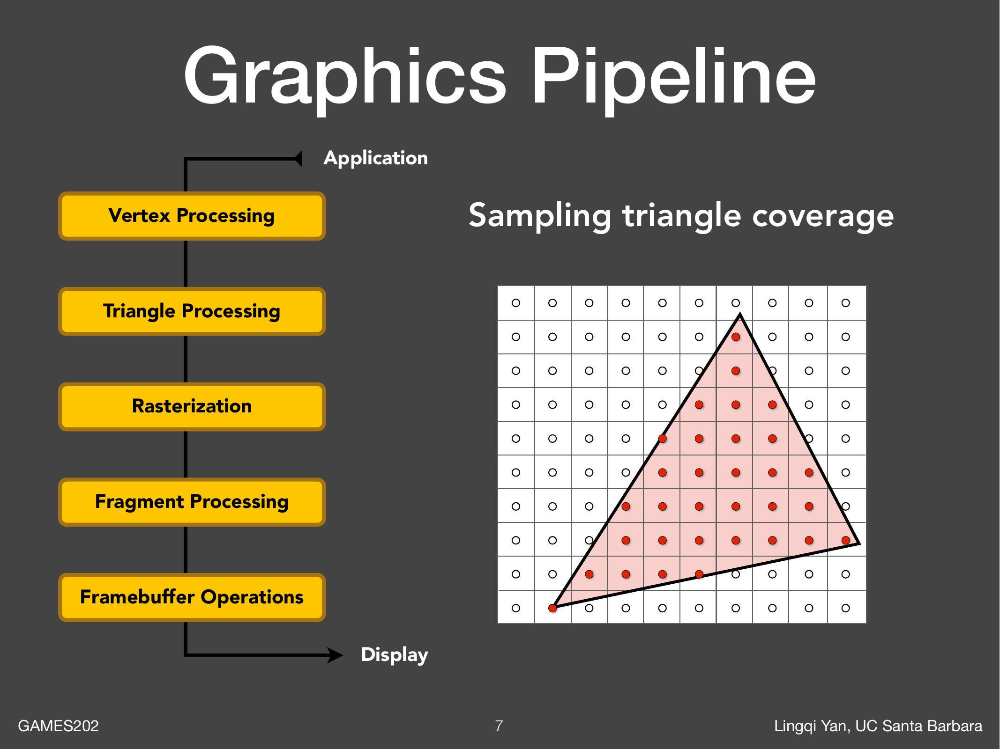

光栅化解决的问题是：

> 一个连续的三角形投影到屏幕后，应该影响哪些离散像素？

屏幕是由像素组成的，像素通常可以理解为采样点。光栅化会检查三角形覆盖了哪些采样点，并为这些采样点生成 fragment。

注意：fragment 还不等于最终像素。fragment 只是“某个图元想写入某个像素位置的一次候选结果”。后面还要经过深度测试、模板测试、混合等操作，才能决定它是否真的写进 framebuffer。

光栅化也会做插值。顶点上有很多属性，例如：

- position；
- normal；
- texture coordinate；
- color；
- tangent。

当三角形内部某个 fragment 被生成时，这些顶点属性会按照重心坐标插值到 fragment 上。于是 fragment shader 才能知道当前像素位置对应的法线、纹理坐标等信息。

## 5. Z-Buffer：解决可见性

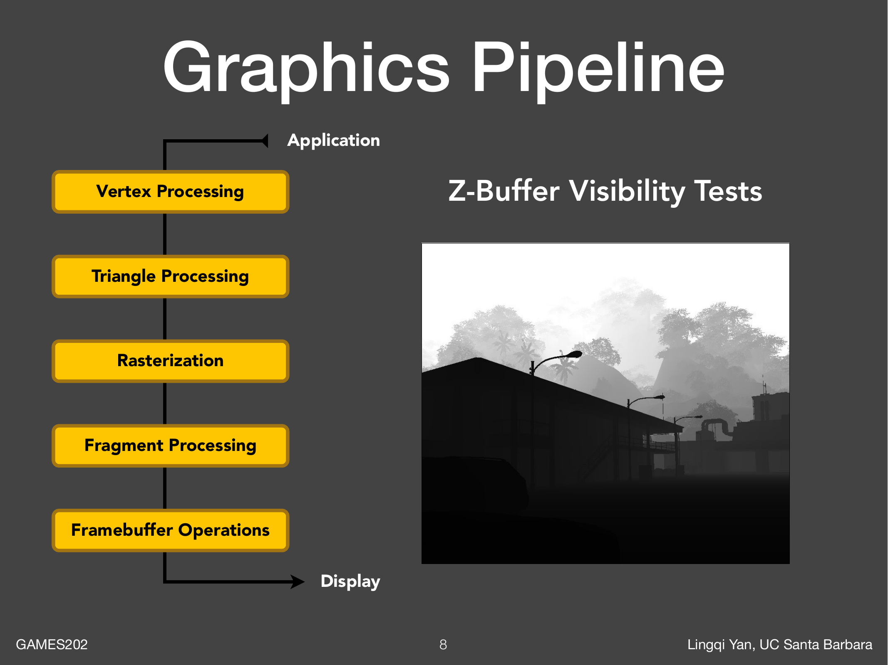

一个像素位置可能被多个三角形覆盖。Z-buffer 的作用是保留离相机最近的那个。

基本思想很直接：

1. framebuffer 除了颜色缓冲，还维护一个深度缓冲；
2. 每个 fragment 带着自己的深度值；
3. 如果它比当前深度缓冲里的值更近，就通过测试并写入颜色和深度；
4. 如果它更远，就被丢弃。

这解决了实时渲染里最基础的可见性问题：谁挡住谁。

不过 Z-buffer 只解决相机可见性，不解决光源可见性。阴影要问的是“从光源看过去是否被挡住”，这就引出了后面 Lecture 3 的 shadow mapping。

## 6. Fragment Processing：着色发生的主要位置

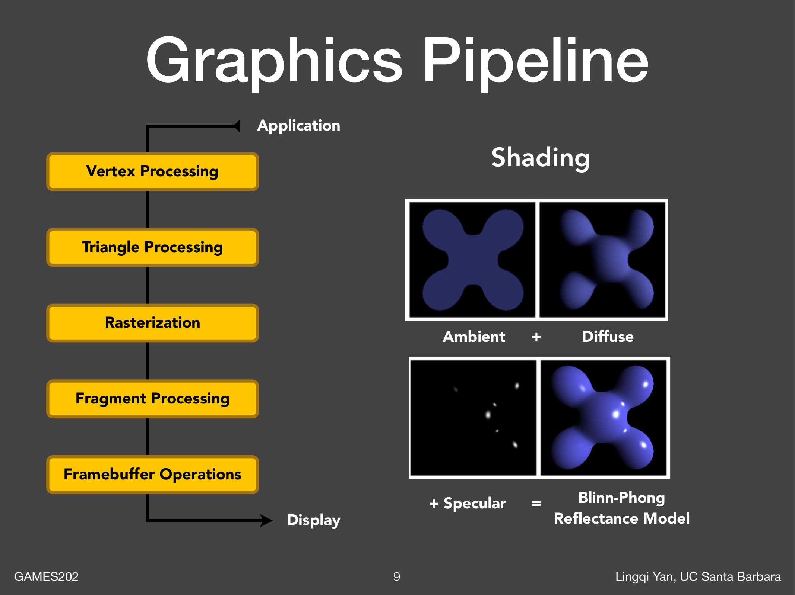

片元处理阶段通常是我们最关心的阶段，因为很多“画面长什么样”的逻辑都在这里：

- 根据法线和光照方向算漫反射；
- 根据视线方向和反射方向算高光；
- 读取纹理；
- 计算阴影；
- 输出颜色、法线、深度、材质参数等。

课件用 Blinn-Phong 作为例子，它把光照拆成：

```text
shading = ambient + diffuse + specular
```

直观理解：

- ambient：不管光从哪里来，都给一点基础亮度；
- diffuse：表面朝向光源越正，越亮；
- specular：视线方向刚好接近镜面反射方向时，出现高光。

Blinn-Phong 不是现代 PBR 的终点，但它非常适合理解“shader 是如何把几何、法线、光源、相机变成颜色”的。

## 7. OpenGL：从 CPU 调 GPU 管线

OpenGL 本质上是一组 API。CPU 端程序通过 OpenGL 告诉 GPU：

- 场景里有哪些顶点和纹理；
- 相机和投影矩阵是什么；
- 这次渲染输出到哪个 framebuffer；
- 使用哪一套 vertex shader 和 fragment shader；
- 开始 draw call。

课上强调：OpenGL 是 API，不是某种特定编程语言。你可以用 C/C++、JavaScript/WebGL 等不同宿主语言去调用类似的图形接口。

## 8. OpenGL 的油画类比

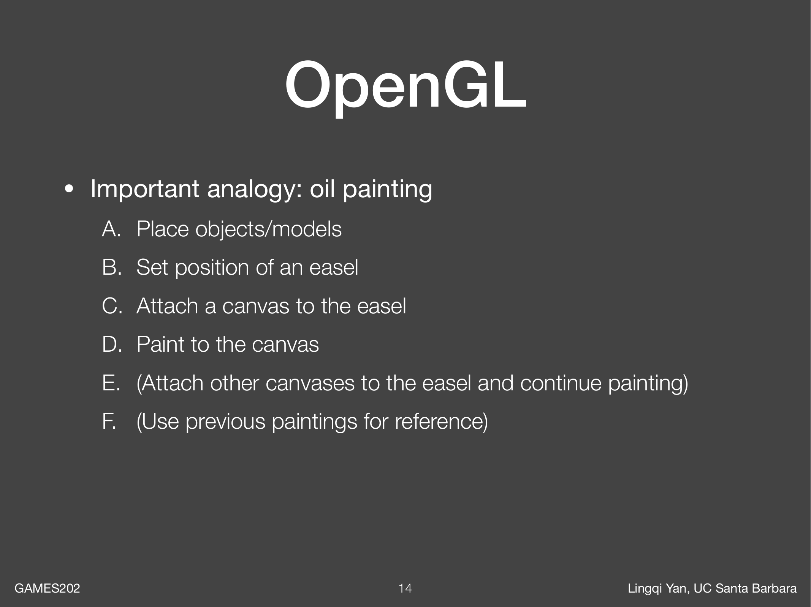

老师用油画类比 OpenGL 的流程：

| 油画动作 | OpenGL / 渲染动作 |
| --- | --- |
| 放置物体模型 | 指定顶点、法线、纹理坐标、VBO |
| 设置画架位置 | 设置相机、视图矩阵、投影矩阵 |
| 把画布挂到画架上 | 指定 framebuffer 和 render target |
| 在画布上作画 | 执行 draw call，让 shader 计算输出 |
| 换画布继续画 | 多个 framebuffer / 多个 render target |
| 参考之前画过的画 | 多 pass 渲染，把上一次结果当纹理输入 |

这个类比对理解实时渲染特别有用，因为现代效果经常不是一次 draw 完成，而是多个 pass 叠起来的。

例如：

- 先从光源视角渲染 shadow map；
- 再从相机视角渲染主画面，并查询 shadow map；
- 再做屏幕空间反射或环境光遮蔽；
- 再做 bloom、TAA、tone mapping 等后处理。

每个 pass 都像换一张画布，或者拿上一张画当参考继续加工。

## 9. 一个 Render Pass 里通常要指定什么

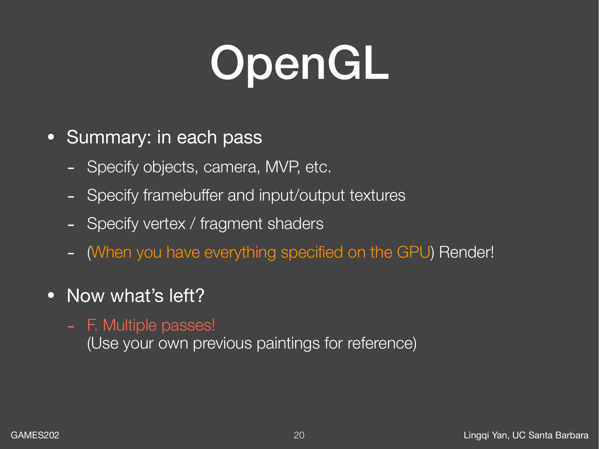

每个渲染 pass 通常需要指定：

1. **objects**：这次要画哪些模型；
2. **camera / MVP**：从哪个视角看；
3. **framebuffer**：输出写到哪里；
4. **input textures**：读哪些纹理，例如 shadow map、G-buffer、环境贴图；
5. **output textures**：写哪些结果，例如颜色、深度、法线、材质参数；
6. **vertex / fragment shaders**：用什么程序处理顶点和片元；
7. **render state**：深度测试、混合、剔除等状态。

后面的实时渲染技术基本都能落到这个框架里。比如 shadow mapping 可以理解为：

- Pass 1：从光源视角渲染深度图；
- Pass 2：从相机视角渲染画面，并用 Pass 1 的深度图判断阴影。

## 10. Shading Language：shader 是小程序

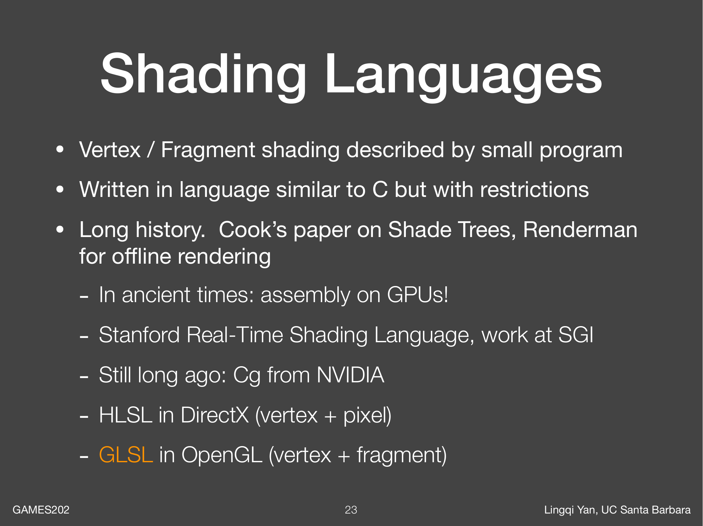

shader 是运行在 GPU 上的小程序。课程主要关注两类：

- **vertex shader**：每个顶点执行一次；
- **fragment shader**：每个 fragment 执行一次。

shader 语言通常接近 C，但会有 GPU 编程相关限制和内置类型。例如 GLSL 中常见：

```glsl
vec3 normal;
vec4 color;
mat4 modelViewProjection;
sampler2D albedoTexture;
```

GPU 的强项是对大量数据执行类似操作。所以 shader 编程的思维方式不是“一个像素一个像素手动循环”，而是“写一个 fragment 的计算逻辑，让 GPU 对所有 fragment 并行执行”。

## 11. Shader Setup：shader 也要编译、链接、使用

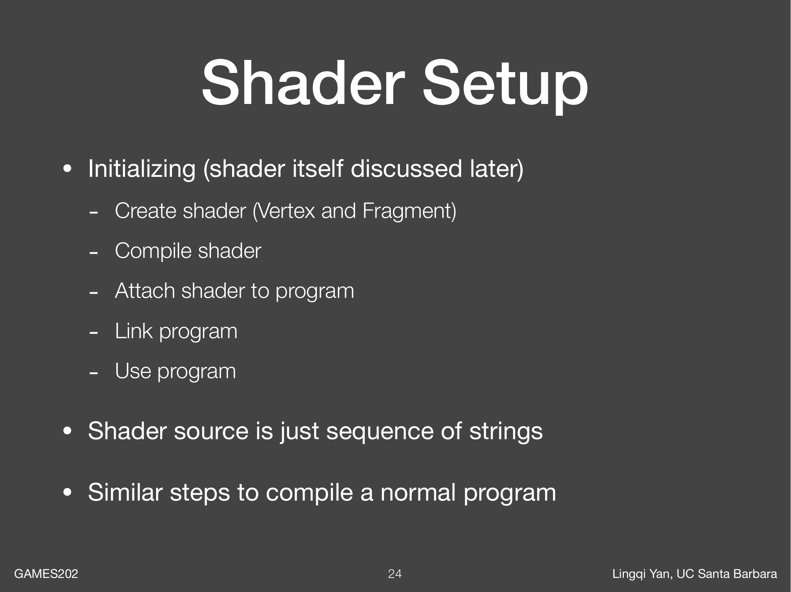

OpenGL 中使用 shader 大致有这些步骤：

1. 创建 vertex shader 和 fragment shader；
2. 读取 shader 源码；
3. 编译 shader；
4. 创建 shader program；
5. 把多个 shader attach 到 program；
6. link program；
7. use program；
8. draw。

这和普通程序的编译链接很像。区别是 shader 的编译和链接发生在图形 API 侧，最终程序运行在 GPU 的可编程阶段。

对后续学习来说，更重要的不是记住 API 名字，而是记住这个关系：

> CPU 负责准备数据和状态，GPU 根据当前绑定的 shader 和资源并行执行渲染。

## 12. Shader 调试：把数值显示成颜色

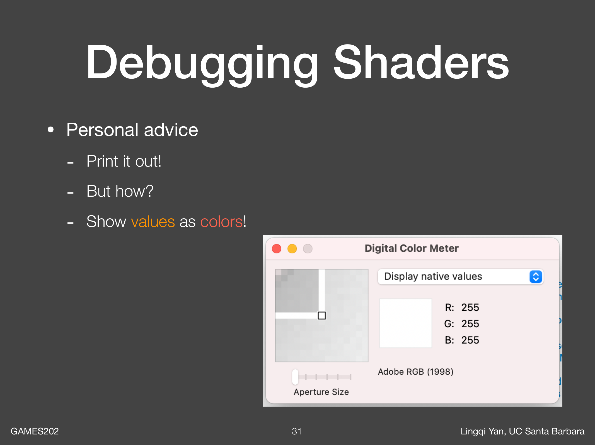

shader 调试往往比普通 CPU 程序更麻烦。一个很实用的办法是：

> 把你想检查的中间变量直接输出成颜色。

例如：

```glsl
// 查看法线方向，normal 取值从 [-1, 1] 映射到 [0, 1]
outColor = vec4(normal * 0.5 + 0.5, 1.0);
```

常见调试方式：

| 想检查什么 | 可以怎么显示 |
| --- | --- |
| normal 是否正确 | normal 映射成 RGB |
| depth 是否合理 | 深度值输出成灰度 |
| UV 是否错乱 | 输出 `vec3(uv, 0)` |
| shadow map 查询是否对 | 输出阴影因子 |
| BRDF 某一项是否异常 | 单独输出 diffuse、specular、F、D、G 等 |

这招很朴素，但非常有用。很多 shader bug 不是崩溃，而是“画面不对”，把中间量可视化往往是最快定位方式。

## 13. 渲染方程：描述光如何传输

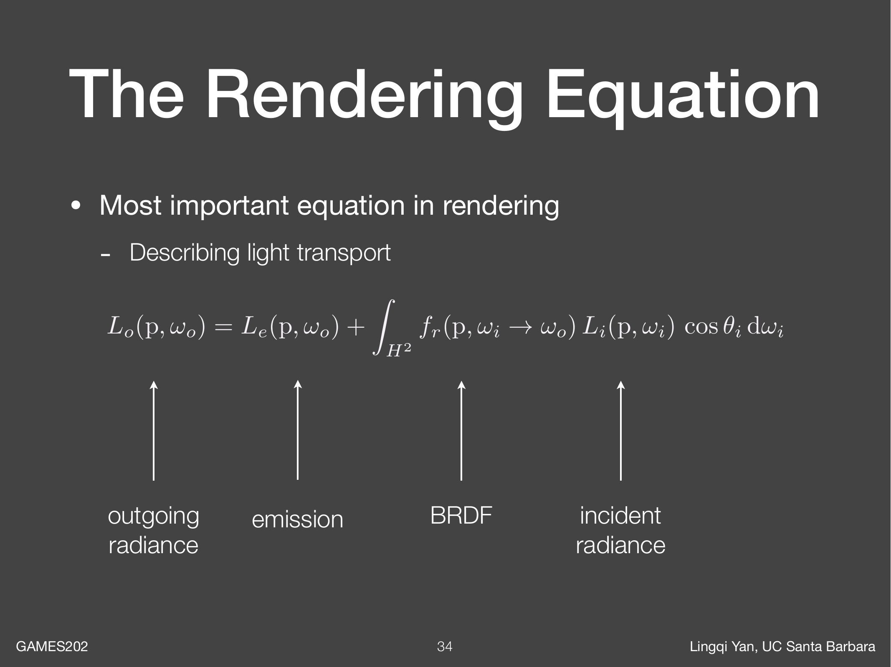

渲染方程是渲染里最重要的公式之一。课件中的形式可以写成：

```text
L_o(p, w_o) = L_e(p, w_o)
            + integral over hemisphere [
                f_r(p, w_i -> w_o)
                L_i(p, w_i)
                cos(theta_i)
                d w_i
              ]
```

逐项解释：

| 项 | 含义 |
| --- | --- |
| `L_o(p, w_o)` | 点 `p` 沿观察方向 `w_o` 出射的 radiance，也就是我们要算的结果 |
| `L_e(p, w_o)` | 点 `p` 自己发出的光，比如灯、发光材质 |
| `integral` | 把来自半球所有入射方向的贡献加起来 |
| `f_r(p, w_i -> w_o)` | BRDF，描述光从入射方向 `w_i` 打到表面后，有多少被反射到出射方向 `w_o` |
| `L_i(p, w_i)` | 从方向 `w_i` 入射到点 `p` 的 radiance |
| `cos(theta_i)` | 入射光与表面法线夹角带来的投影因子 |
| `d w_i` | 对方向积分时的一小块立体角 |

一句话总结：

> 一个点朝相机方向有多亮，等于它自己发出的光，加上所有方向照进来的光经过材质反射后朝相机方向贡献的总和。

## 14. 实时渲染里的渲染方程写法

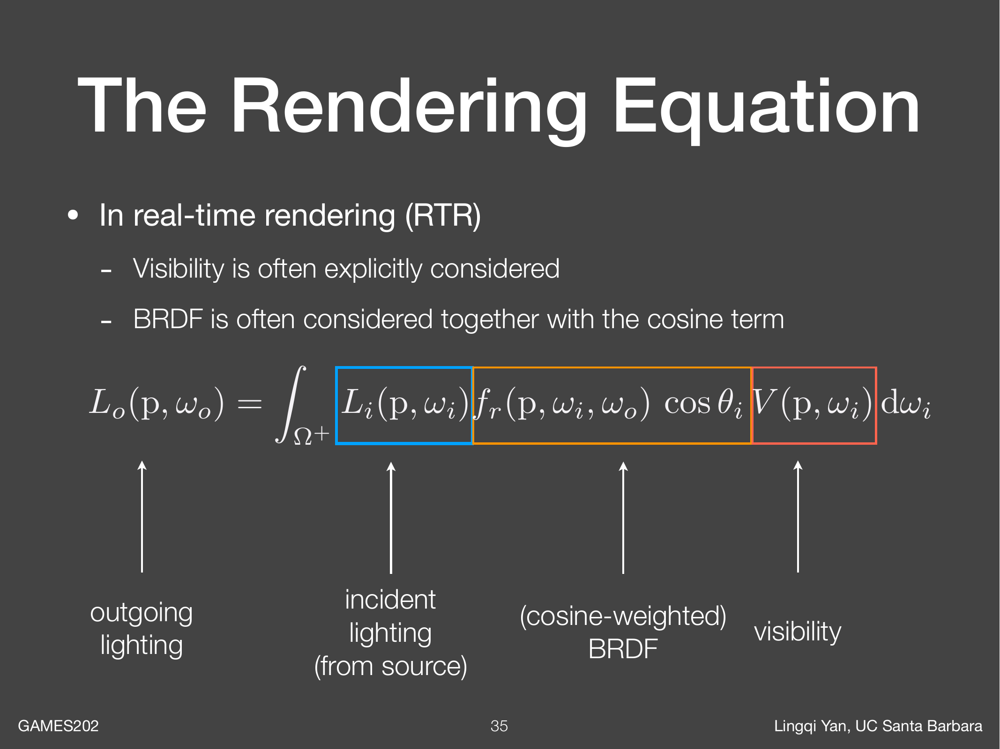

在实时渲染中，我们经常把可见性单独写出来：

```text
L_o(p, w_o) =
  integral [
    L_i(p, w_i)
    V(p, w_i)
    f_r(p, w_i, w_o)
    cos(theta_i)
    d w_i
  ]
```

其中 `V(p, w_i)` 是 visibility：

- 如果从 `p` 沿 `w_i` 能看到光源或环境，则可见性接近 1；
- 如果中间被挡住，则可见性接近 0；
- 对软阴影来说，它可能是 0 到 1 之间的比例。

这正好解释了后续课程为什么会先讲阴影。阴影不是额外贴上去的黑色效果，而是渲染方程里的可见性项。

实时渲染还经常把 BRDF 和 cosine term 放在一起考虑，因为实际 shader 中它们通常一起参与光照权重计算。

## 15. 环境光照：来自所有方向的入射光

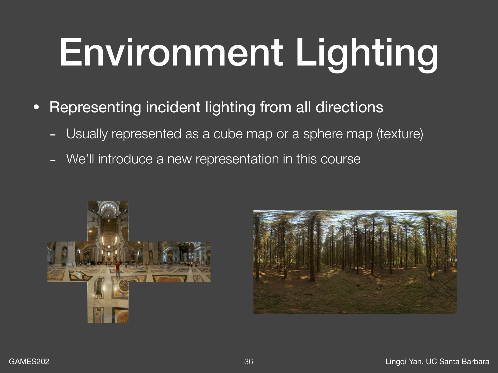

环境光照要表达的是：

> 场景中某个点会被来自四面八方的光照亮，而不只是被几个点光源照亮。

常见表示方式：

- cube map；
- sphere map；
- HDR environment map；
- 后续课程会引入新的表示和预计算方法。

环境光照和渲染方程联系很紧：如果 `L_i(p, w_i)` 来自所有方向，那么理论上就要对半球积分。但实时渲染没有时间对每个像素、每个方向都精确积分，所以需要：

- 预滤波；
- 重要性采样；
- split sum；
- 球谐函数；
- 预计算辐射传输等方法。

这些都会在环境光照和 PBR 相关课程里出现。

## 16. Direct Illumination：只算直接光

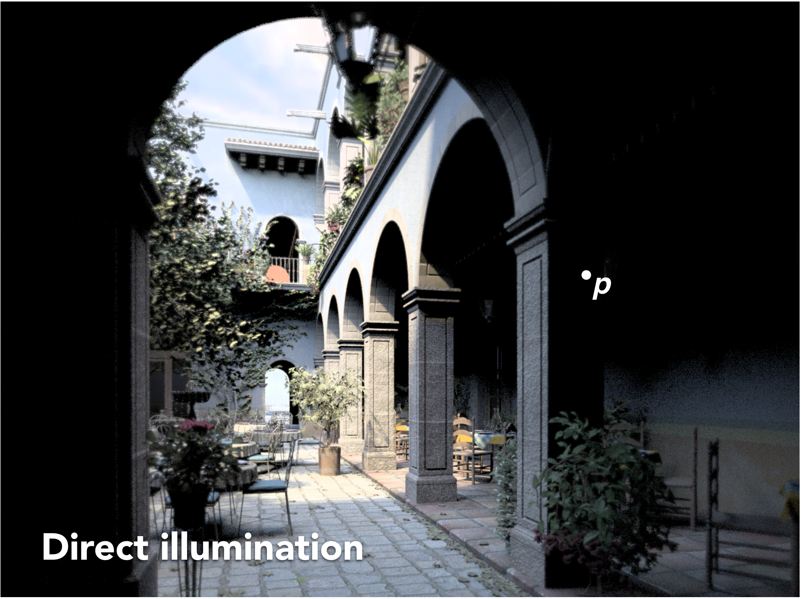

直接光照只考虑：

> 光源发出的光，经过一次传播，直接照到表面点 `p`，再反射到相机。

它不考虑光在其他物体上反弹之后再照到 `p` 的情况。

典型直接光包括：

- 方向光照到地面；
- 点光源照到墙；
- 面光源照到物体表面；
- 环境贴图中的某个方向直接贡献光照。

许多基础 shader 都从直接光开始，因为它相对容易算，也容易与 shadow map 结合。

## 17. One-Bounce GI：一次间接反弹

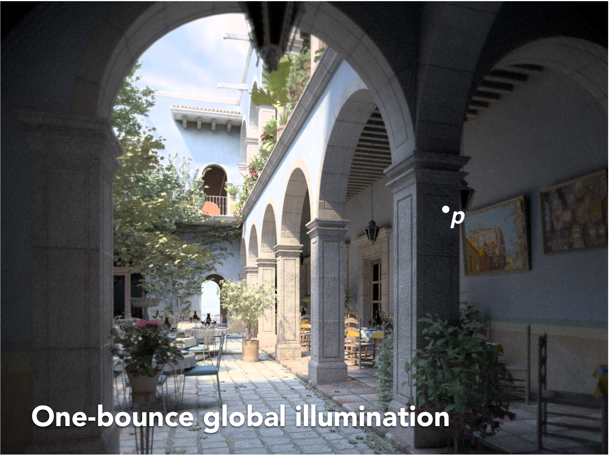

一次反弹全局光照考虑：

> 光先照到某个表面，再从那个表面反射到当前点 `p`。

这会带来很多真实感现象：

- 暗部不再完全黑；
- 彩色墙面会把颜色“染”到附近物体上；
- 大面积墙、地板、天花板会成为间接光源；
- 室内空间的光照更柔和。

在渲染方程里，`L_i(p, w_i)` 本身也是另一个点的 `L_o`。这就是全局光照难的原因：一个点的亮度依赖其他点，其他点又依赖更多点。

## 18. Two-Bounce GI：多次反弹让问题递归起来

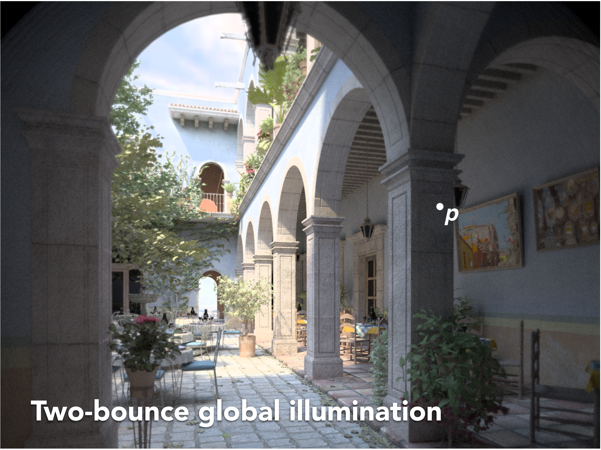

两次反弹、三次反弹乃至更多反弹会让光传输越来越复杂，也越来越接近真实世界。

从公式上看，渲染方程是递归的：

- 当前点需要知道入射光 `L_i`；
- 入射光来自另一个点的出射光 `L_o`；
- 那个点的 `L_o` 又要通过渲染方程继续算。

离线路径追踪可以通过大量随机路径采样逐渐逼近这个结果，但实时渲染必须近似。后续实时 GI 技术都会围绕这个问题做取舍：

- 在 3D 空间缓存间接光；
- 用屏幕空间信息估计附近遮蔽和反弹；
- 对静态部分预计算；
- 用时域积累补充采样不足。

## 19. 这一讲和后续课程的关系

这讲看起来像 GAMES101 复习，但它其实在给后面的实时渲染专题打地基：

| 本讲基础 | 后续会如何用到 |
| --- | --- |
| MVP 变换 | shadow map、屏幕空间方法、motion vector、reprojection |
| Rasterization | 所有基于光栅化的实时效果 |
| Z-buffer | 可见性、深度重建、SSAO、SSR、延迟渲染 |
| Framebuffer / texture | 多 pass 渲染、G-buffer、post-processing |
| Shader | 几乎所有实时渲染算法的落地位置 |
| Rendering Equation | 阴影、BRDF、环境光照、GI、光追的统一理论来源 |
| Direct / indirect light | 后续全局光照课程的核心区分 |

## 20. 常见误解

**误解 1：fragment 就是 pixel。**  
fragment 是候选结果，pixel 是最终 framebuffer 里的结果。一个像素位置可能有多个 fragment 竞争，深度测试后才决定谁留下。

**误解 2：Z-buffer 已经解决了所有遮挡。**  
Z-buffer 只解决相机视角的遮挡。阴影需要从光源视角判断遮挡，全局光照还需要处理更复杂的可见性。

**误解 3：OpenGL 的重点是记 API。**  
API 名字会变，管线思想不变。更重要的是理解 CPU 准备资源、GPU 并行执行 shader、framebuffer 存放结果这套关系。

**误解 4：渲染方程只是离线渲染才用。**  
实时渲染也在近似渲染方程，只是会显式拆出可见性、预计算入射光、简化 BRDF、限制反弹次数或用屏幕空间信息代替真实光传输。

## 21. 学完本讲后应该能回答的问题

1. 图形管线从顶点到像素经历哪些阶段？
2. vertex shader 和 fragment shader 分别运行在什么时候？
3. 为什么 fragment 不一定会成为最终 pixel？
4. Z-buffer 解决的是哪一种可见性？
5. 一个 render pass 通常需要指定哪些资源和状态？
6. 为什么多 pass 渲染可以“用上一张画当参考”？
7. shader 调试时为什么常把中间变量输出成颜色？
8. 渲染方程里的 `L_o`、`L_i`、BRDF、cosine term 分别表示什么？
9. 为什么全局光照天然是递归问题？
10. 直接光照和一次反弹间接光照有什么区别？

## 22. 下一讲预告

下一讲开始进入第一个实时渲染专题：shadow mapping。

本讲里的两个概念会立刻派上用场：

- **Z-buffer**：shadow map 本质上就是从光源视角得到的一张深度图；
- **visibility**：阴影就是渲染方程中的可见性项。

