# GAMES202 Lecture 03：实时阴影 1

> 视频：<https://www.bilibili.com/video/BV1YK4y1T7yY?p=3>  
> 课程主页：<https://sites.cs.ucsb.edu/~lingqi/teaching/games202.html>  
> 本讲主题：Real-time Shadows 1，重点介绍 Shadow Mapping、它产生的瑕疵，以及 PCF、PCSS 如何得到更稳定、更接近软阴影的结果。

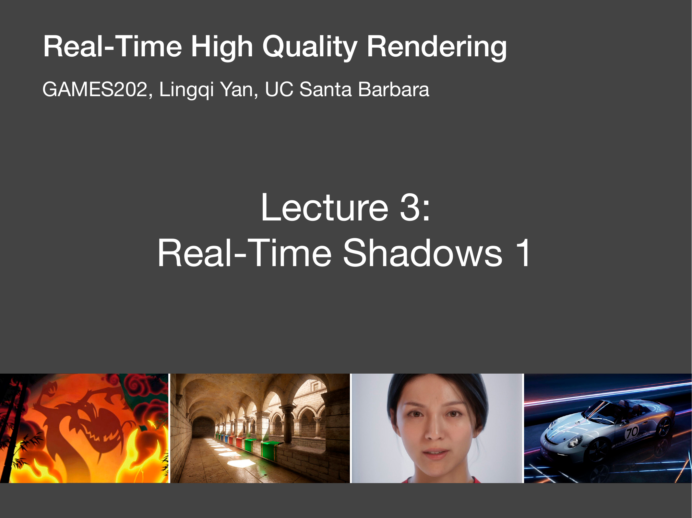

## 1. 阴影不是“涂黑”，而是可见性

上一讲把实时渲染中的渲染方程写成了带可见性项的形式：

$$
L_o(\mathbf{p}, \omega_o)
=
\int_{\Omega^+}
L_i(\mathbf{p}, \omega_i)\,
f_r(\mathbf{p}, \omega_i, \omega_o)\,
\cos\theta_i\,
V(\mathbf{p}, \omega_i)\,
\mathrm{d}\omega_i
$$

其中 `V(p, w_i)` 回答一个很直接的问题：

> 从表面点 `p` 沿入射光方向看过去，能不能看到光源？

- 能看到，`V = 1`，光照正常贡献到该点；
- 完全被挡住，`V = 0`，这部分直接光消失；
- 只能看到面光源的一部分，`V` 可以是 `0` 到 `1` 之间的数，这会形成软阴影。

因此阴影不是在最终颜色上额外乘一个随意的黑色，而是在求解直接光照时判断光源是否可见。Shadow Mapping 就是一种适合光栅化管线的可见性查询方法。

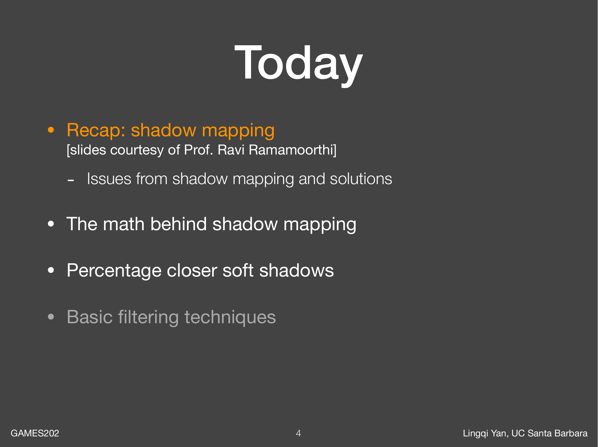

本讲的主线可以概括为：

1. 用 Shadow Mapping 快速得到硬阴影；
2. 理解深度图离散化为什么会产生 self-occlusion 和 aliasing；
3. 用 PCF 对“深度比较结果”做过滤；
4. 根据遮挡物与接收面的距离动态改变过滤范围，得到 PCSS 软阴影。

## 2. Shadow Mapping 的核心想法

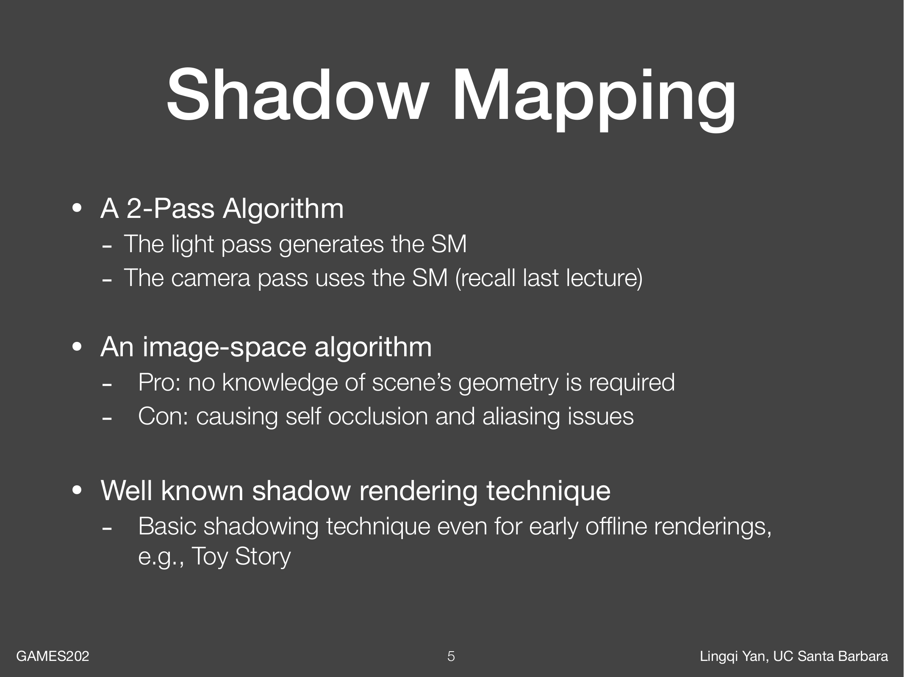

Shadow Mapping 的出发点是：

> 如果光源能照到一个点，那么从光源的位置看过去，这个点应该是该方向上最先看到的表面。

这和相机用 Z-buffer 判断可见性完全相同，只是把观察者换成了光源。

Shadow Mapping 是一个两遍渲染算法：

| Pass | 从哪里看 | 输出或使用什么 | 目的 |
| --- | --- | --- | --- |
| Light Pass | 光源 | 输出深度纹理 `shadow map` | 记录光源在每个方向最先看到的深度 |
| Camera Pass | 相机 | 查询上一遍的 `shadow map` | 判断相机看到的点能否被光源直接看到 |

它也是一种 image-space 算法：核心数据是一张二维深度图，不需要在查询阴影时重新遍历场景中的所有三角形。这使它很适合 GPU 光栅化，但二维离散图像也会带来精度、采样和分辨率问题。

## 3. Pass 1：从光源渲染深度图

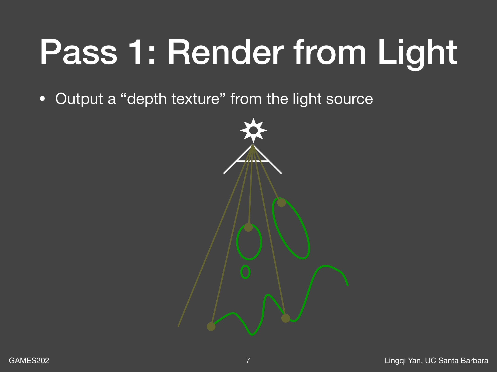

第一遍把光源当作相机：

1. 使用光源的 View 矩阵和 Projection 矩阵；
2. 从光源视角光栅化场景；
3. 开启深度测试；
4. 不关心最终颜色，只保存最近深度；
5. 得到一张 depth texture，也就是 shadow map。

对 shadow map 中的每个 texel，可以把它理解为：

$$
D_{\text{shadow}}(u,v)
=
\min_{\mathbf{q}\,\mapsto\,(u,v)}
z_{\text{light}}(\mathbf{q})
$$

这里的 $\mathbf{q}\mapsto(u,v)$ 表示场景点 $\mathbf{q}$ 投影到 shadow map 的 texel $(u,v)$；取最小值就是保存该方向上离光源最近的表面深度。

方向光通常使用正交投影，因为它的光线互相平行；聚光灯通常使用透视投影；点光源向四面八方发光，常需要 cube map 的六个面或其他全向阴影表示。

## 4. Pass 2：把相机看到的点投回光源

相机正常渲染场景时，每个可见片元都有一个世界空间位置 `p_world`。接下来要把这个点变换到光源的投影空间：

$$
\begin{aligned}
\mathbf{p}_{\text{light}}^{\text{clip}}
&= P_{\text{light}}V_{\text{light}}
   \begin{bmatrix}\mathbf{p}_{\text{world}}\\1\end{bmatrix},\\
\mathbf{p}_{\text{light}}^{\text{ndc}}
&= \frac{
   (\mathbf{p}_{\text{light}}^{\text{clip}})_{xyz}
   }{
   (\mathbf{p}_{\text{light}}^{\text{clip}})_w
   },\\
\mathbf{uv}
&= \frac{1}{2}
   \left(
   (\mathbf{p}_{\text{light}}^{\text{ndc}})_{xy}
   + \mathbf{1}
   \right),\\
z_{\text{receiver}}
&= \operatorname{DepthRangeMap}
   \left(
   (\mathbf{p}_{\text{light}}^{\text{ndc}})_z
   \right).
\end{aligned}
$$

这里的 `uv` 用来查询 shadow map，`z_receiver` 表示当前点到光源的深度。shadow map 中取出的 `z_closest` 则是光源在同一方向实际看到的最近深度。

### 4.1 深度相同：光源可以看到该点

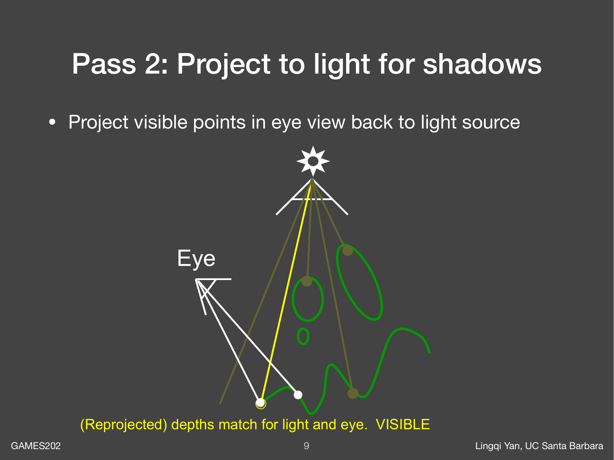

如果两者近似相等：

$$
z_{\text{receiver}}
\le z_{\text{closest}}+\operatorname{bias}
$$

说明相机看到的点也是光源在该方向最先看到的表面，因此它被直接照亮。

### 4.2 当前点更远：前面有遮挡物

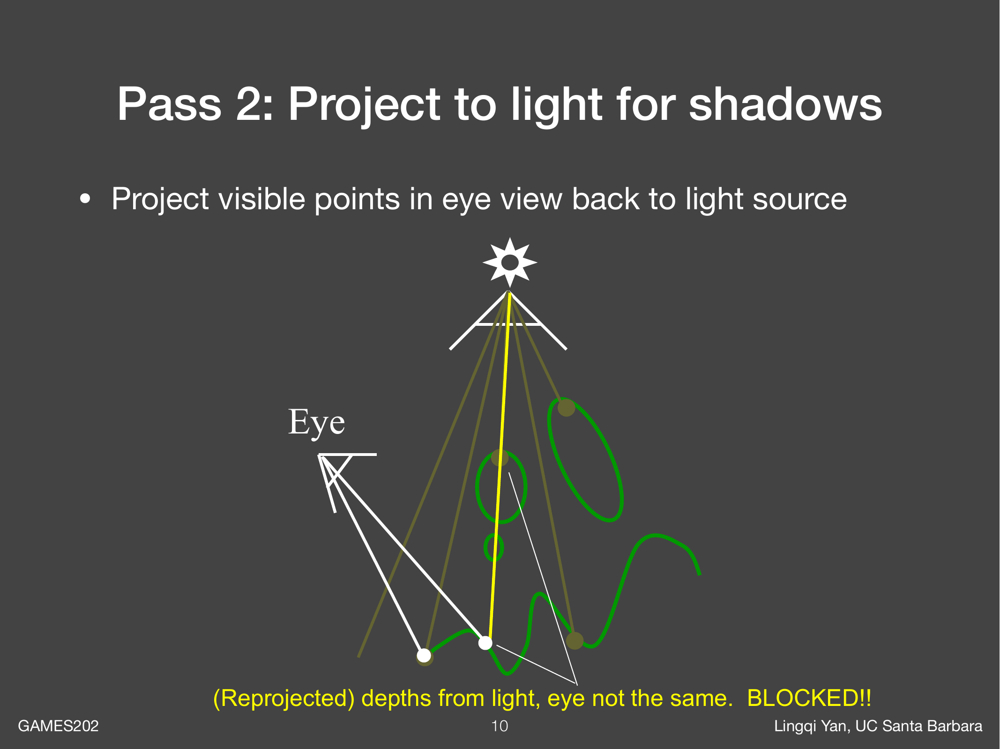

如果：

$$
z_{\text{receiver}}
> z_{\text{closest}}+\operatorname{bias}
$$

说明光源先看到了另一个更近的表面，当前点被它挡住，应处于阴影中。

最基础的比较可以写成：

```glsl
float visible = zReceiver <= sampledDepth + bias ? 1.0 : 0.0;
```

实际代码还要注意：

- 透视除法必须正确；
- NDC 到纹理坐标的映射要符合图形 API 约定；
- 深度范围可能是 `[0, 1]` 或 `[-1, 1]`；
- 使用 reverse-Z 时比较方向会反过来；
- 投影到光源视锥外的点不能直接按普通 texel 查询；
- shadow map 和当前片元的深度必须处在同一种深度表示中。

## 5. 从图像上理解这两遍渲染

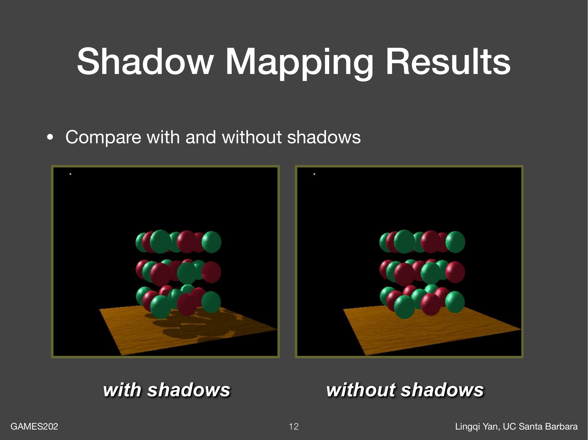

没有阴影时，几何体之间缺少明确的遮挡关系，物体容易显得悬浮。加入阴影后，人眼能更容易判断物体与地面、物体与物体之间的距离和接触关系。

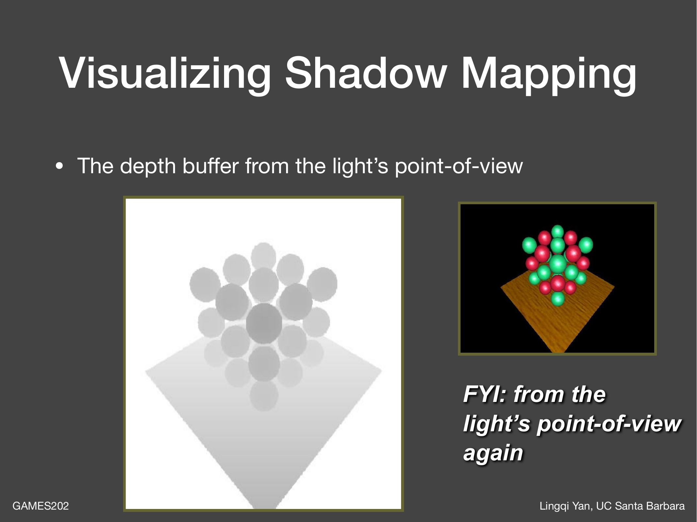

从光源视角生成的 depth buffer 看起来通常是一张灰度图。它不是普通颜色纹理：灰度只是为了方便观察，真正存储的是深度数值。

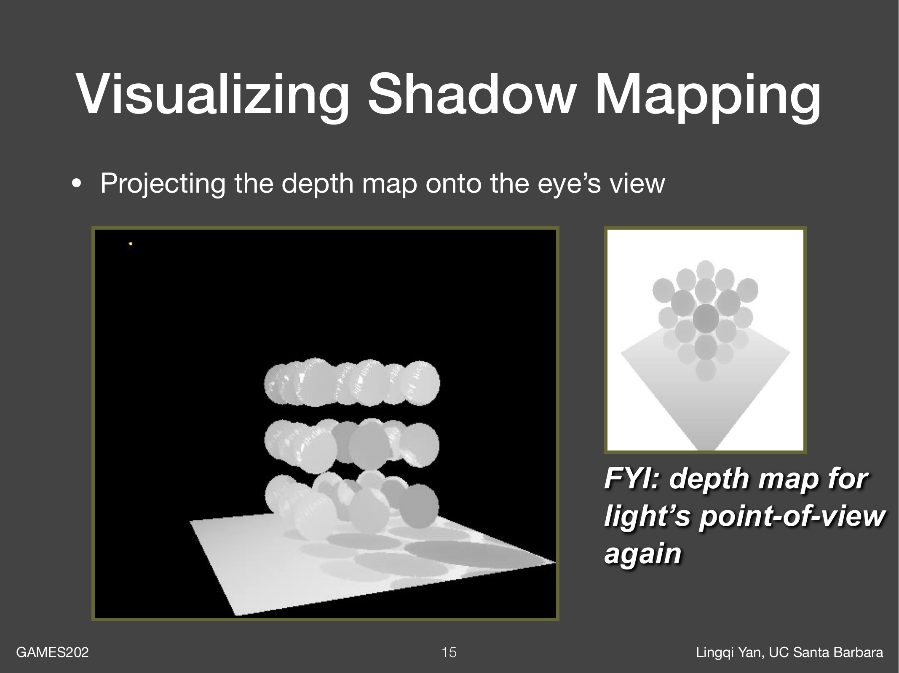

第二遍从相机观察时，相当于把这张光源深度图“投影”回场景。每个相机可见点都去光源图像中找到自己的位置，再完成一次深度比较。

这里有一个很重要的区分：

- 相机的 Z-buffer 决定哪个表面能被相机看见；
- 光源的 shadow map 决定相机看到的这个表面能否被光源看见。

## 6. Shadow Mapping 的优点与代价

Shadow Mapping 长期被广泛使用，是因为它和现有光栅化管线配合得很好：

- 算法结构简单，主要是多一次深度 pass；
- 不需要对每个着色点向场景发射真正的阴影射线；
- 能处理复杂几何体和互相投影；
- 动态光源、动态物体都可以重新渲染 shadow map；
- 查询阶段只是纹理采样和深度比较，适合 GPU 并行执行。

它的主要代价也来自“把连续场景压成有限分辨率深度图”：

- 深度精度有限；
- 一个 texel 会代表一块有限面积；
- 光源和相机的采样位置不一致；
- shadow map 的分辨率不一定均匀地用在屏幕真正需要细节的地方。

这些问题会表现为 self-occlusion、shadow acne、悬空阴影、锯齿、闪烁和细小阴影丢失。

## 7. Self-Occlusion：表面为什么会错误地遮挡自己

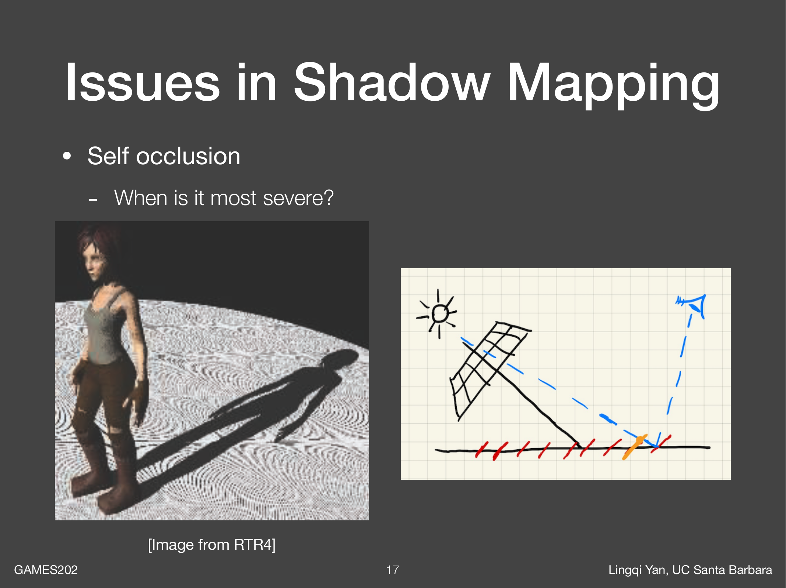

理论上，一个表面点投回光源后，`z_receiver` 应该等于 shadow map 中记录的深度。但实际中，两者经常有微小差异：

1. shadow map 只在离散 texel 上采样；
2. 一个倾斜平面会让同一 texel 覆盖区域内的真实深度发生变化；
3. 光栅化、插值和浮点深度本身有精度误差；
4. 相机 pass 和光源 pass 的采样点通常不完全重合。

于是本来应该相等的深度可能变成：

$$
z_{\text{receiver}}
= z_{\text{closest}}+\varepsilon,
\qquad \varepsilon>0
$$

严格使用 `z_receiver > z_closest` 判断遮挡时，表面会被误判为在自己后面，产生条纹状或点状的 shadow acne。

这个问题在以下情况通常更明显：

- 表面与光线夹角很小，也就是掠射角；
- shadow map 分辨率低，一个 texel 覆盖很大区域；
- 光源投影范围过大，有效 texel 密度不足；
- 深度范围设置过宽，有限精度被浪费。

## 8. Depth Bias：用容差避免自己挡住自己

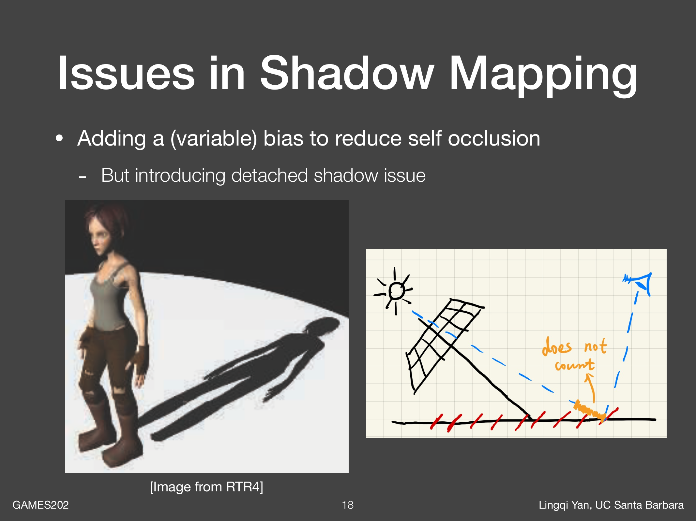

最常用的修复是在比较时加入 bias：

$$
V=
\begin{cases}
1, & z_{\text{receiver}}
     \le z_{\text{closest}}+\operatorname{bias},\\
0, & z_{\text{receiver}}
     > z_{\text{closest}}+\operatorname{bias}.
\end{cases}
$$

也可以在生成 shadow map 时把深度沿某个方向偏移。工程中常把 bias 分成：

- constant bias：给所有点一个固定容差；
- slope-scaled bias：表面越倾斜，bias 越大；
- normal bias：沿接收面法线移动查询位置。

一个常见的概念式写法是：

$$
\operatorname{bias}
=
\max\left(
\operatorname{bias}_{\min},
k_{\text{slope}}
\left(1-\mathbf{n}\cdot\mathbf{l}\right)
\right)
$$

这不是所有 API 都直接照抄的公式，但它表达了同一个直觉：表面越背离光线，离散深度误差通常越明显，需要更大容差。

Bias 是典型的两难调参：

| Bias | 结果 |
| --- | --- |
| 太小 | shadow acne 仍然存在 |
| 合适 | 自遮挡减少，接触关系仍可信 |
| 太大 | 真正靠近物体的阴影也被当成可见，产生 detached shadow / peter-panning |

所以 bias 不是越大越安全。它是在“避免错误自遮挡”和“保住真实接触阴影”之间寻找平衡。

## 9. Second-Depth Shadow Mapping

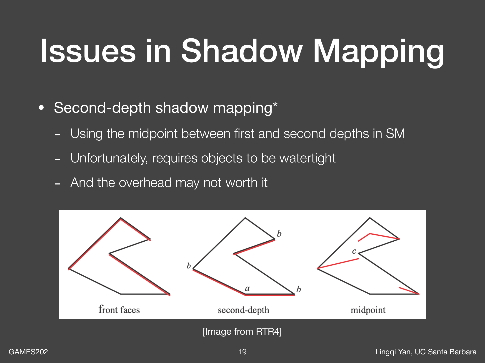

另一个思路是：不只保存光线遇到的第一层深度，还保存第二层深度，并用第一层与第二层的中点作为比较边界。

直观上，第一层是物体正面，第二层是光线离开物体的背面。两者中点通常位于物体内部，因此不会因为表面上的一点点数值误差而把正面误判进阴影。

它的问题是：

- 需要获得第二层深度，增加存储和渲染开销；
- 默认物体是封闭、watertight 的；
- 薄片、开口网格、单面几何和相交几何会破坏“第二层是背面”的假设；
- 复杂度增加后，收益不一定比经过良好调节的 bias 更划算。

这也是实时渲染里常见的工程判断：理论上更精细的方法如果依赖太强的场景假设，未必更适合实际内容生产。

## 10. Aliasing：阴影边缘为什么会锯齿和闪烁

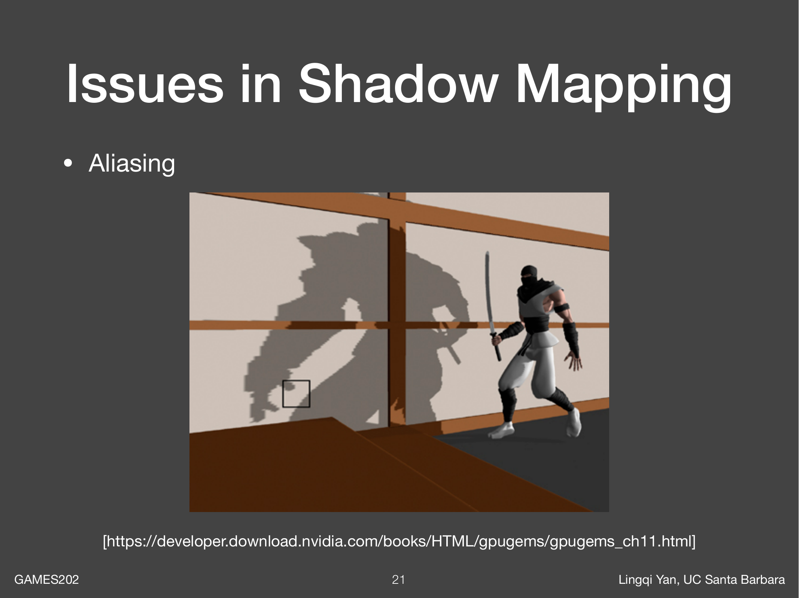

Shadow map 是有限分辨率纹理。一个 shadow texel 投影到屏幕上后，可能覆盖很多 camera pixels，于是多个屏幕像素会共享同一个粗糙的可见性判断，阴影边缘就会出现台阶。

可以把问题理解成两套采样网格不匹配：

- shadow map 在光源图像上采样；
- 最终画面在相机图像上采样；
- 光源投影到相机后，shadow texel 的屏幕尺寸会随位置变化。

相机或光源轻微移动时，查询可能突然跳到相邻 texel，因此静态截图里的锯齿还会变成动态画面中的闪烁。

常见缓解思路包括：

- 提高 shadow map 分辨率；
- 缩小光源投影范围，让 texel 用在真正需要的区域；
- 对大范围方向光使用 Cascaded Shadow Maps；
- 使用 PCF 过滤二值比较结果；
- 旋转或随机化采样，并结合时间过滤；
- 使用后续课程中的统计型 shadow map 方法。

单纯提高分辨率只能推迟问题，并不能消除离散采样的本质。

## 11. 实时渲染中的一个重要近似

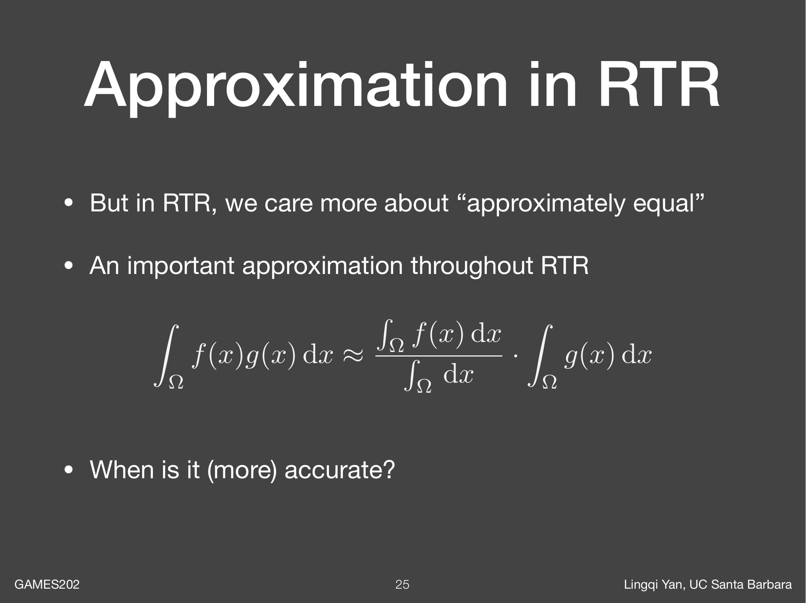

课程用下面的近似解释 Shadow Mapping 与软阴影背后的数学。先定义 $f$ 在积分域 $\Omega$ 上的平均值：

$$
\bar{f}
=
\frac{\displaystyle\int_\Omega f(x)\,\mathrm{d}x}
     {\displaystyle\int_\Omega \mathrm{d}x}
$$

那么乘积的积分可近似写为：

$$
\int_\Omega f(x)g(x)\,\mathrm{d}x
\approx
\bar{f}\int_\Omega g(x)\,\mathrm{d}x
=
\frac{\displaystyle\int_\Omega f(x)\,\mathrm{d}x}
     {\displaystyle\int_\Omega \mathrm{d}x}
\cdot
\int_\Omega g(x)\,\mathrm{d}x
$$

它不是恒等式。它相当于把 `f` 在积分域中的平均值提出来，隐含地假设 `f` 与 `g` 的变化没有强烈相关，或者其中一个函数在积分域内变化不大。

如果把 $\Omega$ 上的均匀积分看成期望，真实值与近似值之差正好由协方差决定：

$$
\underbrace{\int_\Omega f(x)g(x)\,\mathrm{d}x}_{\text{真实值}}
-
\underbrace{|\Omega|\,\mathbb{E}[f]\,\mathbb{E}[g]}_{\text{近似值}}
=
|\Omega|\,\operatorname{Cov}(f,g)
$$

因此，$\operatorname{Cov}(f,g)$ 越接近 0，这个近似越准确；两者同向变化时近似容易低估，反向变化时近似容易高估。

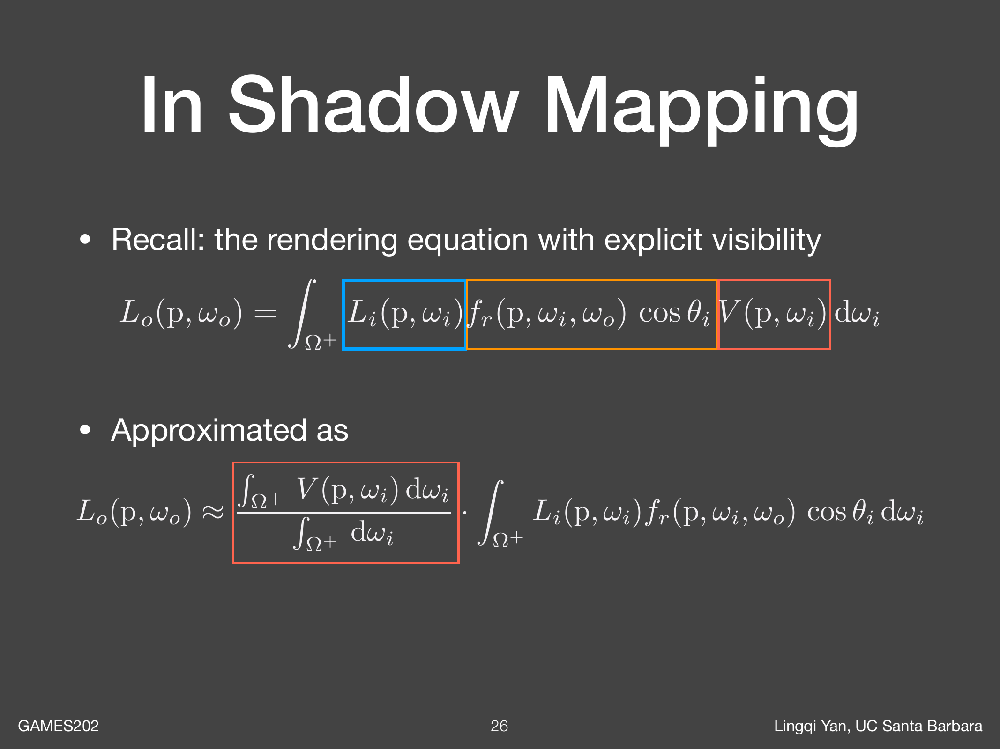

把它用到带 visibility 的渲染方程，可以近似拆成：

$$
\begin{aligned}
G(\omega_i)
&=
L_i(\mathbf{p},\omega_i)\,
f_r(\mathbf{p},\omega_i,\omega_o)\,
\cos\theta_i,\\
L_o(\mathbf{p},\omega_o)
&=
\int_{\Omega^+}
V(\mathbf{p},\omega_i)\,
G(\omega_i)\,
\mathrm{d}\omega_i\\
&\approx
\underbrace{
\frac{
\displaystyle\int_{\Omega^+}
V(\mathbf{p},\omega_i)\,\mathrm{d}\omega_i
}{
\displaystyle\int_{\Omega^+}\mathrm{d}\omega_i
}
}_{\text{光源的平均可见比例 }\bar V}
\cdot
\underbrace{
\int_{\Omega^+}
G(\omega_i)\,\mathrm{d}\omega_i
}_{\text{不考虑遮挡时的光照}}.
\end{aligned}
$$

第一部分只负责“有多少光源可见”，第二部分负责光源强度、BRDF 和余弦项。这相当于把阴影与着色暂时解耦，工程上就可以先算 unshadowed lighting，再乘一个 shadow factor。

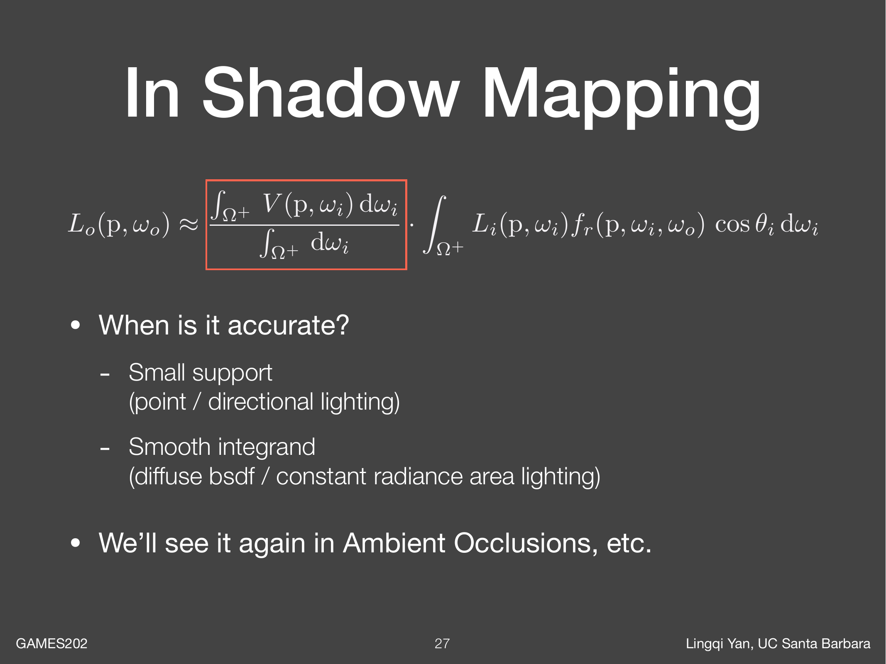

这个近似在以下情况更可靠：

- 积分域很小，例如点光源或方向光近似只有一个入射方向；
- 非可见性部分变化平滑，例如漫反射 BRDF；
- 面光源在不同位置发出的 radiance 近似恒定；
- 可见性与 BRDF、入射光变化没有特别强的相关性。

如果光源很大、材质有尖锐高光、光源不同区域亮度差异很大，那么“可见百分比 × 无阴影光照”可能不再准确。PCSS 追求的是实时且视觉可信，并不是完整求解面积光源积分。

## 12. 从硬阴影到软阴影

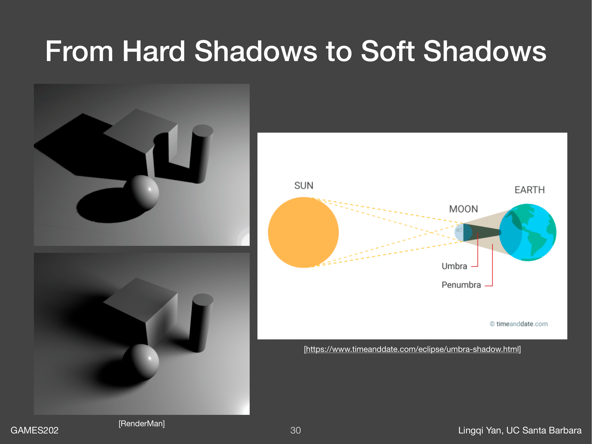

理想点光源只有一个位置。对任意接收点而言，它只有“看得见”或“被挡住”两种状态，因此产生硬阴影。

面光源具有面积。接收点可能看到：

- 整个光源：完全照亮；
- 完全看不到光源：本影 umbra；
- 只看到一部分光源：半影 penumbra。

所以真实软阴影并不是把硬阴影随便模糊一下，而是不同位置看到了不同比例的面光源。

太阳在现实中也有有限的角大小，因此能产生软阴影。实时渲染中的“方向光”如果没有光源角半径，通常只是把太阳近似成零面积方向光，得到硬阴影。

## 13. PCF：先比较，再过滤

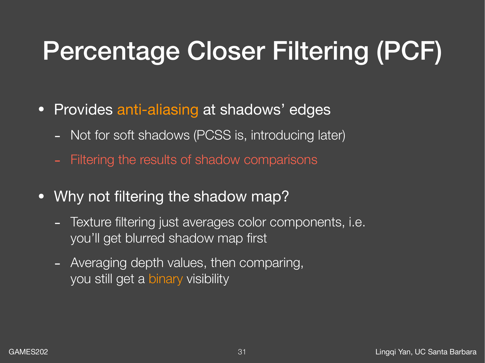

Percentage Closer Filtering，简称 PCF，用于减轻硬阴影边缘的 aliasing。它最关键的原则是：

> 过滤的是多次深度比较得到的可见性结果，而不是 shadow map 中的深度值。

为什么不能先把深度平均，再比较？假设邻近两个 texel 的深度分别是 `2` 和 `10`，接收点深度是 `6`：

$$
\begin{aligned}
z_{\text{receiver}} &= 6,
& (z_1,z_2)&=(2,10),\\
(V_1,V_2)
&=
\left(
\mathbf{1}[6\le2],
\mathbf{1}[6\le10]
\right)
=(0,1),\\
\bar V
&=\frac{V_1+V_2}{2}
=\frac{1}{2}.
\end{aligned}
$$

如果先平均深度，则 $\bar z=(2+10)/2=6$，之后只做一次比较仍然只能得到 0 或 1，无法表达“一半样本可见”。

先平均深度会丢掉“有多少样本在接收点前面”这条信息，而且深度比较是非线性操作，通常有：

$$
\operatorname{Compare}
\left(
\mathbb{E}[z]
\right)
\ne
\mathbb{E}
\left[
\operatorname{Compare}(z)
\right]
$$

### 13.1 PCF 的计算步骤

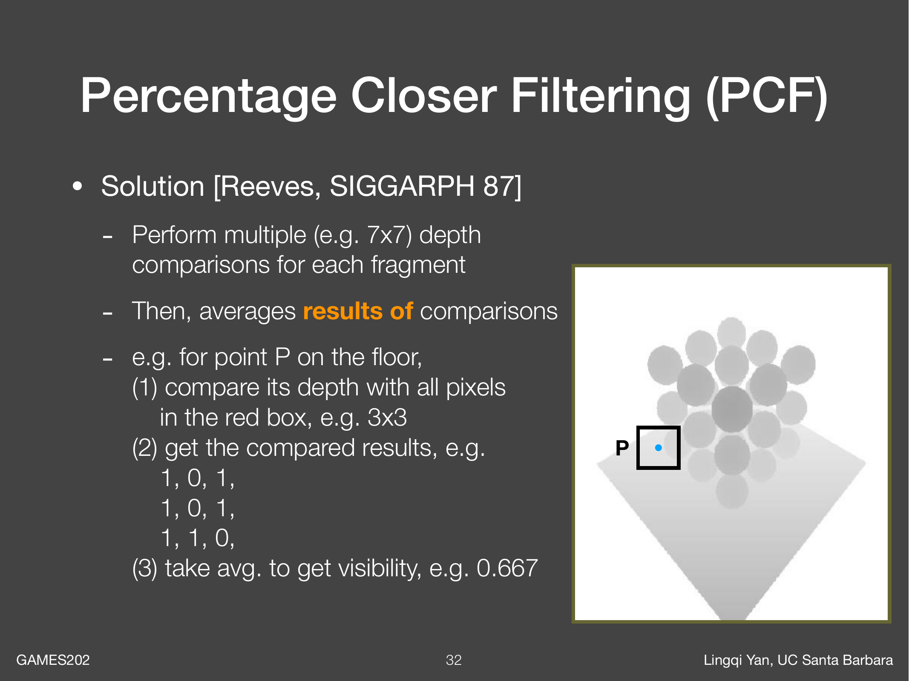

对当前片元，不只采样一个 shadow texel，而是在周围取一个核，例如 `3 x 3` 或 `7 x 7`：

```glsl
float visibility = 0.0;

for (int i = 0; i < sampleCount; ++i) {
    float shadowDepth = sampleShadowMap(uv + offsets[i]);
    visibility +=
        zReceiver <= shadowDepth + bias ? 1.0 : 0.0;
}

visibility /= float(sampleCount);
```

如果 9 次比较中有 6 次可见，最终 visibility 就是 `6 / 9 = 0.667`。阴影边缘不再只能从 0 突然跳到 1，而是会出现中间值。

PCF 的名称也可以按字面理解：它统计周围有多少百分比的深度样本比当前接收点“更远”，也就是有多少样本允许光照到达当前点。

## 14. PCF 看起来变软，但不等于物理软阴影

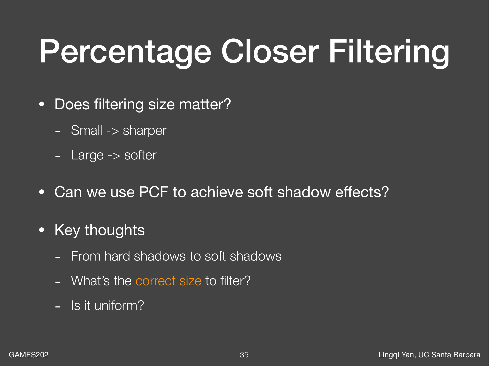

PCF 核越小，边缘越锐利；核越大，边缘越模糊。固定大核确实能让阴影“看起来软”，但它并没有表达真实面光源的几何关系。

真实软阴影有一个重要现象：contact hardening。

- 遮挡物靠近接收面时，阴影边缘很锐利；
- 遮挡物离接收面越远，半影越宽、边缘越柔和。

固定半径 PCF 在所有位置使用相同模糊宽度，因此主要应理解为阴影边缘抗锯齿。要模拟随距离变化的半影，需要让 PCF 的过滤半径也随场景几何关系变化，这就得到 PCSS。

## 15. PCSS 的关键观察：笔尖阴影为什么近处清晰

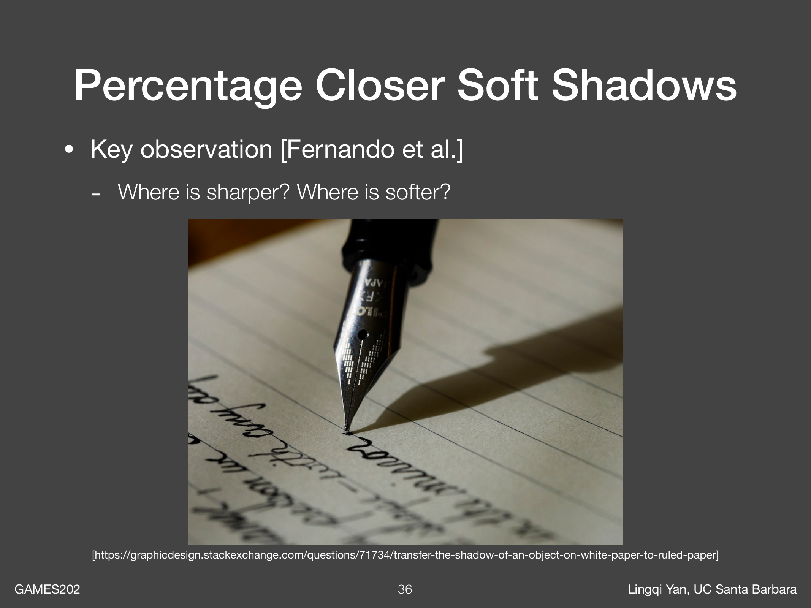

观察笔尖投在纸上的阴影：笔尖贴近纸的位置更清晰，笔杆离纸更远的位置更模糊。

从面光源上不同位置出发的光线会形成一束逐渐张开的范围：

- 遮挡物和接收面靠得很近时，这束范围还没来得及张开，半影很窄；
- 两者距离增大时，投影差异累积，半影变宽；
- 光源本身越大，不同光源位置形成的投影差异也越大。

PCSS，Percentage Closer Soft Shadows，就是用这个几何关系估计“当前位置应该使用多大的 PCF 核”。

## 16. 半影宽度公式

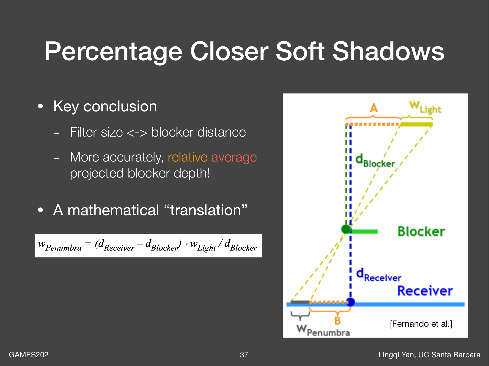

通过相似三角形，可以得到常用近似：

$$
w_{\text{penumbra}}
\approx
\frac{
\left(
d_{\text{receiver}}-d_{\text{blocker}}
\right)
w_{\text{light}}
}{
d_{\text{blocker}}
}
$$

各项含义：

| 变量 | 含义 |
| --- | --- |
| `w_penumbra` | 接收面上的半影宽度，之后要换算成 shadow map 中的过滤半径 |
| `d_receiver` | 光源到当前接收点的深度 |
| `d_blocker` | 光源到遮挡物的平均深度 |
| `w_light` | 面光源的宽度或在当前模型中的等效尺寸 |

从公式可以直接读出三个直觉：

1. `d_receiver ≈ d_blocker` 时，接收面贴近遮挡物，半影接近 0；
2. `d_receiver - d_blocker` 越大，遮挡物离接收面越远，阴影越软；
3. `w_light` 越大，半影越宽。

公式给出的宽度还不能直接当纹理 texel 数。实际实现要结合光源投影、shadow map 分辨率和深度空间，把它换算成 UV 半径。

## 17. PCSS 的完整三步

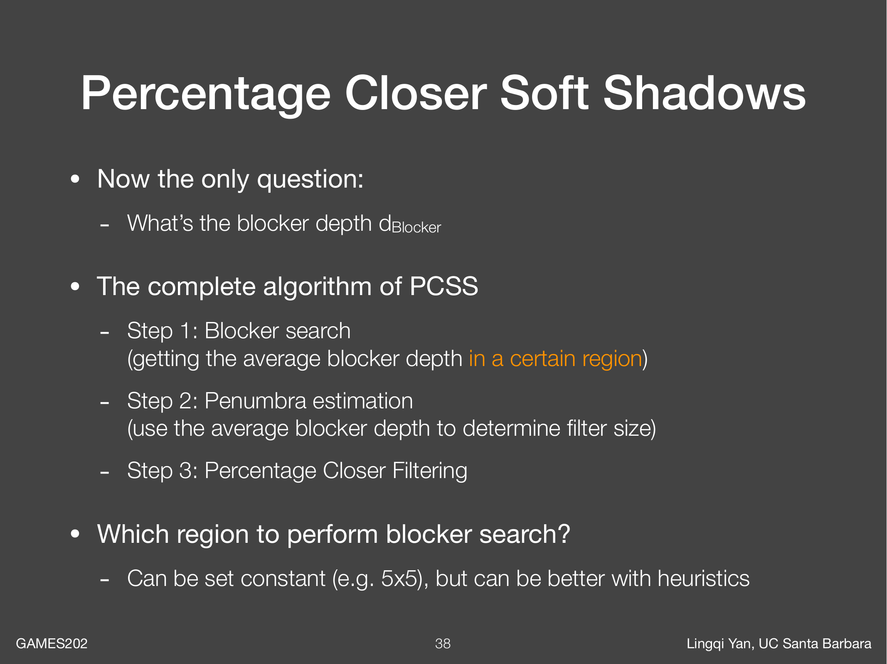

### 17.1 Step 1：Blocker Search

在当前接收点投影到 shadow map 的位置附近采样。只保留比接收点更靠近光源的样本：

$$
z_i^{\text{shadow}}
<
d_{\text{receiver}}-\operatorname{bias}
$$

这些样本代表可能挡住当前点的 blocker。把它们的线性深度求平均，得到 `d_blocker`。

如果一个 blocker 都没找到，说明这片区域没有遮挡，当前点可直接返回完全可见，不必继续做大范围 PCF。

### 17.2 Step 2：Penumbra Estimation

把 `d_receiver`、平均 `d_blocker` 和光源尺寸代入半影公式，估计当前位置的 `w_penumbra`，再把它换算为 shadow map UV 中的 PCF 半径。

### 17.3 Step 3：Variable-Radius PCF

使用刚刚算出的可变半径执行 PCF：

- blocker 靠近 receiver，核小，阴影清晰；
- blocker 远离 receiver，核大，阴影柔和。

这三步可以概括成：

1. **Blocker Search**：先找谁挡住了光；
2. **Penumbra Estimation**：再估计它应该产生多宽的半影；
3. **Variable-Radius PCF**：最后用对应大小的 PCF 核计算可见比例。

## 18. PCSS 伪代码

下面的伪代码只表达算法结构，坐标变换、线性深度和采样分布要根据具体渲染器调整：

```glsl
float pcss(vec2 uv, float receiverDepth)
{
    float receiverDepthLinear = linearizeDepth(receiverDepth);
    float blockerDepthSum = 0.0;
    int blockerCount = 0;

    float searchRadius =
        computeSearchRadius(lightSize, receiverDepthLinear);

    // Step 1: blocker search
    for (int i = 0; i < BLOCKER_SAMPLE_COUNT; ++i) {
        vec2 offset = blockerSamples[i];
        float depth = sampleShadowMap(uv + offset * searchRadius);

        if (depth < receiverDepth - bias) {
            blockerDepthSum += linearizeDepth(depth);
            blockerCount++;
        }
    }

    if (blockerCount == 0)
        return 1.0;

    float blockerDepth =
        blockerDepthSum / float(blockerCount);

    // Step 2: penumbra estimation
    float penumbra =
        (receiverDepthLinear - blockerDepth) * lightSize / blockerDepth;
    float filterRadius = penumbraToShadowUV(penumbra);

    // Step 3: variable-radius PCF
    float visibility = 0.0;
    for (int i = 0; i < PCF_SAMPLE_COUNT; ++i) {
        vec2 offset = pcfSamples[i];
        float depth = sampleShadowMap(uv + offset * filterRadius);
        visibility += receiverDepth <= depth + bias ? 1.0 : 0.0;
    }

    return visibility / float(PCF_SAMPLE_COUNT);
}
```

代码中最容易被忽略的一点是：参与距离公式的深度最好是线性深度。透视投影后的 depth buffer 往往是非线性的，直接拿它做距离比例会让半影估计失真。

## 19. Blocker Search 应该搜索多大范围

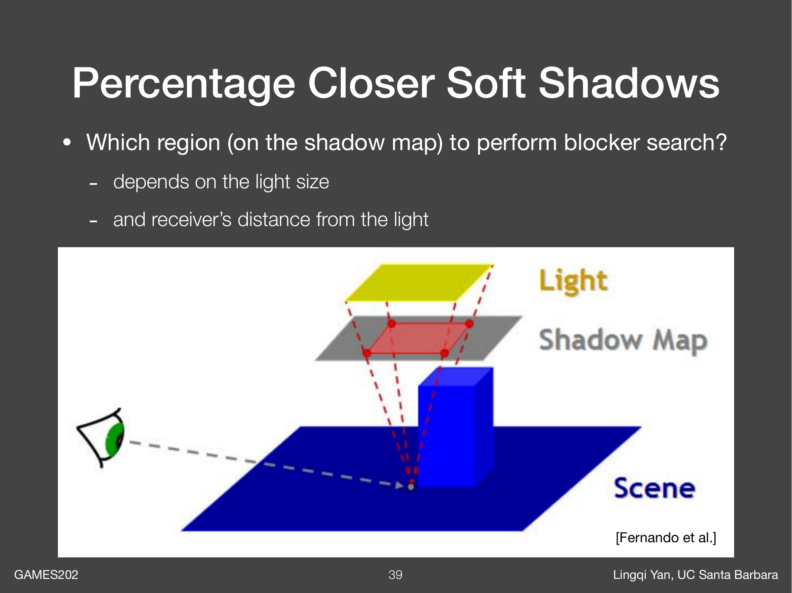

搜索区域可以简单固定为 `5 x 5`，但更合理的范围应与下面两个因素有关：

- 光源尺寸：光源越大，可能影响当前点的 blocker 范围越大；
- receiver 到光源的距离：接收点越远，光源投影在中间平面上的可能遮挡范围越大。

搜索范围太小，会漏掉真正贡献半影的 blocker，软阴影不稳定或过硬；搜索范围太大，会混入不相关遮挡物，同时增加采样成本。

实践中通常使用预先设计的 Poisson disk、旋转采样图案或低差异序列，而不是规则方格穷举所有 texel。这样能用较少样本减轻规则条纹，但样本过少仍可能产生噪声，需要结合时域稳定或降噪。

## 20. PCSS 的效果与局限

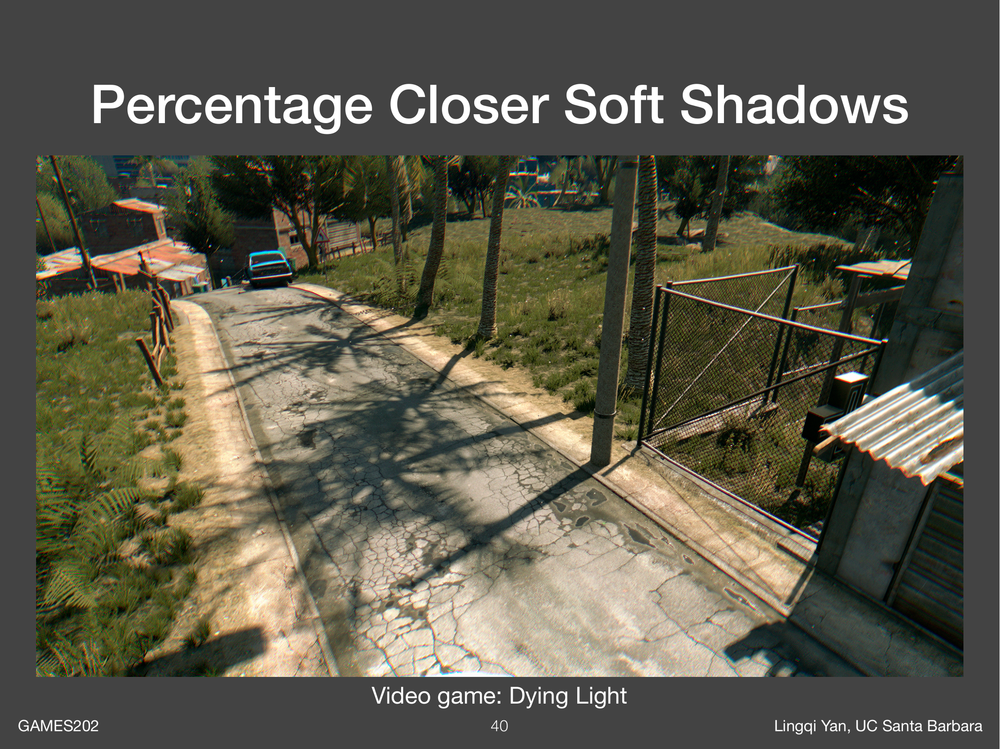

PCSS 能以纯 shadow map 查询实现有 contact hardening 的软阴影，视觉质量和实时成本之间的平衡很好，因此被许多游戏和实时引擎采用。

但它仍然是近似：

- blocker search 和 PCF 都需要多次纹理采样；
- 大半影需要大过滤核，成本随样本数上升；
- 少量样本可能带来噪声、条带或随镜头闪烁；
- 多层遮挡物被压成一个平均 blocker depth，结果不一定符合真实几何；
- 非线性深度、错误的 UV 半径换算会导致半影大小不对；
- shadow acne 与 detached shadow 仍需 bias 处理；
- shadow map 看不到或分辨不出的细节，PCSS 也无法恢复。

所以 PCSS 不是“免费把硬阴影变成正确软阴影”，而是用 blocker 深度估计为 PCF 选择一个更合理的局部核大小。

## 21. Shadow Mapping、PCF、PCSS 对比

| 方法 | 每个点查询什么 | 输出特点 | 主要解决的问题 | 主要代价或局限 |
| --- | --- | --- | --- | --- |
| Shadow Mapping | 单个或少量深度样本 | 0 或 1 的硬可见性 | 快速判断光源遮挡 | acne、aliasing、硬边缘 |
| PCF | 固定邻域内多次深度比较 | 0 到 1 的平均可见性 | 阴影边缘抗锯齿 | 固定模糊宽度，不表达 contact hardening |
| PCSS | 先找 blocker，再动态决定 PCF 邻域 | 距离相关的软阴影 | 近处硬、远处软的半影 | 两阶段多次采样，仍依赖近似和 bias |

可以记成一句话：

> Shadow Mapping 负责比较深度；PCF 负责平均比较结果；PCSS 负责为 PCF 决定“这里该平均多大范围”。

## 22. 实现和调试时的检查顺序

阴影出问题时，不要一开始就乱调 bias。按数据流逐层检查通常更快：

1. 把 shadow map 直接显示为灰度图，确认光源深度 pass 正常；
2. 可视化 `uv`，确认世界点投影到了正确的 shadow texel；
3. 输出 `z_receiver` 和 `sampledDepth`，确认二者使用相同深度空间；
4. 只输出单次比较结果，确认亮暗方向没有反；
5. 检查光源视锥外和纹理边界的处理；
6. 再加入最小 bias，观察 acne 与 detached shadow 的变化；
7. PCF 阶段先用固定小核，确认“先比较再平均”；
8. PCSS 单独可视化 blocker count、平均 blocker depth 和 filter radius；
9. 最后再优化采样分布、样本数和时间稳定性。

一个很实用的调试视图是把 `filterRadius` 映射成颜色。如果整幅图半影半径几乎相同，PCSS 的深度线性化或距离换算很可能有问题。

## 23. 常见误解

**误解 1：shadow map 是一张黑白阴影图。**  
不是。它首先是一张从光源视角得到的深度图。黑白阴影结果来自相机 pass 中的深度比较。

**误解 2：把 shadow map 做双线性模糊就是 PCF。**  
PCF 的关键是对每个样本先做深度比较，再平均比较结果。直接平均深度会改变遮挡判断的含义。

**误解 3：PCF 核越大，软阴影就越真实。**  
固定大核只是把所有边缘都模糊。真实半影宽度应随光源尺寸和 blocker-receiver 距离变化。

**误解 4：加大 bias 总能修好 shadow acne。**  
Bias 太大会让接触阴影与物体分离。还应检查 shadow map 分辨率、光源投影范围、表面斜率和深度精度。

**误解 5：PCSS 精确模拟了面光源。**  
PCSS 用平均 blocker depth 和可变 PCF 核近似面光源可见比例。它保留了 contact hardening 这一关键视觉规律，但不是完整面积光积分。

## 24. 学完本讲后应该能回答的问题

1. 为什么阴影可以理解为渲染方程中的可见性项？
2. Shadow Mapping 的两个 pass 分别输出和使用什么？
3. 为什么要把相机可见点重新投影到光源空间？
4. `z_receiver` 大于 shadow map 深度时，为什么说明当前点被遮挡？
5. shadow acne 为什么在倾斜表面上更严重？
6. bias 太小和太大分别会产生什么现象？
7. 为什么不能先过滤 shadow map 深度，再做一次比较？
8. PCF 为什么应被理解为对可见性结果做过滤？
9. 固定大小 PCF 与真实软阴影有什么差别？
10. contact hardening 是什么现象？
11. PCSS 的 blocker search、penumbra estimation、PCF 三步分别做什么？
12. 半影公式如何解释光源大小和 blocker-receiver 距离的影响？
13. 为什么 PCSS 计算距离时通常需要线性深度？

## 25. 下一讲预告

Lecture 4 会继续讨论实时阴影，重点从“逐样本做很多次比较”转向“能否对一片区域快速得到统计结果”：

- 基础过滤与概率不等式；
- Variance Soft Shadow Mapping；
- MIPMAP 和 Summed-Area Variance Shadow Maps；
- Moment Shadow Mapping；
- Signed Distance Field shadows。

本讲最值得带到下一讲的疑问是：PCF/PCSS 的大核需要很多次深度比较，能不能预先存储某些统计量，让大范围过滤更快？
