# GAMES202 Lecture 04：实时阴影 2

> 视频：<https://www.bilibili.com/video/BV1YK4y1T7yY?p=4>  
> 课程主页：<https://sites.cs.ucsb.edu/~lingqi/teaching/games202.html>  
> 本讲主题：Real-time Shadows 2。重点是重新理解 PCF，分析 PCSS 的性能瓶颈，并用 VSSM、MIPMAP、Summed Area Table 和 Moment Shadow Mapping 加速、改进软阴影。

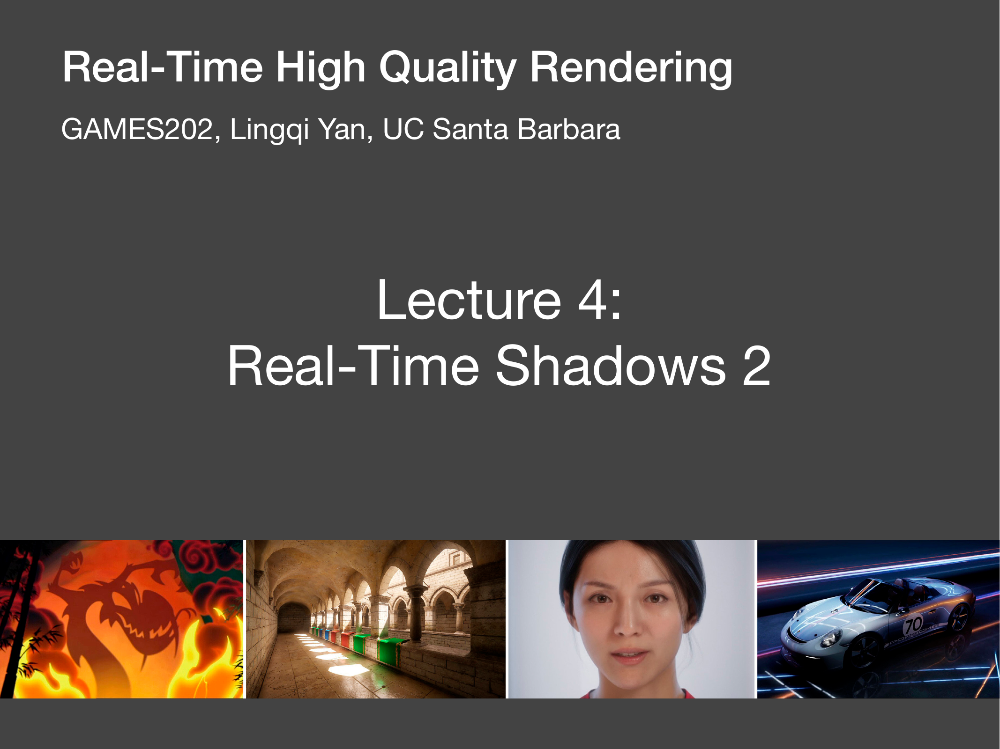

## 1. 从 Lecture 3 到 Lecture 4

Lecture 3 建立了下面这条路线：

1. Shadow Mapping 用一次深度比较得到硬阴影；
2. PCF 对一片区域内的深度比较结果求平均，得到平滑的可见比例；
3. PCSS 先寻找遮挡物，再根据遮挡物与接收面的距离决定 PCF 核大小，从而表现“近处阴影硬、远处阴影软”。

PCSS 的软阴影效果不错，但它有两个需要遍历样本的步骤：

- Blocker Search：在搜索区域中逐个检查深度，找出遮挡物并计算平均遮挡深度；
- PCF：在最终过滤区域中逐个比较深度，再把比较结果平均。

阴影越软，需要检查的区域通常越大，采样数也越多。本讲的问题因此变成：

> 能不能不逐个访问区域里的 texel，也能快速估计区域中的遮挡比例和平均遮挡深度？

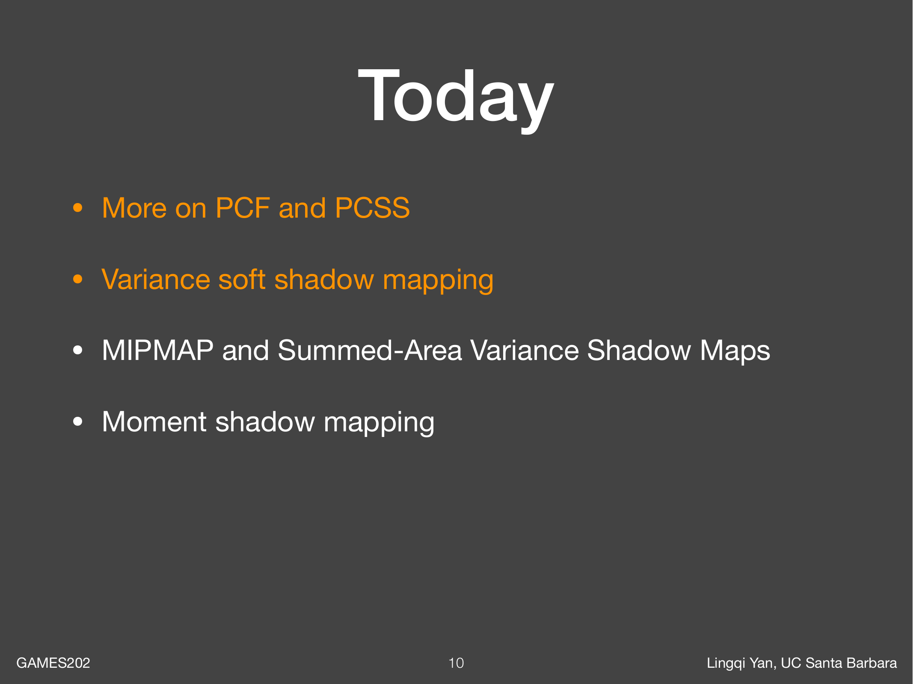

本讲的主线可以概括为：

1. 用概率语言重写 PCF；
2. 用均值和方差近似区域内的深度分布；
3. 用单边 Chebyshev 不等式估计可见比例；
4. 用 MIPMAP 或 Summed Area Table 快速取得区域统计量；
5. 用更多高阶矩改善只保存均值、方差时的分布误差。

## 2. PCF 的数学定义

设当前着色点为 `x`，它投影到 shadow map 上的位置为 `p`，接收点在光源空间中的深度为

$$
t=D_{\mathrm{scene}}(\mathbf{x}).
$$

在 `p` 附近选择过滤区域 `N(p)`。对区域中的每个采样点 `q`，先执行 shadow test：

$$
\chi^+(a)=
\begin{cases}
1,&a\ge 0,\\
0,&a<0.
\end{cases}
$$

因此，该样本对当前点可见，当且仅当 shadow map 深度不小于接收点深度：

$$
\chi^+\!\left[
D_{\mathrm{SM}}(\mathbf{q})-D_{\mathrm{scene}}(\mathbf{x})
\right]=1.
$$

PCF 把邻域内所有二值比较结果加权平均：

$$
V(\mathbf{x})
=
\sum_{\mathbf{q}\in N(\mathbf{p})}
w(\mathbf{p},\mathbf{q})\,
\chi^+\!\left[
D_{\mathrm{SM}}(\mathbf{q})-D_{\mathrm{scene}}(\mathbf{x})
\right],
$$

并满足

$$
\sum_{\mathbf{q}\in N(\mathbf{p})}
w(\mathbf{p},\mathbf{q})=1.
$$

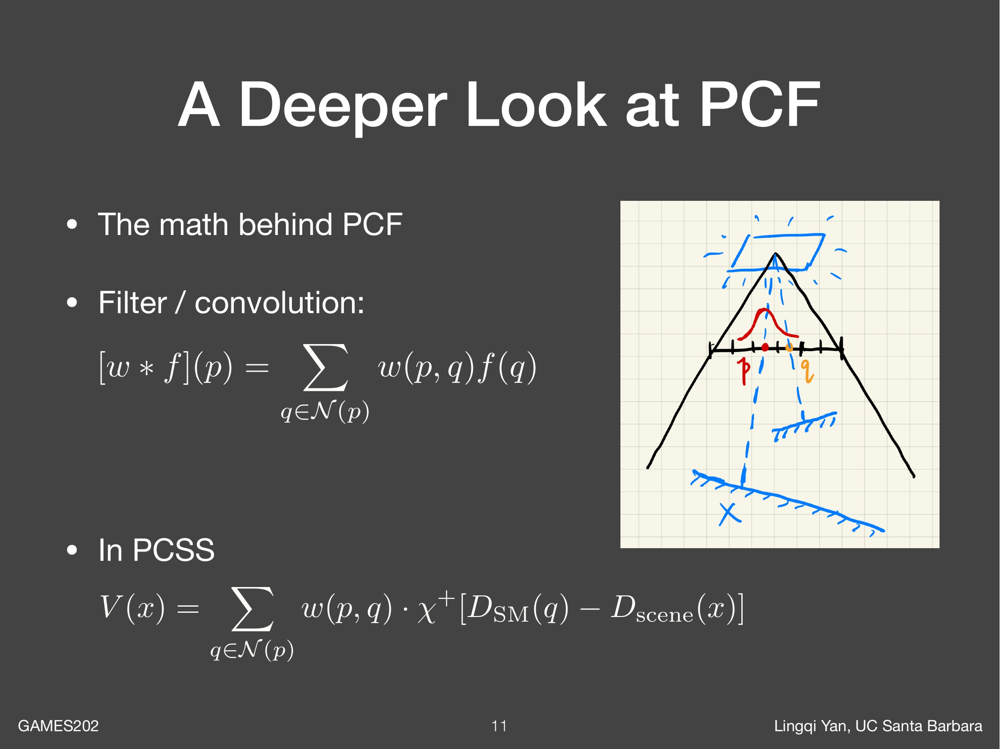

如果使用均匀权重，PCF 的结果就是：

$$
V(\mathbf{x})
=
\frac{
\text{通过深度比较的样本数量}
}{
\text{总样本数量}
}.
$$

所以 `V = 0` 表示区域内样本全部认为当前点被遮挡，`V = 1` 表示全部认为当前点可见，介于两者之间则表示只看到了光源的一部分。

## 3. PCF 的两个常见误解

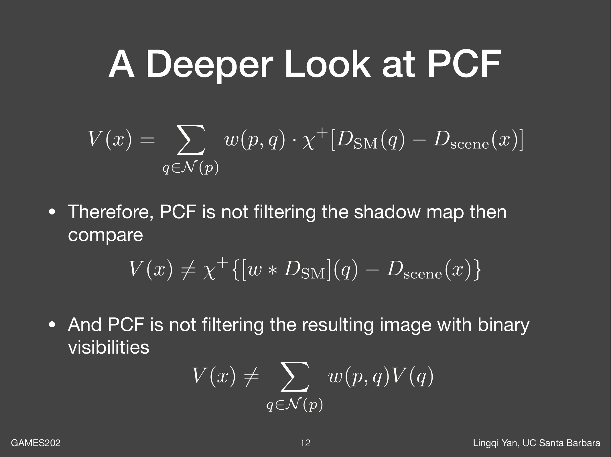

### 3.1 PCF 不是先过滤深度，再比较一次

正确顺序是：

$$
\boxed{
\text{逐样本比较}
\longrightarrow
\text{平均比较结果}
}
$$

错误顺序则是：

$$
\boxed{
\text{先平均深度}
\longrightarrow
\text{只比较一次}
}
$$

两者一般不相等：

$$
\sum_{\mathbf{q}}w_{\mathbf{q}}\,
\chi^+\!\left[D_{\mathrm{SM}}(\mathbf{q})-t\right]
\ne
\chi^+\!\left[
\sum_{\mathbf{q}}w_{\mathbf{q}}D_{\mathrm{SM}}(\mathbf{q})-t
\right].
$$

原因是深度比较是非线性操作。举一个只有两个样本的例子：

$$
D_1=4,\qquad D_2=10,\qquad t=6,
$$

两个样本权重都是 `1/2`。正确的 PCF 为

$$
V_{\mathrm{PCF}}
=
\frac{1}{2}
\left(
\chi^+(4-6)+\chi^+(10-6)
\right)
=\frac{1}{2}.
$$

如果先平均深度，则

$$
\bar D=\frac{4+10}{2}=7,
$$

再比较会得到

$$
\chi^+(7-6)=1.
$$

一个结果是“看到一半光源”，另一个结果是“完全可见”，物理含义显然不同。

### 3.2 PCF 也不是最后模糊一张二值阴影图

下面两个式子同样不等价：

$$
V(\mathbf{x})
\ne
\sum_{\mathbf{q}\in N(\mathbf{p})}
w(\mathbf{p},\mathbf{q})V(\mathbf{q}).
$$

直接模糊屏幕空间阴影图会混合不同物体、不同深度甚至不相邻表面的结果，还会依赖相机分辨率和视角。PCF 则是在 shadow-map 空间中，为当前接收点使用同一个接收深度 `t`，对周围多个 shadow-map 深度进行比较。

一句话记忆：

> PCF 过滤的是一组深度比较产生的可见性样本，而不是原始深度，也不是渲染完成后的阴影颜色。

## 4. PCSS 为什么慢

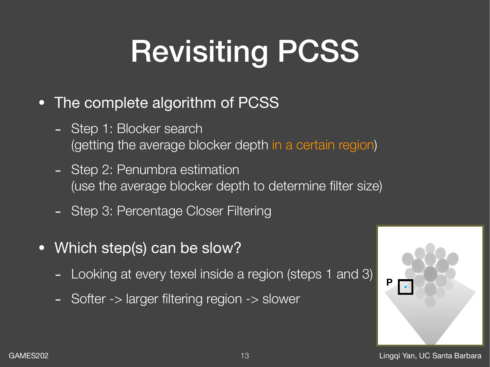

PCSS 有三个步骤：

1. 在接收点周围搜索 blocker；
2. 用平均 blocker 深度估计半影宽度；
3. 使用与半影宽度对应的过滤半径执行 PCF。

设 Blocker Search 使用 `N_b` 个样本，PCF 使用 `N_f` 个样本，则每个着色点大致需要

$$
O(N_b+N_f)
$$

次 shadow-map 访问和比较。

对面光源，常用的相似三角形近似为

$$
w_{\mathrm{penumbra}}
\approx
w_{\mathrm{light}}
\frac{z_r-z_b}{z_b},
$$

其中：

- `w_light` 是光源尺寸；
- `z_b` 是平均遮挡物深度；
- `z_r` 是接收点深度。

接收点离 blocker 越远，半影越宽，最终 PCF 核也越大。如果为了保持采样密度而增加样本数，成本会随软阴影宽度继续上升。

VSSM 要解决的正是 PCSS 中第 1 步和第 3 步的区域查询问题。

## 5. VSSM 的核心目标

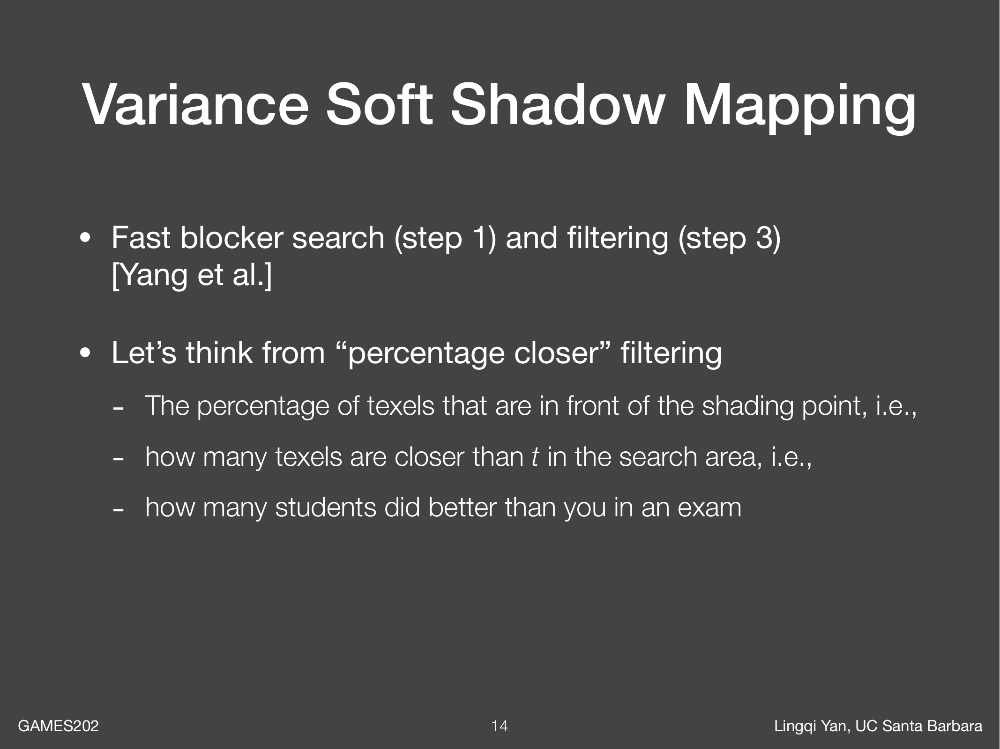

VSSM 是 Variance Soft Shadow Mapping。它延续 PCSS 的整体结构，但希望做到：

> 用少量预先保存的统计量，近似回答“区域内有多少 texel 的深度大于接收点深度”。

这和考试成绩问题很相似：

- 全班每个人的成绩相当于区域中的深度样本；
- 你的成绩相当于接收点深度 `t`；
- “多少人比你分数高”相当于“多少 shadow-map 深度大于 `t`”。

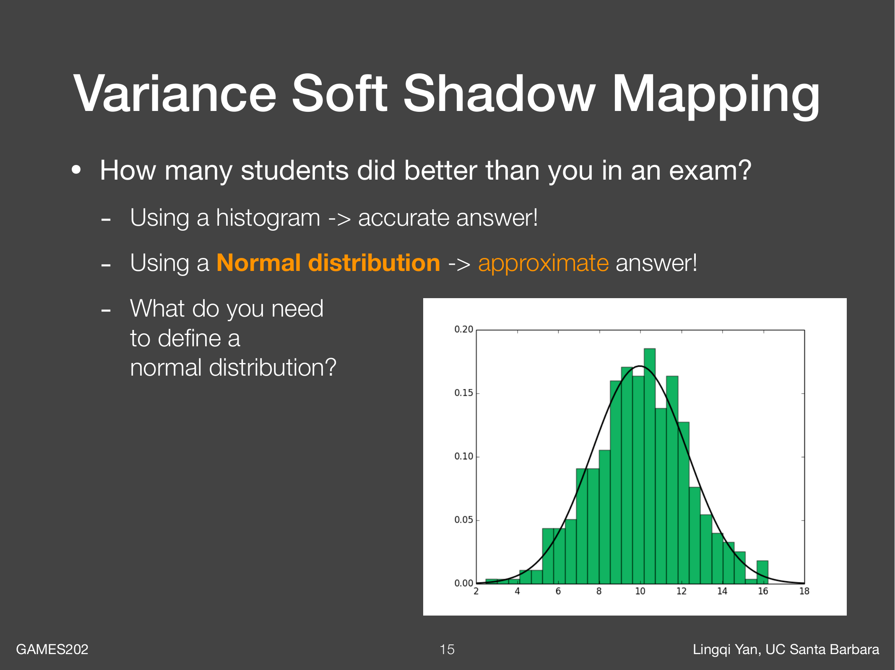

如果逐个读取所有人成绩，答案当然精确，但查询很慢。如果只知道全班成绩的均值和方差，也可以对“高于某个阈值的人数比例”作快速估计。

这里的关键不是假设深度一定服从正态分布。VSSM 实际使用的是只依赖均值、方差的单边 Chebyshev 不等式。

## 6. 把区域中的深度看成随机变量

在 shadow map 的一个过滤区域中随机选择一个 texel，并读取其深度。把这个深度记为随机变量 `X`。

假设区域共有 `N` 个样本，深度分别为

$$
z_1,z_2,\ldots,z_N.
$$

那么均值为

$$
\mu=E[X]=\frac{1}{N}\sum_{i=1}^{N}z_i,
$$

二阶矩为

$$
E[X^2]=\frac{1}{N}\sum_{i=1}^{N}z_i^2,
$$

方差为

$$
\sigma^2
=
E\!\left[(X-\mu)^2\right]
=
E[X^2]-E[X]^2.
$$

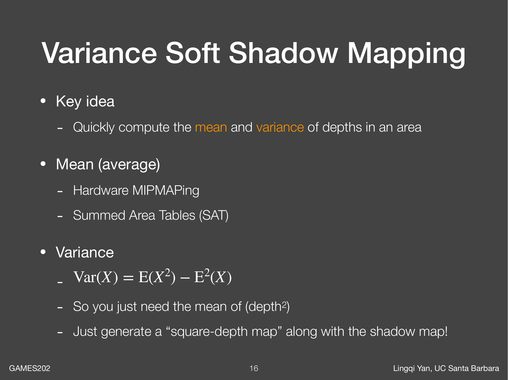

因此生成 shadow map 时，不仅保存深度 `z`，还同时保存平方深度 `z^2`：

$$
M_1=z,\qquad M_2=z^2.
$$

之后对两个通道使用相同的线性过滤或范围查询，就能获得

$$
\mu=\operatorname{Filter}(M_1),
$$

以及

$$
E[X^2]=\operatorname{Filter}(M_2).
$$

最后计算

$$
\sigma^2
=
\max\!\left(
E[X^2]-\mu^2,\,
\varepsilon
\right).
$$

这里取 `max` 是为了防止浮点舍入导致一个很小的负方差，也防止后续公式出现数值不稳定。

## 7. CDF 与阴影可见比例

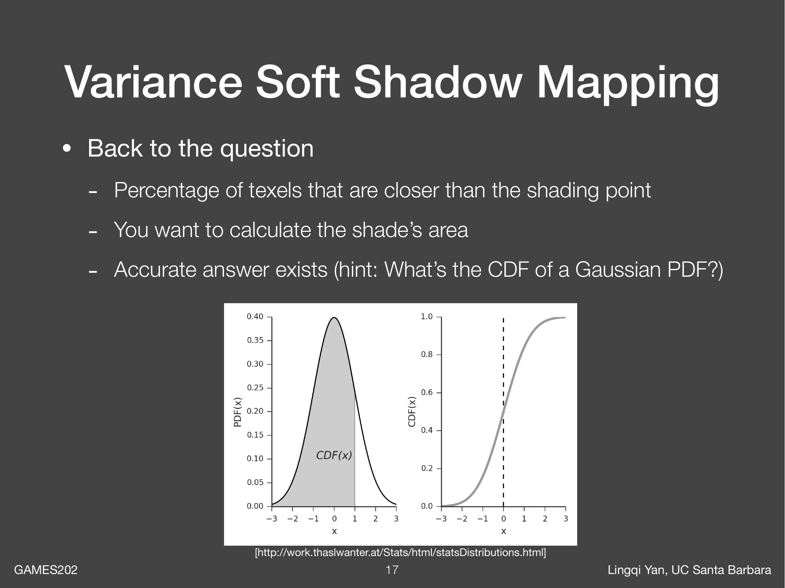

随机变量 `X` 的累积分布函数 CDF 定义为

$$
F_X(t)=P(X\le t).
$$

它表示随机取得的深度不超过阈值 `t` 的概率。

在阴影查询中：

- `X < t`：shadow map 中有一个表面比接收点更靠近光源，该样本认为接收点被遮挡；
- `X >= t`：该方向上没有更近的遮挡物，该样本认为接收点可见。

因此 PCF 想求的可见比例可以写成

$$
V(t)=P(X\ge t).
$$

在连续分布的近似下，可以写为

$$
V(t)\approx P(X>t)=1-F_X(t).
$$

于是 PCF 的大量逐样本比较，被改写成了一个概率查询：

> 已知区域深度分布，求它落在阈值 `t` 右侧的概率。

如果我们知道完整 CDF，这个查询很容易；但完整保存每个区域的 CDF 太昂贵。VSSM 只保存前两个矩，用不等式估计这个概率。

## 8. 单边 Chebyshev 不等式

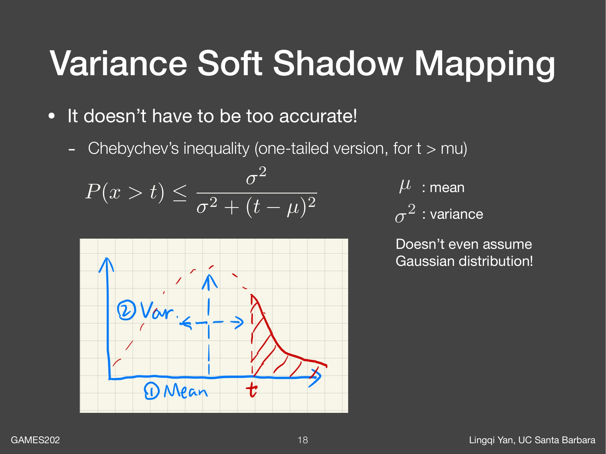

当

$$
t>\mu
$$

时，单边 Chebyshev 不等式，也称 Cantelli 不等式，给出：

$$
P(X>t)
\le
\frac{\sigma^2}
{\sigma^2+(t-\mu)^2}.
$$

记

$$
p_{\max}(t)
=
\frac{\sigma^2}
{\sigma^2+(t-\mu)^2},
$$

那么 `p_max` 是真实尾部概率 `P(X > t)` 的一个上界。VSSM 用这个上界近似可见比例：

$$
V(t)\approx p_{\max}(t).
$$

### 8.1 直觉解释

若 `t` 只比均值大一点，`t - mu` 很小，公式结果接近 1。这表示仅凭均值和方差，我们不能排除大量样本位于 `t` 右侧。

若 `t` 比均值大很多，分母中的 `(t - mu)^2` 快速变大，上界下降。例如：

$$
t=\mu+\sigma
\quad\Longrightarrow\quad
p_{\max}=\frac{1}{2},
$$

$$
t=\mu+2\sigma
\quad\Longrightarrow\quad
p_{\max}=\frac{1}{5},
$$

$$
t=\mu+3\sigma
\quad\Longrightarrow\quad
p_{\max}=\frac{1}{10}.
$$

也就是说，阈值离均值越远，仍有大量样本超过阈值的可能性越低。

### 8.2 为什么不需要高斯分布

公式中没有高斯分布的概率密度函数，也没有正态分布参数拟合。它只使用

$$
\mu,\qquad \sigma^2.
$$

因此它能用于任意具有有限均值和方差的分布。代价是：它只给出上界，不会精确恢复真实 CDF。

### 8.3 当 `t <= mu` 时怎么办

上面的单边形式针对 `t > mu`。常见实现会在

$$
t\le\mu
$$

时直接返回可见：

$$
V(t)=1.
$$

直觉上，接收点深度不大于区域平均深度时，没有足够证据判断它位于遮挡物之后。这个分支很便宜，但也正是近似误差可能出现的地方之一。

## 9. VSSM 如何把 PCF 查询变成近似 O(1)

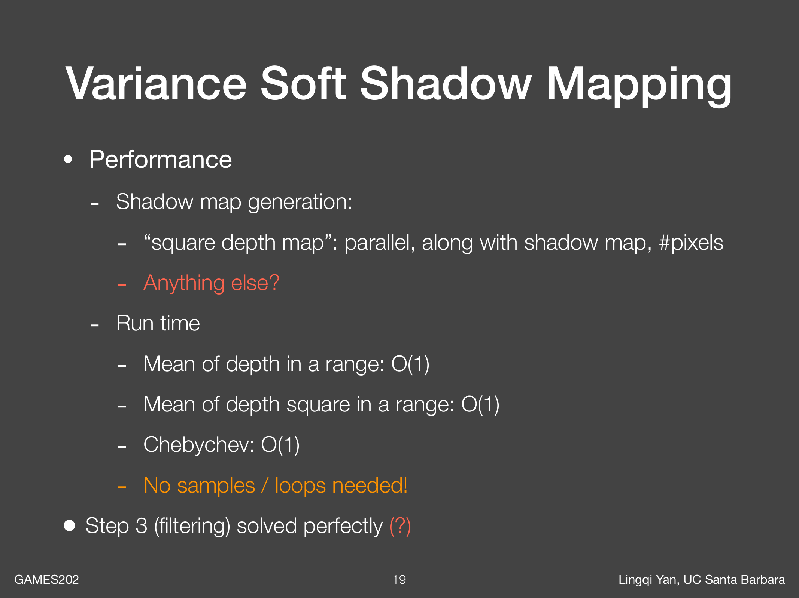

假设已经有一种数据结构，可以在常数次纹理查询中返回任意过滤区域内的

$$
E[X]
\quad\text{和}\quad
E[X^2].
$$

那么对任何过滤半径，VSSM 都只需：

1. 查询一阶矩 `mu`；
2. 查询二阶矩 `E[X^2]`；
3. 计算方差；
4. 代入单边 Chebyshev 公式。

运行时不再显式遍历区域内所有 texel，所以过滤阶段从

$$
O(N_f)
$$

变为近似

$$
O(1).
$$

这里的 `O(1)` 指每次着色查询所需的纹理访问次数不随过滤区域面积增长。预处理 shadow map、构建 MIPMAP 或 SAT 仍然有成本。

## 10. Blocker Search 也能用统计量近似

PCSS 的 Blocker Search 不只需要遮挡比例，还需要所有 blocker 的平均深度。

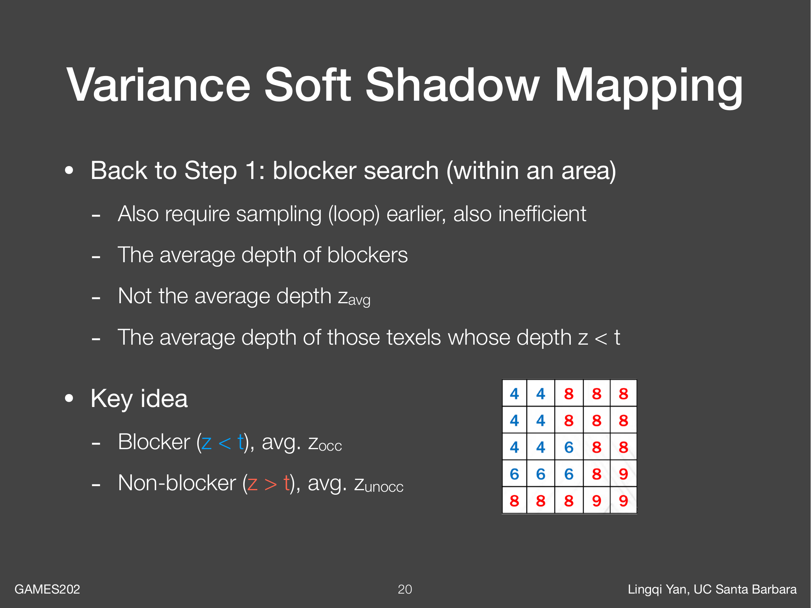

把区域中的样本分成两组：

- blocker：`X < t`，平均深度为 `z_occ`；
- non-blocker：`X >= t`，平均深度为 `z_unocc`。

令 blocker 比例为

$$
p_{\mathrm{occ}}=P(X<t),
$$

non-blocker 比例为

$$
p_{\mathrm{unocc}}=P(X\ge t)=1-p_{\mathrm{occ}}.
$$

整个区域的平均深度是两组平均深度的加权和：

$$
\mu
=
p_{\mathrm{occ}}z_{\mathrm{occ}}
+
p_{\mathrm{unocc}}z_{\mathrm{unocc}}.
$$

VSSM 已经能用 Chebyshev 上界估计 non-blocker 比例：

$$
p_{\mathrm{unocc}}
\approx
P(X>t)
\approx
p_{\max}(t).
$$

于是

$$
p_{\mathrm{occ}}
\approx
1-p_{\max}(t).
$$

但方程中仍有两个未知平均深度。为了继续求解，VSSM 做了一个关键近似：

$$
z_{\mathrm{unocc}}\approx t.
$$

也就是把所有未遮挡样本的平均深度近似为接收面的深度。代入后得到

$$
\mu
\approx
p_{\mathrm{occ}}z_{\mathrm{occ}}
+
(1-p_{\mathrm{occ}})t,
$$

从而

$$
\boxed{
z_{\mathrm{occ}}
\approx
\frac{
\mu-(1-p_{\mathrm{occ}})t
}{
p_{\mathrm{occ}}
}
}.
$$

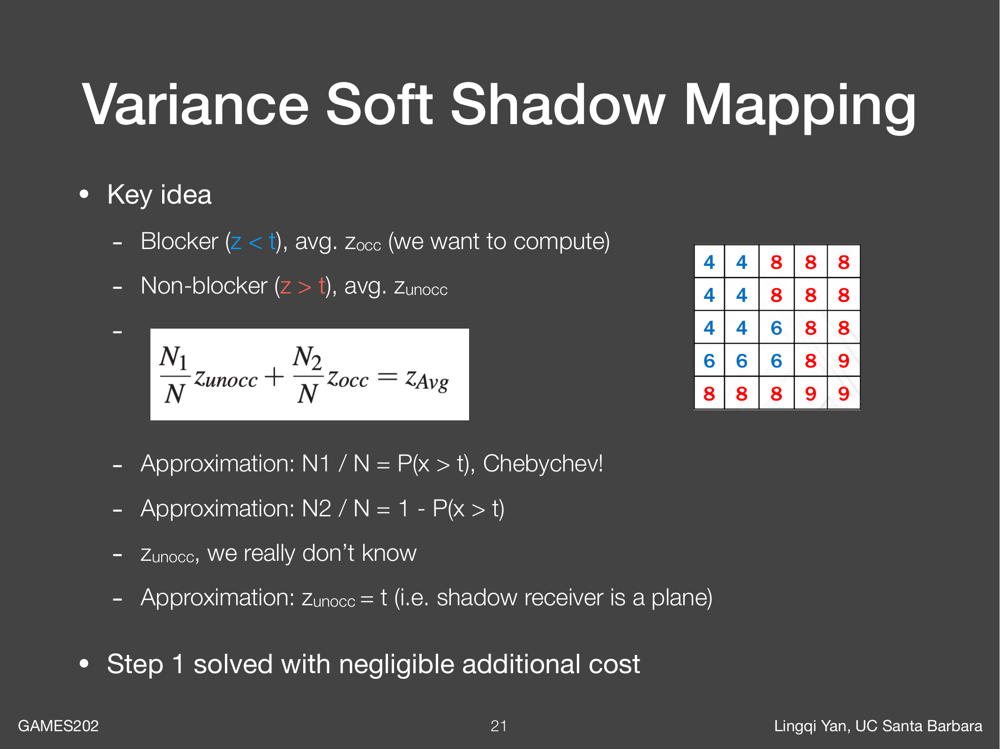

这就是 VSSM 加速 Blocker Search 的核心：不再枚举并平均所有 blocker，而是由区域均值、估计出的遮挡比例和接收点深度反推出平均 blocker 深度。

### 10.1 需要处理的边界情况

如果

$$
p_{\mathrm{occ}}\approx 0,
$$

分母会接近 0。此时应该直接认为没有找到 blocker，返回完全可见，而不能继续做除法。

此外，推导依赖

$$
z_{\mathrm{unocc}}\approx t.
$$

这相当于假设接收面在搜索区域内近似为平面，并且未遮挡样本的深度集中在接收面附近。复杂几何、多个接收面或深度跨度很大时，这个近似会失效。

## 11. VSSM 的完整流程

VSSM 可以理解为“保留 PCSS 的三步结构，用统计查询替代两次采样循环”。

### 11.1 生成阶段

生成包含两个通道的 shadow map：

$$
\left(z,z^2\right).
$$

然后为两个通道同时构建可快速进行范围查询的数据结构。

### 11.2 Step 1：近似 Blocker Search

在 blocker 搜索区域查询

$$
\mu_s,\qquad E_s[X^2],
$$

得到

$$
\sigma_s^2=E_s[X^2]-\mu_s^2.
$$

使用 Chebyshev 估计可见比例，再反推出

$$
z_{\mathrm{occ}}.
$$

### 11.3 Step 2：估计半影

把 `z_occ` 代入 PCSS 的相似三角形公式：

$$
w_{\mathrm{penumbra}}
\approx
w_{\mathrm{light}}
\frac{t-z_{\mathrm{occ}}}
{z_{\mathrm{occ}}}.
$$

再把世界空间或光源空间的半影宽度换算为 shadow-map 纹理空间的过滤半径。

### 11.4 Step 3：近似 PCF

在最终过滤区域再次查询

$$
\mu_f,\qquad E_f[X^2],
$$

并用 Chebyshev 公式估计可见比例。

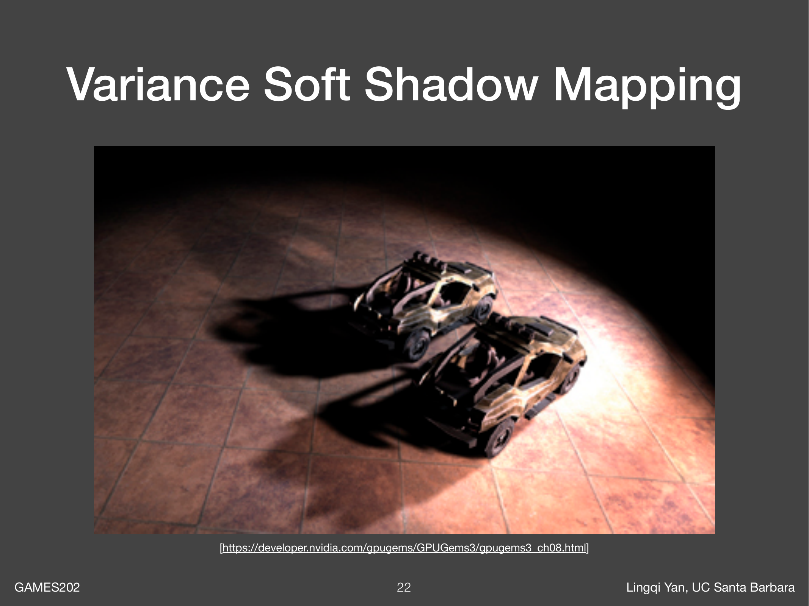

于是两个随核面积增长的循环都变成了固定数量的统计查询。图中可以看到 VSSM 能以较低查询成本得到接触处较硬、远处逐渐变软的阴影。

## 12. 真正的问题变成“快速范围查询”

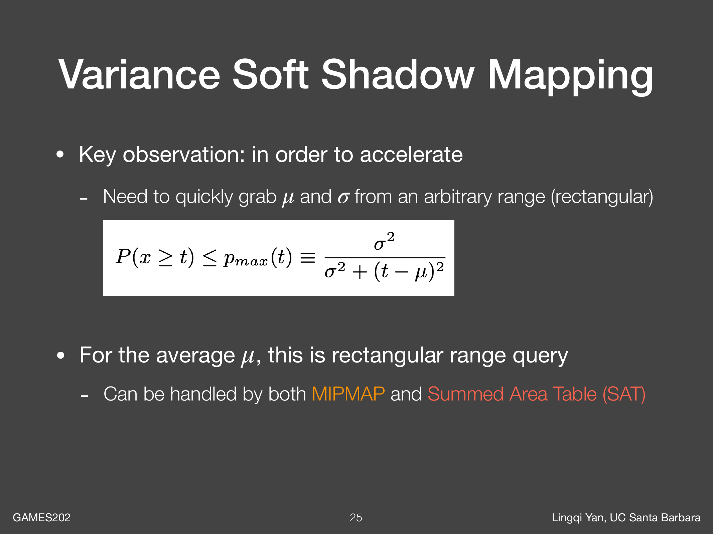

到这里，概率部分只需要均值和方差，但仍有一个工程问题：

> 如何快速得到任意矩形区域中的 `E[X]` 和 `E[X^2]`？

如果每次仍然遍历区域内所有 texel，那么只是把比较操作换成了求和，并没有消除复杂度。

因为

$$
E[X]=\frac{\sum z_i}{N},
$$

$$
E[X^2]=\frac{\sum z_i^2}{N},
$$

所以问题等价于：快速求一个矩形区域内的 `z` 通道之和与 `z^2` 通道之和。

课上介绍了两种选择：

- MIPMAP：快、硬件支持好，但范围结果是近似的；
- Summed Area Table：矩形查询精确，但构建和数值范围更需要小心。

## 13. MIPMAP 范围查询

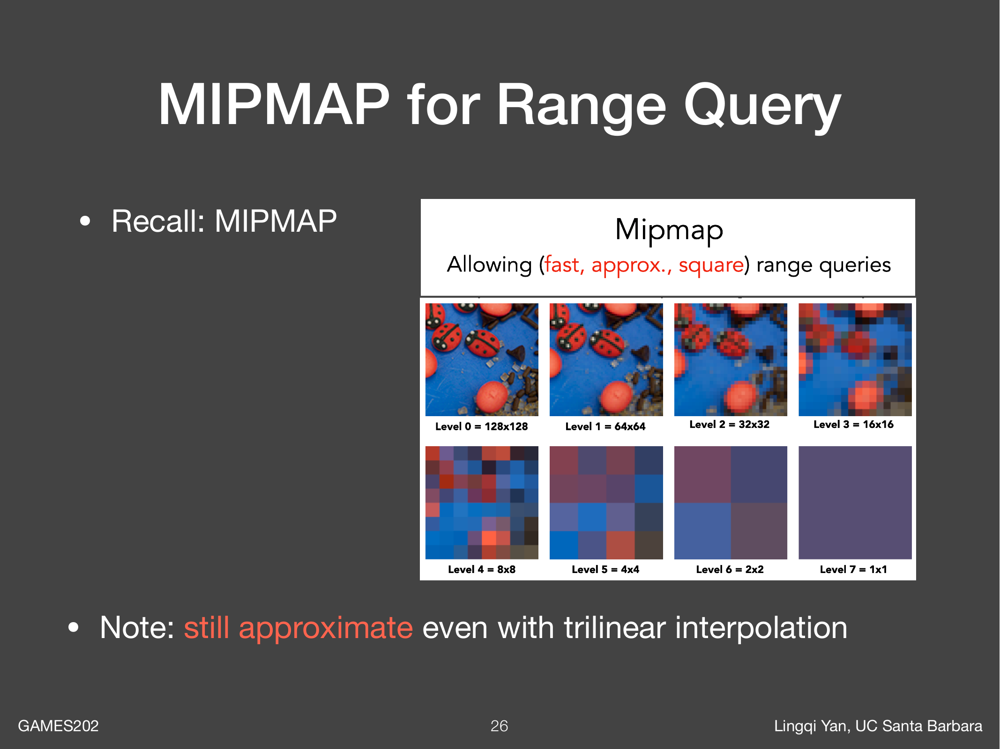

MIPMAP 的每一级都把上一层的一小片 texel 平均成一个 texel。若第 0 级尺寸为

$$
W\times H,
$$

第 `k` 级大约为

$$
\frac{W}{2^k}\times\frac{H}{2^k}.
$$

当希望查询边长约为 `r` 的正方形区域时，可以选择

$$
\operatorname{lod}\approx\log_2 r.
$$

这样高层 MIPMAP 中一次纹理采样，就近似代表原图中的一大片区域。配合双线性和三线性过滤，可以减少层级切换时的突变。

### 13.1 优点

- GPU 原生支持，生成与采样方便；
- 每次查询只需固定数量的纹理访问；
- 很适合正方形、近似方形的过滤核；
- 查询成本基本不随核面积增长。

### 13.2 局限

MIPMAP texel 对应的是预先固定、对齐的区域。任意位置、任意尺寸的查询区域通常不会与某个 texel 完全重合，所以结果只是近似。

即使使用三线性插值，仍是在几个相邻、不同层级的预过滤值之间插值，并不等于精确求目标矩形的平均值。

此外，普通 MIPMAP 更自然地表示各向同性正方形范围。如果过滤区域是狭长矩形，普通 MIPMAP 不能独立选择两个方向的尺度。

## 14. Summed Area Table：二维前缀和

SAT 是 Summed Area Table，也称积分图。它把“一片区域的和”转化为“四个角的加减”。

### 14.1 一维前缀和

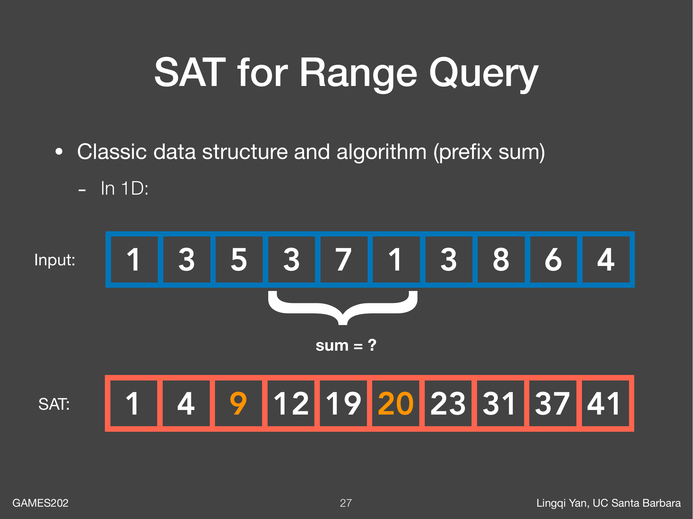

对一维数组 `f(i)`，定义前缀和

$$
S(x)=\sum_{i=0}^{x}f(i).
$$

区间 `[a, b]` 的和为

$$
\sum_{i=a}^{b}f(i)
=
S(b)-S(a-1).
$$

无论区间包含 2 个元素还是 2000 个元素，都只需要两次查询和一次减法。

### 14.2 二维前缀和

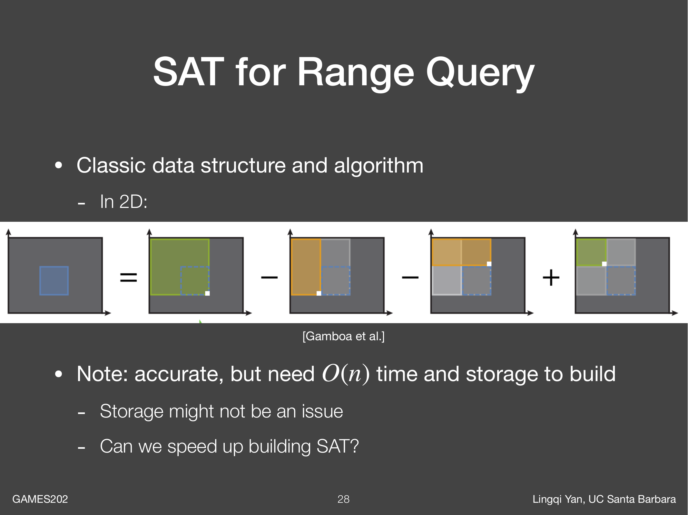

二维 SAT 定义为

$$
S(x,y)
=
\sum_{i=0}^{x}
\sum_{j=0}^{y}
f(i,j).
$$

对目标矩形

$$
[x_0,x_1]\times[y_0,y_1],
$$

矩形和为

$$
\begin{aligned}
\operatorname{Sum}
={}&S(x_1,y_1)
-S(x_0-1,y_1)\\
&-S(x_1,y_0-1)
+S(x_0-1,y_0-1).
\end{aligned}
$$

可以把符号记成：

$$
\boxed{\text{右下}-\text{左下}-\text{右上}+\text{左上}}.
$$

减去左边和上边后，左上重叠区域被减了两次，所以必须再加回来一次。

矩形平均值为

$$
\operatorname{Mean}
=
\frac{\operatorname{Sum}}
{(x_1-x_0+1)(y_1-y_0+1)}.
$$

分别为 `z` 与 `z^2` 构建 SAT，就可以常数时间得到 `mu` 和 `E[X^2]`。

### 14.3 SAT 的代价

查询只需要四个角，但 SAT 的生成不是免费的：

- 对一张含 `N` 个 texel 的图，构建至少需要 `O(N)` 工作；
- 并行前缀和比生成普通 MIPMAP 更复杂；
- 前缀和的数值范围会随图像面积增大，精度与数据格式要谨慎选择；
- 动态光源或动态场景每帧更新 shadow map 时，SAT 也需要重新构建。

## 15. MIPMAP 与 SAT 对比

| 特性 | MIPMAP | Summed Area Table |
| --- | --- | --- |
| 单次查询成本 | 近似 `O(1)` | `O(1)` |
| 任意轴对齐矩形 | 近似 | 精确 |
| 硬件支持 | 非常成熟 | 通常需要自行实现 |
| 构建 | 简单、常有自动生成支持 | 需要二维前缀和 |
| 形状 | 更适合方形或近似方形核 | 任意轴对齐矩形 |
| 插值连续性 | 双线性、三线性方便 | 需自行处理连续坐标 |
| 数值范围 | 保存局部平均，较稳定 | 保存大范围累加和，要注意精度 |

“SAT 精确”指的是：对离散 texel 的轴对齐矩形求和是精确的。整个 VSSM 仍包含 Chebyshev、平面接收面等近似，所以使用 SAT 不会让最终阴影变成完全准确的物理软阴影。

## 16. VSSM 为什么会 Light Leaking

VSSM 的速度来自“只用前两个矩描述深度分布”。问题也来自这里：均值和方差无法唯一确定真实分布。

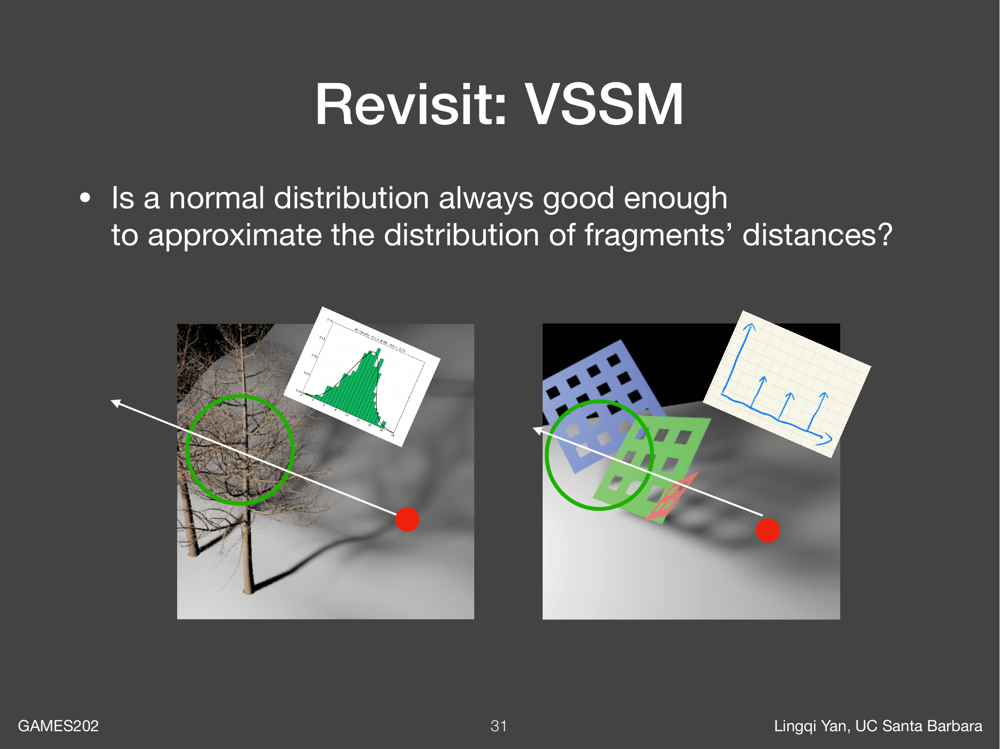

例如一个过滤区域同时覆盖：

- 一层很近的遮挡物；
- 一层很远的背景或接收面；
- 两者之间几乎没有任何深度。

真实深度分布可能是明显的双峰分布。仅有 `mu` 和 `sigma^2` 时，算法无法知道中间其实没有样本，只能给出一个较宽松的尾部概率上界。

### 16.1 上界偏大会漏光

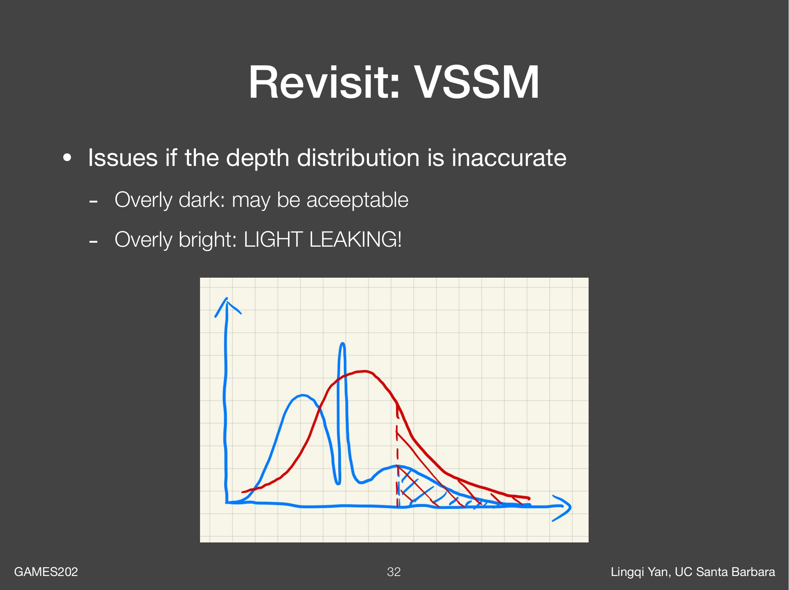

Chebyshev 给出的是

$$
P(X>t)\le p_{\max}(t).
$$

若真实可见比例很小，但上界较大，VSSM 把 `p_max` 直接当作可见度后，就会让本应很暗的区域获得过多光照。这就是 light leaking。

“估计过暗”通常只是阴影稍重；“估计过亮”却会在遮挡关系明确的地方出现明显漏光，所以更容易被观察到。

工程中常使用一个经验映射压低较小的可见概率：

$$
V'
=
\operatorname{clamp}
\left(
\frac{V-p_{\min}}
{1-p_{\min}},
0,1
\right).
$$

这常被称为 light-bleeding reduction。它能缓解视觉问题，但会让阴影更硬或更暗，并没有恢复真实深度分布。

### 16.2 非平面接收面的误差

Blocker Search 中使用了

$$
z_{\mathrm{unocc}}\approx t.
$$

当搜索区域横跨倾斜表面、台阶、多个物体或深度不连续边界时，non-blocker 深度不再集中于 `t`，反推出的平均 blocker 深度就会偏离真实值。

### 16.3 Chebyshev 分支的适用条件

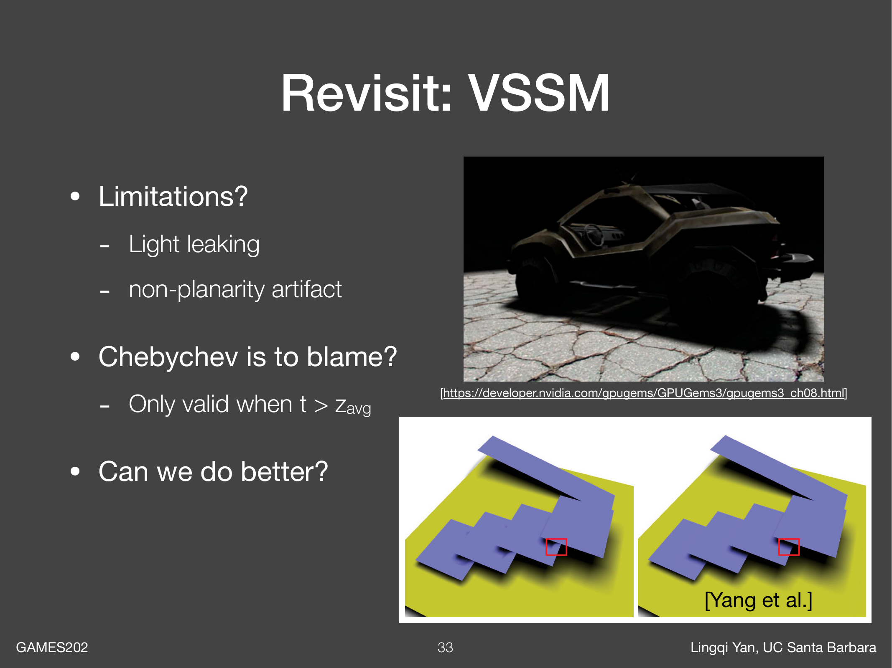

课件特别强调，所使用的单边公式针对

$$
t>\mu.
$$

如果忽略这个条件，在整个深度范围无条件代入公式，概率意义和实现结果都会出错。

VSSM 的限制可以总结为：

- 前两个矩不足以准确表达多峰分布；
- 概率上界可能明显大于真实可见比例，引起漏光；
- Blocker Search 假设接收面局部近似平面；
- 深度偏差、分辨率、投影和坐标范围问题仍然存在；
- 它加速的是区域过滤，不会自动修复 Shadow Mapping 的所有伪影。

## 17. Moment Shadow Mapping 的动机

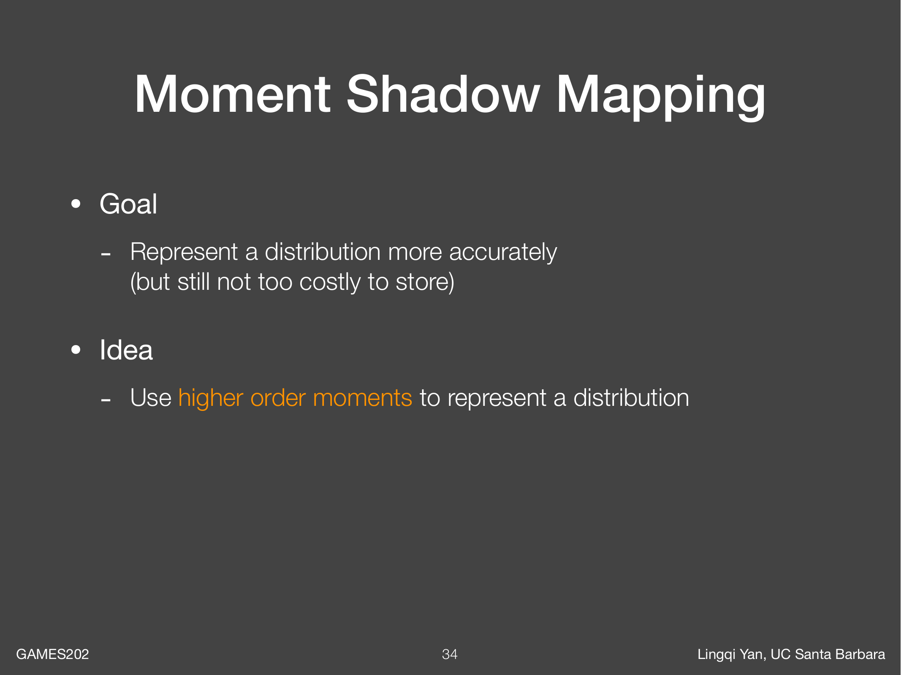

既然 VSSM 的问题是两个统计量无法描述复杂分布，一个自然想法是：

> 保存更多关于深度分布的信息，但仍保持它们可以被线性过滤。

Moment Shadow Mapping，简称 MSM，使用更高阶的矩描述深度分布。

随机变量 `X` 的第 `k` 阶原点矩为

$$
m_k=E[X^k].
$$

VSSM 实际保存了前两阶矩：

$$
m_1=E[X],
\qquad
m_2=E[X^2].
$$

MSM 常保存前四阶矩：

$$
m_1=E[X],
\qquad
m_2=E[X^2],
\qquad
m_3=E[X^3],
\qquad
m_4=E[X^4].
$$

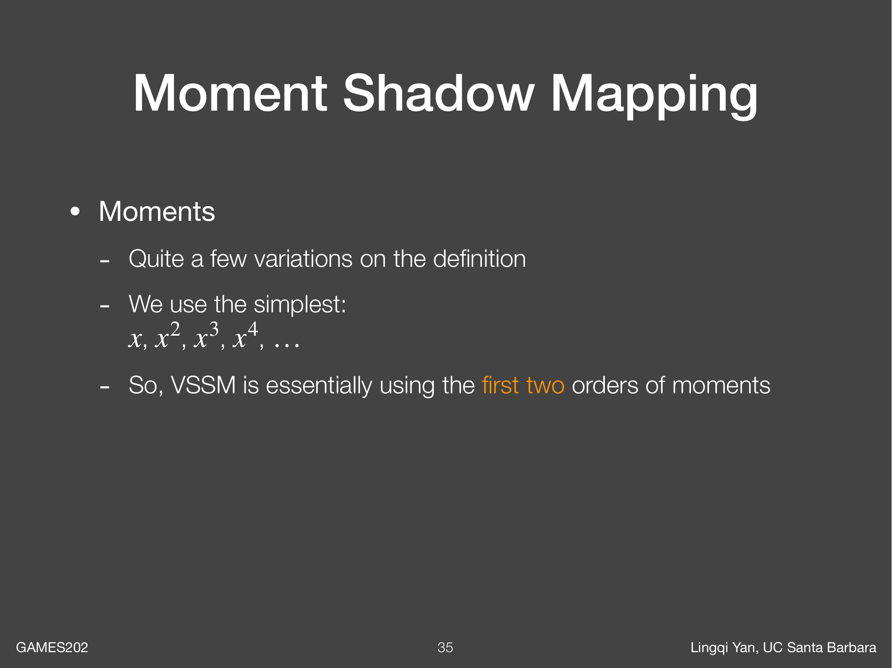

生成 shadow map 时，每个 texel 写入

$$
\left(z,z^2,z^3,z^4\right).
$$

因为期望和过滤都是线性的，所以过滤四个通道后，可以得到过滤区域内的四阶矩。

## 18. 高阶矩如何改善 CDF

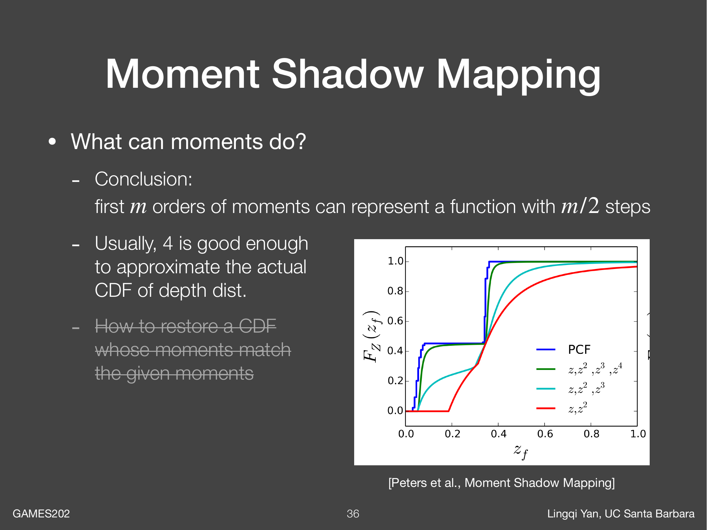

矩本身不是 CDF，但它们给真实分布施加了更多约束。

只知道 `m_1` 和 `m_2` 时，许多差异很大的分布都可能具有相同均值和方差。因此 Chebyshev 只能给出比较松的上界。

加入 `m_3` 和 `m_4` 后：

- 三阶信息能够描述分布的不对称程度；
- 四阶信息能够进一步约束尾部与集中程度；
- 与这些矩一致的候选分布更少；
- 由矩问题求出的 CDF 界通常更接近真实 CDF。

课件给出的结论是：前 `m` 阶矩可以用来表示具有大约 `m/2` 个台阶的函数。使用四阶矩时，已经能够更好地逼近具有两个主要深度层次的分布，这正是许多遮挡物与接收面组合的典型情况。

需要注意，MSM 不是简单地把四个矩代入 Chebyshev 公式。它需要在着色阶段求解一个小型矩重建问题，构造与这些矩一致的离散分布或 CDF 界，再查询阈值 `t` 处的可见概率。

## 19. Moment Shadow Mapping 的流程与代价

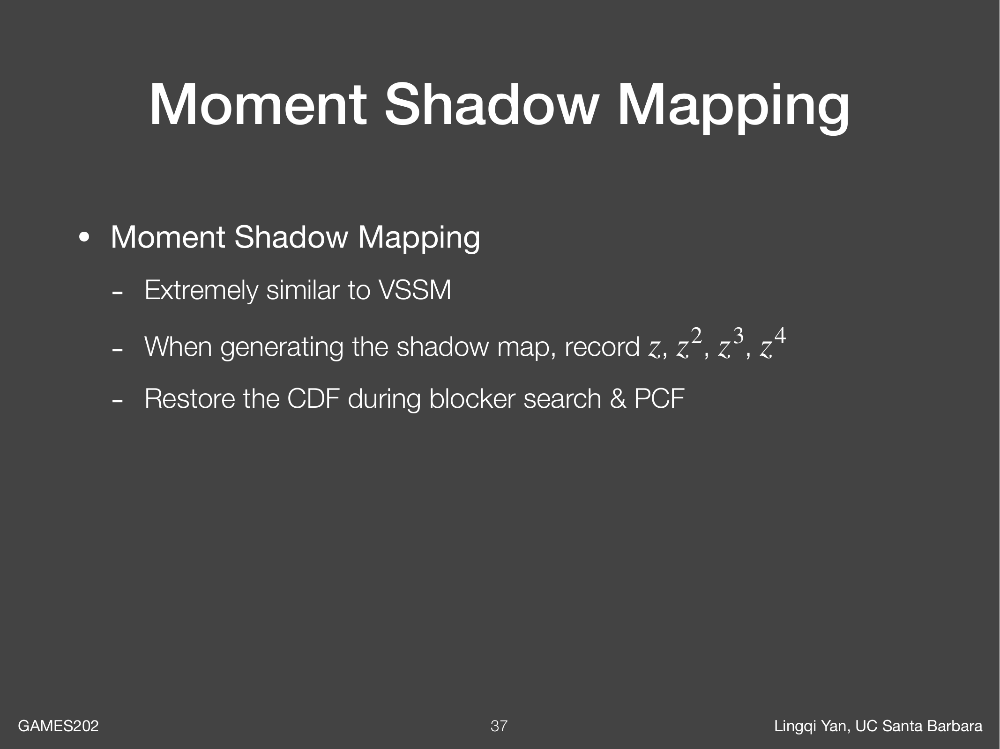

MSM 的流程与 VSSM 很相似：

1. Shadow pass 保存 `z, z^2, z^3, z^4`；
2. 对四个通道进行预过滤或建立范围查询结构；
3. 查询当前过滤区域的四阶矩；
4. 根据四阶矩重建或约束 CDF；
5. 取得阈值 `t` 右侧的概率作为可见度。

它仍然具备“可预过滤”的优势，因为每个矩通道都能使用普通线性过滤。

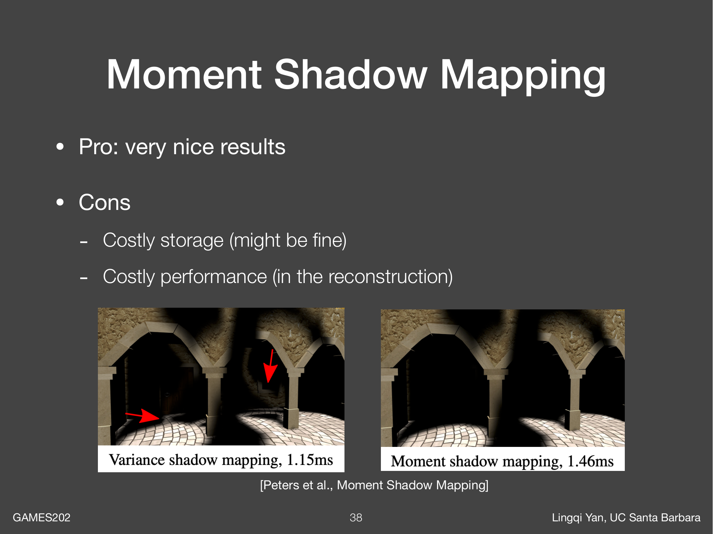

课件中的对比显示，MSM 能明显减轻 VSSM 的漏光并保持柔和阴影，但代价是：

- shadow map 需要更多通道和带宽；
- MIPMAP 或 SAT 也要处理更多通道；
- 着色阶段的 CDF 重建比一个 Chebyshev 公式昂贵；
- 高阶幂更容易带来浮点精度和数值稳定性问题；
- 实现复杂度明显高于 VSSM。

## 20. VSSM、MSM 与逐样本 PCSS 对比

| 方法 | 保存内容 | 查询方式 | 主要优点 | 主要问题 |
| --- | --- | --- | --- | --- |
| PCSS | 原始深度 | 两次逐样本循环 | 过程直观，可直接统计 blocker | 大核时代价高，噪声与采样数相关 |
| VSSM | `E[z]`、`E[z^2]` | Chebyshev 上界 | 查询便宜，易于预过滤 | 分布近似粗糙，容易 light leaking |
| MSM | 常用前四阶矩 | 矩重建 CDF | 对复杂深度分布更准确 | 存储、带宽、计算和实现成本更高 |

选择时不能只问“哪个最好”，而要看场景与预算：

- 光源较小、阴影核不大时，直接 PCF 或 PCSS 可能已经足够；
- 需要大范围软阴影且预算严格时，VSSM 的常数查询很有吸引力；
- 对漏光敏感并且能接受更高成本时，可以考虑 MSM；
- 现代实时渲染中还可能结合级联阴影、时域采样、屏幕空间修正或光线追踪。

## 21. VSSM GLSL 风格伪代码

下面的代码强调算法结构。`queryMoments` 可以由 MIPMAP、SAT 或其他预过滤结构实现。

```glsl
struct Moments2 {
    float mean;
    float meanSquare;
};

float chebyshevVisibility(float t, Moments2 moments)
{
    if (t <= moments.mean) {
        return 1.0;
    }

    float variance = moments.meanSquare
                   - moments.mean * moments.mean;
    variance = max(variance, 1e-6);

    float delta = t - moments.mean;
    return variance / (variance + delta * delta);
}
```

可选的漏光抑制：

```glsl
float reduceLightBleeding(float visibility, float minVisibility)
{
    return clamp(
        (visibility - minVisibility) / (1.0 - minVisibility),
        0.0,
        1.0
    );
}
```

由区域统计量近似平均 blocker 深度：

```glsl
bool estimateAverageBlockerDepth(
    float receiverDepth,
    Moments2 searchMoments,
    out float blockerDepth)
{
    float pUnoccluded = chebyshevVisibility(
        receiverDepth,
        searchMoments
    );
    float pOccluded = 1.0 - pUnoccluded;

    if (pOccluded <= 1e-4) {
        blockerDepth = 0.0;
        return false;
    }

    blockerDepth =
        (searchMoments.mean - pUnoccluded * receiverDepth)
        / pOccluded;

    return blockerDepth > 0.0
        && blockerDepth < receiverDepth;
}
```

完整流程：

```glsl
float vssmVisibility(vec2 shadowUV, float receiverDepth)
{
    float searchRadius = computeBlockerSearchRadius(receiverDepth);
    Moments2 searchMoments = queryMoments(
        shadowUV,
        searchRadius
    );

    float blockerDepth;
    bool hasBlocker = estimateAverageBlockerDepth(
        receiverDepth,
        searchMoments,
        blockerDepth
    );

    if (!hasBlocker) {
        return 1.0;
    }

    float filterRadius = lightRadius
        * (receiverDepth - blockerDepth)
        / blockerDepth;

    Moments2 filterMoments = queryMoments(
        shadowUV,
        filterRadius
    );

    float visibility = chebyshevVisibility(
        receiverDepth,
        filterMoments
    );

    return reduceLightBleeding(visibility, 0.2);
}
```

这段伪代码还省略了：

- depth bias 或 normal bias；
- 光源空间到纹理空间的半径换算；
- UV 越界处理；
- 透视投影下的深度线性化约定；
- MIPMAP LOD 或 SAT 矩形边界计算；
- reverse-Z 时的比较方向；
- MSM 的数值稳定化与 CDF 重建。

## 22. 实现和调试清单

### 22.1 Shadow-map 生成

- 确认一阶与二阶矩来自同一个深度表示；
- 若存储投影后的非线性深度，所有比较和推导必须使用相同表示；
- 使用足够精度的纹理格式，避免两个接近的平方深度统计量相减时造成严重消减误差；
- 检查清屏值是否与“远平面、无遮挡”的约定一致；
- 先可视化 `z`，再可视化 `z^2` 和方差。

### 22.2 统计查询

- MIPMAP 的每个通道都必须按相同方式过滤；
- 不要对深度使用 `min` MIPMAP，却对公式仍按平均值解释；
- SAT 查询要检查矩形四角的正负号与边界；
- 验证查询整个纹理时，均值是否与 CPU 参考值一致；
- 用固定小矩形对比暴力求和，先验证范围查询再调阴影。

### 22.3 Chebyshev 查询

- 只在 `t > mu` 的分支使用尾部上界；
- 方差必须限制为非负，并设置合理下限；
- 输出可见度应限制到 `[0, 1]`；
- 单独显示 `mean`、`variance`、`pMax`，比只看最终颜色更容易定位问题；
- 调整漏光抑制参数时，同时观察暗部是否被过度压黑。

### 22.4 Blocker Search

- 没有 blocker 时立即返回完全可见；
- 防止 `p_occ` 接近 0 时除零；
- 检查估计出的 blocker 深度是否位于光源与接收点之间；
- 将 blocker 深度、半影宽度和最终过滤半径分别可视化；
- 对倾斜面和几何边界重点检查非平面误差。

## 23. 常见误解

### 23.1 “VSSM 假设深度是高斯分布”

不准确。正态分布只是课上帮助理解“用少量统计量估计人数比例”的类比。核心公式是单边 Chebyshev 不等式，它不要求高斯分布。

### 23.2 “Chebyshev 算出来的就是真实可见概率”

不是。它给出上界：

$$
P(X>t)\le p_{\max}(t).
$$

VSSM 把上界当作近似值，这一步正是速度与误差的交换。

### 23.3 “有了均值就不需要平方深度”

只有均值无法计算方差。必须同时获得

$$
E[X]
\quad\text{和}\quad
E[X^2],
$$

才能通过

$$
\sigma^2=E[X^2]-E[X]^2
$$

得到方差。

### 23.4 “SAT 让 VSSM 完全精确”

SAT 只让矩形区域求和精确。Chebyshev 概率估计、平均 blocker 深度和平面接收面假设仍然是近似。

### 23.5 “MSM 保存四阶矩后就等于保存完整分布”

不是。有限个矩仍不能唯一确定任意复杂分布。四阶矩只是比两阶矩施加更多约束，通常能得到更紧的 CDF 近似。

### 23.6 “过滤半径越大，VSSM 一定越准确”

查询成本不会随面积明显增长，但更大的区域可能混合更多深度层，使分布更复杂。此时前两个矩反而更难准确表达真实 CDF，漏光可能更明显。

## 24. 学完本讲后应该能回答的问题

1. 为什么 PCF 必须先进行每个样本的深度比较，再平均结果？
2. 为什么“先平均深度再比较”与 PCF 不等价？
3. PCSS 的哪两个步骤会随采样区域增大而变慢？
4. 为什么保存 `z` 和 `z^2` 就能得到区域深度的均值与方差？
5. 在阴影问题中，随机变量 `X`、阈值 `t` 和概率 `P(X > t)` 分别表示什么？
6. 单边 Chebyshev 公式要求什么条件？它给出真实概率还是概率上界？
7. VSSM 如何由总均值和遮挡比例反推出平均 blocker 深度？
8. 近似 `z_unocc = t` 隐含了什么几何假设？
9. MIPMAP 与 SAT 的范围查询各有什么优缺点？
10. 为什么双峰或多峰深度分布容易造成 VSSM light leaking？
11. Moment Shadow Mapping 为什么要保存高阶矩？
12. MSM 相比 VSSM 增加了哪些存储、带宽、计算和实现成本？

## 25. 一页总结

本讲最重要的思维转换是：

$$
\boxed{
\text{逐 texel 统计可见性}
\longrightarrow
\text{由区域分布估计可见概率}
}
$$

PCF 的目标可写成

$$
V(t)=P(X>t).
$$

VSSM 保存

$$
E[X],\qquad E[X^2],
$$

计算

$$
\sigma^2=E[X^2]-E[X]^2,
$$

再用

$$
P(X>t)
\le
\frac{\sigma^2}
{\sigma^2+(t-\mu)^2}
$$

快速估计可见度。

MIPMAP 或 SAT 让任意大小区域的矩查询接近常数成本；VSSM 再由区域均值和估计的遮挡比例近似平均 blocker 深度，从而保留 PCSS 的可变半影。

这种方法的代价是深度分布被压缩成很少的统计量。当前两个矩无法描述多峰分布时，就会产生 light leaking。MSM 通过保存

$$
E[z],E[z^2],E[z^3],E[z^4]
$$

更精确地约束 CDF，但需要更多存储与更复杂的重建。

## 26. 下一讲预告

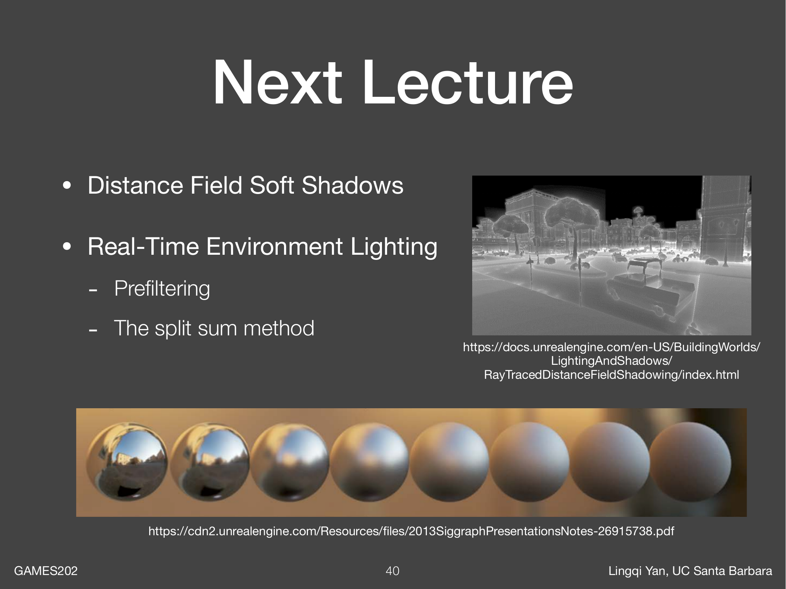

下一讲将继续讨论：

- Distance Field Soft Shadows；
- Real-Time Environment Lighting；
- 环境光照的预过滤；
- Split Sum 方法。

它们会把问题从“一个光源产生的软阴影”推进到“复杂环境光如何在实时预算内被查询和积分”。
