# GAMES202 Lecture 05：实时环境光照

> 视频：<https://www.bilibili.com/video/BV1YK4y1T7yY?p=5>  
> 课程主页：<https://sites.cs.ucsb.edu/~lingqi/teaching/games202.html>  
> 官方课件：<https://sites.cs.ucsb.edu/~lingqi/teaching/resources/GAMES202_Lecture_05.pdf>  
> 本讲主题：Real-Time Environment Mapping。前半部分使用距离场计算软阴影，后半部分讨论如何用预过滤环境贴图与 Split Sum 近似实时计算环境光照。

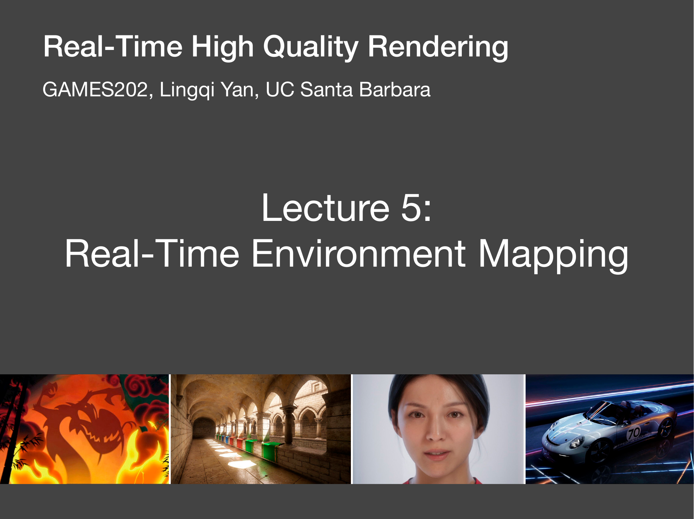

## 1. 本讲解决什么问题

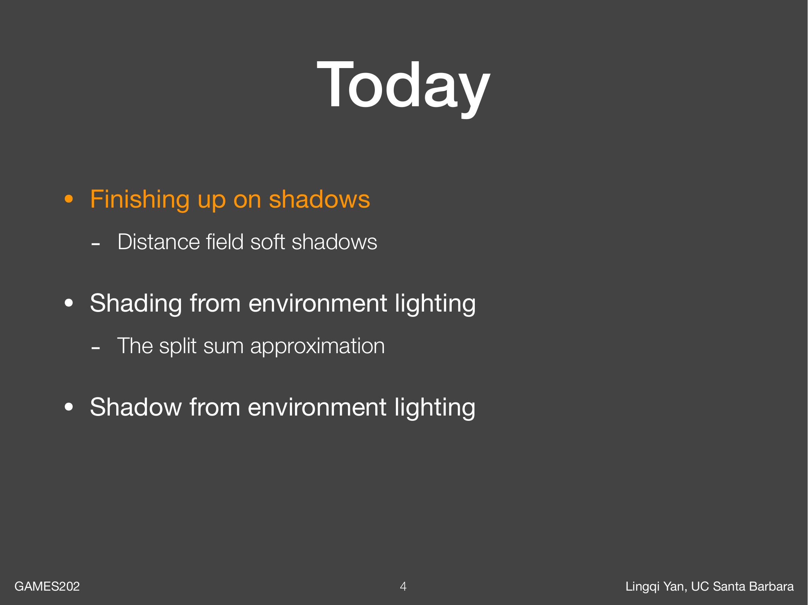

Lecture 5 包含两个看似独立、实际都在做“空间换时间”的主题。

第一部分是 Distance Field Soft Shadows：

1. 使用距离场查询当前位置离最近几何体有多远；
2. 用这个距离作为射线可以安全前进的步长；
3. 在前进过程中估计遮挡物相对着色点张开的角度；
4. 用最危险的一次接近程度近似软阴影可见度。

第二部分是 Real-Time Environment Mapping：

1. 环境贴图表示来自所有远处方向的光；
2. 直接代入渲染方程需要大量方向采样；
3. 将光照积分近似拆成两个部分；
4. 第一部分预过滤环境贴图；
5. 第二部分预计算成二维 BRDF 查找表；
6. 运行时只进行几次纹理查询和乘加。

这两个主题的共同思路是：

> 把运行时昂贵的几何查询或积分，转化为可预计算的数据和少量固定成本查询。

## 2. 距离场是什么

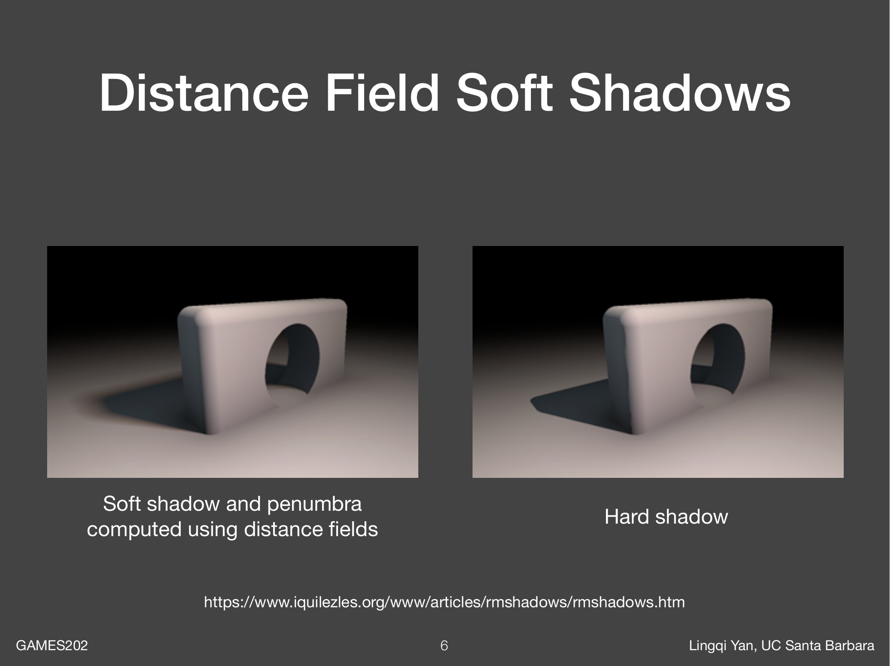

左图使用距离场估计半影，遮挡物附近的阴影较硬，远离接触位置后逐渐变软；右图只做二值相交测试，因此整个边界都是硬阴影。两者使用同一类距离查询，区别在于是否保留射线沿途“离遮挡物有多近”的信息。

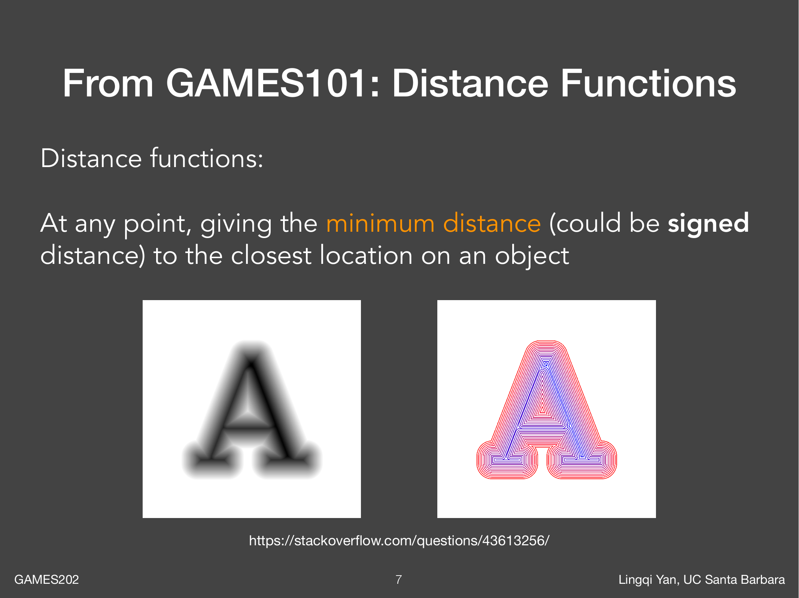

距离函数在空间任意位置 `p` 返回该点到物体表面的最短距离：

$$
d(\mathbf{p})
=
\min_{\mathbf{q}\in\partial\mathcal{O}}
\left\|
\mathbf{p}-\mathbf{q}
\right\|.
$$

这里：

- `O` 表示物体占据的区域；
- `boundary(O)` 表示物体表面；
- `q` 是表面上的任意点；
- `d(p)` 是 `p` 到最近表面的欧氏距离。

Signed Distance Field，简称 SDF，还会使用正负号区分内外：

$$
\operatorname{SDF}(\mathbf{p})
=
\begin{cases}
-d(\mathbf{p}),&\mathbf{p}\text{ 在物体内部},\\
\phantom{-}d(\mathbf{p}),&\mathbf{p}\text{ 在物体外部},\\
0,&\mathbf{p}\text{ 位于物体表面}.
\end{cases}
$$

因此，SDF 不仅告诉我们“离表面多远”，还告诉我们“在物体里面还是外面”。

最重要的几何意义是：

> 如果当前位置的距离场值为 `d`，那么以当前位置为球心、`d` 为半径的球体内部没有任何表面。

这个球就是当前点周围的“安全区域”。

## 3. SDF 的零等值面与插值

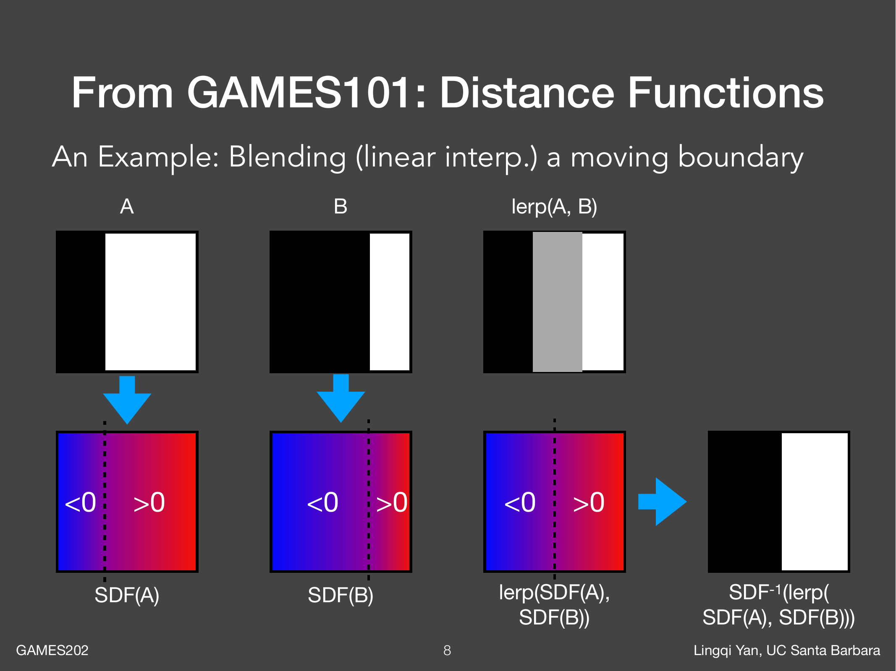

一个 SDF 表示的几何边界就是它的零等值面：

$$
\mathcal{S}
=
\left\{
\mathbf{p}
\mid
\operatorname{SDF}(\mathbf{p})=0
\right\}.
$$

如果有两个形状的距离场 `d_A` 和 `d_B`，可以对场值做线性插值：

$$
d_t(\mathbf{p})
=
(1-t)d_A(\mathbf{p})
+t\,d_B(\mathbf{p}),
\qquad
t\in[0,1].
$$

再提取新场的零等值面：

$$
\mathcal{S}_t
=
\left\{
\mathbf{p}
\mid
d_t(\mathbf{p})=0
\right\}.
$$

就可以得到形状 A 向形状 B 连续变化的边界。

课件中的一维示意非常重要：直接插值两张二值图容易得到两层半透明边界；插值距离场后再取零等值面，则能得到一条连续移动的边界。

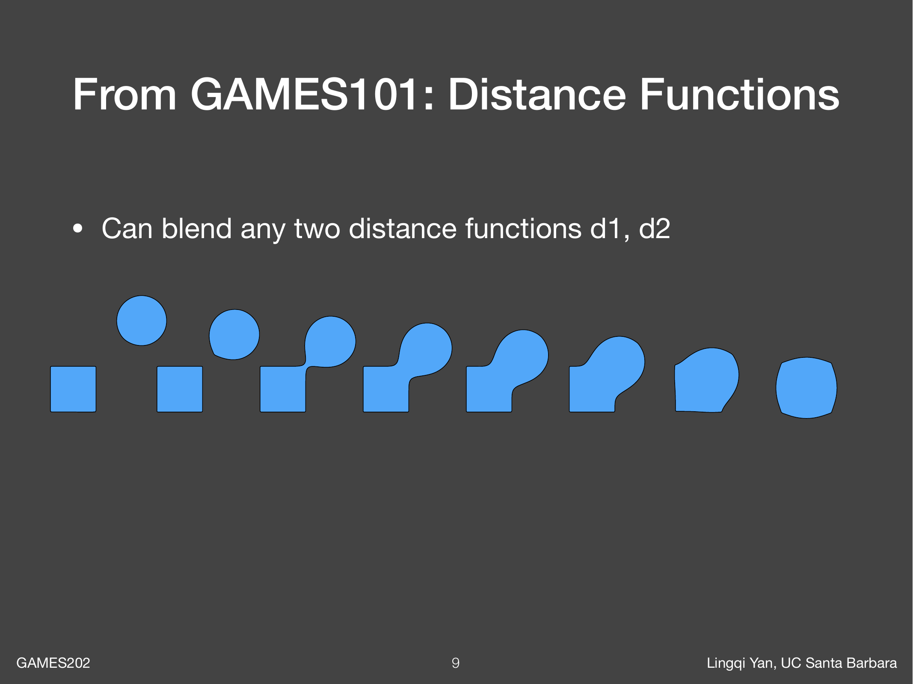

这种方法还可以用于多个二维或三维形状之间的变形。

不过要注意：两个精确 SDF 的线性插值不一定仍是严格满足欧氏距离性质的 SDF。它的零等值面通常仍然有用，但若要用于 Sphere Tracing，必须考虑它是否仍提供保守的安全距离。

## 4. Sphere Tracing：为什么可以大步前进

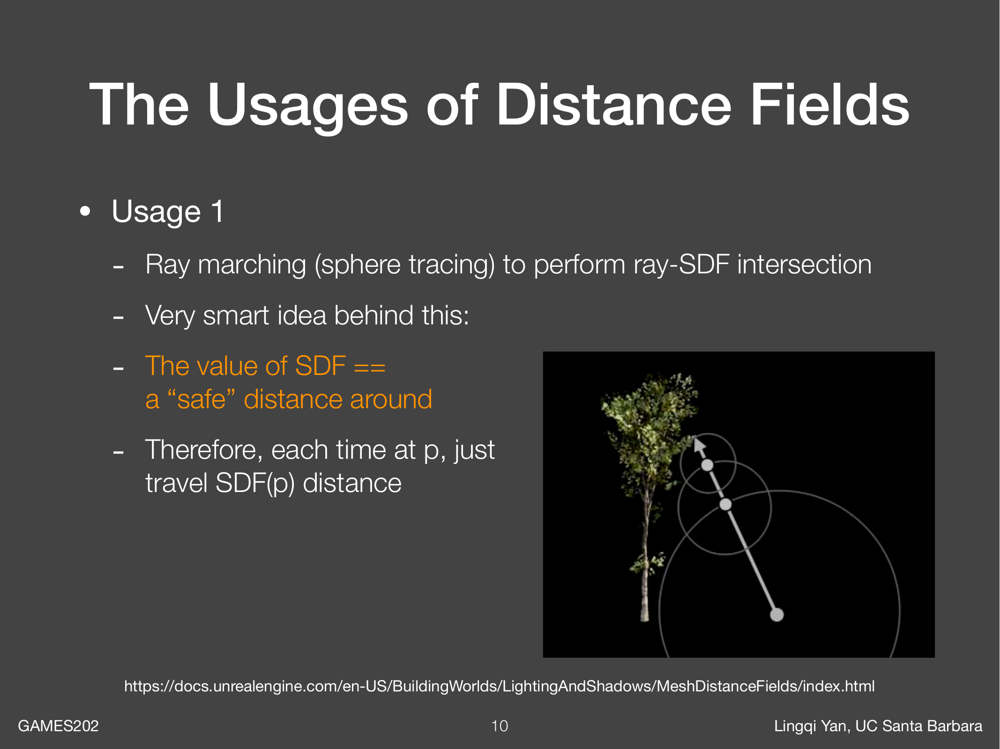

普通 Ray Marching 可以使用固定步长沿射线前进，但步长选择很麻烦：

- 步长太小，迭代次数很多；
- 步长太大，可能直接跨过薄物体；
- 场景尺度变化时，一个固定步长很难通用。

Sphere Tracing 使用当前位置的 SDF 值作为步长。

设射线为

$$
\mathbf{p}(t)
=
\mathbf{o}+t\mathbf{d},
$$

其中：

- `o` 是射线起点；
- `d` 是单位方向；
- `t` 是沿射线前进的距离。

第 `k` 步位于

$$
\mathbf{p}_k
=
\mathbf{o}+t_k\mathbf{d}.
$$

查询距离场：

$$
s_k
=
\operatorname{SDF}(\mathbf{p}_k).
$$

然后前进：

$$
t_{k+1}
=
t_k+s_k.
$$

因为以 `p_k` 为球心、`s_k` 为半径的球内没有表面，所以在这个距离内前进不会撞过最近几何体。

### 4.1 终止条件

当

$$
\left|
\operatorname{SDF}(\mathbf{p}_k)
\right|
<\varepsilon
$$

时，可以认为射线到达表面。

当

$$
t_k>t_{\max}
$$

或迭代次数达到上限时，则认为没有命中。

### 4.2 “安全”依赖什么

只有当距离场给出的步长不大于到最近表面的真实距离时，这个步长才是安全的。

如果使用的不是精确 SDF，而是一个 Distance Estimator：

- 低估距离通常只是多走几步；
- 高估距离可能让射线跨过几何体；
- 低分辨率三维纹理和插值也会引入误差；
- 实现中常乘一个略小于 1 的安全系数。

## 5. 用 Sphere Tracing 计算硬阴影

从着色点 `o` 朝光源方向发射阴影射线。

若光源位置为 `l`，则

$$
\mathbf{d}
=
\frac{
\mathbf{l}-\mathbf{o}
}{
\left\|
\mathbf{l}-\mathbf{o}
\right\|
},
$$

$$
t_{\mathrm{light}}
=
\left\|
\mathbf{l}-\mathbf{o}
\right\|.
$$

沿射线执行 Sphere Tracing：

- 在到达光源前命中表面，返回完全遮挡；
- 安全前进到光源距离，返回完全可见。

硬阴影可见度为

$$
V(\mathbf{o})
=
\begin{cases}
0,&\text{射线先命中遮挡物},\\
1,&\text{射线先到达光源}.
\end{cases}
$$

但只返回 0 或 1 仍然是硬阴影。距离场还提供了“射线离遮挡物有多近”的信息，这可以用来估计半影。

## 6. 从安全距离得到安全角度

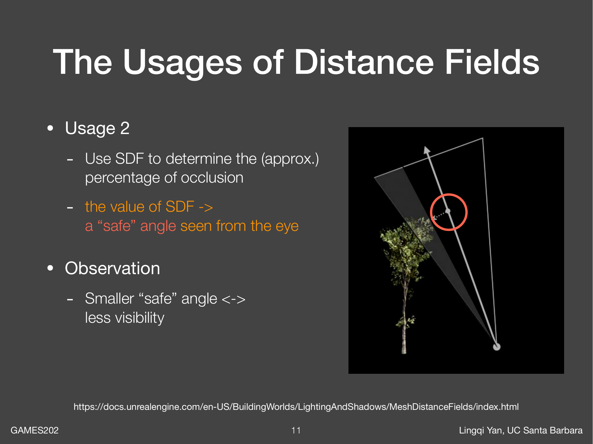

在射线上的采样点 `p`，距离场值

$$
h
=
\operatorname{SDF}(\mathbf{p})
$$

表示附近最近遮挡物与 `p` 的距离。

从射线起点 `o` 看过去，以 `p` 为中心、`h` 为半径的安全球张开一个角度。设

$$
t
=
\left\|
\mathbf{p}-\mathbf{o}
\right\|,
$$

则几何上可以近似写成

$$
\sin\theta
\approx
\frac{h}{t},
$$

所以

$$
\theta
\approx
\arcsin
\left(
\frac{h}{t}
\right).
$$

当角度较小时：

$$
\arcsin x\approx x,
$$

于是有

$$
\theta
\approx
\frac{h}{t}.
$$

这个比值很有直觉：

- `h` 很小：射线非常靠近遮挡物，安全角度小，可见度低；
- `h` 很大：射线周围很空，安全角度大，可见度高；
- 同样的 `h` 出现在更远处时，张开的角度更小，因此分母必须包含 `t`。

## 7. 为什么要取沿途的最小值

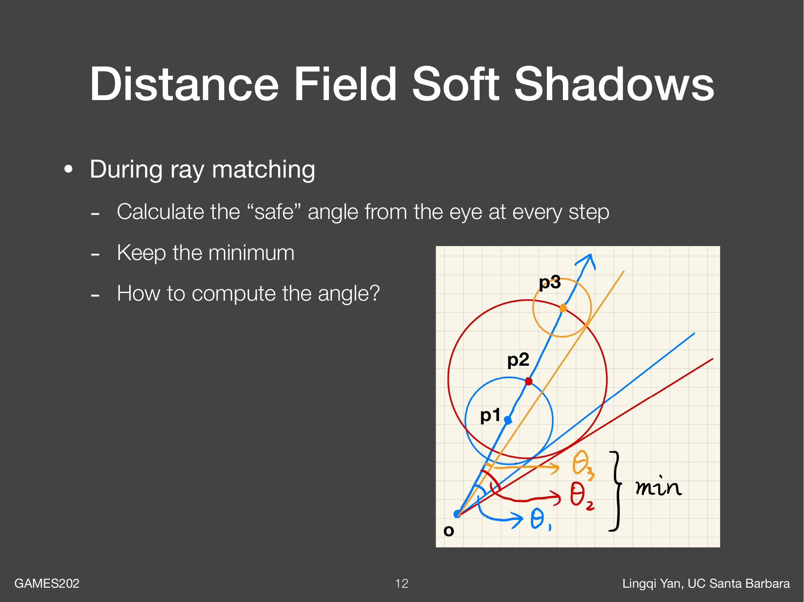

沿着阴影射线前进时，每个采样点都会产生一个安全角度估计。

$$
\theta_k
\approx
\frac{
\operatorname{SDF}(\mathbf{p}_k)
}{
\left\|
\mathbf{p}_k-\mathbf{o}
\right\|
}.
$$

最终可见度不能取平均值。因为只要射线路径中有一处非常接近遮挡物，那一处就限制了从着色点能够看到的光源范围。

所以取最小值：

$$
\theta_{\min}
=
\min_k
\theta_k.
$$

这相当于寻找整条路径中最窄的“可见锥”。

如果某一步真正命中表面：

$$
\operatorname{SDF}(\mathbf{p}_k)
<\varepsilon,
$$

则直接返回完全遮挡，不必继续估计。

## 8. Distance Field Soft Shadow 公式

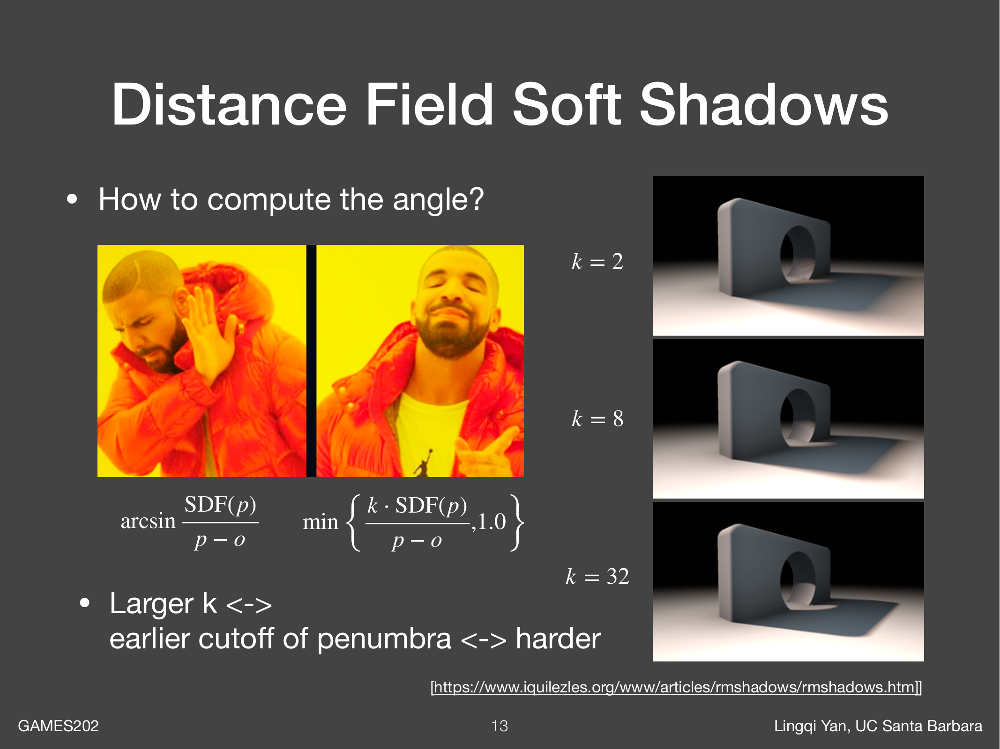

课件使用下面的实时近似：

$$
V
\approx
\min_k
\operatorname{clamp}
\left(
k_{\mathrm{soft}}
\frac{
\operatorname{SDF}(\mathbf{p}_k)
}{
\left\|
\mathbf{p}_k-\mathbf{o}
\right\|
},
0,
1
\right).
$$

这里 `k_soft` 是控制半影软硬程度的经验参数。

### 8.1 参数的视觉意义

当 `k_soft` 较小时：

- 比值被放大的程度小；
- 更多位置落在 0 到 1 的过渡区；
- 半影更宽；
- 阴影更软。

当 `k_soft` 较大时：

- 可见度更快达到 1；
- 只有非常靠近遮挡物的射线才处于半影；
- 半影更窄；
- 阴影更硬。

因此，`k_soft` 越大，阴影越接近硬阴影。

### 8.2 这不是精确面积光源积分

该公式没有显式积分光源形状，也没有真正计算光源被遮挡的面积比例。它利用距离场与射线路径的几何关系，构造了一个视觉上合理、计算便宜的半影估计。

它适合实时效果，但不是严格的物理软阴影解。

## 9. SDF 软阴影伪代码

```glsl
float sdfSoftShadow(
    vec3 rayOrigin,
    vec3 rayDirection,
    float maxDistance,
    float softness)
{
    float visibility = 1.0;
    float t = 0.01;

    for (int step = 0; step < 64; ++step) {
        if (t >= maxDistance) {
            break;
        }

        vec3 p = rayOrigin + t * rayDirection;
        float h = sceneSDF(p);

        if (h < 1e-4) {
            return 0.0;
        }

        visibility = min(
            visibility,
            softness * h / t
        );

        float safeStep = max(h * 0.9, 1e-4);
        t += safeStep;
    }

    return clamp(visibility, 0.0, 1.0);
}
```

代码中的 `0.9` 是安全系数。对严格、精确的 SDF，它可能不是必需的；对离散距离场、插值后的距离估计或不完全满足距离性质的组合场，它能降低跨过几何体的风险。

实际使用时还要处理：

- 从表面法线方向偏移射线起点，避免自相交；
- 点光源和方向光的最大追踪距离不同；
- 非均匀缩放会破坏简单 SDF 的距离性质；
- 最大步数太小会漏掉远处遮挡物；
- 步长下限太大可能跨过薄几何；
- 距离场分辨率不足会导致光漏和边界抖动。

## 10. 距离场的可视化、优点与限制

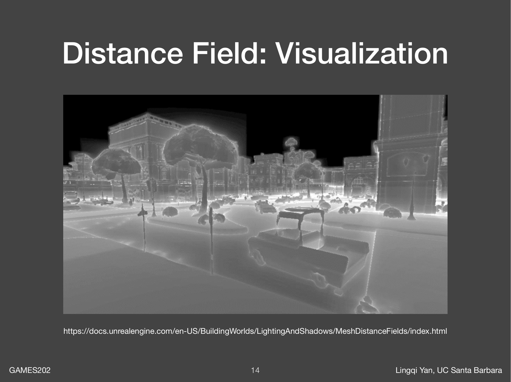

距离场可视化通常让靠近表面的区域较暗或显示紧密等值线，远离几何体的区域更亮。它不是最终阴影图，而是一种空间查询数据。

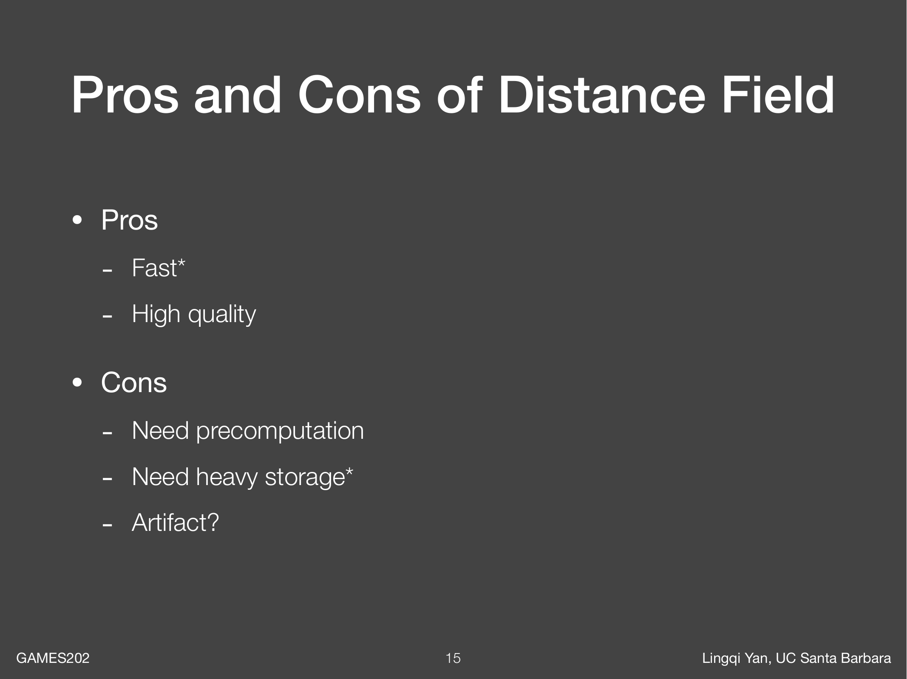

优点：

- 一次查询就能获得到最近几何体的距离；
- Sphere Tracing 能根据空间空旷程度自适应步长；
- 软阴影过渡连续，通常比低采样数 PCSS 更平滑；
- 同一份数据还能用于碰撞、AO、光线求交等效果；
- 复杂几何被转化为规则纹理查询，适合 GPU。

限制：

- 静态网格通常需要预计算距离场；
- 三维距离场会占用较多显存；
- 分辨率不足时，小特征和薄片容易丢失；
- 动态、蒙皮或拓扑变化物体不容易低成本更新；
- 非均匀缩放、插值和组合会破坏严格距离性质；
- 追踪仍有最大步数，复杂场景并非真正固定成本。

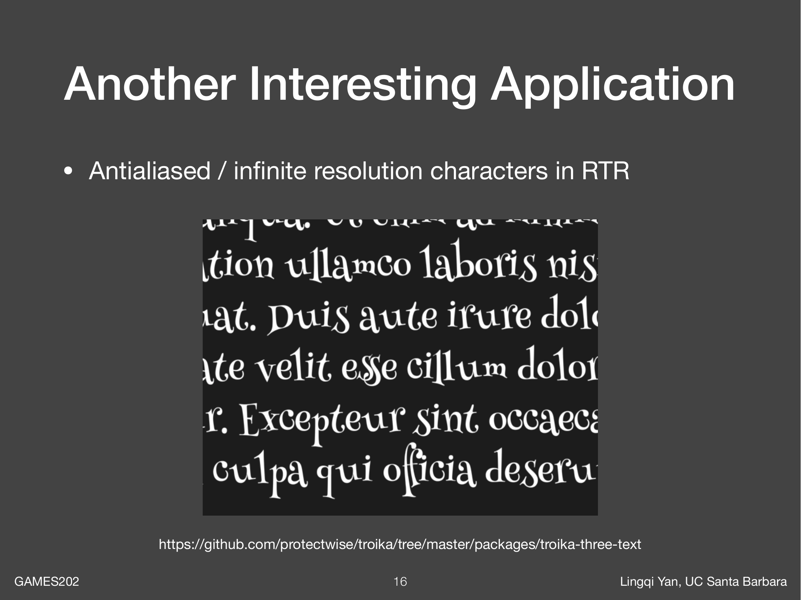

课件还展示了距离场字体。字符轮廓保存为二维距离场后，可以在运行时使用阈值和导数恢复平滑边缘，在缩放时获得比普通低分辨率位图更稳定的抗锯齿效果。

## 11. 从阴影切换到环境光照

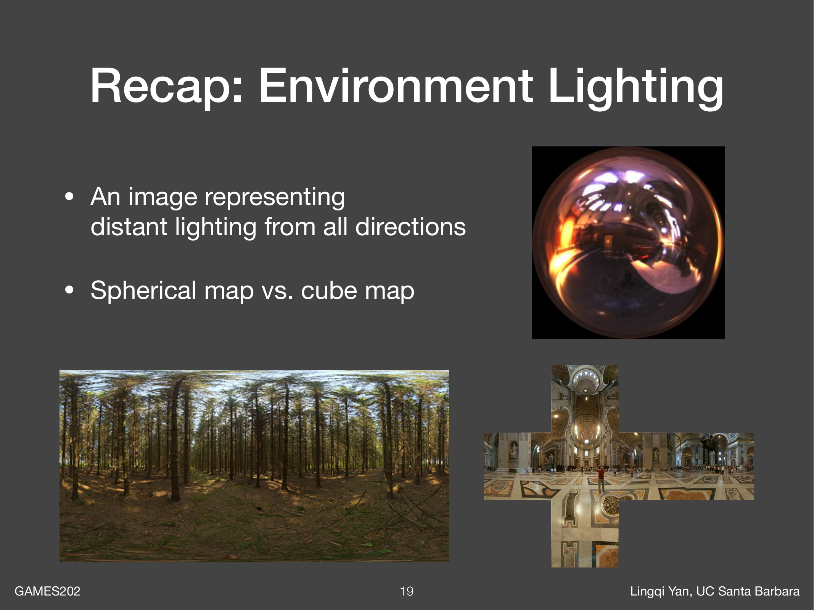

环境贴图用一张二维纹理或六张立方体纹理，表示来自远处所有方向的入射光。

对足够远的环境，可以近似认为入射光只与方向有关，而与场景中着色点的位置无关：

$$
L_i(\mathbf{p},\omega_i)
\approx
L_{\mathrm{env}}(\omega_i).
$$

这就是环境贴图能够被场景中多个物体共享的原因。

常见表示方式：

- Spherical Map：把球面方向映射到一张二维纹理；
- Latitude-Longitude Map：经纬度展开，常用于 HDRI 文件；
- Cube Map：六张正方形纹理组成立方体，GPU 支持成熟；
- Octahedral Map：把单位球方向折叠映射到正方形，存储利用率较高。

课件重点对比球面贴图与 Cube Map。无论存储方式如何，运行时查询的输入本质上都是一个三维方向。

## 12. 环境光照仍然是渲染方程

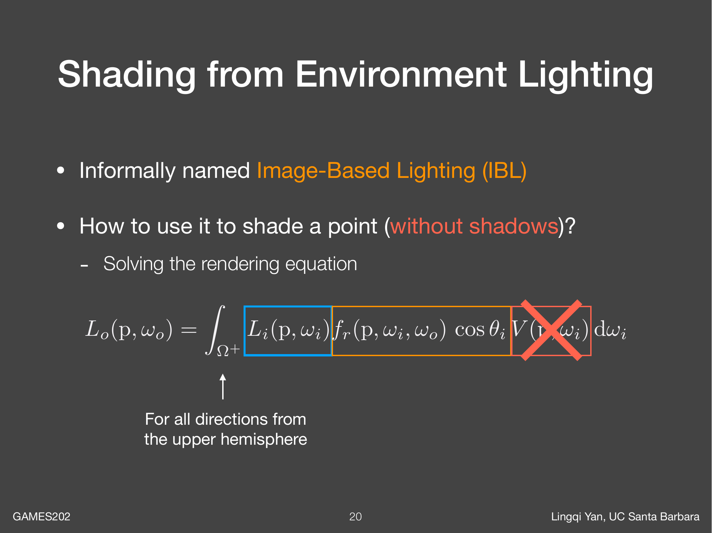

暂时忽略阴影后，一个表面点在观察方向上的出射辐射度为

$$
L_o(\mathbf{p},\omega_o)
=
\int_{\Omega^+}
L_{\mathrm{env}}(\omega_i)\,
f_r(\mathbf{p},\omega_i,\omega_o)\,
\max
\left(
0,
\mathbf{n}\cdot\omega_i
\right)
\mathrm{d}\omega_i.
$$

其中：

- `L_env` 是环境贴图在入射方向上的辐射度；
- `f_r` 是 BRDF；
- `n` 是表面法线；
- `omega_i` 是入射方向；
- `omega_o` 是观察方向；
- `Omega+` 是法线上半球。

环境贴图不是简单贴到物体上的颜色纹理。它提供的是各个方向的入射光，仍然需要经过 BRDF 和余弦项积分。

## 13. 为什么不直接 Monte Carlo 采样

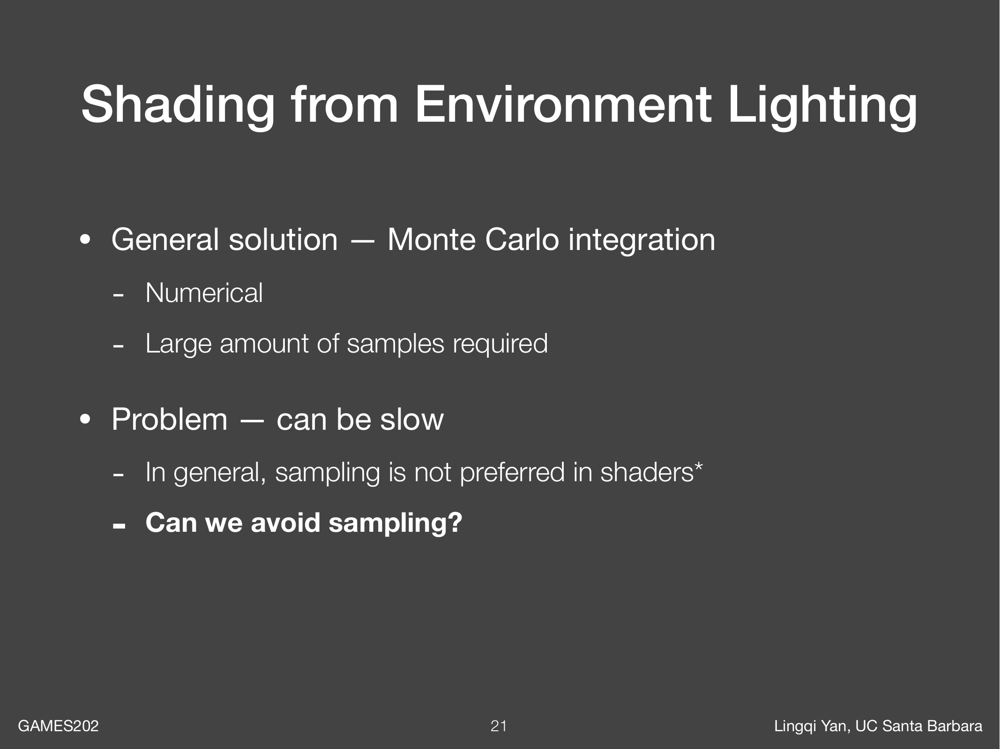

渲染方程可以用 Monte Carlo 积分：

$$
L_o
\approx
\frac{1}{N}
\sum_{j=1}^{N}
\frac{
L_{\mathrm{env}}(\omega_j)\,
f_r(\omega_j,\omega_o)\,
\max(0,\mathbf{n}\cdot\omega_j)
}{
p(\omega_j)
}.
$$

其中 `p(omega_j)` 是采样方向的概率密度。

离线渲染可以使用大量样本并逐渐收敛，但实时片元着色器面对的是：

- 每帧数百万个像素；
- 每个像素可能有多个材质层；
- 低样本数会产生明显噪声；
- 高样本数会带来大量环境贴图查询；
- 还要为其他光照、后处理和几何任务留下预算。

因此课程提出的问题是：

> 能不能完全避免运行时对半球做大量随机采样？

## 14. 关键观察：BRDF 要么集中，要么平滑

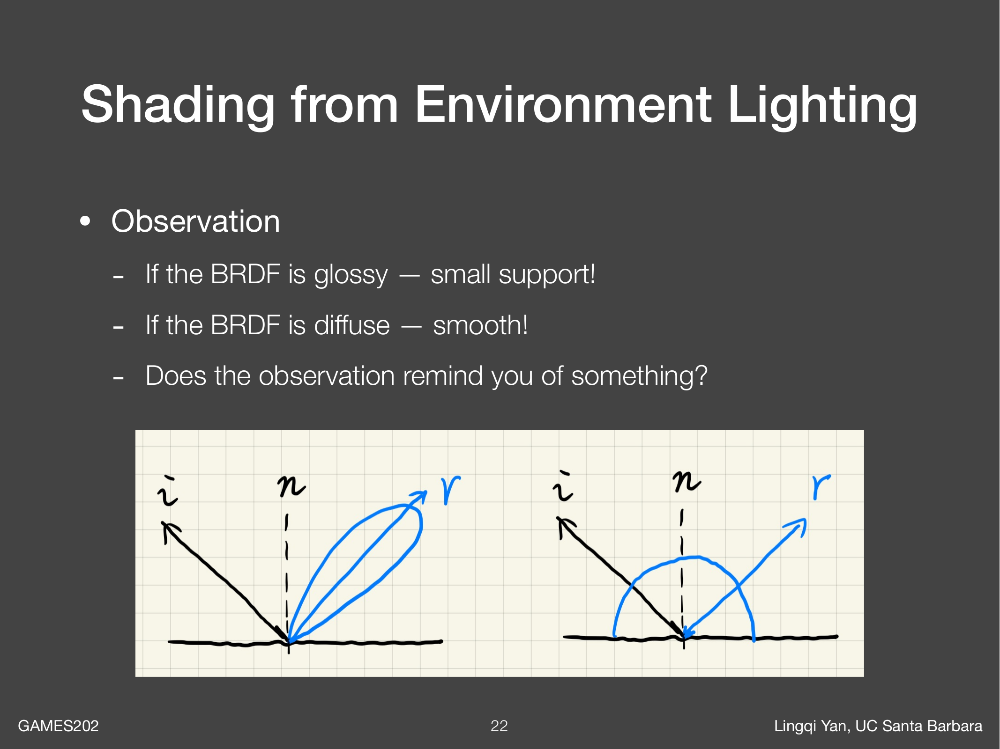

对于非常光滑的镜面材质：

- BRDF 能量集中在镜面反射方向附近；
- 有效积分区域很小；
- 只有环境贴图的一小片方向贡献明显。

对于粗糙或漫反射材质：

- BRDF 分布宽；
- 函数变化相对平滑；
- 高频环境细节被大范围积分平均掉。

这正好对应 Lecture 3 的经典近似：当一个函数的有效支撑很小，或者参与积分的函数在范围内足够平滑时，可以把乘积积分近似拆开。

## 15. 经典乘积积分近似

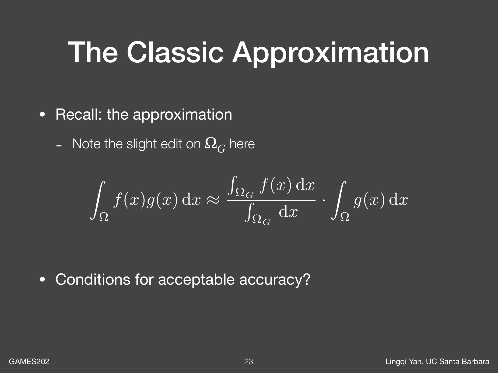

设 `g` 的有效支撑区域为 `Omega_g`，课程使用：

$$
\int_{\Omega}
f(x)g(x)\,
\mathrm{d}x
\approx
\frac{
\displaystyle
\int_{\Omega_g}
f(x)\,
\mathrm{d}x
}{
\displaystyle
\int_{\Omega_g}
\mathrm{d}x
}
\cdot
\int_{\Omega}
g(x)\,
\mathrm{d}x.
$$

右侧第一项是 `f` 在 `g` 的有效区域中的平均值，第二项是 `g` 的总积分。

它不是恒等式。近似比较可靠的典型情况包括：

- `g` 只在很小区域内非零，而 `f` 在这片小区域内变化不大；
- `f` 或 `g` 在积分域内非常平滑；
- 两个函数的高频变化没有强烈相关；
- 只需要视觉上稳定、可接受的结果，而不是严格积分值。

环境光照中可以对应为：

$$
f(\omega_i)
=
L_{\mathrm{env}}(\omega_i),
$$

$$
g(\omega_i)
=
f_r(\omega_i,\omega_o)
\max(0,\mathbf{n}\cdot\omega_i).
$$

## 16. Split Sum 第一阶段：把光照项拆出来

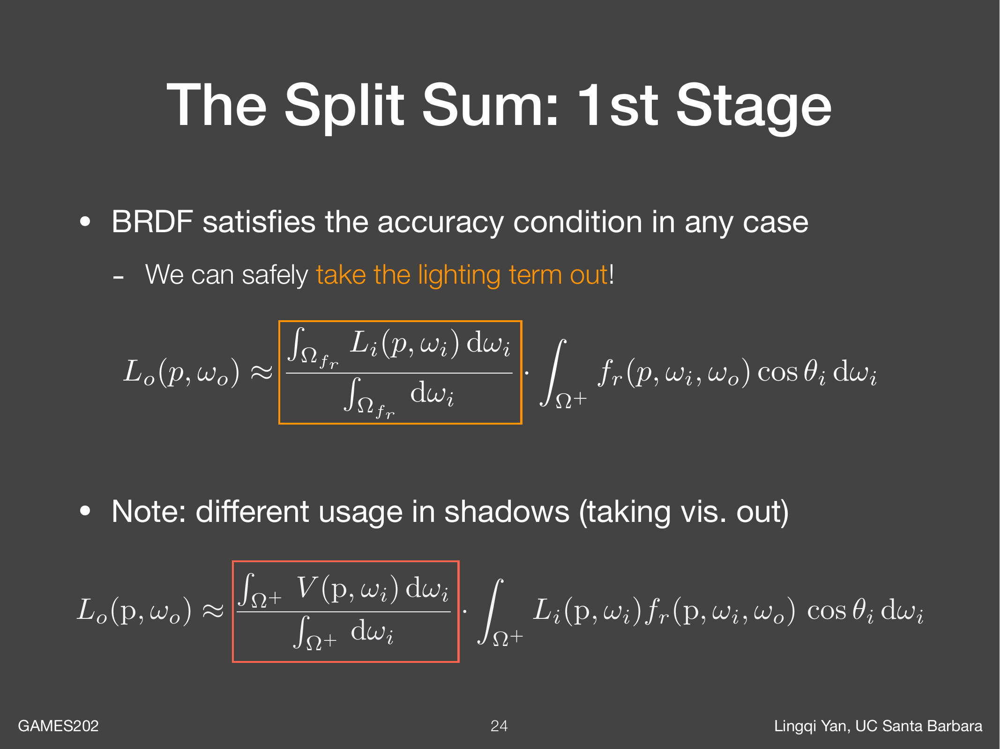

将经典近似代入环境光照积分：

$$
\begin{aligned}
L_o(\mathbf{p},\omega_o)
\approx{}&
\frac{
\displaystyle
\int_{\Omega_{f_r}}
L_{\mathrm{env}}(\omega_i)
\mathrm{d}\omega_i
}{
\displaystyle
\int_{\Omega_{f_r}}
\mathrm{d}\omega_i
}\\
&\cdot
\int_{\Omega^+}
f_r(\mathbf{p},\omega_i,\omega_o)
\max(0,\mathbf{n}\cdot\omega_i)
\mathrm{d}\omega_i.
\end{aligned}
$$

这个式子被拆成：

1. 环境光在 BRDF 有效方向范围内的平均值；
2. BRDF 与余弦项自身的积分。

第一项依赖具体环境贴图，第二项主要依赖材质和观察几何。

课程强调，这里与阴影章节拆分 visibility 的用法不同：

- 阴影章节把 visibility 的平均值提出；
- 本讲把 environment lighting 的局部平均值提出。

## 17. 预过滤环境贴图

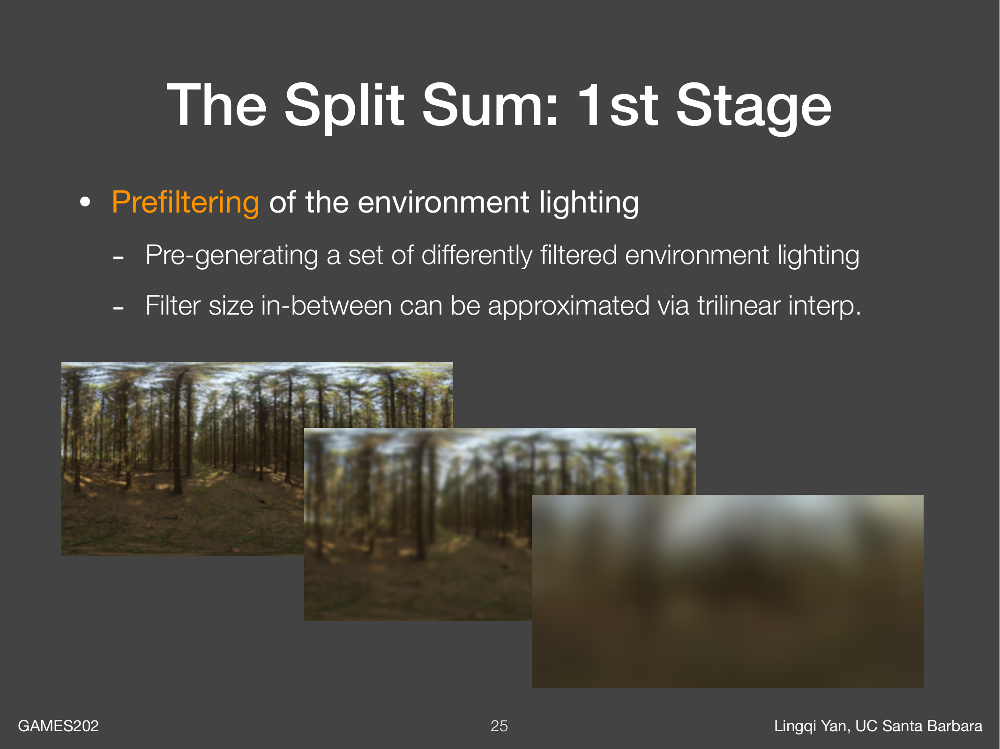

第一阶段可以离线或加载时预计算一组不同模糊程度的环境贴图：

$$
L_{\mathrm{prefilter}}
\left(
\mathbf{r},\alpha
\right)
\approx
\frac{
\displaystyle
\int_{\Omega_{f_r}(\mathbf{r},\alpha)}
L_{\mathrm{env}}(\omega)
\mathrm{d}\omega
}{
\displaystyle
\int_{\Omega_{f_r}(\mathbf{r},\alpha)}
\mathrm{d}\omega
}.
$$

其中：

- `r` 是镜面反射方向；
- `alpha` 表示粗糙度；
- `Omega_fr` 是该粗糙度下 BRDF 的主要支撑区域。

粗糙度与过滤范围的关系：

- 粗糙度接近 0：反射波瓣很窄，保留清晰环境细节；
- 粗糙度增大：波瓣变宽，环境贴图被更大范围平均；
- 粗糙度接近 1：只留下非常模糊、低频的环境颜色。

工程中通常把不同粗糙度的预过滤结果保存在 Cube Map 的不同 MIP 层级。介于两级之间的粗糙度可以使用三线性插值。

要注意：普通图像 MIPMAP 只是方形像素低通；高质量 Specular IBL 通常会按选定的微表面分布进行重要性采样卷积。预过滤规则必须和后面的 BRDF LUT 推导保持一致。

## 18. 为什么沿镜面反射方向查询

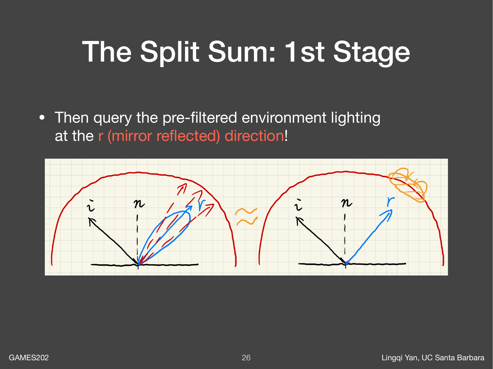

设从表面指向相机的方向为 `v`，则理想镜面反射方向为

$$
\mathbf{r}
=
\operatorname{reflect}
\left(
-\mathbf{v},
\mathbf{n}
\right).
$$

光滑材质的 BRDF 波瓣集中在 `r` 附近，因此预过滤环境贴图的查询中心就是 `r`。

粗糙材质不是只反射 `r` 方向，而是反射 `r` 周围一片区域。预过滤贴图已经把这片区域的环境光平均，所以运行时仍然只需：

1. 计算一个反射方向；
2. 根据粗糙度选择 MIP 层；
3. 进行一次 Cube Map 查询。

这一步把“许多环境方向采样”压缩成了一次带 LOD 的纹理查询。

## 19. Split Sum 第二阶段还剩什么

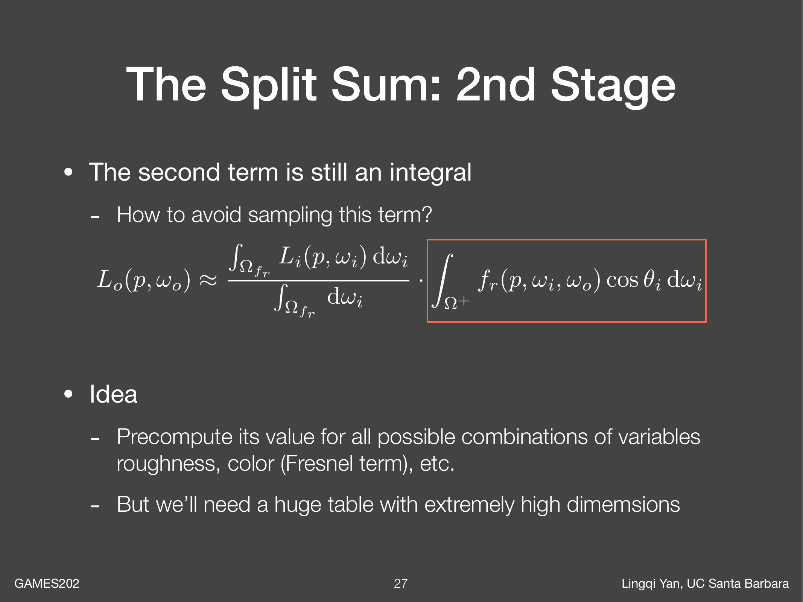

第一阶段之后仍有：

$$
I_{\mathrm{BRDF}}
=
\int_{\Omega^+}
f_r(\mathbf{p},\omega_i,\omega_o)
\max(0,\mathbf{n}\cdot\omega_i)
\mathrm{d}\omega_i.
$$

直接把这个积分对所有参数预计算并不现实，因为 BRDF 可能依赖：

- 粗糙度；
- 基础反射率；
- 入射方向；
- 观察方向；
- 法线方向；
- 各向异性参数；
- 其他材质模型参数。

如果把所有变量都作为查找表维度，纹理会迅速变成高维数据。

第二阶段的目标是继续拆变量，把它压缩为一个二维查找表。

## 20. 微表面 BRDF 回顾

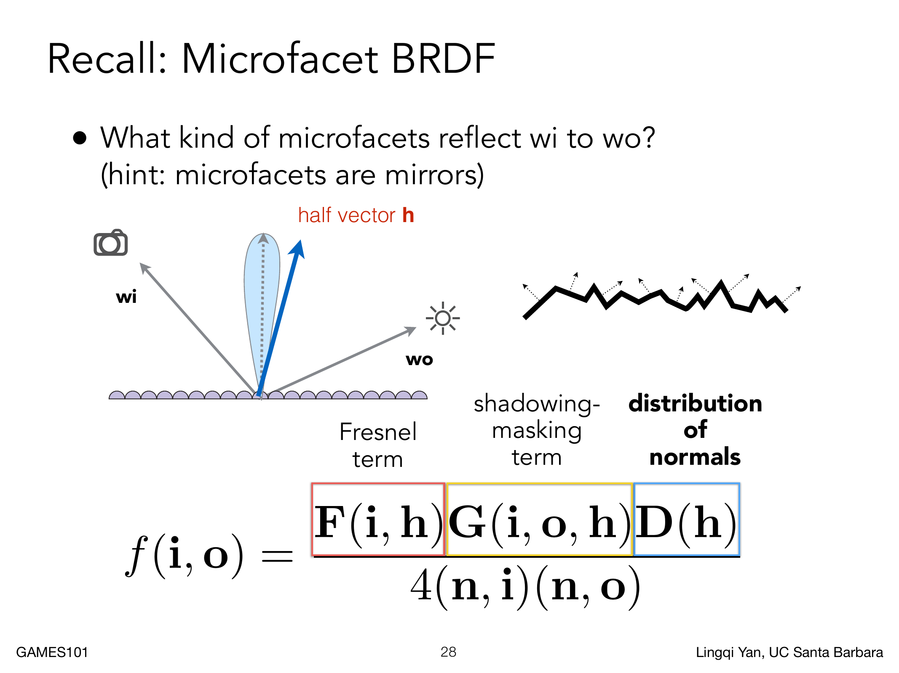

常见微表面 BRDF 为

$$
f_r
\left(
\omega_i,\omega_o
\right)
=
\frac{
F(\omega_i,\mathbf{h})\,
G(\omega_i,\omega_o,\mathbf{h})\,
D(\mathbf{h})
}{
4
(\mathbf{n}\cdot\omega_i)
(\mathbf{n}\cdot\omega_o)
}.
$$

半程向量为

$$
\mathbf{h}
=
\frac{
\omega_i+\omega_o
}{
\left\|
\omega_i+\omega_o
\right\|
}.
$$

三项的作用：

- `F`：Fresnel 项，描述反射率随观察角变化；
- `G`：几何项，描述微表面之间的遮蔽与掩蔽；
- `D`：法线分布函数，描述有多少微表面朝向 `h`。

分母负责归一化与投影关系。

## 21. Schlick Fresnel 近似

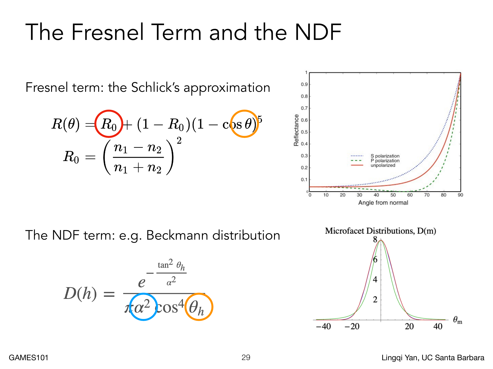

Schlick 近似把 Fresnel 写成：

$$
F(c)
=
F_0
+
(1-F_0)(1-c)^5,
$$

其中

$$
c
=
\max
\left(
0,
\omega_i\cdot\mathbf{h}
\right).
$$

也可以改写为：

$$
F(c)
=
F_0
\left[
1-(1-c)^5
\right]
+
(1-c)^5.
$$

这个形式非常关键，因为它把材质的基础反射率 `F0` 变成了一个线性系数。

对电介质，`F0` 通常较低且接近无色；对金属，`F0` 通常来自有色基础反射率。具体材质工作流可能不同，但 Split Sum 需要的只是运行时提供 `F0`。

## 22. 把 BRDF 积分拆成 A 和 B

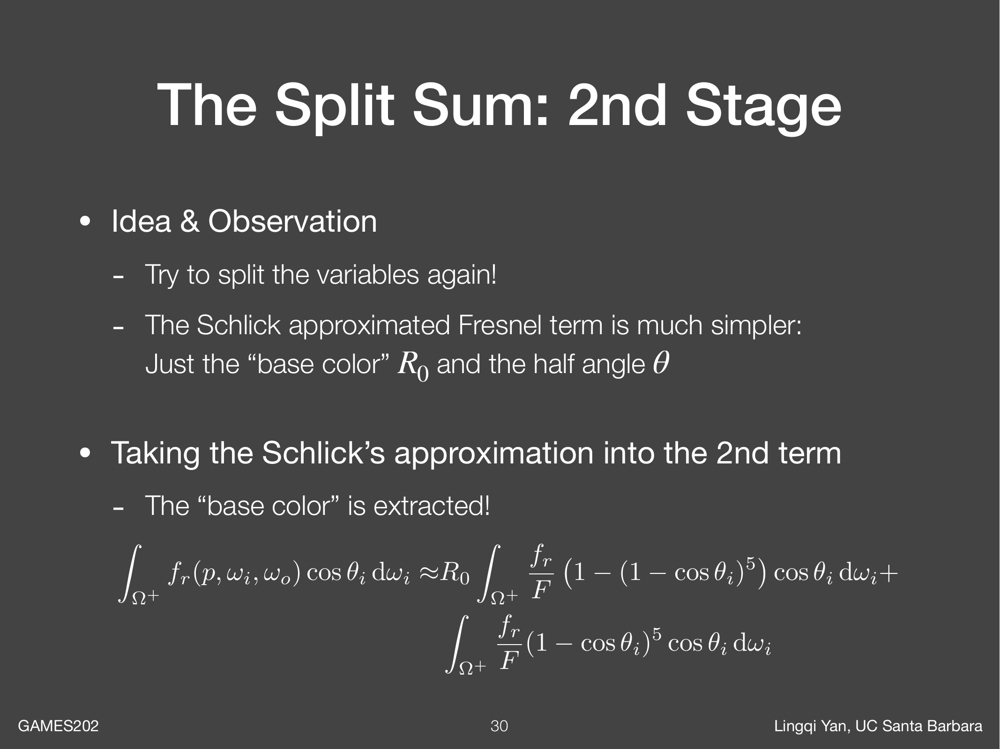

定义去掉 Fresnel 后的部分：

$$
K
\left(
\omega_i,\omega_o
\right)
=
\frac{
G(\omega_i,\omega_o,\mathbf{h})\,
D(\mathbf{h})
}{
4
(\mathbf{n}\cdot\omega_i)
(\mathbf{n}\cdot\omega_o)
}.
$$

于是：

$$
f_r
=
F(c)K.
$$

代入 Schlick 分解：

$$
\begin{aligned}
I_{\mathrm{BRDF}}
={}&
\int_{\Omega^+}
F(c)K
\max(0,\mathbf{n}\cdot\omega_i)
\mathrm{d}\omega_i\\
\approx{}&
F_0
\int_{\Omega^+}
K
\left[
1-(1-c)^5
\right]
\max(0,\mathbf{n}\cdot\omega_i)
\mathrm{d}\omega_i\\
&+
\int_{\Omega^+}
K
(1-c)^5
\max(0,\mathbf{n}\cdot\omega_i)
\mathrm{d}\omega_i.
\end{aligned}
$$

把两个积分记为 `A` 和 `B`：

$$
A
\left(
\alpha,\mu_v
\right)
=
\int_{\Omega^+}
K
\left[
1-(1-c)^5
\right]
\max(0,\mathbf{n}\cdot\omega_i)
\mathrm{d}\omega_i,
$$

$$
B
\left(
\alpha,\mu_v
\right)
=
\int_{\Omega^+}
K
(1-c)^5
\max(0,\mathbf{n}\cdot\omega_i)
\mathrm{d}\omega_i,
$$

其中：

$$
\mu_v
=
\max
\left(
0,
\mathbf{n}\cdot\omega_o
\right).
$$

最终：

$$
\boxed{
I_{\mathrm{BRDF}}
\approx
F_0 A+B
}.
$$

在各向同性微表面 BRDF 下，固定模型和参数化方式后，`A` 与 `B` 主要只依赖：

- 粗糙度 `alpha`；
- 观察角余弦 `NdotV`。

## 23. 二维 BRDF LUT

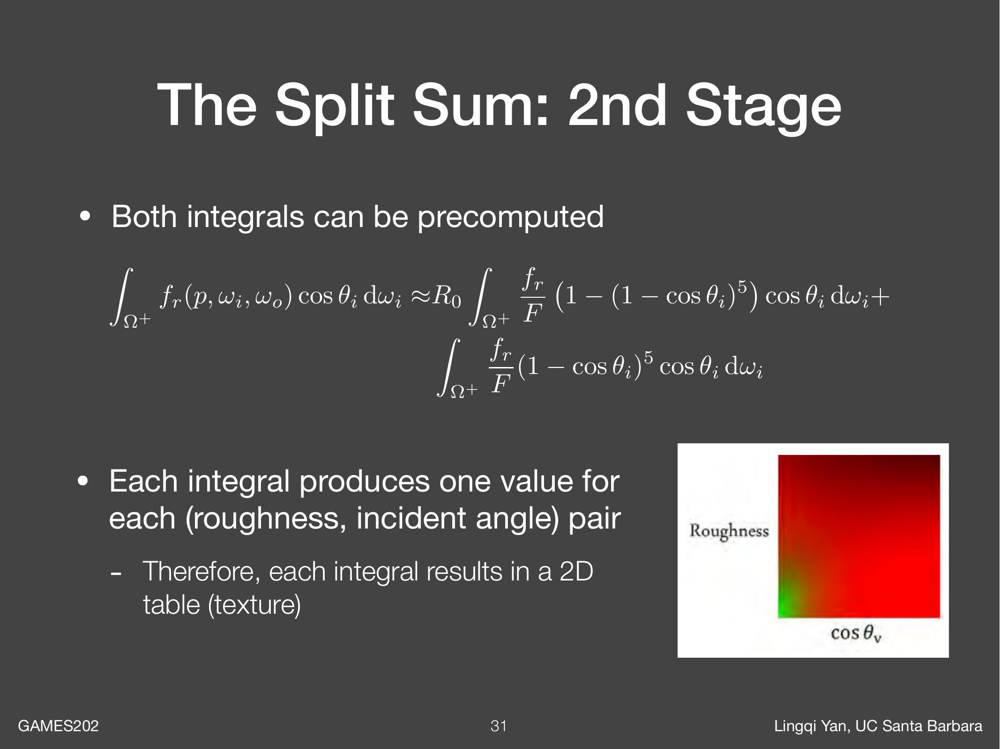

因为 `A` 和 `B` 都只需要两个输入，所以可以预计算为一张二维纹理：

$$
\operatorname{BRDFLUT}
\left(
\mu_v,\alpha
\right)
=
\left(
A,B
\right).
$$

常见存储方式：

- R 通道保存 `A`；
- G 通道保存 `B`；
- 横轴保存 `NdotV`；
- 纵轴保存 roughness。

运行时只需一次二维纹理查询：

$$
(A,B)
=
\operatorname{texture}
\left(
\operatorname{BRDFLUT},
(\mu_v,\alpha)
\right).
$$

这张 LUT 与具体环境贴图无关，因此同一个 BRDF 模型可以在多个场景中复用。

但它与以下选择有关：

- 使用的 NDF；
- 几何遮蔽函数；
- roughness 到分布参数的映射；
- 采样和积分约定；
- 是否包含多次散射能量补偿。

不能随意把一种管线生成的 LUT 与另一种 BRDF 实现混用。

## 24. 最终 Split Sum 公式

第一阶段提供：

$$
L_{\mathrm{prefilter}}
\left(
\mathbf{r},\alpha
\right).
$$

第二阶段提供：

$$
F_0 A(\alpha,\mu_v)
+
B(\alpha,\mu_v).
$$

最终镜面环境光照近似为：

$$
\boxed{
L_{o,\mathrm{spec}}
\approx
L_{\mathrm{prefilter}}
\left(
\mathbf{r},\alpha
\right)
\left[
F_0 A(\alpha,\mu_v)
+
B(\alpha,\mu_v)
\right]
}.
$$

如果 `F0` 和预过滤环境光都是 RGB，而 `A`、`B` 是标量，则运算按颜色通道进行。

运行时只需要：

1. 计算反射方向 `r`；
2. 根据 roughness 查询预过滤 Cube Map；
3. 用 `NdotV` 与 roughness 查询二维 BRDF LUT；
4. 计算 `prefiltered * (F0 * A + B)`。

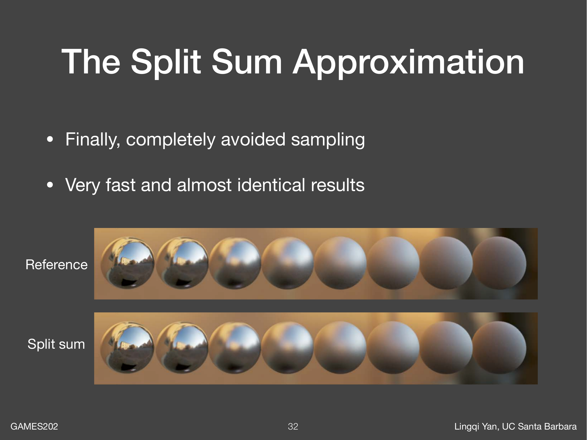

课件中的结果表明，Split Sum 与参考积分非常接近，但运行成本显著降低。

## 25. 漫反射环境光照

对理想 Lambert 漫反射：

$$
f_d
=
\frac{
\rho_d
}{
\pi
}.
$$

漫反射环境光照为：

$$
L_{o,\mathrm{diff}}
=
\frac{
\rho_d
}{
\pi
}
\int_{\Omega^+}
L_{\mathrm{env}}(\omega_i)
\max(0,\mathbf{n}\cdot\omega_i)
\mathrm{d}\omega_i.
$$

括号中的积分称为 irradiance：

$$
E(\mathbf{n})
=
\int_{\Omega^+}
L_{\mathrm{env}}(\omega_i)
\max(0,\mathbf{n}\cdot\omega_i)
\mathrm{d}\omega_i.
$$

可以把环境贴图与余弦核预卷积成低频 Irradiance Map，运行时沿法线方向查询：

$$
L_{o,\mathrm{diff}}
\approx
\frac{
\rho_d
}{
\pi
}
E(\mathbf{n}).
$$

因此常见实时 IBL 会准备两类资源：

- Diffuse Irradiance Map；
- Specular Prefiltered Environment Map 与 BRDF LUT。

## 26. 为什么叫 Split Sum

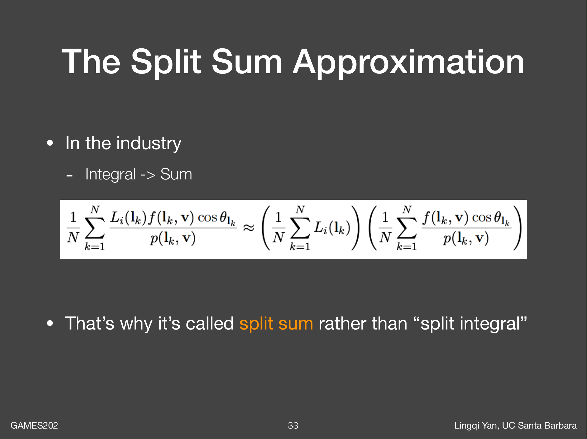

数学推导写成积分，但工业渲染最终会通过离散采样近似积分。

原始 Monte Carlo 求和可以抽象为：

$$
\frac{1}{N}
\sum_{j=1}^{N}
L_j B_j.
$$

Split Sum 把它近似拆成两个可以独立预计算的部分：

$$
\left(
\frac{1}{N}
\sum_{j=1}^{N}
L_j
\right)
\left(
\frac{1}{N}
\sum_{j=1}^{N}
B_j
\right).
$$

这就是 Split Sum 名称的来源，而不是 Split Integral。

这里同样要记住：

$$
\frac{1}{N}\sum L_jB_j
\ne
\left(
\frac{1}{N}\sum L_j
\right)
\left(
\frac{1}{N}\sum B_j
\right)
$$

一般并不严格相等。它依赖前面讨论的平滑性、支撑范围与弱相关近似。

## 27. Split Sum 没有解决环境阴影

本讲推导时明确暂时去掉了 visibility。完整环境光照应为：

$$
L_o
=
\int_{\Omega^+}
L_{\mathrm{env}}(\omega_i)\,
V(\mathbf{p},\omega_i)\,
f_r(\mathbf{p},\omega_i,\omega_o)\,
\max(0,\mathbf{n}\cdot\omega_i)
\mathrm{d}\omega_i.
$$

Split Sum 处理的是无阴影环境光照：

$$
V(\mathbf{p},\omega_i)=1.
$$

环境光来自整个半球，不像一个点光源只有一个主要方向。若要精确加入阴影，就需要对许多方向知道可见性，而且 visibility 还随空间位置变化，不能只存在一张远处环境贴图里。

因此直接使用 IBL 容易出现：

- 室内仍被室外 HDRI 过度照亮；
- 凹槽和接触区域缺少遮蔽；
- 物体像漂浮在环境中；
- 反射中出现本应被局部几何挡住的亮光源。

常见补偿方法包括：

- Ambient Occlusion；
- Bent Normal；
- Reflection Probe 与局部遮挡体积；
- Screen-Space Reflection；
- Ray-Traced Reflection；
- 实时全局光照。

这些方法都在尝试补回 Split Sum 中被省略的空间可见性。

## 28. GLSL 风格运行时代码

镜面 IBL：

```glsl
vec3 evaluateSpecularIBL(
    vec3 normal,
    vec3 viewDir,
    vec3 f0,
    float roughness)
{
    float nDotV = max(dot(normal, viewDir), 0.0);
    vec3 reflectionDir = reflect(-viewDir, normal);

    float lod = roughness * maxEnvironmentMip;
    vec3 prefiltered = textureLod(
        prefilteredEnvironment,
        reflectionDir,
        lod
    ).rgb;

    vec2 brdf = texture(
        brdfLUT,
        vec2(nDotV, roughness)
    ).rg;

    return prefiltered * (f0 * brdf.x + brdf.y);
}
```

漫反射 IBL：

```glsl
vec3 evaluateDiffuseIBL(
    vec3 normal,
    vec3 diffuseColor)
{
    vec3 irradiance = texture(
        irradianceEnvironment,
        normal
    ).rgb;

    return diffuseColor * irradiance;
}
```

金属度工作流中常见的组合：

```glsl
vec3 f0 = mix(vec3(0.04), baseColor, metalness);
vec3 diffuseColor = baseColor * (1.0 - metalness);

vec3 diffuse = evaluateDiffuseIBL(normal, diffuseColor);
vec3 specular = evaluateSpecularIBL(
    normal,
    viewDir,
    f0,
    roughness
);

vec3 color = diffuse + specular;
```

这只是核心结构。实际 PBR 管线还会处理：

- sRGB 与线性空间；
- HDR 格式和曝光；
- Tone Mapping；
- 能量守恒；
- 多次散射补偿；
- AO 对 diffuse 和 specular 的不同影响；
- Probe 混合与视差修正。

## 29. 实现与调试清单

### 29.1 距离场

- 可视化 SDF 切片，确认表面附近连续；
- 检查物体外部为正、内部为负的符号约定；
- 用简单球体验证距离值是否正确；
- 检查非均匀缩放是否破坏距离；
- 将步数、最小距离和最终 visibility 分别可视化；
- 对薄片、小物体和接触位置进行重点测试；
- 给射线起点加入法线偏移，避免自阴影。

### 29.2 环境贴图

- 确认 HDR 环境纹理以线性空间读取；
- 检查 Cube Map 六个面的方向与上下翻转；
- 检查接缝处是否使用无缝 Cube Map 采样；
- 用纯色环境图验证亮度守恒；
- 用单个高亮区域验证反射方向是否正确；
- 用不同 roughness 检查 MIP 变化是否连续。

### 29.3 BRDF LUT

- LUT 的横纵轴顺序必须和着色器一致；
- `NdotV` 与 roughness 都应限制到合法范围；
- LUT 必须与当前 NDF、几何项和 roughness 映射匹配；
- 检查 roughness 是否在材质导入时被平方过；
- 用固定 `F0` 对比高样本数参考积分；
- 检查掠射角是否出现异常过亮、黑边或 NaN。

### 29.4 最终显示

- 在线性 HDR 空间完成光照累加；
- 在最后阶段执行曝光和 Tone Mapping；
- 不要把 Tone-Mapped 环境图拿去做光照积分；
- 检查是否重复应用 Gamma；
- 暂时关闭 AO、阴影和后处理，单独验证 IBL。

## 30. 常见误解

### 30.1 “环境贴图就是物体的反射颜色”

不准确。环境贴图表示方向上的入射辐射度。最终颜色还取决于 BRDF、法线、观察方向、粗糙度和积分。

### 30.2 “roughness 只是把最终画面模糊”

不是。roughness 改变微表面法线分布和 BRDF 波瓣范围。预过滤环境贴图是在方向域中平均入射光，而不是对屏幕颜色做后处理模糊。

### 30.3 “Split Sum 是严格等式”

不是。它来自乘积积分的近似拆分。环境中高频光源与 BRDF 波瓣强烈相关时，误差会增大。

### 30.4 “有预过滤 Cube Map 就不需要 BRDF LUT”

预过滤 Cube Map 只近似第一阶段的环境平均。Fresnel、几何遮蔽和观察角影响仍需要第二阶段的 LUT。

### 30.5 “一张 BRDF LUT 适用于所有 PBR 实现”

不一定。LUT 与 NDF、几何函数、roughness 参数化和积分约定绑定。

### 30.6 “Split Sum 自动产生环境阴影”

不会。本讲推导暂时令 visibility 为 1。AO、反射遮挡或 GI 需要另外处理。

### 30.7 “Sphere Tracing 永远不会穿过物体”

只有在查询值是保守安全距离时才成立。过度估计距离、低分辨率场、非均匀缩放和错误组合都会造成穿透。

## 31. 方法对比

| 方法 | 预计算数据 | 运行时核心操作 | 优点 | 主要限制 |
| --- | --- | --- | --- | --- |
| Shadow Map / PCSS | 光源深度图 | 深度比较与过滤 | 适合光栅场景、动态几何 | 大核采样昂贵，依赖光源视图 |
| SDF Soft Shadow | 二维或三维距离场 | Sphere Tracing 与最小角度 | 半影平滑、自适应步长 | 存储高，动态更新困难 |
| Monte Carlo IBL | 原始环境贴图 | 多方向随机采样 | 通用、可逐步收敛 | 实时低样本噪声大 |
| Split Sum IBL | 预过滤环境图与 BRDF LUT | 固定纹理查询 | 快、稳定、工业常用 | 是近似，默认缺少 visibility |

## 32. 学完本讲后应该能回答的问题

1. SDF 的数值与零等值面分别表示什么？
2. 为什么 SDF 值可以作为 Sphere Tracing 的安全步长？
3. 距离估计过高与过低分别会带来什么后果？
4. SDF 软阴影为什么使用“距离除以已前进距离”？
5. 为什么要取整条阴影射线上的最小安全角度？
6. `k_soft` 增大时，阴影为什么会变硬？
7. 环境贴图表示颜色纹理还是方向上的入射光？
8. 为什么实时着色器不适合为每个像素使用大量 Monte Carlo 样本？
9. 经典乘积积分近似在什么情况下比较可靠？
10. Split Sum 第一阶段预计算什么？
11. roughness 为什么可以映射到预过滤环境图的 MIP 层级？
12. Schlick Fresnel 如何把 `F0` 从 BRDF 积分中拆出来？
13. BRDF LUT 的两个输入和两个输出分别是什么？
14. 最终 Specular IBL 公式由哪两次纹理查询组成？
15. 为什么 Split Sum 本身不能产生环境光阴影？

## 33. 一页总结

SDF 软阴影的核心是：

$$
\boxed{
\text{SDF 提供安全步长}
\quad+\quad
\text{沿途最小安全角度提供半影}
}.
$$

运行时近似为：

$$
V
\approx
\min_k
\operatorname{clamp}
\left(
k_{\mathrm{soft}}
\frac{
\operatorname{SDF}(\mathbf{p}_k)
}{
\left\|
\mathbf{p}_k-\mathbf{o}
\right\|
},
0,
1
\right).
$$

环境光照的原始问题是：

$$
L_o
=
\int_{\Omega^+}
L_{\mathrm{env}}\,
f_r\,
\cos\theta_i\,
\mathrm{d}\omega_i.
$$

Split Sum 把它近似拆成：

$$
\boxed{
\text{预过滤环境光}
\times
\text{预积分 BRDF}
}.
$$

最终镜面 IBL 为：

$$
\boxed{
L_{o,\mathrm{spec}}
\approx
L_{\mathrm{prefilter}}
\left(
\mathbf{r},\alpha
\right)
\left[
F_0A(\alpha,\mu_v)
+
B(\alpha,\mu_v)
\right]
}.
$$

第一部分保存在预过滤 Cube Map 中，第二部分保存在二维 BRDF LUT 中。运行时不再对半球进行大量采样，只需要固定数量的纹理查询。

## 34. 下一讲预告

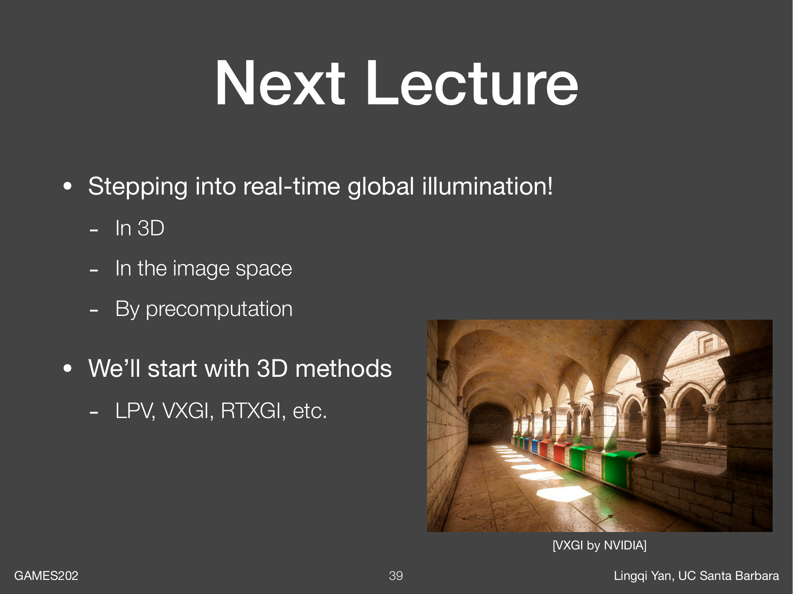

下一讲开始进入 Real-Time Global Illumination：

- 三维空间中的实时 GI；
- 图像空间中的实时 GI；
- 预计算全局光照；
- LPV；
- VXGI；
- RTXGI。

Lecture 5 中被暂时省略的环境光可见性，会在后续全局光照、空间遮挡与光照传播方法中继续处理。
