# GAMES202 Lecture 06：预计算辐射传输

> 视频：<https://www.bilibili.com/video/BV1YK4y1T7yY?p=6>  
> 课程主页：<https://sites.cs.ucsb.edu/~lingqi/teaching/games202.html>  
> 官方课件：<https://sites.cs.ucsb.edu/~lingqi/teaching/resources/GAMES202_Lecture_06.pdf>  
> 本讲主题：Real-Time Environment Mapping - Precomputed Radiance Transfer。重点是环境光阴影、频率与滤波、Spherical Harmonics，以及 PRT 如何把带可见性的环境光积分变成运行时点积。

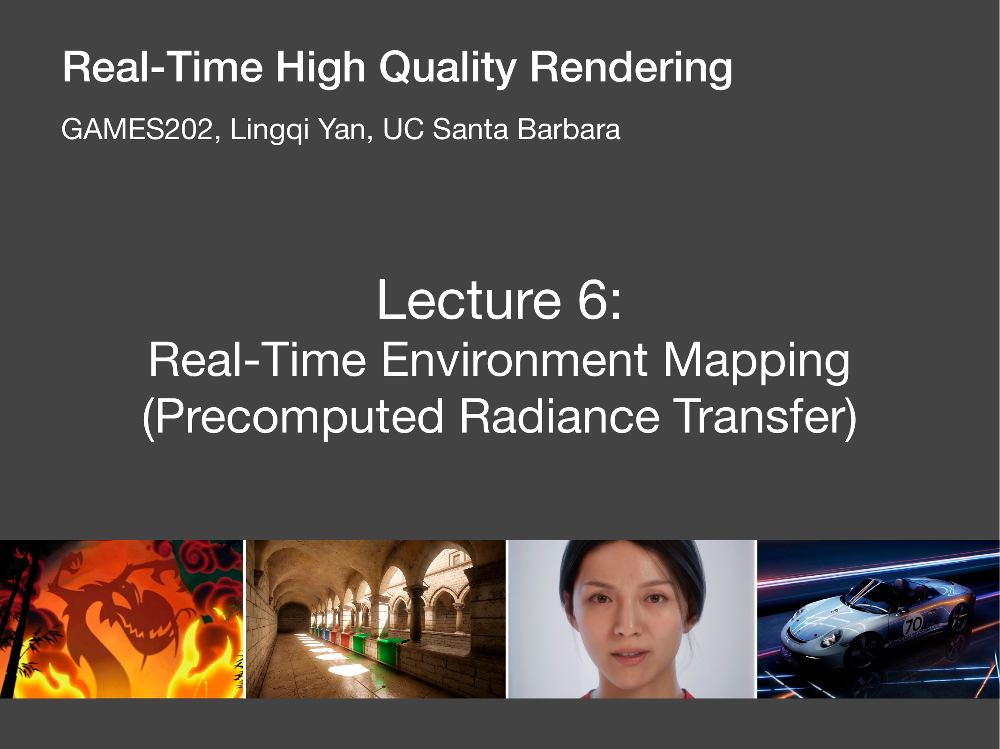

## 1. 从 Split Sum 到 PRT

Lecture 5 的 Split Sum 能非常快地计算无阴影环境光照：

$$
L_o
\approx
L_{\mathrm{prefilter}}
\left(
\mathbf{r},\alpha
\right)
\left[
F_0 A+B
\right].
$$

但推导时暂时令可见性恒为 1：

$$
V
\left(
\mathbf{p},\omega_i
\right)
=
1.
$$

完整的环境光照应为：

$$
L_o
\left(
\mathbf{p},\omega_o
\right)
=
\int_{\Omega^+}
L_i(\omega_i)\,
V(\mathbf{p},\omega_i)\,
f_r(\mathbf{p},\omega_i,\omega_o)\,
\max
\left(
0,
\mathbf{n}\cdot\omega_i
\right)
\mathrm{d}\omega_i.
$$

Lecture 6 要回答：

> 能否保留环境光的方向变化、阴影，甚至间接光，同时仍然让运行时计算足够便宜？

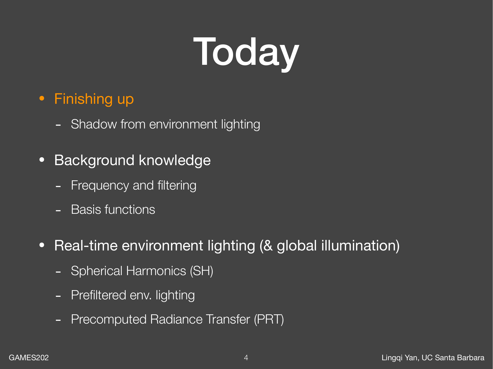

本讲路线为：

1. 解释环境光阴影为什么难；
2. 回顾频率、滤波和卷积；
3. 用基函数表示方向函数；
4. 将 Fourier 思想推广到球面上的 Spherical Harmonics；
5. 利用漫反射的低通性质压缩环境光；
6. 把静态场景的光传输预计算到 SH 空间；
7. 运行时用点积完成动态环境光重照明。

## 2. 环境光阴影为什么难

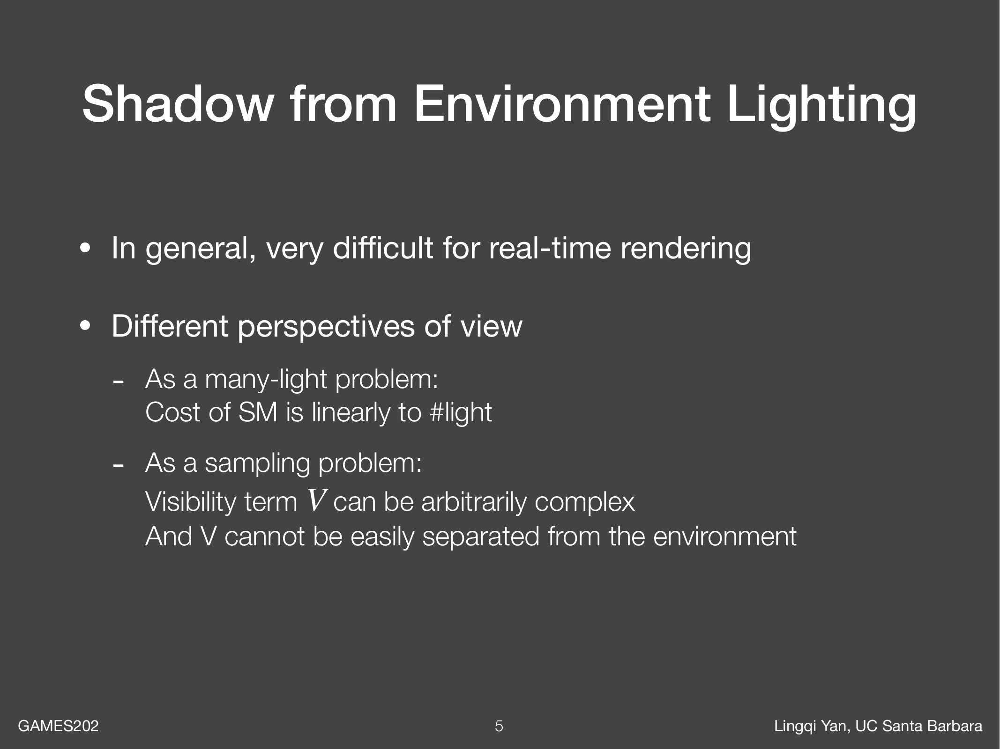

### 2.1 把环境贴图看成许多光源

环境贴图的每个 texel 都可以看成一个方向光源。

若环境贴图离散为 `N` 个方向，对每个方向生成一张 Shadow Map，成本大致随方向数量线性增长：

$$
C_{\mathrm{shadow}}
\propto
N.
$$

即使只有一个 `64 x 64` 的 Cube Map：

$$
N
=
6\times64\times64
=
24576.
$$

为两万多个方向分别生成阴影显然不现实。

### 2.2 把它看成采样问题

对于固定表面点，visibility 是球面方向函数：

$$
V_{\mathbf{p}}(\omega)
\in
\left\{
0,1
\right\}.
$$

几何边界会让它在方向空间中突然从 0 跳到 1，因此它可能包含很高频、很复杂的变化。

环境贴图也可能包含小而亮的光源。此时 `L_i` 与 `V` 的方向变化强烈相关，不能简单写成：

$$
\int L_i V\,\mathrm{d}\omega
\approx
\left(
\int L_i\,\mathrm{d}\omega
\right)
\left(
\int V\,\mathrm{d}\omega
\right).
$$

亮光方向是否恰好被挡住，对结果影响极大。只知道“平均可见比例”是不够的。

## 3. 工业方法与研究方向

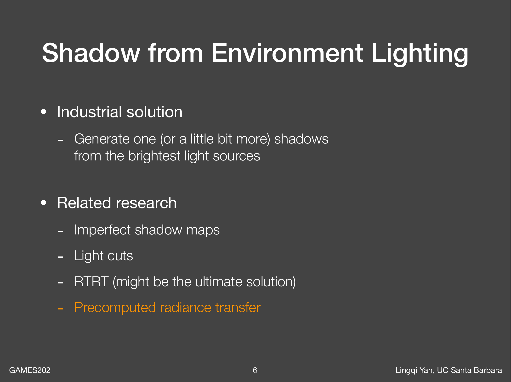

常见工业近似是：

1. 从环境贴图中寻找最亮的一个或少数几个方向；
2. 把它们当作主要方向光；
3. 只为这些方向生成阴影；
4. 剩余低频环境光使用无阴影 IBL、AO 或 Probe 近似。

它不能完整还原环境可见性，但能把预算集中到最显眼的阴影上。

课件列出的研究方向包括：

- Imperfect Shadow Maps；
- Lightcuts；
- Real-Time Ray Tracing；
- Precomputed Radiance Transfer。

本讲选择 PRT：把静态几何导致的传输过程提前算好，以较低的运行时成本支持动态、低频环境光。

## 4. 为什么要先讲频率

环境光、visibility、BRDF 和余弦项都是定义在方向上的函数。

如果直接保存每个方向的函数值，需要大量数据。频率分析提供了另一条路：

- 低频函数变化缓慢，可以用少量参数表示；
- 高频函数变化快速，需要更多参数；
- 滤波会压低某些频率；
- 如果光传输只保留低频，就可以只保存低频系数。

PRT 的效率来自一个事实：

> 漫反射与余弦项天然是低通滤波器，很多高频环境细节在积分后会被显著削弱。

## 5. Fourier 展开：用简单波形表示函数

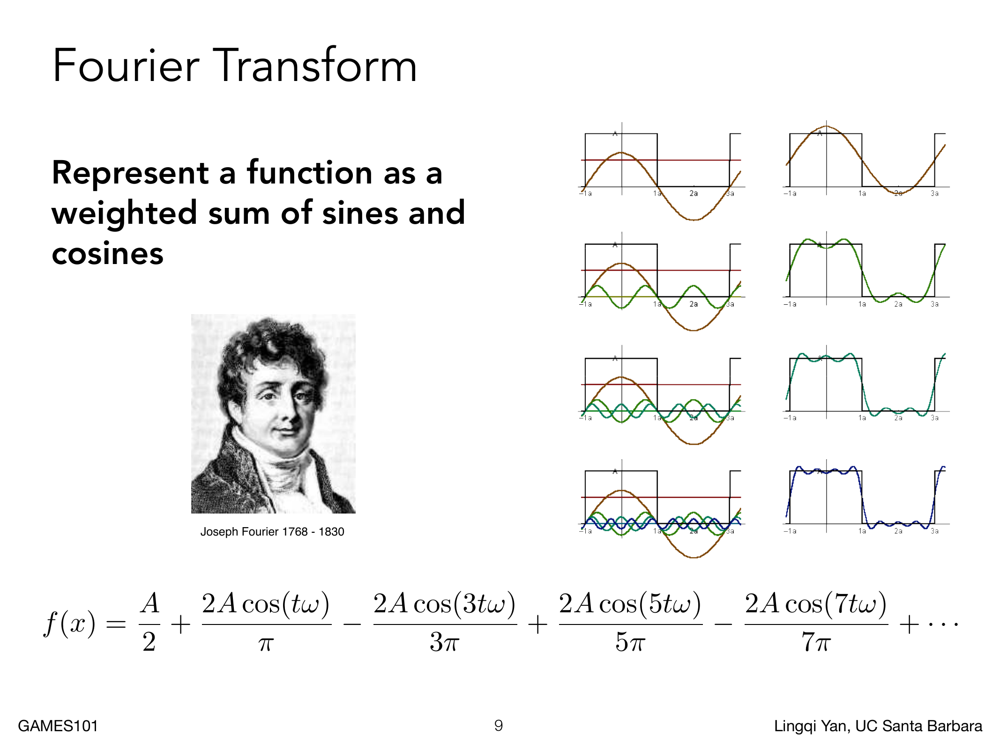

周期函数可以展开成一组正弦和余弦的加权和：

$$
f(x)
=
\frac{a_0}{2}
+
\sum_{k=1}^{\infty}
\left[
a_k\cos(k\omega_0x)
+
b_k\sin(k\omega_0x)
\right].
$$

每个正弦或余弦都是一个基函数：

- 低 `k` 表示低频，变化缓慢；
- 高 `k` 表示高频，变化迅速；
- 系数表示原函数含有多少对应频率。

若只保留低频项：

$$
\tilde f(x)
=
\frac{a_0}{2}
+
\sum_{k=1}^{K}
\left[
a_k\cos(k\omega_0x)
+
b_k\sin(k\omega_0x)
\right],
$$

重建结果会更平滑，同时丢失尖锐边缘。

## 6. 图像中的高频与低频

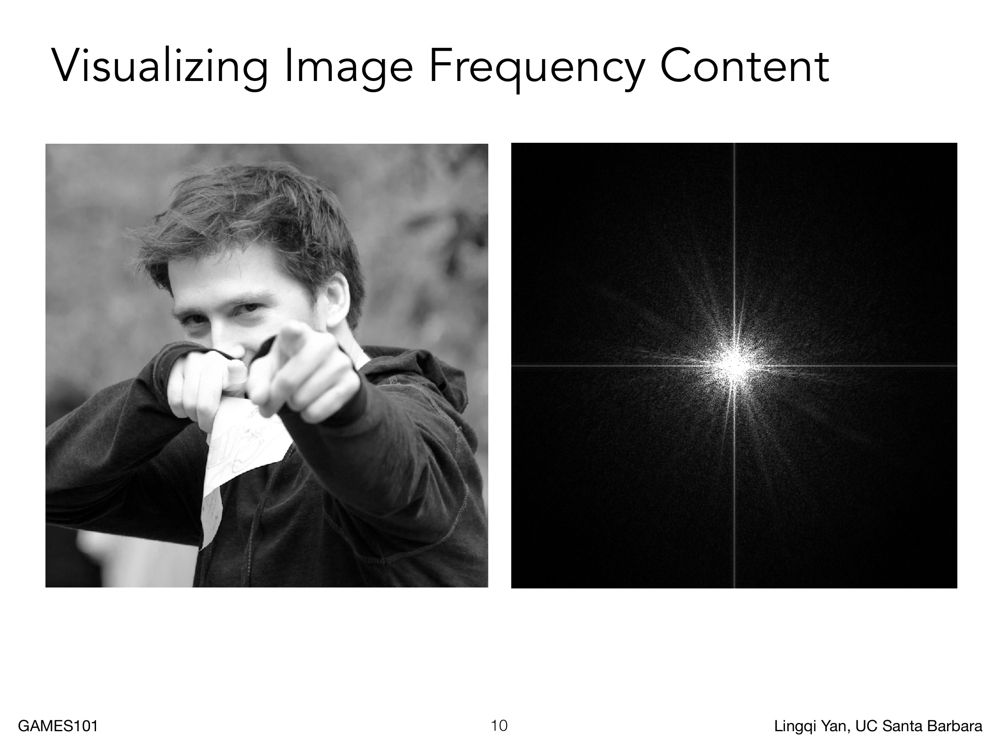

图像可以看作二维函数。

低频内容：

- 大块缓慢变化的明暗；
- 平滑渐变；
- 模糊轮廓；
- 大尺度结构。

高频内容：

- 锐利边缘；
- 细密纹理；
- 小而亮的高光；
- 噪声；
- 阴影边界。

频谱中心通常对应低频，远离中心的部分对应更高频。图像中方向性明显的边缘，也会在频谱中产生方向结构。

## 7. 滤波就是保留或删除频率

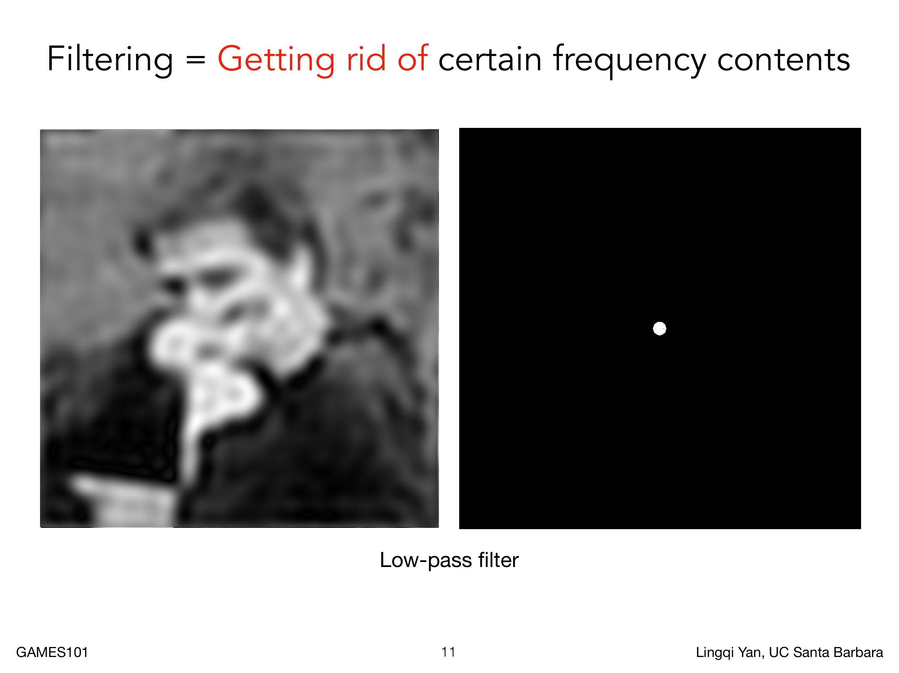

低通滤波器保留低频、抑制高频，因此结果变模糊：

$$
\text{Low Pass}
\quad\Longrightarrow\quad
\text{保留缓慢变化，删除快速变化}.
$$

高通滤波器则强调边缘和细节。

漫反射环境光照中，一个方向的入射光会被整个上半球积分。这个大范围平均过程会削弱小尺度方向变化，所以漫反射表现为低通。

## 8. 卷积定理

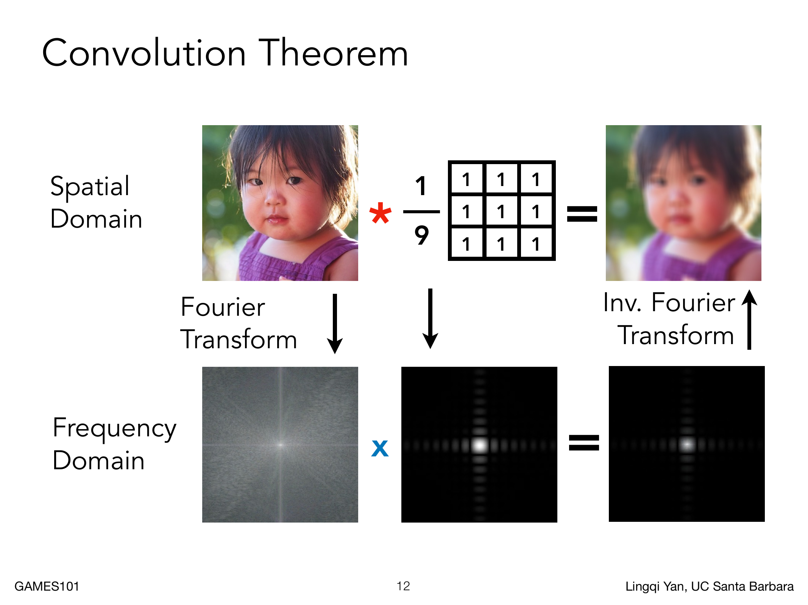

空间域卷积定义为：

$$
(f*g)(x)
=
\int
f(t)g(x-t)
\mathrm{d}t.
$$

卷积定理说明：

$$
\mathcal{F}
\left\{
f*g
\right\}
=
\mathcal{F}\{f\}
\cdot
\mathcal{F}\{g\}.
$$

也就是：

> 空间域做卷积，等价于频率域逐频率相乘。

反过来：

$$
\mathcal{F}
\left\{
f\,g
\right\}
=
\mathcal{F}\{f\}
*
\mathcal{F}\{g\}.
$$

这让我们可以从滤波器的频谱直接判断它会保留哪些频率。

## 9. 从乘积积分理解滤波

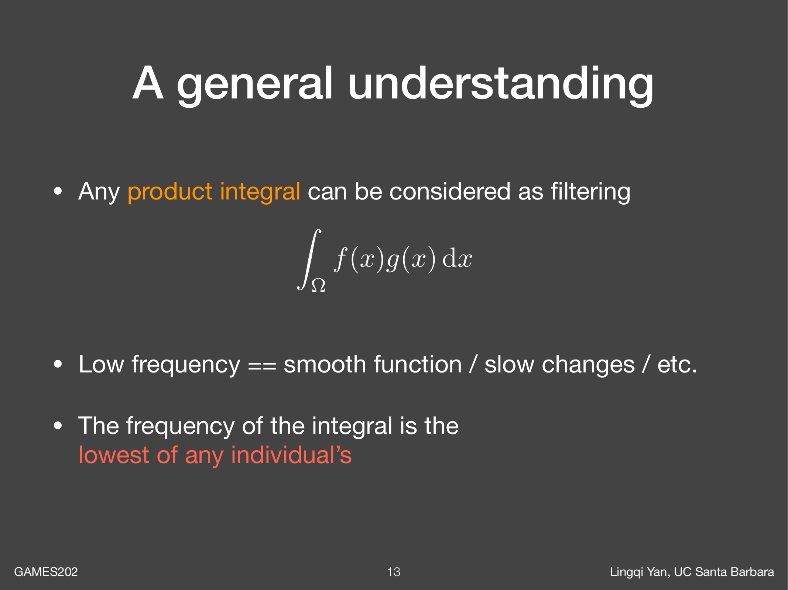

很多渲染计算都具有乘积积分形式：

$$
I
=
\int_{\Omega}
f(x)g(x)
\mathrm{d}x.
$$

它是两个函数的内积。若把其中一个函数平移后再计算，就会得到相关或卷积，所以可以从滤波角度理解。

在渲染方程中：

$$
f(\omega)
=
L_i(\omega),
$$

$$
g(\omega)
=
V(\omega)
f_r(\omega,\omega_o)
\max
\left(
0,
\mathbf{n}\cdot\omega
\right).
$$

如果 `g` 是低通核，`L_i` 的高频部分对最终积分贡献会被削弱。于是没有必要用大量参数精确保存那些最后几乎会被过滤掉的频率。

课件用“最终积分能保留的频率受到最低频因素限制”建立直觉。更严格地说，具体频谱由乘法、卷积与积分共同决定；这里的工程结论是：强低通传输允许使用低阶基函数近似。

## 10. 基函数：把函数变成系数向量

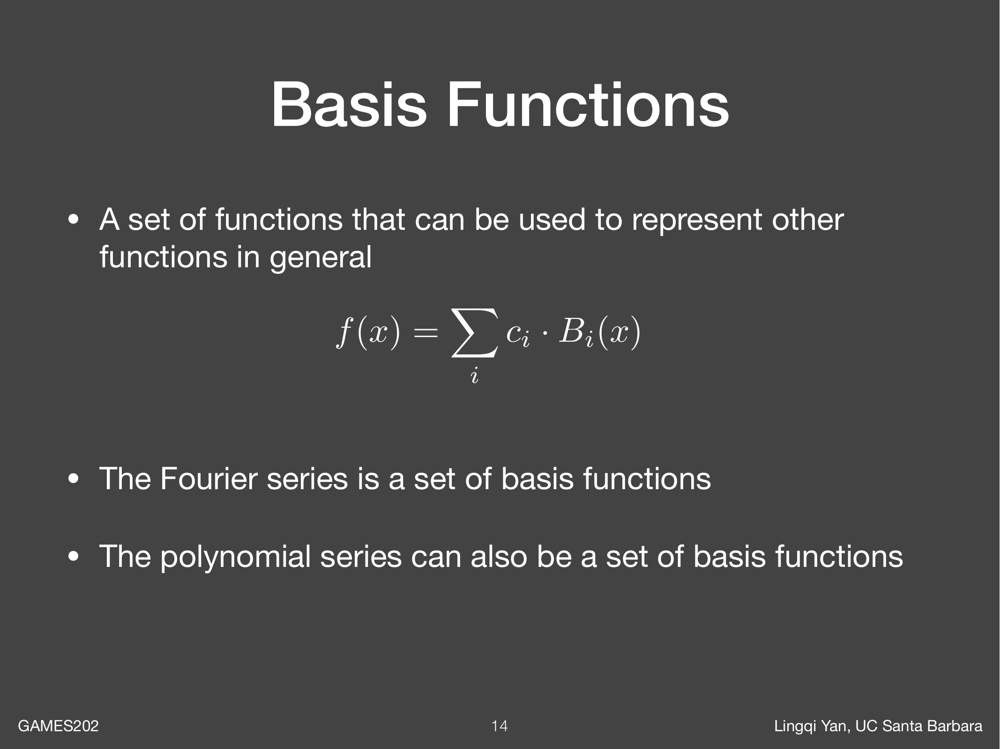

选择一组基函数：

$$
B_0(x),
B_1(x),
\ldots,
B_{K-1}(x).
$$

函数可以近似写成：

$$
f(x)
\approx
\sum_{i=0}^{K-1}
c_i B_i(x).
$$

原本连续的函数被表示为系数向量：

$$
\mathbf{c}
=
\begin{bmatrix}
c_0&
c_1&
\cdots&
c_{K-1}
\end{bmatrix}^{\mathsf T}.
$$

使用更多基函数：

- 表达能力更强；
- 能保留更高频细节；
- 存储与计算成本更高。

使用更少基函数：

- 数据紧凑；
- 计算更快；
- 只保留低频；
- 尖锐变化会被平滑。

PRT 要做的就是选择适合球面方向函数的基函数，并让积分在系数空间中变成点积。

## 11. Spherical Harmonics 是球面上的 Fourier

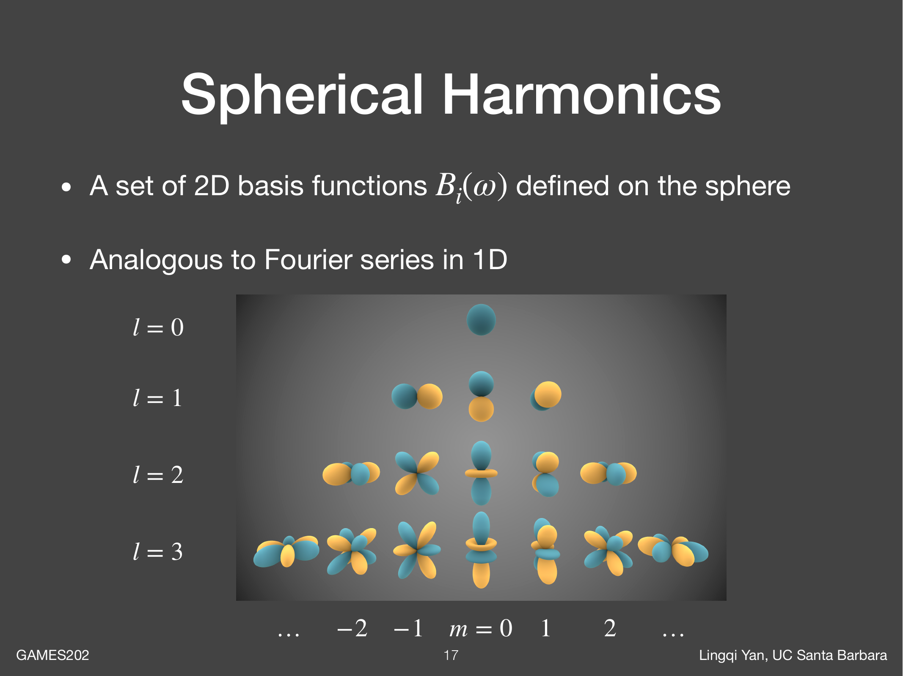

Spherical Harmonics，简称 SH，是定义在单位球面上的一组正交基函数：

$$
Y_l^m(\omega).
$$

索引满足：

$$
l=0,1,2,\ldots,
$$

$$
-l\le m\le l.
$$

其中：

- `l` 表示 band，也可理解为频率层级；
- `m` 表示同一 band 内的不同方向模式；
- `l` 越高，球面上的正负变化越复杂。

每个 band 含有：

$$
2l+1
$$

个基函数。

保留从 0 到 `L` 的所有 band，总系数数为：

$$
K
=
\sum_{l=0}^{L}
(2l+1)
=
(L+1)^2.
$$

所以：

| 最高 band | 系数数量 |
| --- | --- |
| 0 | 1 |
| 1 | 4 |
| 2 | 9 |
| 3 | 16 |
| 4 | 25 |

有些资料把“保留到 `l = 2`”称为二阶 SH，也有资料称为三 band SH。阅读实现时最好直接确认系数数量。

课件基函数图中的两种颜色表示函数值的正负，不是实际光照颜色。

## 12. SH 投影与重建

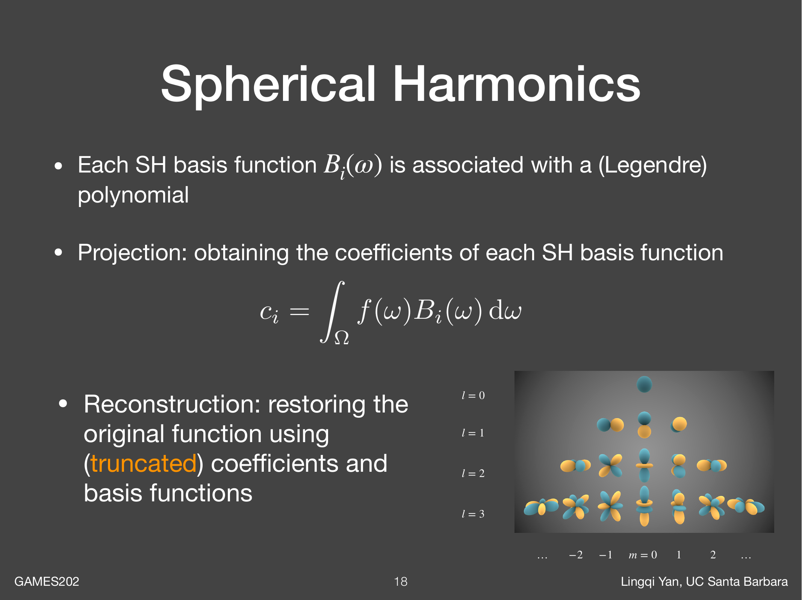

将球面函数 `f` 投影到 SH 基：

$$
f_l^m
=
\int_{\mathbb{S}^2}
f(\omega)
Y_l^m(\omega)
\mathrm{d}\omega.
$$

得到的 `f_lm` 就是 SH 系数。

用有限阶系数重建：

$$
\tilde f(\omega)
=
\sum_{l=0}^{L}
\sum_{m=-l}^{l}
f_l^m
Y_l^m(\omega).
$$

若使用无限阶并满足适当条件，可以完整恢复原函数。实时渲染只保留有限阶，因此得到低频近似。

### 12.1 数值投影

对于离散球面样本：

$$
f_l^m
\approx
\sum_{s=1}^{N}
f(\omega_s)
Y_l^m(\omega_s)
w_s.
$$

`w_s` 是该样本代表的球面立体角。

对经纬度环境贴图，不能给每个 texel 相同权重，因为靠近两极的 texel 覆盖更小的立体角。

## 13. 正交归一为什么重要

SH 满足：

$$
\int_{\mathbb{S}^2}
Y_l^m(\omega)
Y_{l'}^{m'}(\omega)
\mathrm{d}\omega
=
\delta_{ll'}
\delta_{mm'}.
$$

这里 Kronecker delta 定义为：

$$
\delta_{ab}
=
\begin{cases}
1,&a=b,\\
0,&a\ne b.
\end{cases}
$$

不同基函数的内积为 0，同一基函数与自身的内积为 1。

这带来一个极重要的性质。若

$$
f(\omega)
\approx
\sum_i f_iB_i(\omega),
$$

$$
g(\omega)
\approx
\sum_i g_iB_i(\omega),
$$

则：

$$
\int_{\mathbb{S}^2}
f(\omega)g(\omega)
\mathrm{d}\omega
\approx
\sum_i f_i g_i.
$$

连续球面积分被化成系数向量点积：

$$
\boxed{
\langle f,g\rangle
\approx
\mathbf{f}^{\mathsf T}\mathbf{g}
}.
$$

这就是 PRT 运行时很快的数学基础。

## 14. 预过滤与多次查询

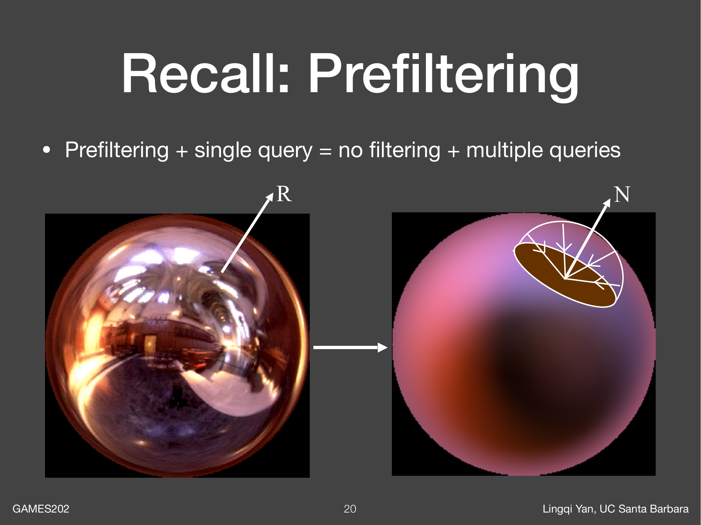

不预过滤时，为了计算一个宽 BRDF 或漫反射结果，需要查询环境贴图中许多方向。

预过滤时，提前把这些方向的积分写入一个新函数：

$$
F_{\mathrm{prefilter}}(\mathbf{n})
=
\int_{\mathbb{S}^2}
L(\omega)
K(\mathbf{n},\omega)
\mathrm{d}\omega.
$$

运行时沿 `n` 查询一次即可。

因此：

$$
\boxed{
\text{预过滤}+\text{一次查询}
\approx
\text{原始数据}+\text{多次查询}
}.
$$

SH 提供了另一种预过滤表示：在频率系数上直接乘以滤波核系数。

## 15. 漫反射 irradiance 是球面卷积

漫反射 irradiance 为：

$$
E(\mathbf{n})
=
\int_{\mathbb{S}^2}
L(\omega)
\max
\left(
0,
\mathbf{n}\cdot\omega
\right)
\mathrm{d}\omega.
$$

这里的 clamped cosine 核为：

$$
K_{\mathbf{n}}(\omega)
=
\max
\left(
0,
\mathbf{n}\cdot\omega
\right).
$$

当法线 `n` 变化时，相当于在球面上旋转同一个核，因此 irradiance 是环境光与 clamped cosine 的球面卷积。

## 16. SH 空间中的解析 irradiance

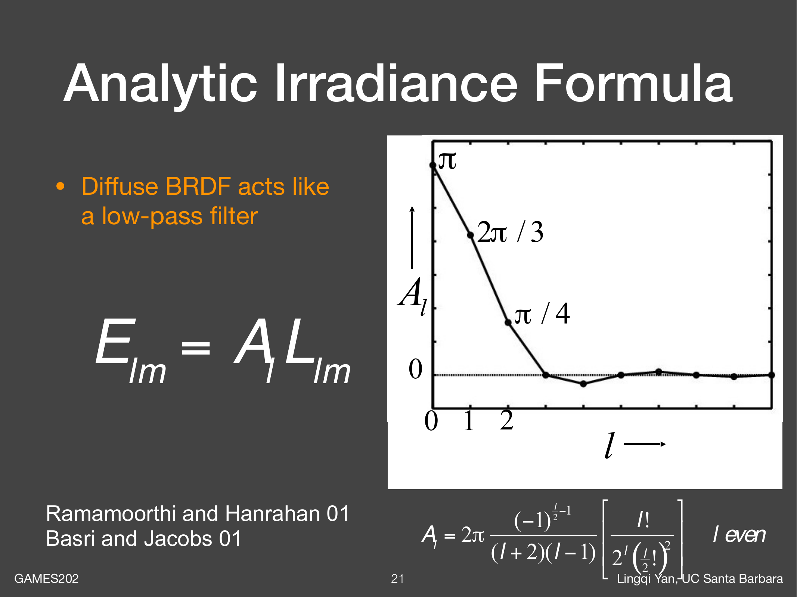

球面对称卷积在 SH 空间中可以逐 band 相乘：

$$
E_l^m
=
A_l L_l^m.
$$

其中：

- `L_lm` 是环境光 SH 系数；
- `A_l` 是 clamped cosine 核在第 `l` 个 band 的系数；
- `E_lm` 是 irradiance SH 系数。

常见归一化约定下，前三个 band 的缩放为：

$$
A_0=\pi,
$$

$$
A_1=\frac{2\pi}{3},
$$

$$
A_2=\frac{\pi}{4}.
$$

更高 band 的系数迅速变小。它们并非全部严格为 0，但贡献已经很弱。

这说明：

> Clamped cosine 是很强的低通滤波器，漫反射 irradiance 主要由前 3 个 SH band 决定。

## 17. 为什么漫反射只需 9 个参数

保留到 `l = 0`：

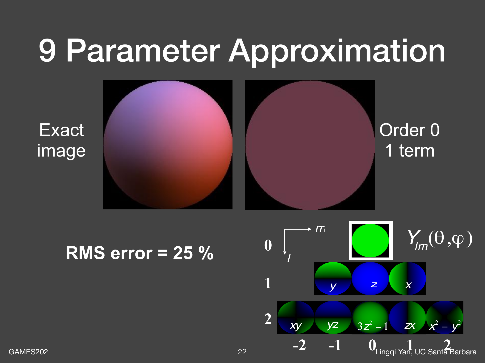

只有 1 个常数系数，只能表示整体平均亮度。课件示例 RMS 误差约为：

$$
25\%.
$$

保留到 `l = 1`：

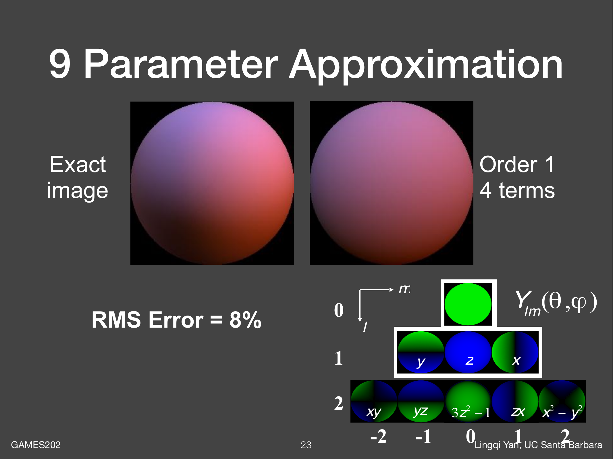

共有 4 个系数，可以表达主要方向变化。示例 RMS 误差降到约：

$$
8\%.
$$

保留到 `l = 2`：

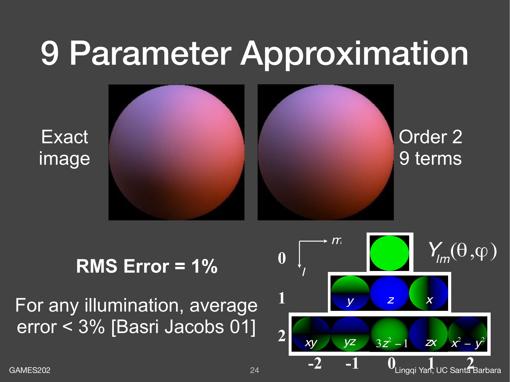

共有 9 个系数，示例 RMS 误差约为：

$$
1\%.
$$

课件引用的结论是：对于任意照明，九参数漫反射 irradiance 的平均误差通常低于约 3%。

这并不表示九个系数能准确重建原始环境贴图。它只能准确重建环境贴图经过漫反射低通后的结果。

尖锐太阳、高频灯条和清晰反射仍然需要更多频率或其他方法。

## 18. 常用的 9 个实 SH 基函数

对单位方向：

$$
\omega
=
(x,y,z),
$$

一组常见实 SH 约定为：

$$
\begin{aligned}
Y_0^0
&=0.282095,\\
Y_1^{-1}
&=0.488603\,y,\\
Y_1^0
&=0.488603\,z,\\
Y_1^1
&=0.488603\,x,\\
Y_2^{-2}
&=1.092548\,xy,\\
Y_2^{-1}
&=1.092548\,yz,\\
Y_2^0
&=0.315392\,(3z^2-1),\\
Y_2^1
&=1.092548\,xz,\\
Y_2^2
&=0.546274\,(x^2-y^2).
\end{aligned}
$$

不同资料可能使用不同：

- 坐标轴方向；
- 系数顺序；
- 正负号；
- 归一化常数；
- 实 SH 或复 SH。

投影、旋转、预计算和着色器必须使用完全相同的约定。

## 19. 用二次型快速计算 irradiance

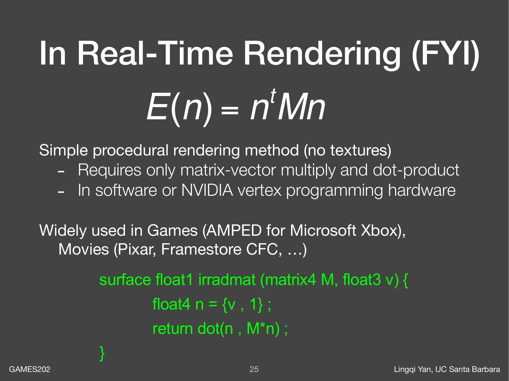

由于二阶 SH 基函数只包含常数、一次项和二次项，九参数 irradiance 可以整理成：

$$
E(\mathbf{n})
\approx
\tilde{\mathbf{n}}^{\mathsf T}
\mathbf{M}
\tilde{\mathbf{n}},
$$

其中：

$$
\tilde{\mathbf{n}}
=
\begin{bmatrix}
n_x&
n_y&
n_z&
1
\end{bmatrix}^{\mathsf T},
$$

`M` 是由 9 个环境光系数组合出的 `4 x 4` 矩阵。

运行时只需要：

1. 构造四维法线向量；
2. 做一次矩阵向量乘法；
3. 再做一次点积。

早期 GPU 即使没有方便的 Cube Map 预过滤，也能高效计算低频环境漫反射。

有些推导把 clamped cosine、SH 常数甚至 Lambert 的 `1/pi` 因子吸收到矩阵中。实现时必须确认 `M` 最终表示的是 irradiance 还是已经乘过 BRDF 的出射辐射度。

## 20. 环境光暴力积分有多贵

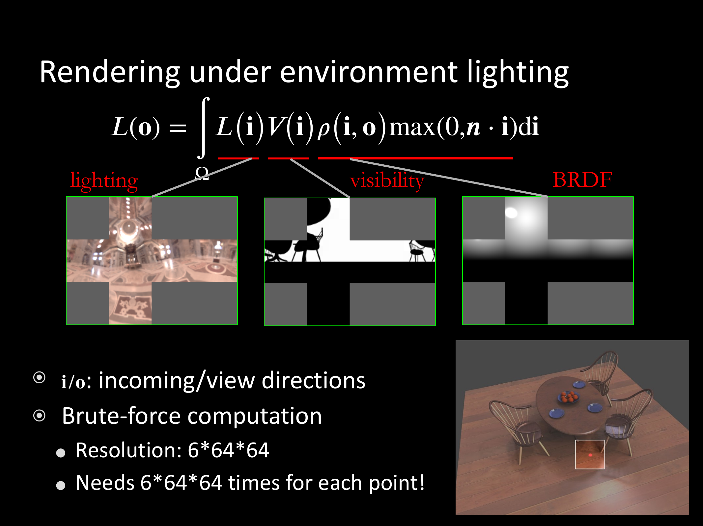

完整方向积分为：

$$
L_o(\omega_o)
=
\int_{\Omega}
L(\omega_i)\,
V(\omega_i)\,
\rho(\omega_i,\omega_o)\,
\max
\left(
0,
\mathbf{n}\cdot\omega_i
\right)
\mathrm{d}\omega_i.
$$

一个 `6 x 64 x 64` Cube Map 含：

$$
24576
$$

个方向样本。

如果每个顶点或像素都遍历所有方向，还要做 visibility 与 BRDF 查询，实时成本无法接受。

Split Sum 解决了无阴影 BRDF 积分。PRT 进一步尝试把 `V`、余弦项和固定材质响应也放进预计算。

## 21. PRT 的核心思想

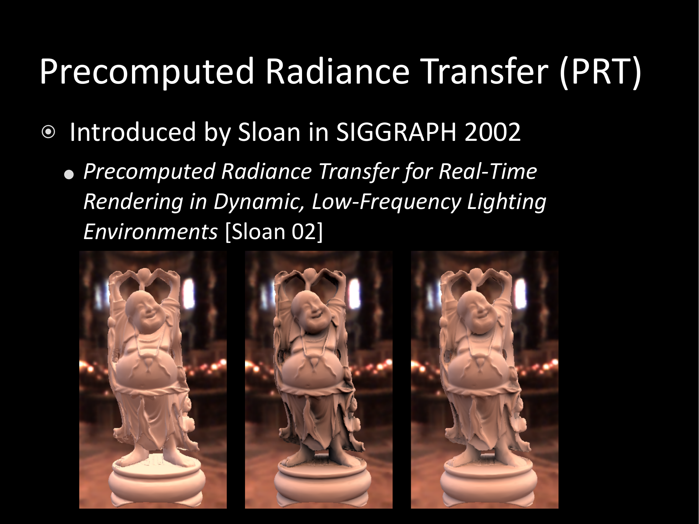

Precomputed Radiance Transfer 由 Sloan 等人在 2002 年系统提出，用于动态、低频环境光下的实时重照明。

它把渲染方程拆成两部分：

- Lighting：运行时可以变化；
- Light Transport：由几何、visibility、BRDF 和间接反射决定，提前计算。

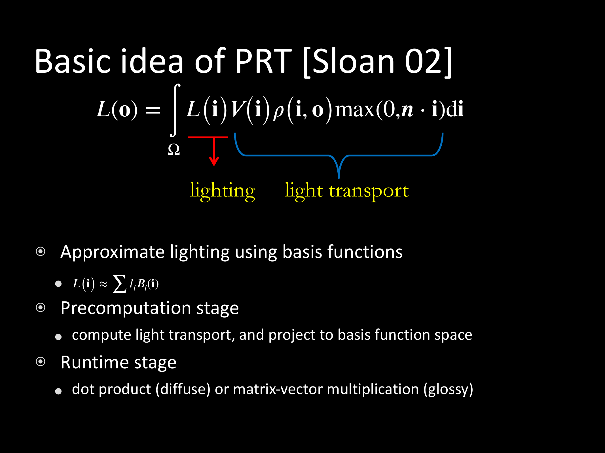

工作流程：

### 21.1 预计算阶段

1. 选择球面基函数；
2. 对场景点计算每个入射方向的光传输；
3. 将传输函数投影到基函数空间；
4. 把传输系数存到顶点、纹理或其他空间数据中。

### 21.2 运行时阶段

1. 将当前环境光投影到同一组基函数；
2. 若环境只旋转，可直接旋转 SH 系数；
3. 将光照系数与传输系数点积；
4. 得到当前环境光下的着色结果。

昂贵的 visibility、遮挡和反弹计算被挪到离线阶段。

## 22. Diffuse PRT 的推导

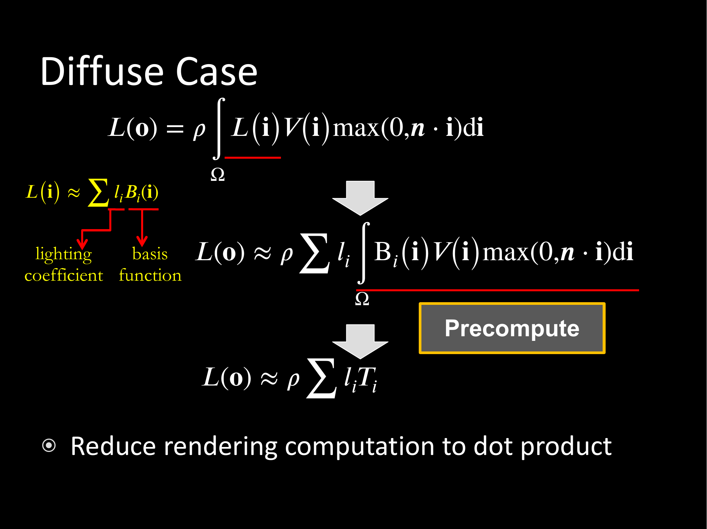

对 Lambert 漫反射，令：

$$
f_r
=
\frac{\rho_d}{\pi}.
$$

则：

$$
L_o(\mathbf{p})
=
\frac{\rho_d}{\pi}
\int_{\Omega}
L(\omega)\,
V_{\mathbf{p}}(\omega)\,
\max
\left(
0,
\mathbf{n}_{\mathbf{p}}\cdot\omega
\right)
\mathrm{d}\omega.
$$

把环境光展开到基函数：

$$
L(\omega)
\approx
\sum_{i=0}^{K-1}
l_iB_i(\omega).
$$

代入积分：

$$
\begin{aligned}
L_o(\mathbf{p})
\approx{}&
\frac{\rho_d}{\pi}
\int_{\Omega}
\left[
\sum_i l_iB_i(\omega)
\right]
V_{\mathbf{p}}(\omega)
\max
\left(
0,
\mathbf{n}_{\mathbf{p}}\cdot\omega
\right)
\mathrm{d}\omega\\
={}&
\frac{\rho_d}{\pi}
\sum_i l_i
\int_{\Omega}
B_i(\omega)
V_{\mathbf{p}}(\omega)
\max
\left(
0,
\mathbf{n}_{\mathbf{p}}\cdot\omega
\right)
\mathrm{d}\omega.
\end{aligned}
$$

定义点 `p` 的第 `i` 个传输系数：

$$
T_i(\mathbf{p})
=
\int_{\Omega}
B_i(\omega)
V_{\mathbf{p}}(\omega)
\max
\left(
0,
\mathbf{n}_{\mathbf{p}}\cdot\omega
\right)
\mathrm{d}\omega.
$$

于是：

$$
\boxed{
L_o(\mathbf{p})
\approx
\frac{\rho_d}{\pi}
\sum_i
l_iT_i(\mathbf{p})
}.
$$

向量形式：

$$
\boxed{
L_o(\mathbf{p})
\approx
\frac{\rho_d}{\pi}
\mathbf{l}^{\mathsf T}
\mathbf{T}(\mathbf{p})
}.
$$

运行时复杂的球面积分只剩一个长度为 `K` 的点积。

## 23. 传输系数究竟保存了什么

最基础的直接光传输：

$$
T_i(\mathbf{p})
=
\int_{\Omega}
B_i(\omega)
V_{\mathbf{p}}(\omega)
\max
\left(
0,
\mathbf{n}_{\mathbf{p}}\cdot\omega
\right)
\mathrm{d}\omega.
$$

它同时编码：

- 表面朝向产生的余弦衰减；
- 静态几何产生的方向可见性；
- 当前点对第 `i` 个基函数照明的响应。

如果令：

$$
V_{\mathbf{p}}(\omega)=1,
$$

得到无阴影传输。

如果离线追踪可见性，得到带阴影传输。

如果离线求解器还模拟一次或多次反射，传输系数可以包含 inter-reflection。此时系数不再只是上面的直接可见性积分，但对入射照明仍保持线性，因此运行时仍可做点积。

## 24. 为什么 SH 适合 PRT

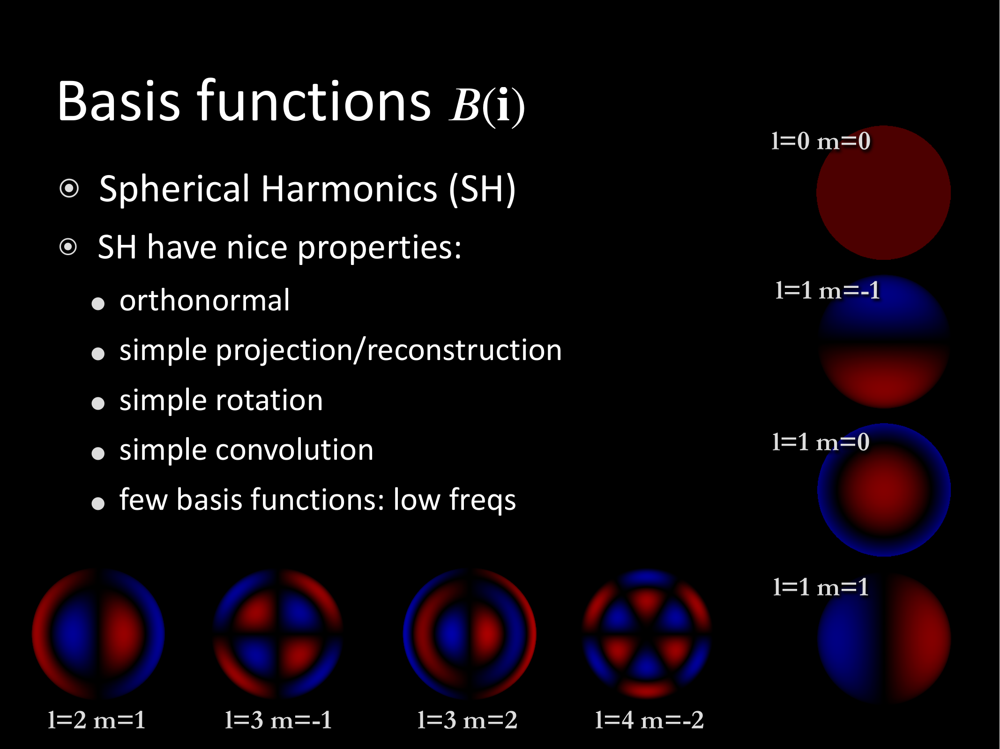

SH 具有：

- Orthonormal：积分容易变点积；
- Projection / Reconstruction 简单；
- Rotation 有成熟的系数变换；
- Convolution 对球面对称核简单；
- 低阶系数能够紧凑表示低频光照。

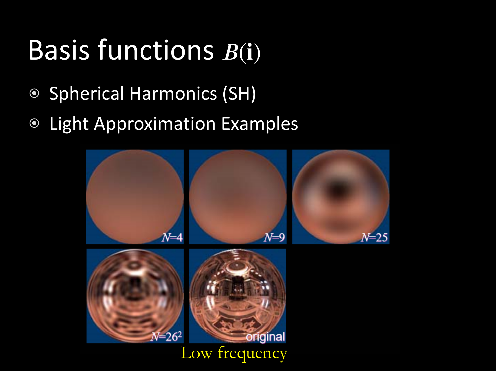

保留 4、9、25 个系数时，环境贴图会逐渐恢复更多方向细节。

但 PRT 的目标通常不是完整恢复环境贴图，而是恢复经过低频传输后的着色结果。所以即使环境图看起来模糊，最终漫反射外观仍可能很接近参考。

## 25. SH 正交性的图形化理解

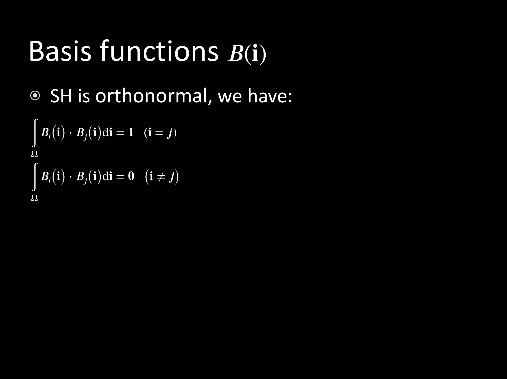

对于两个不同的 SH 基函数：

$$
\int_{\mathbb{S}^2}
B_i(\omega)
B_j(\omega)
\mathrm{d}\omega
=
0,
\qquad
i\ne j.
$$

对于同一个归一化基函数：

$$
\int_{\mathbb{S}^2}
B_i^2(\omega)
\mathrm{d}\omega
=
1.
$$

因此把函数投影到 SH 时，每个系数只测量该函数在对应模式上的分量，不会与其他正交模式混在一起。

## 26. 从原始空间到 SH 空间

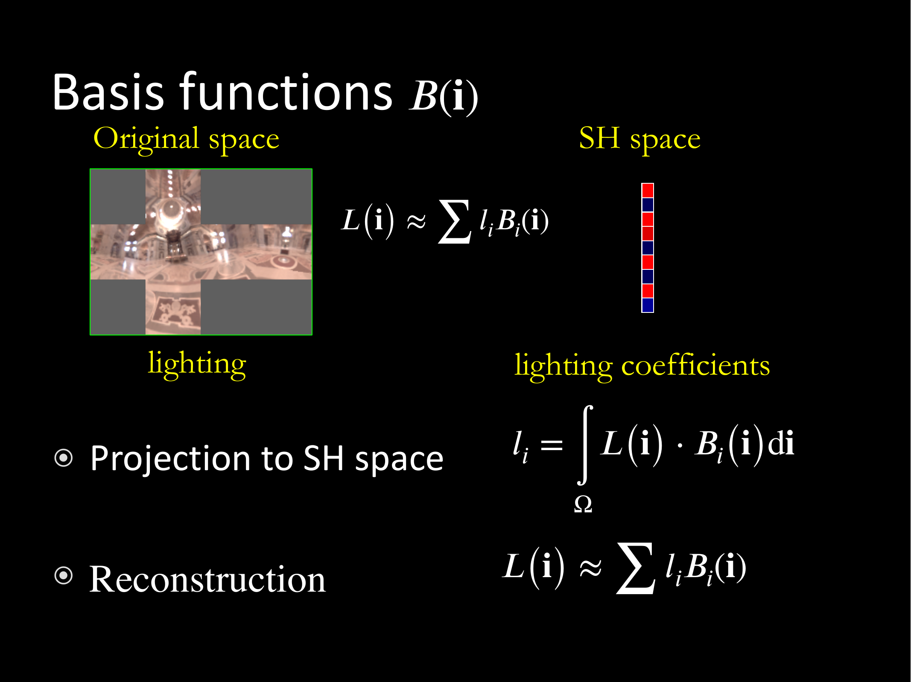

环境光投影：

$$
l_i
=
\int_{\mathbb{S}^2}
L(\omega)
B_i(\omega)
\mathrm{d}\omega.
$$

低阶重建：

$$
\tilde L(\omega)
=
\sum_i l_iB_i(\omega).
$$

进入 SH 空间后：

- 一张高分辨率环境图变成少量 RGB 系数；
- 漫反射卷积变成逐 band 乘法；
- 环境旋转变成系数旋转；
- 光照与传输积分变成向量点积。

这不是“换一种纹理压缩格式”，而是把渲染运算搬到一个更适合低频球面函数的坐标系中。

## 27. PRT 预计算的直觉

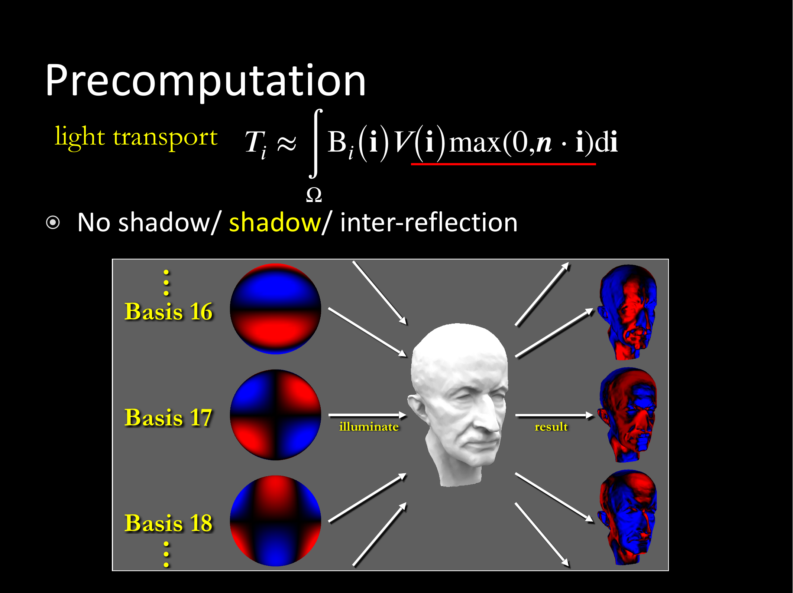

可以把预计算理解为：

1. 用第 0 个基函数作为整个环境照明场景；
2. 渲染或模拟物体对它的响应；
3. 保存结果作为第 0 个传输系数；
4. 换成第 1 个基函数照明，再保存响应；
5. 对所有基函数重复。

对每个场景点，最终得到：

$$
\mathbf{T}(\mathbf{p})
=
\begin{bmatrix}
T_0(\mathbf{p})&
T_1(\mathbf{p})&
\cdots&
T_{K-1}(\mathbf{p})
\end{bmatrix}^{\mathsf T}.
$$

由于光传输在固定场景中对光照强度是线性的，任意环境光的响应都可以由这些基响应线性组合。

## 28. 运行时只剩点积

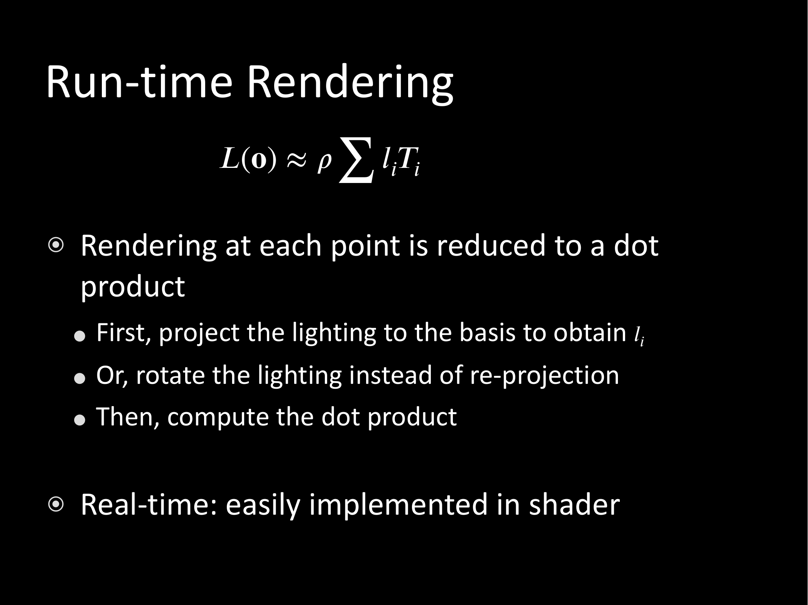

当前环境光投影为：

$$
\mathbf{l}
=
\begin{bmatrix}
l_0&
l_1&
\cdots&
l_{K-1}
\end{bmatrix}^{\mathsf T}.
$$

每个顶点或着色点保存：

$$
\mathbf{T}(\mathbf{p}).
$$

运行时：

$$
L_o(\mathbf{p})
\approx
\frac{\rho_d}{\pi}
\mathbf{l}^{\mathsf T}
\mathbf{T}(\mathbf{p}).
$$

对 RGB 环境光，`l_i` 是 RGB，`T_i` 通常是标量：

$$
\mathbf{C}(\mathbf{p})
\approx
\frac{\rho_d}{\pi}
\sum_i
\mathbf{l}_i
T_i(\mathbf{p}).
$$

如果环境贴图只发生旋转，可以旋转 SH 光照系数，而不必重新对高分辨率环境图做完整投影。

## 29. PRT 能得到什么效果

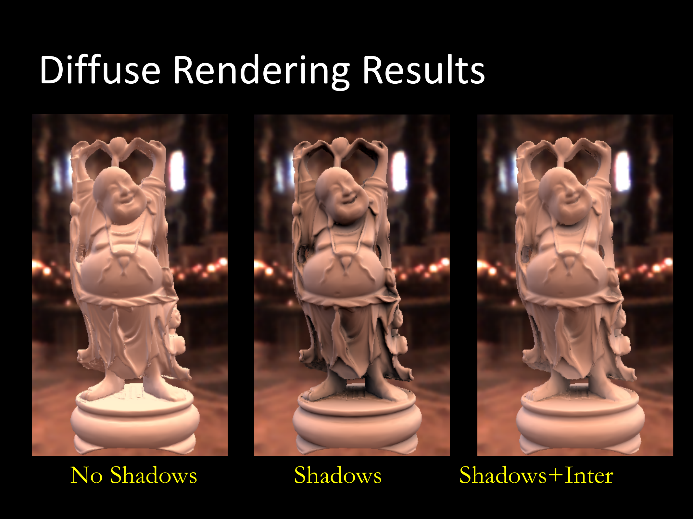

课件依次展示：

1. No Shadows：只做低频环境着色；
2. Shadows：传输包含静态可见性；
3. Shadows + Inter：进一步加入预计算的间接反射。

PRT 的价值不仅是“更便宜的阴影”。它可以把复杂静态场景中的：

- 自遮挡；
- 软阴影；
- 颜色反弹；
- 低频全局光照；

压缩到每个点的一组传输系数中，并允许环境光在运行时改变。

## 30. Glossy PRT 为什么更贵

Diffuse PRT 中，漫反射 BRDF 与观察方向无关，所以每个点只需要一个传输向量：

$$
\mathbf{T}(\mathbf{p})
\in
\mathbb{R}^{K}.
$$

Glossy 材质的响应还依赖观察方向。一个常见表示是传输矩阵：

$$
\mathbf{o}
=
\mathbf{M}_{\mathbf{p}}
\mathbf{l},
$$

其中：

- `l` 是入射环境光系数；
- `M_p` 是点 `p` 的传输矩阵；
- `o` 是出射方向函数的系数。

若输入和输出都使用 `K` 个系数，每个点需要约：

$$
K^2
$$

个矩阵元素，而 diffuse 只需 `K` 个。

因此 glossy PRT 的存储、预计算和矩阵向量乘法都更昂贵，通常还需要压缩、分块或低秩近似。

## 31. 9 系数 SH 投影伪代码

```glsl
void evaluateSH9(vec3 w, out float sh[9])
{
    float x = w.x;
    float y = w.y;
    float z = w.z;

    sh[0] = 0.282095;
    sh[1] = 0.488603 * y;
    sh[2] = 0.488603 * z;
    sh[3] = 0.488603 * x;
    sh[4] = 1.092548 * x * y;
    sh[5] = 1.092548 * y * z;
    sh[6] = 0.315392 * (3.0 * z * z - 1.0);
    sh[7] = 1.092548 * x * z;
    sh[8] = 0.546274 * (x * x - y * y);
}
```

将环境光投影到 9 个系数：

```glsl
vec3 lightSH[9] = vec3[9](
    vec3(0.0), vec3(0.0), vec3(0.0),
    vec3(0.0), vec3(0.0), vec3(0.0),
    vec3(0.0), vec3(0.0), vec3(0.0)
);

for (int sampleId = 0; sampleId < sampleCount; ++sampleId) {
    vec3 direction = sampleDirection(sampleId);
    vec3 radiance = sampleEnvironment(direction);
    float solidAngle = sampleSolidAngle(sampleId);

    float sh[9];
    evaluateSH9(direction, sh);

    for (int i = 0; i < 9; ++i) {
        lightSH[i] += radiance * sh[i] * solidAngle;
    }
}
```

实际项目通常在 CPU、Compute Shader 或离线工具中完成环境投影，而不是在每个片元中执行。

## 32. Diffuse PRT 预计算伪代码

```glsl
void precomputeTransfer(
    vec3 position,
    vec3 normal,
    out float transferSH[9])
{
    for (int i = 0; i < 9; ++i) {
        transferSH[i] = 0.0;
    }

    for (int sampleId = 0;
         sampleId < sampleCount;
         ++sampleId) {
        vec3 direction = sampleHemisphere(
            normal,
            sampleId
        );

        float nDotL = max(dot(normal, direction), 0.0);
        float visibility = traceVisibility(
            position,
            direction
        );
        float solidAngle = sampleSolidAngle(sampleId);

        float sh[9];
        evaluateSH9(direction, sh);

        for (int i = 0; i < 9; ++i) {
            transferSH[i] += sh[i]
                * visibility
                * nDotL
                * solidAngle;
        }
    }
}
```

这里的传输只包含直接光 visibility 与余弦项。若要包含 inter-reflection，需要使用更完整的离线光传输求解器。

## 33. Diffuse PRT 运行时代码

```glsl
vec3 evaluateDiffusePRT(
    vec3 albedo,
    vec3 lightSH[9],
    float transferSH[9])
{
    vec3 irradiance = vec3(0.0);

    for (int i = 0; i < 9; ++i) {
        irradiance += lightSH[i] * transferSH[i];
    }

    return albedo * irradiance / PI;
}
```

必须保持预计算定义一致：

- 如果 `transferSH` 已包含 `1 / PI`，运行时不能再除一次；
- 如果传输已经包含材质颜色，不能再次乘 albedo；
- 如果 light SH 已经过 clamped cosine 卷积，就不能与同样包含余弦项的 transfer 重复卷积。

## 34. PRT 的优点

- 运行时只需少量点积或矩阵向量乘法；
- 支持动态、旋转的低频环境光；
- 静态几何阴影可直接包含在传输中；
- 可以预计算一次或多次间接反射；
- 没有逐帧随机采样噪声；
- 很适合展示复杂静态物体的环境重照明；
- SH 系数紧凑，GPU 着色器实现简单。

## 35. PRT 的限制

### 35.1 几何和 visibility 通常必须静态

传输系数绑定场景点、法线与遮挡关系。物体移动、变形或遮挡物变化后，原传输不再正确。

### 35.2 低阶 SH 只能表示低频

尖锐环境光、小面积太阳、硬阴影和清晰高光需要更高阶系数。高阶 SH 会增加：

- 系数数量；
- 顶点或纹理存储；
- 预计算时间；
- 运行时点积长度；
- 旋转成本。

截断高频还可能出现 ringing 和负值。

### 35.3 传输存储可能很大

若每个顶点保存 9 个浮点数，大模型仍会产生可观数据。Glossy PRT 的矩阵存储更昂贵。

### 35.4 动态局部光源不自然

经典 PRT 主要针对远处环境光。带位置衰减的近场点光源并不能简单地只用一个全局球面函数表示。

### 35.5 预计算成本

高质量 visibility 和多次反射需要大量离线射线。虽然运行时便宜，但数据生成可能很慢。

## 36. 实现与调试清单

### 36.1 SH 约定

- 固定坐标系和 Cube Map 面方向；
- 确认 SH 系数顺序；
- 确认实 SH 的正负号和常数；
- 用单方向光测试投影与重建；
- 用常量环境测试只有 `Y00` 系数显著；
- 环境旋转前后检查能量是否保持。

### 36.2 数值积分

- 每个球面样本使用正确立体角；
- 经纬度贴图必须考虑纬度权重；
- 增加样本数并观察系数是否收敛；
- 对投影后的函数进行可视化重建；
- 检查 RGB HDR 数值是否在线性空间；
- 不要在投影前 Tone Map。

### 36.3 传输预计算

- 起始射线加入法线偏移；
- visibility 的 0/1 方向不能写反；
- 对无遮挡球体验证结果与解析 irradiance 接近；
- 分别可视化每个 transfer 系数；
- 先实现 no-shadow，再加入 visibility；
- inter-reflection 使用单独参考场景验证。

### 36.4 运行时

- 检查是否重复乘 albedo 或 `1 / PI`；
- 检查顶点插值是否导致阴影过度模糊；
- 用 CPU 点积结果对比着色器；
- 暂时关闭曝光、AO 和其他灯光；
- 对旋转环境验证 SH 旋转方向。

## 37. 常见误解

### 37.1 “9 个 SH 系数能还原任意环境贴图”

不能。它们只能表示低频近似。九参数之所以适合漫反射，是因为 clamped cosine 已经滤掉大量高频。

### 37.2 “SH 本身会产生阴影”

不会。SH 只是基函数。阴影来自预计算传输中的 visibility。

### 37.3 “PRT 支持动态场景”

经典 PRT 支持动态照明，不等于支持动态几何。传输绑定静态遮挡关系。

### 37.4 “PRT 只是预计算一张 Lightmap”

Lightmap 通常保存某个固定照明下的最终结果。PRT 保存的是对一组基照明的响应，因此运行时可以重新组合成不同环境光。

### 37.5 “更多 SH 阶数总是更好”

更高阶能表达更多细节，但数据、计算和 ringing 风险也更高。应根据传输带宽与目标材质选择。

### 37.6 “有了 PRT 就不需要 BRDF”

PRT 仍然建模光传输。Diffuse PRT 把固定 BRDF 因子放到公式或传输中；Glossy PRT 甚至需要更复杂的方向传输矩阵。

## 38. Lecture 5 与 Lecture 6 方法对比

| 方法 | 动态内容 | 预计算内容 | 能否包含静态阴影 | 主要适用对象 |
| --- | --- | --- | --- | --- |
| Split Sum IBL | 环境光、材质参数、视角 | 环境预过滤与 BRDF LUT | 默认不能 | 实时镜面与漫反射 IBL |
| SH Irradiance | 低频环境光、法线 | 环境 SH 或卷积系数 | 默认不能 | 漫反射环境光 |
| Diffuse PRT | 低频环境光 | 每点静态传输向量 | 可以 | 静态几何漫反射重照明 |
| Glossy PRT | 低频环境光、视角 | 每点方向传输矩阵 | 可以 | 更复杂但更昂贵的重照明 |

## 39. 学完本讲后应该能回答的问题

1. 为什么把环境贴图的每个 texel 当光源会使阴影成本过高？
2. 为什么 visibility 是高频、难分离的方向函数？
3. 低通滤波与漫反射环境光有什么关系？
4. 基函数如何把连续函数变成有限维系数向量？
5. SH 中 `l` 和 `m` 分别表示什么？
6. 保留到 `l = 2` 为什么共有 9 个系数？
7. SH 投影和重建公式分别是什么？
8. SH 正交归一为什么能把积分变成点积？
9. 为什么 clamped cosine 主要保留前三个 SH band？
10. 九参数近似准确的是原始环境图还是漫反射 irradiance？
11. PRT 将渲染方程分成哪两个部分？
12. Diffuse PRT 的 transfer 系数包含哪些几何信息？
13. 为什么 PRT 能包含静态阴影和 inter-reflection？
14. 动态环境光变化时，运行时需要重新计算什么？
15. 为什么经典 PRT 不适合动态遮挡物？
16. Glossy PRT 为什么从向量升级成矩阵？

## 40. 一页总结

低阶 SH 把球面函数写成：

$$
f(\omega)
\approx
\sum_i f_iB_i(\omega).
$$

利用正交归一：

$$
\int
f(\omega)g(\omega)
\mathrm{d}\omega
\approx
\sum_i f_i g_i.
$$

漫反射余弦核是低通滤波器：

$$
E_l^m
=
A_lL_l^m,
$$

所以前 3 个 band、共 9 个系数通常已能很好近似 diffuse irradiance。

PRT 进一步把静态传输投影到同一基空间：

$$
T_i(\mathbf{p})
=
\int
B_i(\omega)
V_{\mathbf{p}}(\omega)
\max
\left(
0,
\mathbf{n}_{\mathbf{p}}\cdot\omega
\right)
\mathrm{d}\omega.
$$

运行时只做：

$$
\boxed{
L_o(\mathbf{p})
\approx
\frac{\rho_d}{\pi}
\mathbf{l}^{\mathsf T}
\mathbf{T}(\mathbf{p})
}.
$$

它实现了：

$$
\boxed{
\text{动态低频环境光}
+
\text{预计算静态传输}
\longrightarrow
\text{实时重照明}
}.
$$

## 41. 下一讲预告

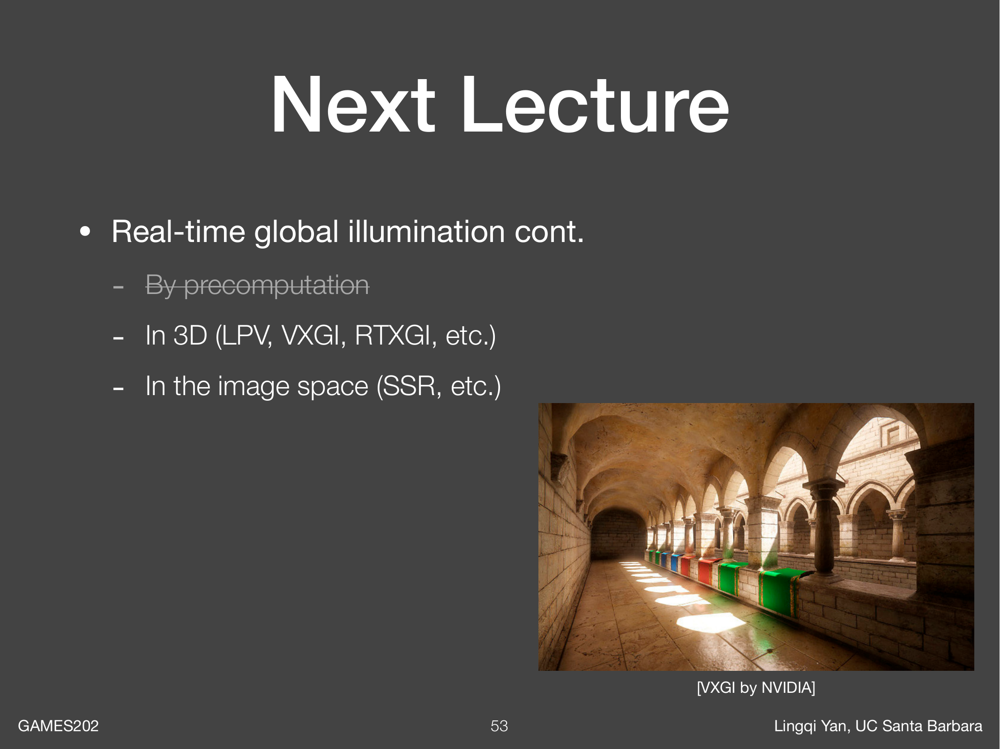

下一讲将继续实时全局光照：

- 预计算方法；
- 三维空间方法；
- Light Propagation Volumes；
- Voxel Global Illumination；
- RTXGI；
- 图像空间方法，例如 SSR。

Lecture 6 依靠静态传输换取低运行时成本；后续方法将进一步讨论如何让光照传播和可见性适应动态场景。
