# GAMES202 Lecture 8：Real-time Global Illumination in 3D and Screen Space

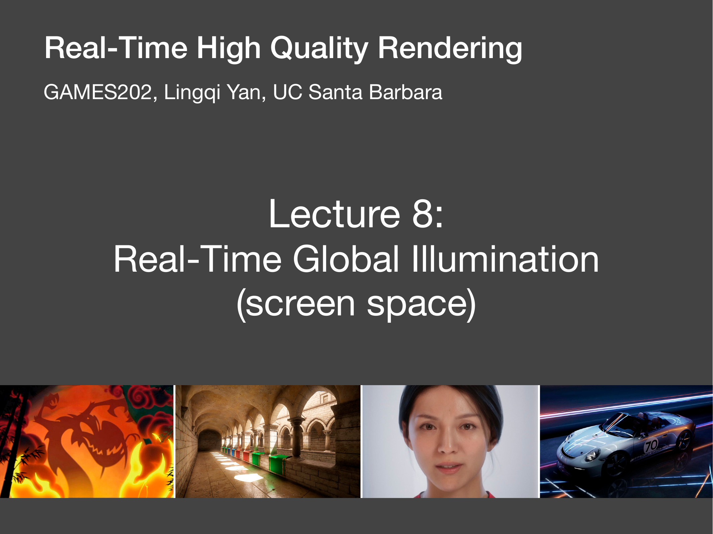

这一讲延续 RSM 的问题：如果每个像素都要遍历大量虚拟点光源，仍然太慢。LPV 和 VXGI 将光照放进三维空间结构中，让着色点可以快速查询；后半讲转入屏幕空间，从 SSAO 开始介绍只依赖当前画面缓冲的实时近似。

## 1. 本讲路线

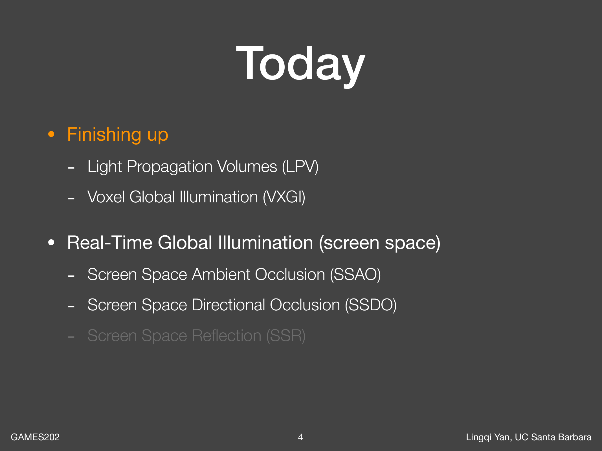

本讲包含三类方法：

1. **Light Propagation Volumes（LPV）**：把直接受光表面发出的辐亮度注入三维网格，并在相邻格子间传播。
2. **Voxel Global Illumination（VXGI）**：将场景体素化，用层次体素结构和锥体追踪查询间接光。
3. **Screen Space Ambient Occlusion（SSAO）**：仅用深度、法线和屏幕邻域，近似环境光被遮挡的程度。

它们都不是完整求解渲染方程，而是在不同空间中缓存、传播或抽样可见信息。

# 第一部分：Light Propagation Volumes

## 2. LPV 的核心想法

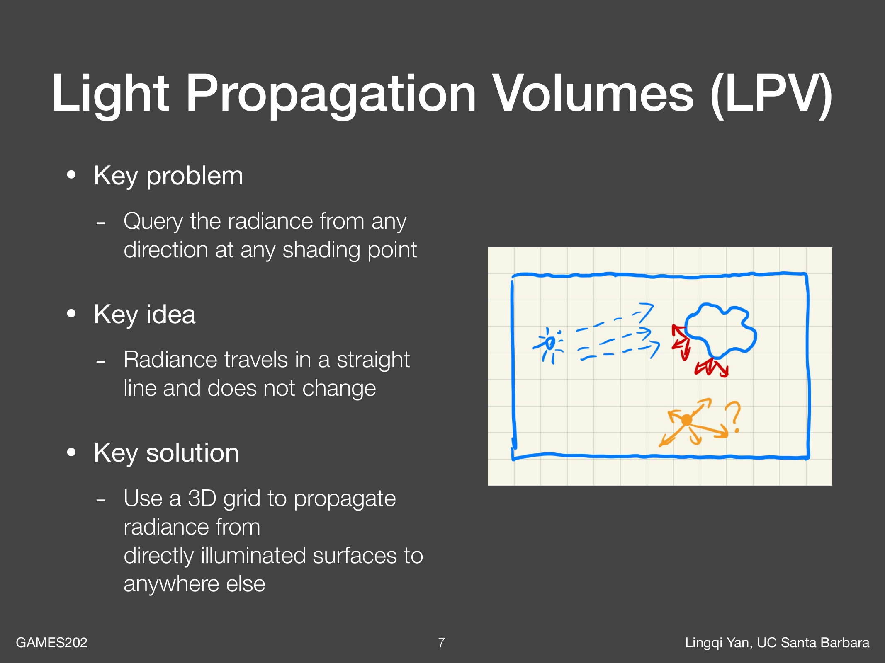

RSM 把直接受光表面离散为很多 VPL。LPV 进一步观察到：与其让每个屏幕像素分别查询这些 VPL，不如先把它们发出的方向性辐亮度汇总到一个低分辨率三维网格中，再让光在网格里传播。

最终每个表面点只需查询自己所在的网格单元，就能获得局部间接光。

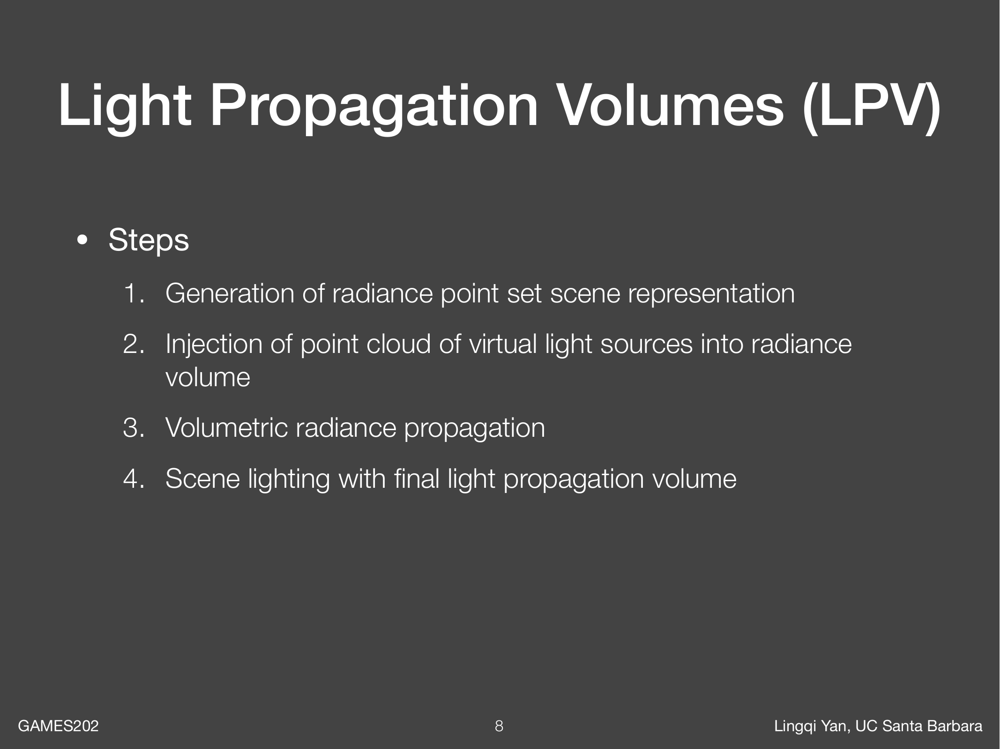

LPV 的标准流程是：

1. **Generation**：由 RSM 生成 VPL。
2. **Injection**：把 VPL 的方向性辐亮度注入三维网格。
3. **Propagation**：在相邻网格单元之间迭代传播辐亮度。
4. **Rendering**：在相机着色阶段查询网格，计算间接漫反射。

## 3. 第一步：从 RSM 生成 VPL

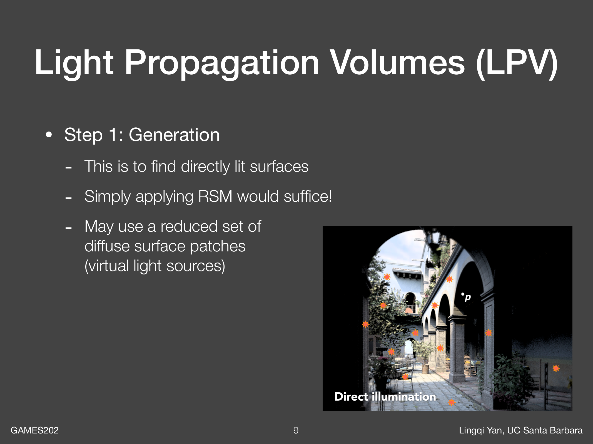

这一步与 Lecture 7 相同。光源视角渲染场景，并为每个直接受光片元保存：

- 世界位置
- 法线
- 反射通量或出射能量

每个样本代表一个面向特定方向发光的表面小块。它不是向四面八方等强发光的普通点光源，而更接近一个带方向分布的漫反射小面元。

## 4. 第二步：注入方向性辐亮度

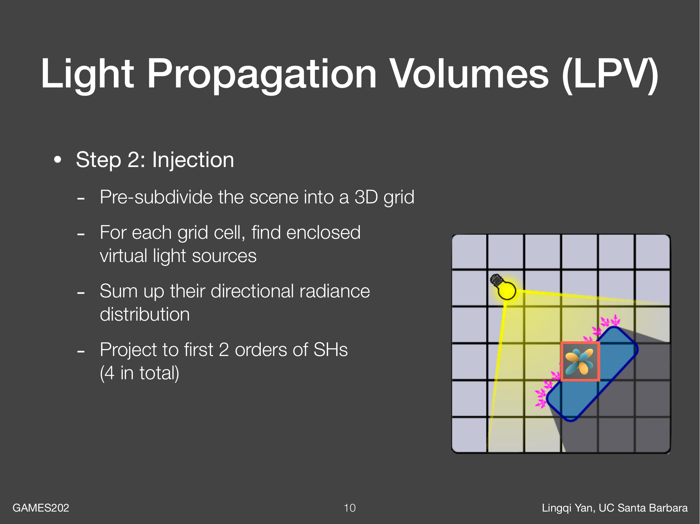

若每个网格单元只保存一个 RGB 值，就会丢失光从哪个方向来。LPV 通常用前两阶球谐函数保存方向分布，即每个颜色通道使用 4 个 SH 系数。

对方向函数 `L(omega)`，系数为：

$$
c_i
=
\int_{\Omega}
L(\omega)B_i(\omega)
\,\mathrm{d}\omega
$$

注入时，将 VPL 的方向分布投影为低阶 SH 系数，再累加到 VPL 所在的网格单元。这样每个单元保存的不只是“有多少光”，还粗略保存“光主要朝哪里传播”。

## 5. 第三步：在网格中传播

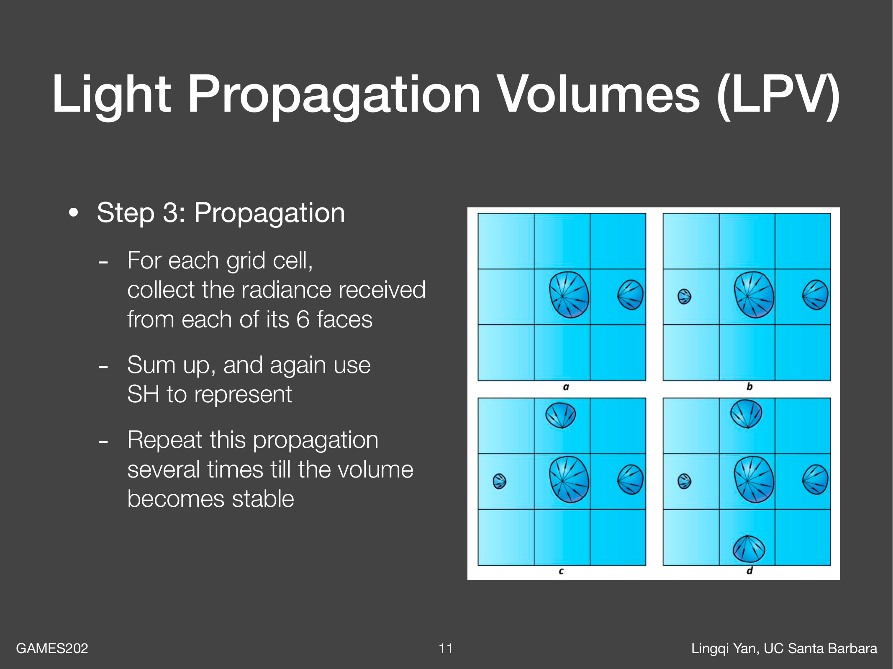

三维规则网格中的每个单元有 6 个面相邻单元。一次传播迭代大致做这些事：

1. 读取当前单元的 SH 辐亮度。
2. 估计它穿过每个面的出射贡献。
3. 将贡献旋转或投影到邻居的 SH 表示。
4. 把所有邻居贡献累加到下一轮网格。

重复传播多轮，就近似得到更多次光线反弹。传播轮数越多，光能到达的范围越远，但也会越来越模糊。

一个高度简化的传播框架如下：

```glsl
for (int iteration = 0; iteration < propagationSteps; ++iteration) {
    for (int face = 0; face < 6; ++face) {
        ivec3 neighbor = cell + faceOffset[face];
        SH4 outgoing = projectThroughFace(current[cell], face);
        next[neighbor] += outgoing * propagationWeight;
    }

    current = next;
    clear(next);
}
```

实际 GPU 实现会让每个线程处理一个网格单元，并使用双缓冲纹理避免读写冲突。

## 6. 第四步：渲染时查询 LPV

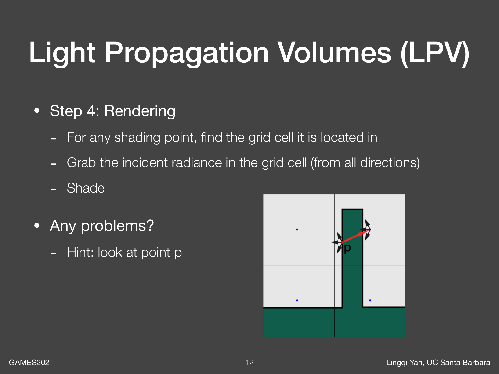

对世界空间着色点 `p`：

1. 找到 `p` 在三维网格中的位置。
2. 对周围 8 个单元做三线性插值，得到 SH 系数。
3. 用表面法线对应的余弦核与 SH 系数点积。
4. 乘漫反射反照率，得到间接漫反射。

由于查询成本基本固定，LPV 避免了逐像素遍历成百上千个 VPL。

## 7. LPV 为什么会漏光

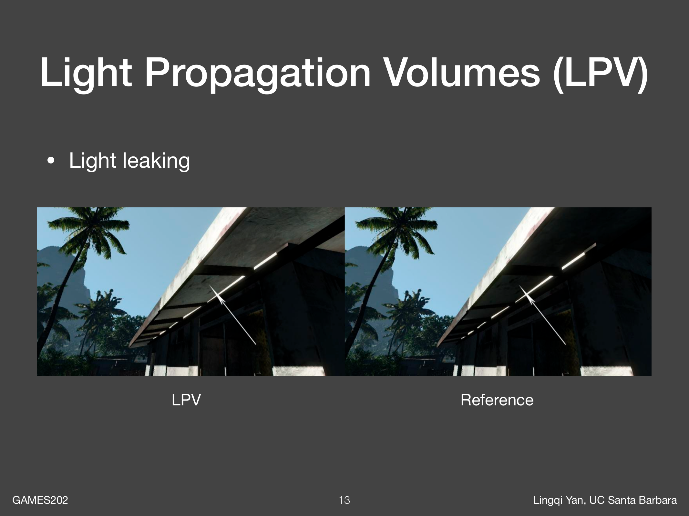

LPV 最大的问题来自粗糙离散化。一个网格单元可能同时覆盖墙的两侧，而传播时只知道单元之间相邻，不知道中间是否有墙。结果是光从亮侧直接传播到暗侧。

典型缓解方法包括：

- 提高网格分辨率，但显存和传播成本会以三次方增长。
- 注入几何遮挡信息，例如 Geometry Volume。
- 使用级联 LPV，让相机附近网格更细。
- 对薄墙增加保守体素化或人为厚度。

这些方法只能缓解，无法彻底消除低分辨率网格造成的信息损失。

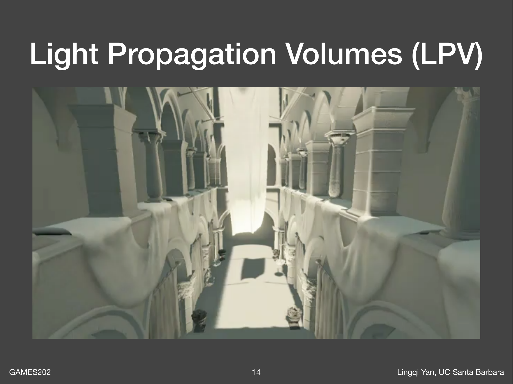

## 8. LPV 的优缺点

**优点：**

- 支持动态光源和动态场景。
- 查询成本与 VPL 数量无关。
- 多次传播可近似多次漫反射。
- 低阶 SH 能保存少量方向信息。

**缺点：**

- 三维网格占用较多存储，分辨率通常很低。
- 光照传播会变模糊，难以保留锐利间接阴影。
- 薄墙和小物体容易漏光。
- 传播次数有限，并不等价于收敛的多次反弹。

# 第二部分：Voxel Global Illumination

## 9. VXGI 的核心想法

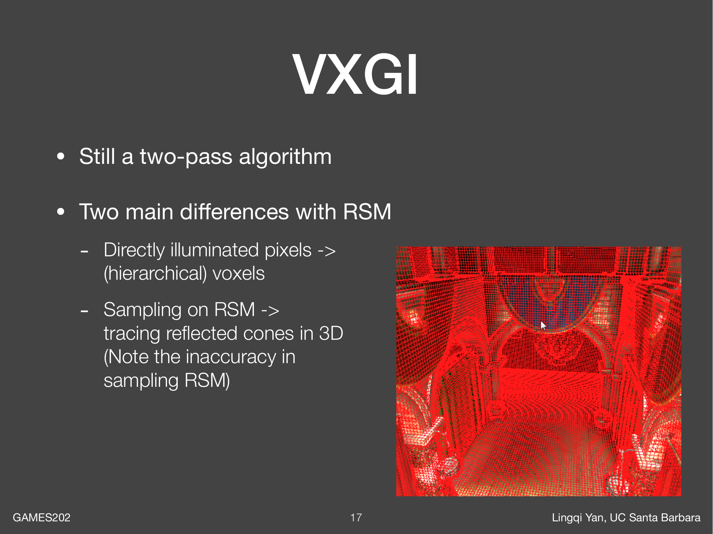

VXGI 不只建立一个保存光的规则网格，还把场景几何、法线和辐射信息体素化。随后不追踪大量独立射线，而是追踪有宽度的**锥体**。

一个锥体代表一束方向相近的射线。锥体离起点越远，覆盖范围越大，因此可以从更粗的体素层级读取平均结果。

## 10. 场景体素化与层次结构

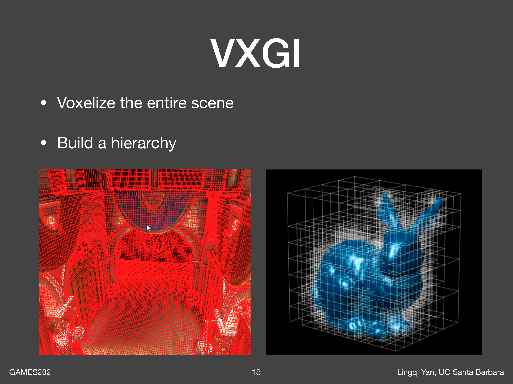

体素化把三角形覆盖到三维网格中，记录占据情况、法线、材质和光照。然后像生成纹理 MIPMAP 一样逐层合并体素：

- 细层级保留局部几何和高频光照。
- 粗层级表示更大空间范围内的平均信息。
- 查询层级由锥体在当前位置的截面大小决定。

若锥体直径为 `d`、最细体素尺寸为 `s`，一个常用层级估计为：

$$
\mathrm{mipLevel}
\approx
\log_2\left(\frac{d}{s}\right)
$$

## 11. Light Pass：把直接光写入体素

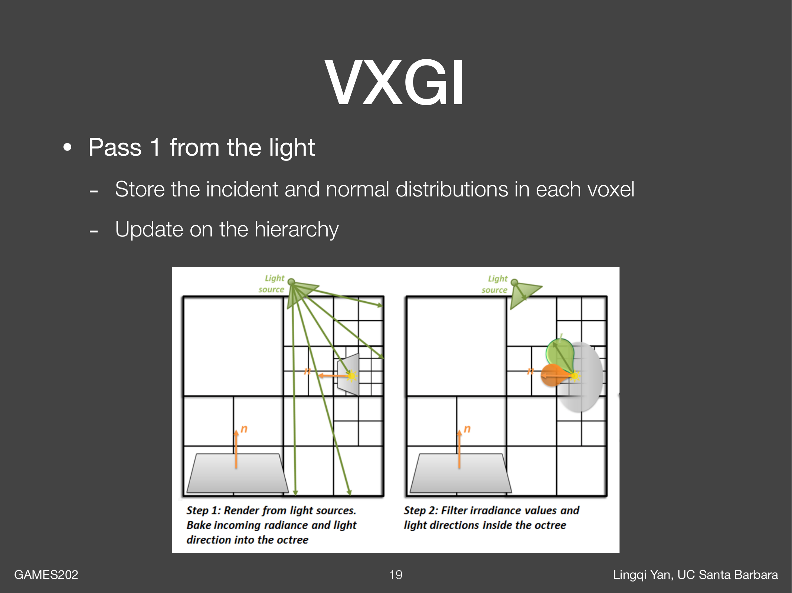

在光照阶段，系统先计算体素中的直接光，再将辐亮度向更粗层级过滤。这样相机查询的不是原始材质，而是已经被光照过的三维辐射场。

为了保留方向性，工程实现可能为不同主方向保存多个体素纹理，避免把相反方向的光完全混合。

## 12. Camera Pass：用锥体追踪间接光

### Glossy 反射

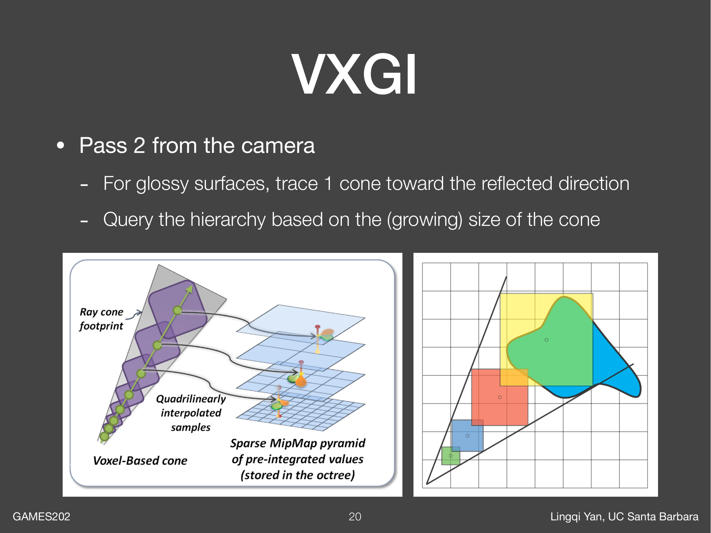

有光泽反射主要集中在镜面反射方向，因此可沿反射向量追踪一个锥体：

- 粗糙度低，锥角小，反射清晰。
- 粗糙度高，锥角大，读取更粗层级，反射更模糊。

### 漫反射

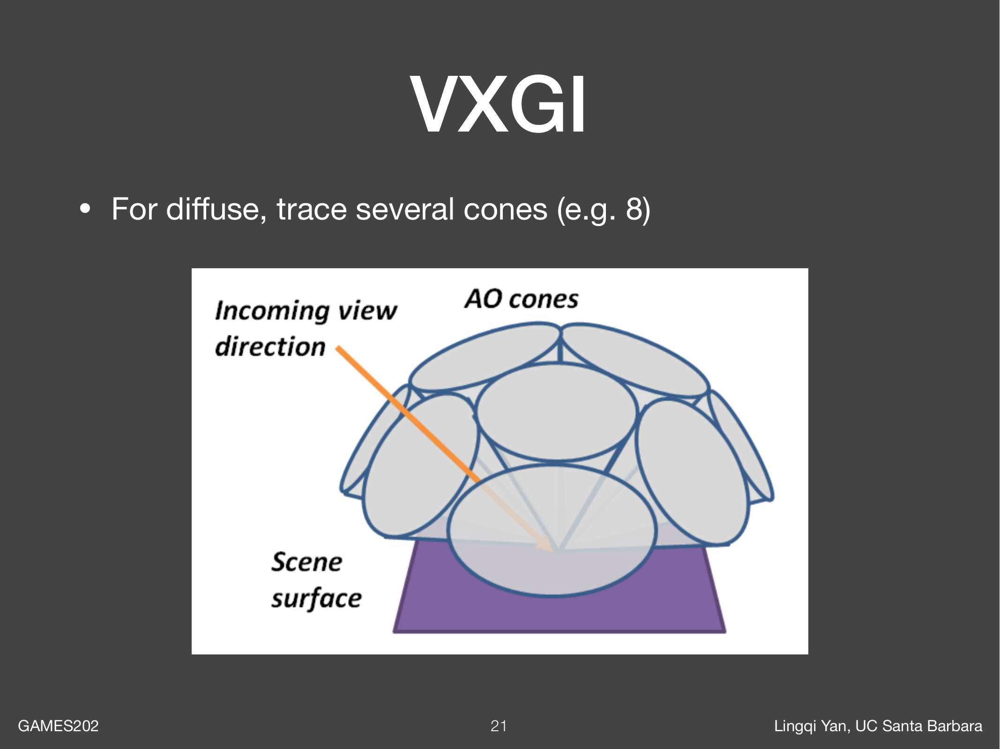

漫反射需要覆盖法线朝向的半球。通常使用数个较宽锥体，例如 6 到 8 个，近似对半球方向积分。每个锥体沿途累积辐亮度和不透明度。

一种简化的前向累积是：

```glsl
vec4 traceCone(vec3 origin, vec3 direction, float aperture) {
    vec3 radiance = vec3(0.0);
    float transmittance = 1.0;
    float distance = voxelSize;

    while (distance < maxDistance && transmittance > 0.01) {
        float diameter = max(voxelSize, 2.0 * aperture * distance);
        float lod = log2(diameter / voxelSize);
        vec4 sampleValue = sampleVoxelRadiance(origin + direction * distance, lod);

        radiance += transmittance * sampleValue.rgb;
        transmittance *= 1.0 - sampleValue.a;
        distance += diameter;
    }

    return vec4(radiance, 1.0 - transmittance);
}
```

这与光线追踪相似，但每次采样查询的是一片空间的平均值，所以一次锥体查询可近似许多射线。

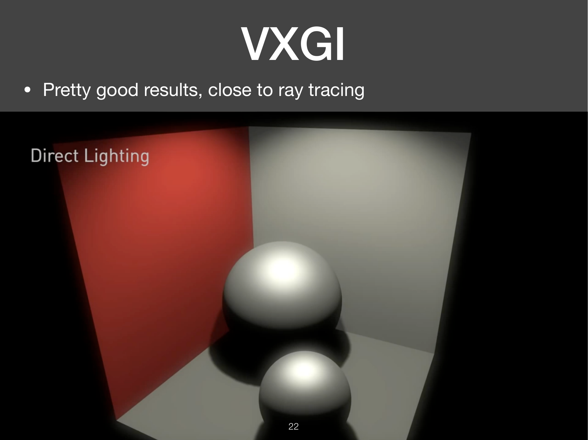

## 13. LPV 与 VXGI 对比

| 维度 | LPV | VXGI |
| --- | --- | --- |
| 空间表示 | 低分辨率规则光照网格 | 含几何与辐射的层次体素 |
| 光传播 | 邻居间迭代传播 | 着色时做锥体追踪 |
| 方向表示 | 常用低阶 SH | 常用方向体素或多个纹理 |
| 细节 | 较模糊 | 层次查询可保留更多局部细节 |
| 成本 | 传播迭代 | 体素化、MIP 构建和多锥查询 |
| 常见问题 | 网格漏光、过度扩散 | 体素漏光、显存大、动态更新贵 |

两者都把连续三维世界离散化，因此薄几何、细缝和高频可见性都难以准确保存。

# 第三部分：Screen-space Ambient Occlusion

## 14. 什么是屏幕空间方法

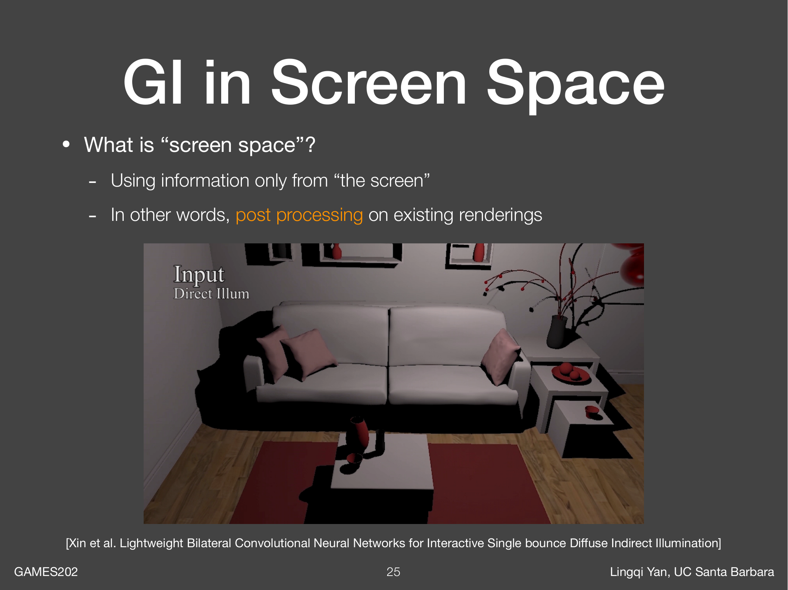

屏幕空间算法只使用当前相机已经生成的数据，例如：

- 深度缓冲
- 法线缓冲
- 屏幕颜色
- 运动向量

它们不需要完整场景加速结构，容易集成到延迟渲染管线中，成本也与屏幕分辨率直接相关。但屏幕之外、被前景遮住或深度缓冲中没有的几何都不可见。

## 15. SSAO 想近似什么

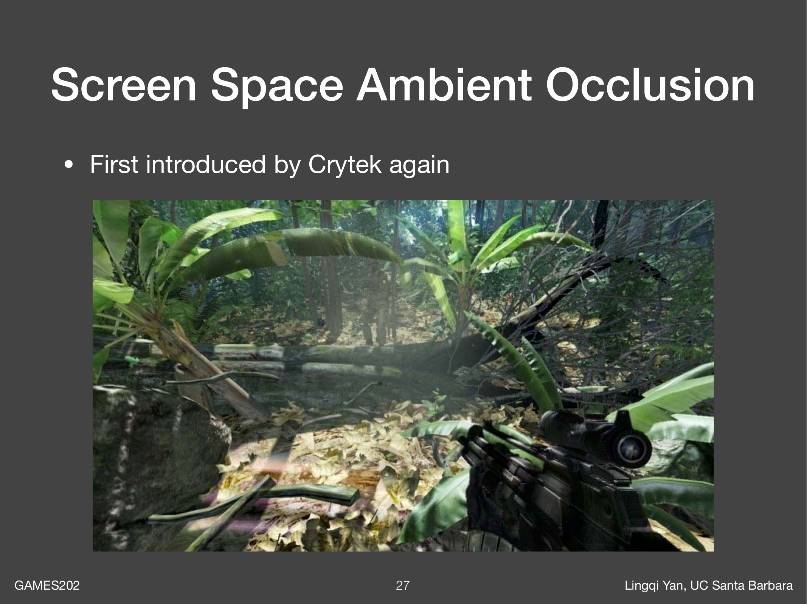

环境光遮蔽描述一个点周围的半球有多少方向被附近几何挡住。凹槽、墙角和物体接触处通常可见方向更少，所以显得更暗。

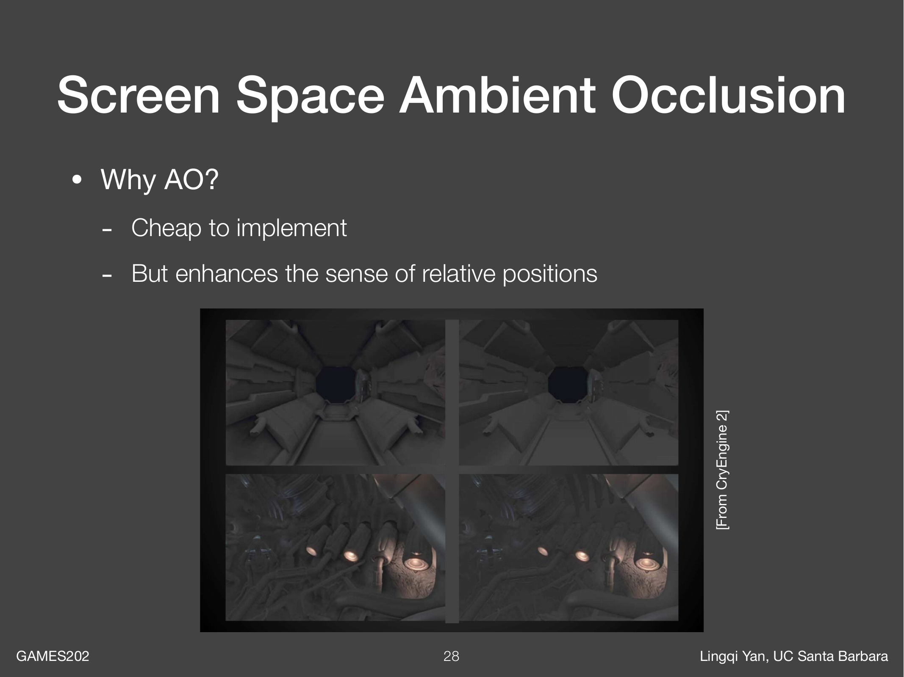

AO 不是真正的阴影，也不是完整的间接光照。它更像一个低成本的局部可见性因子，用来增强接触关系和几何层次。

## 16. SSAO 的两个关键假设

### 假设一：间接入射光近似常量

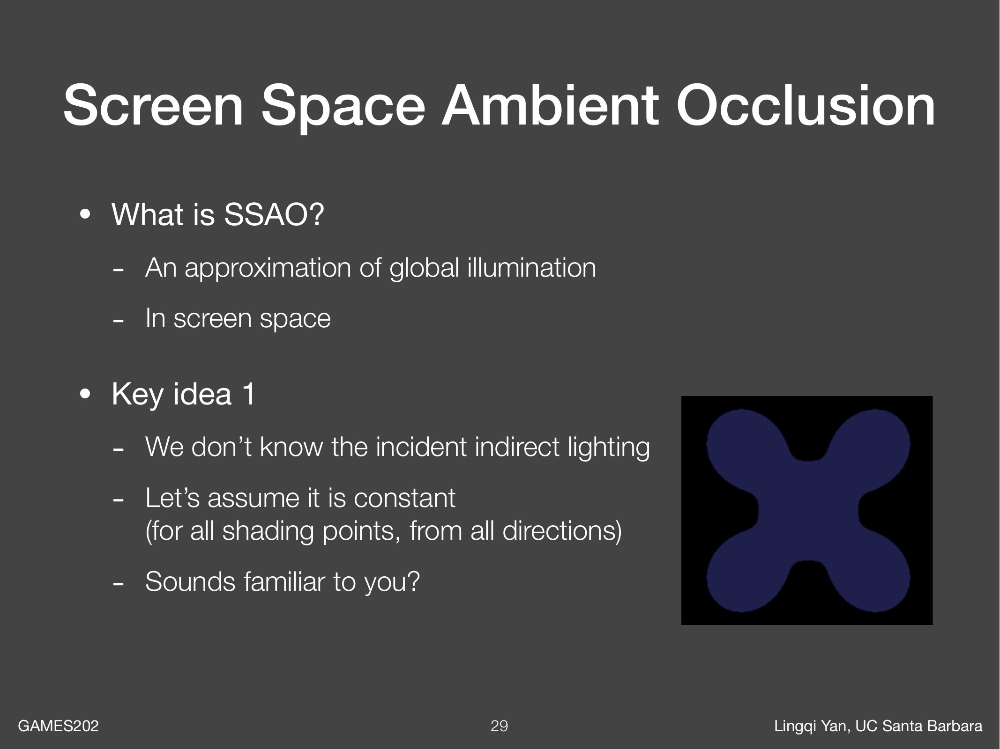

把来自不同方向的间接光 `L_i` 近似为同一个平均值。这样方向变化主要由可见性 `V` 决定。

### 假设二：表面是漫反射

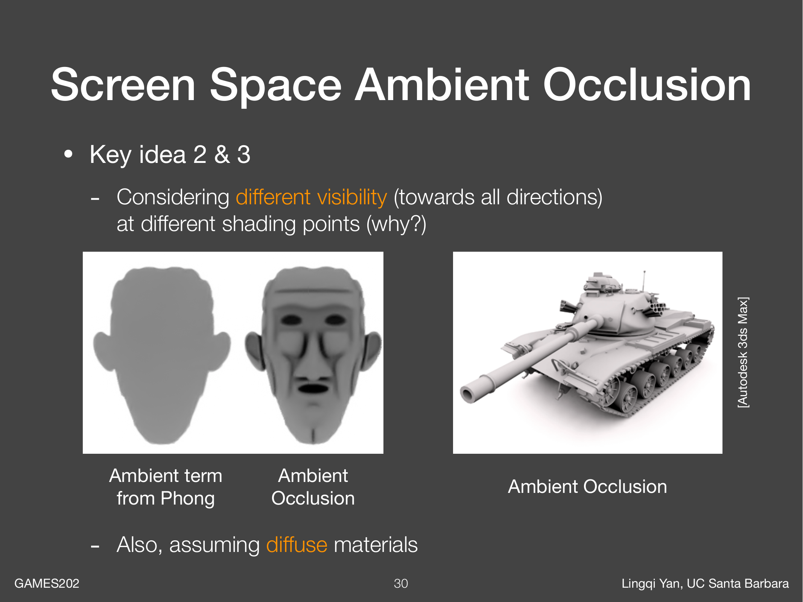

Lambert BRDF 与方向无关：

$$
f_r
=
\frac{\rho}{\pi}
$$

因此可以把材质项从半球积分中提出。SSAO 最终只需估计带余弦权重的可见方向比例。

## 17. 从渲染方程推导 AO

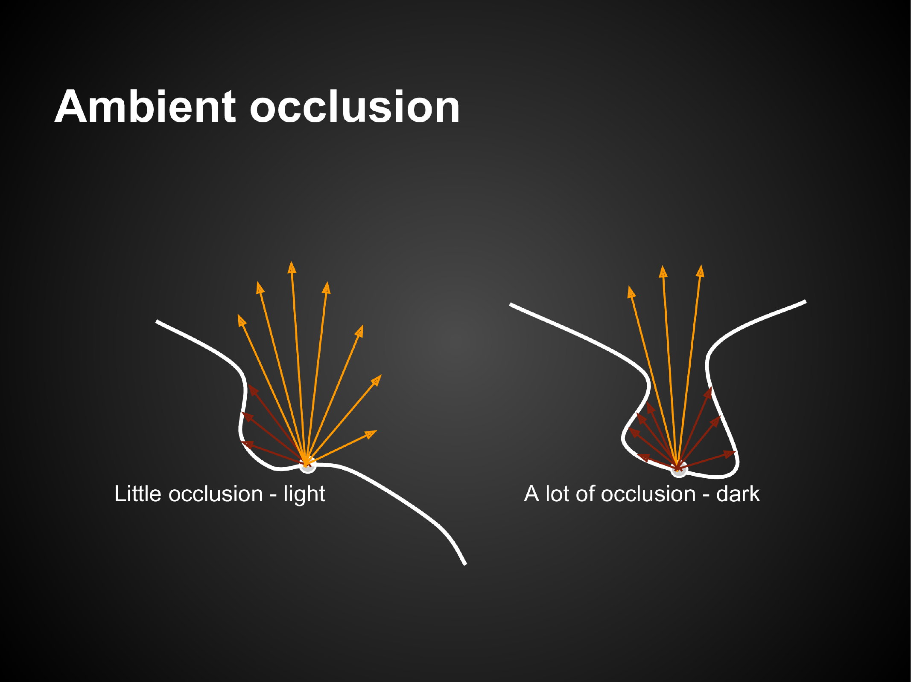

考虑间接光部分：

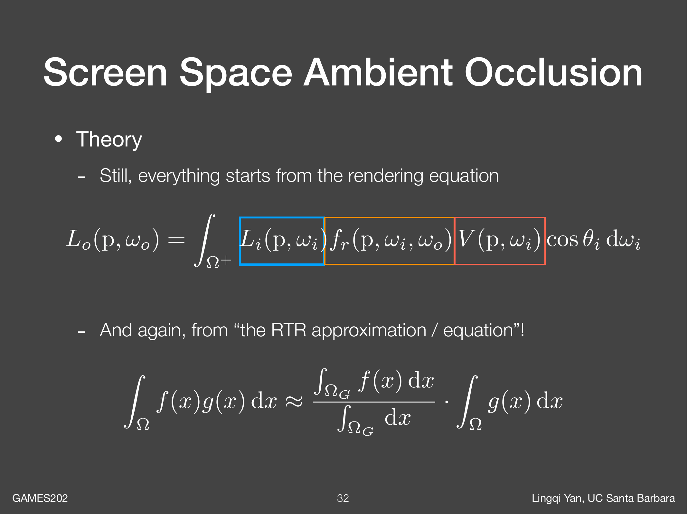

$$
L_o^{\mathrm{indir}}(p)
=
\int_{\Omega^+}
L_i^{\mathrm{indir}}(p,\omega)
f_r(p,\omega,\omega_o)
V(p,\omega)
\cos\theta
\,\mathrm{d}\omega
$$

若间接入射光近似为常量，且表面为 Lambert 漫反射：

$$
L_o^{\mathrm{indir}}(p)
\approx
L_i^{\mathrm{indir}}(p)
\frac{\rho}{\pi}
\int_{\Omega^+}
V(p,\omega)\cos\theta
\,\mathrm{d}\omega
$$

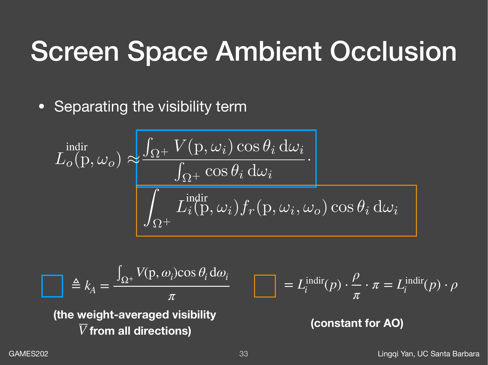

定义环境光遮蔽的可见比例：

$$
k_A(p)
=
\frac{
\int_{\Omega^+}V(p,\omega)\cos\theta\,\mathrm{d}\omega
}{
\pi
}
$$

于是：

$$
L_o^{\mathrm{indir}}(p)
\approx
k_A(p)\,L_i^{\mathrm{indir}}(p)\,\rho
$$

`k_A` 位于 0 到 1 之间：

- `k_A = 1`：半球完全可见，没有环境遮蔽。
- `k_A = 0`：所有方向都被挡住。
- 实际渲染中常把 `1 - k_A` 称为 occlusion，再用它压暗环境光。

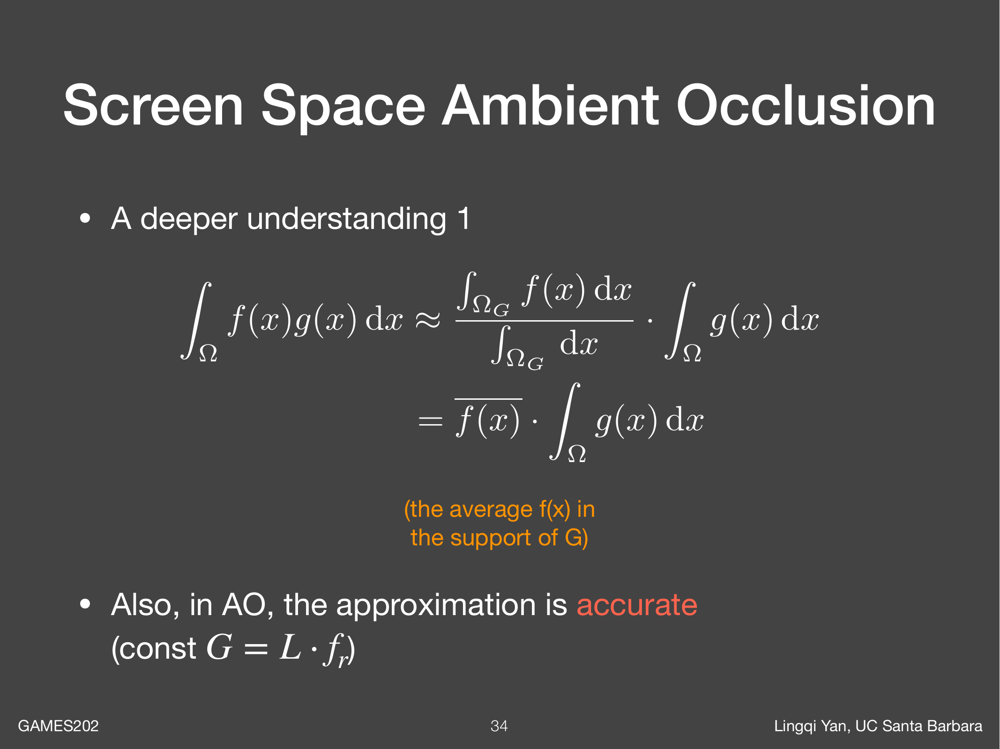

这个分离只有在被提出积分的间接光与 BRDF 近似不随方向变化时才准确。强方向光照和镜面材质都不满足条件。

## 18. 为什么分母正好是 pi

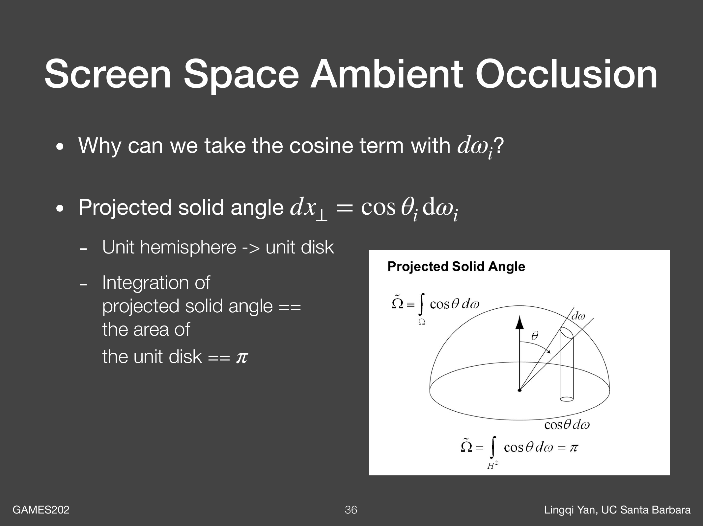

半球方向的微分立体角乘 `cos(theta)`，等价于它在法线垂直平面上的投影面积。整个单位半球投影后就是半径为 1 的圆盘，因此：

$$
\int_{\Omega^+}\cos\theta\,\mathrm{d}\omega
=
\pi
$$

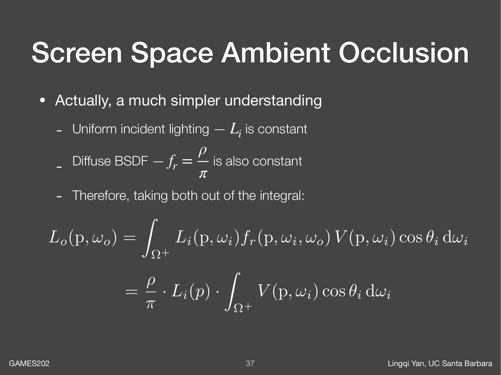

所以用 `pi` 归一化后，`k_A` 就是余弦加权意义下的可见比例，而不是任意经验常数。

## 19. 从物体空间 AO 到屏幕空间 AO

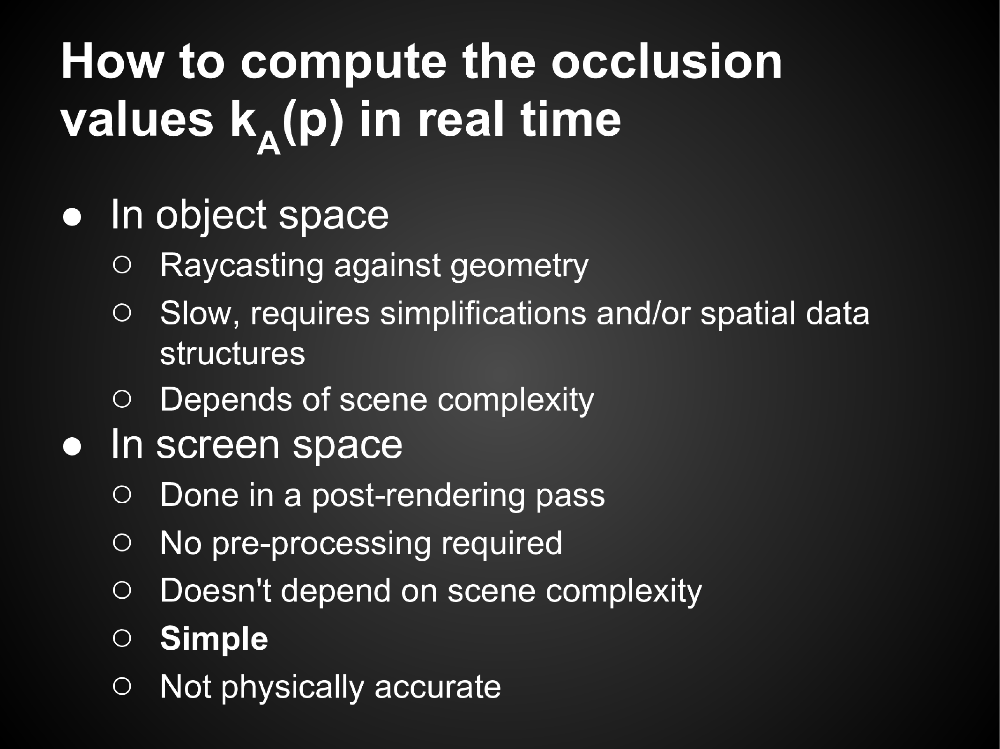

准确估计 `V(p, omega)` 需要从 `p` 向半球发射射线。SSAO 用深度缓冲替代场景求交：

1. 从深度重建当前像素的视图空间位置 `p`。
2. 在 `p` 周围生成一组半球样本。
3. 将每个样本位置投影回屏幕。
4. 读取投影像素的深度。
5. 判断深度缓冲中的几何是否挡在样本之前。
6. 汇总遮挡比例并做空间滤波。

## 20. 为什么只检查有限半径

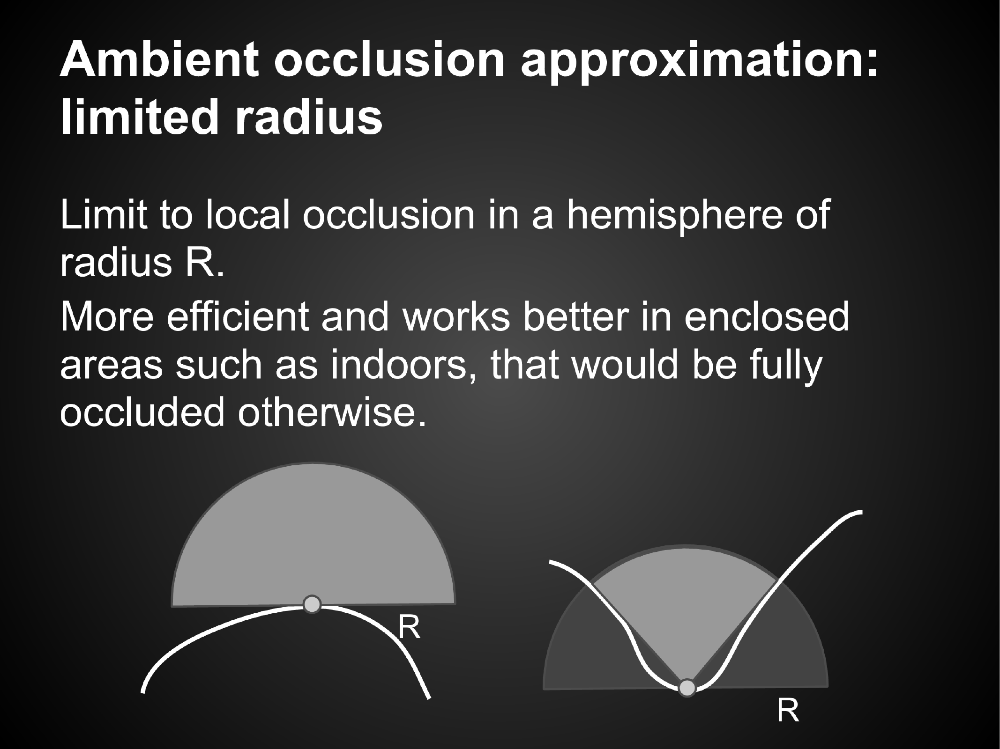

AO 主要描述局部遮蔽。若把很远的物体也算作遮挡，整个画面会变脏、变灰。因此定义视图空间半径 `R`，只统计当前点附近的样本。

半径决定视觉尺度：

- 小半径突出接触阴影和细缝。
- 大半径产生更宽的暗区，但更容易出现光晕与错误遮挡。
- 固定屏幕像素半径会随距离改变世界尺度，通常应在视图空间取样后投影。

## 21. 深度比较如何估计遮挡

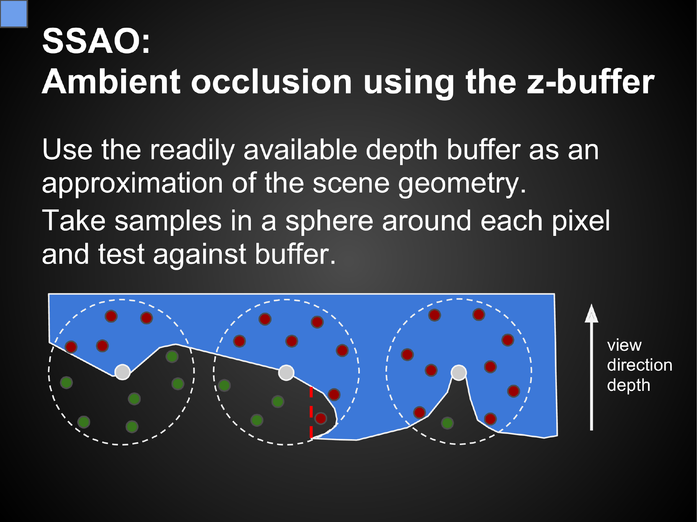

对一个期望样本位置 `s`，把它投影到屏幕坐标 `uv`，从深度缓冲重建该位置真正可见的表面 `q`。若 `q` 比 `s` 更靠近相机，说明样本方向可能被几何挡住。

简化判断可写为：

$$
\mathrm{occluded}(s)
=
\begin{cases}
1, & z_q < z_s - \mathrm{bias} \\
0, & \text{otherwise}
\end{cases}
$$

具体比较符号取决于视图空间轴方向和深度编码，工程中必须先统一“更近”的定义。

加入距离权重后：

$$
A(p)
=
1-
\frac{
\sum_{i=1}^{N}w_i\,\mathrm{occluded}(s_i)
}{
\sum_{i=1}^{N}w_i
}
$$

其中 `A(p)` 是最终可见比例，`w_i` 用于降低超出半径或深度差过大的样本权重。

## 22. 一个实用的 SSAO 管线

```glsl
float computeSSAO(vec2 uv, vec3 positionVS, vec3 normalVS) {
    mat3 tangentFrame = buildTBN(normalVS, randomRotation(uv));
    float occlusion = 0.0;
    float weightSum = 0.0;

    for (int i = 0; i < KERNEL_SIZE; ++i) {
        vec3 sampleVS = positionVS
            + tangentFrame * hemisphereKernel[i] * radius;

        vec2 sampleUV = projectToUV(sampleVS);
        float sceneDepth = texture(depthTexture, sampleUV).r;
        vec3 sceneVS = reconstructViewPosition(sampleUV, sceneDepth);

        float rangeWeight = smoothstep(
            0.0,
            1.0,
            radius / max(abs(positionVS.z - sceneVS.z), 1e-4));

        float blocked = sceneVS.z >= sampleVS.z + bias ? 1.0 : 0.0;
        occlusion += blocked * rangeWeight;
        weightSum += rangeWeight;
    }

    return 1.0 - occlusion / max(weightSum, 1e-4);
}
```

上面的深度比较假设视图空间相机朝负 `z` 方向；若引擎约定不同，需要反转比较关系。

## 23. SSAO 为什么会产生错误遮挡

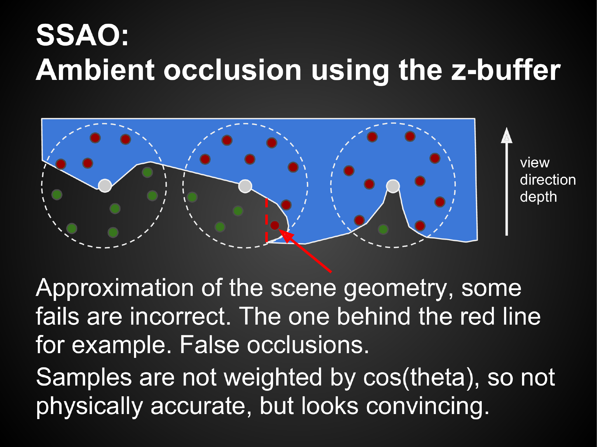

深度缓冲每个像素只保存最前面一层表面。SSAO 将一个屏幕深度差解释为附近三维遮挡，但两者可能实际上相距很远，或根本不在同一局部结构中。

常见错误来源：

- 前景轮廓附近把远处背景误认为遮挡物。
- 薄物体背后的信息被丢失。
- 屏幕外几何完全不存在于查询数据中。
- 相机移动时样本对应关系改变，产生闪烁。

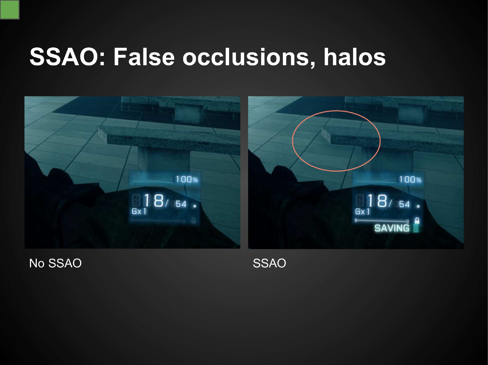

错误遮挡经常表现为轮廓周围的暗色光晕。深度差范围检查、法线权重、合理半径和边缘保持滤波都能减轻它。

## 24. 少量样本、噪声与滤波

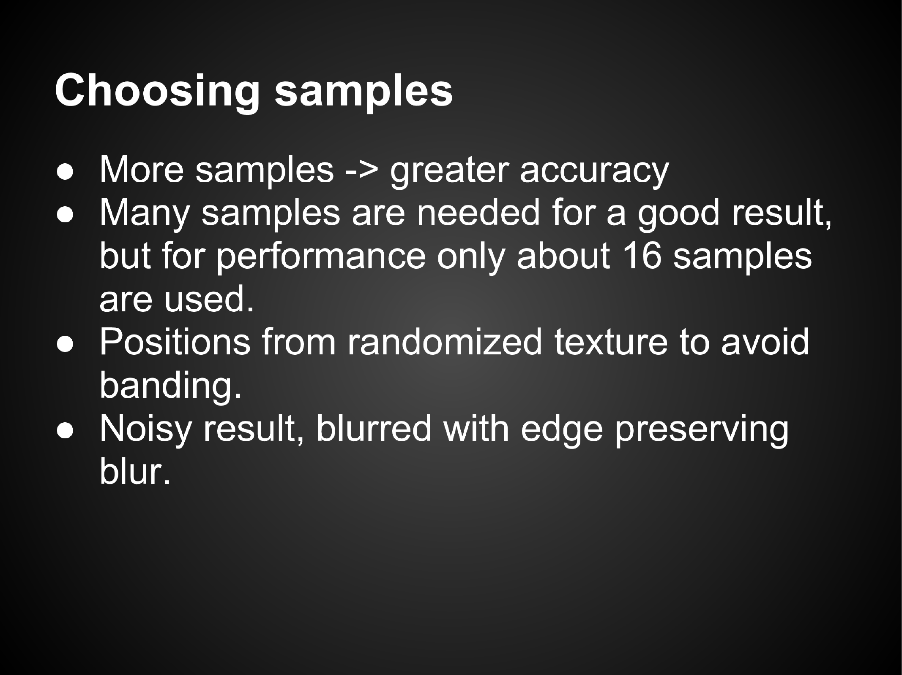

实时 SSAO 常只用约 16 个样本。若每个像素使用完全相同的采样方向，会出现明显条纹；通常使用小型随机旋转纹理打散方向，使结构性条纹变成高频噪声。

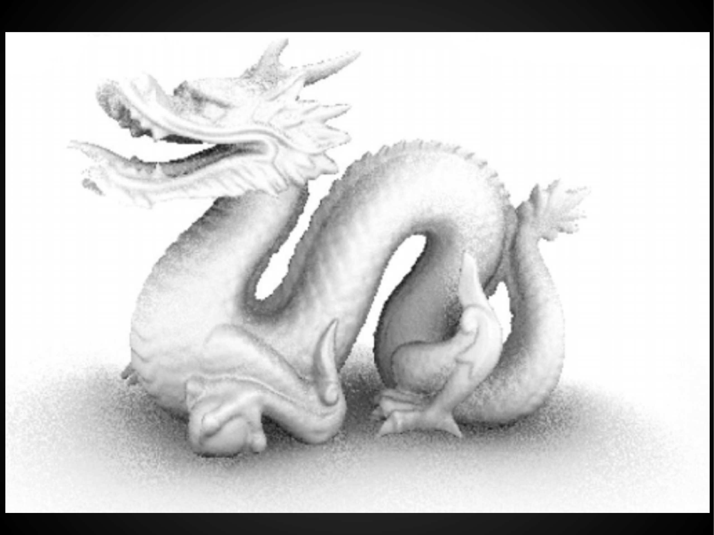

随后使用边缘保持滤波平滑噪声。普通高斯模糊会让 AO 跨越物体边界，双边滤波则同时参考空间距离、深度差和法线差。


双边权重可以概括为：

$$
w(p,q)
=
w_s(\lVert p-q\rVert)
\,w_z(|z_p-z_q|)
\,w_n(\mathbf{n}_p\cdot\mathbf{n}_q)
$$

这样同一表面内的噪声会被平滑，而深度和法线不连续处尽量保留边界。

## 25. HBAO：用地平线角度改进采样

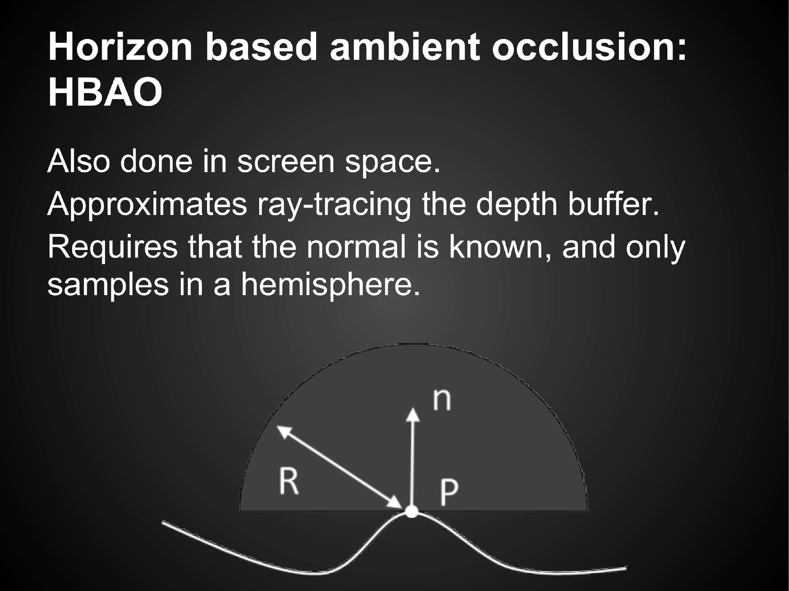

Horizon-Based Ambient Occlusion（HBAO）不是简单统计球形区域中的点，而是沿屏幕上的多个方向搜索最高遮挡角。对每个切片方向，附近深度形成一条“地平线”；地平线越高，可见半球越小。

它显式利用表面法线和角度关系，通常比早期球形 SSAO 更稳定，也能减少把表面自身误判为遮挡的问题，但本质上仍受屏幕空间信息缺失限制。

## 26. 效果对比

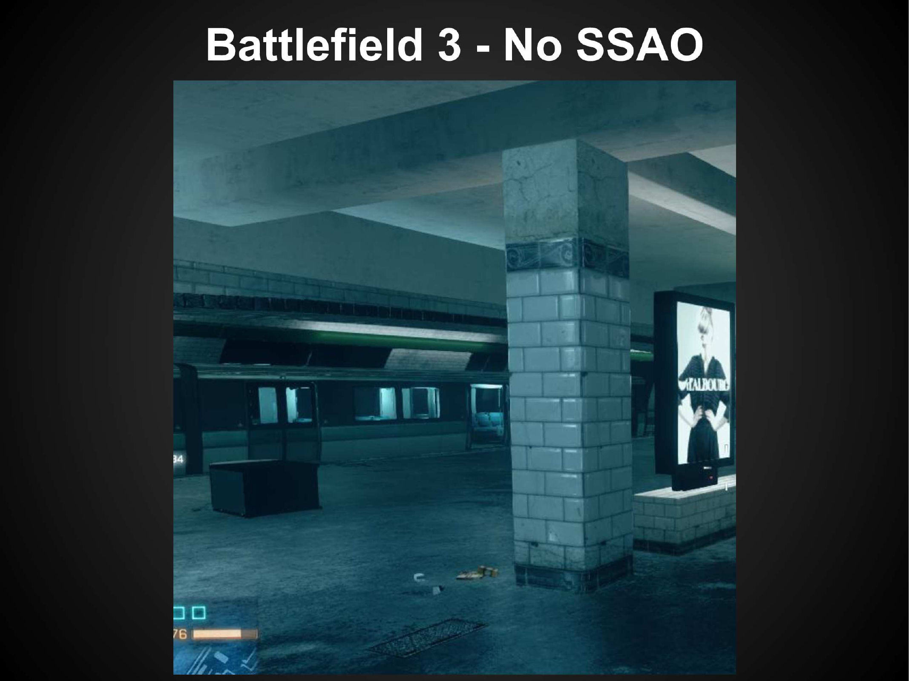

关闭 AO 时，缺少直接阴影的接触区域容易显得漂浮，墙角与细小凹槽不够清晰。

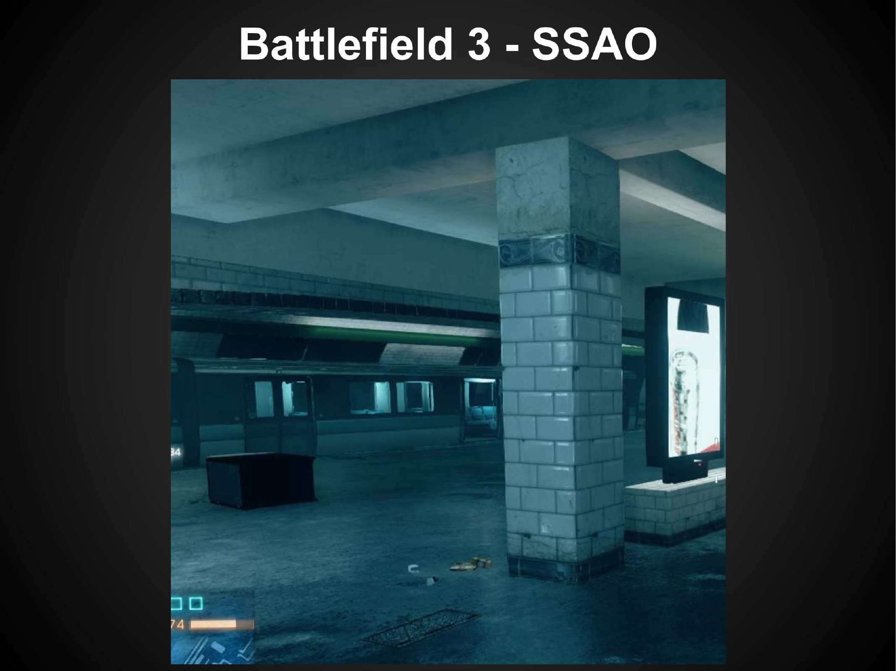

开启 SSAO 后，接触处和局部凹陷变暗，空间层次更明显。但半径或强度过大时会像给物体描黑边。

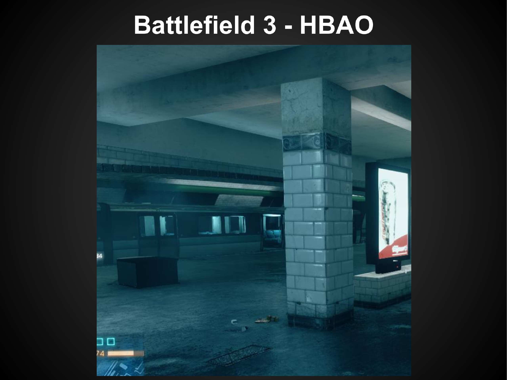

HBAO 通常提供更连贯的方向遮蔽，但它仍是一种经验性的局部明暗增强，不应被误解为真实间接光。

## 27. 三类三维 GI 与 SSAO 的关系

| 方法 | 使用的数据空间 | 估计内容 | 看不到什么 |
| --- | --- | --- | --- |
| RSM | 光源屏幕空间 | 直接受光表面产生的一次反弹 | 光源看不到的 VPL、常省略二次可见性 |
| LPV | 世界空间三维网格 | 传播后的低频间接光 | 小于网格的几何细节 |
| VXGI | 世界空间层次体素 | 锥体范围内的间接辐亮度 | 小于体素的细节、准确高频可见性 |
| SSAO | 相机屏幕空间 | 局部环境可见比例 | 屏幕外和被遮住的几何、真实光照颜色 |

SSAO 经常与其他 GI 方法同时使用：GI 提供彩色间接光，AO 负责增强局部接触感。但必须避免把同一遮蔽重复计算，导致墙角过黑。

## 28. 常见误解

### 误解一：LPV 传播十次就等于十次真实反弹

不是。每次传播都在低分辨率网格和低阶 SH 上进行，能量、方向与遮挡已经被强烈近似。传播轮数只是控制影响范围。

### 误解二：VXGI 就是体素光线追踪

它借用了追踪思想，但锥体每次读取的是一片区域的过滤结果。速度更快，细小遮挡和清晰反射也会丢失。

### 误解三：SSAO 是环境光造成的阴影

SSAO 只估计局部可见比例，不知道真实环境光来自哪里、是什么颜色。它不能生成颜色渗透，也不能替代间接光照。

### 误解四：AO 越黑越有立体感

过强 AO 会让物体像被描边，开阔区域也变脏。合理结果应主要出现在接触点、凹槽和近距离遮挡处。

## 29. 调试清单

### LPV

1. 单独显示网格占据范围与 VPL 注入位置。
2. 分别可视化 4 个 SH 系数，检查方向是否正确。
3. 每次只增加一轮传播，观察能量扩散路径。
4. 在薄墙两侧放置亮暗区域，检查漏光程度。
5. 验证世界坐标到网格坐标的边界和级联切换。

### VXGI

1. 可视化最细体素层，确认三角形没有大面积缺失。
2. 逐级查看 MIP，检查辐亮度和不透明度过滤。
3. 固定锥角，验证层级随距离增大。
4. 分开调试 diffuse cones 和 specular cone。
5. 检查薄墙、体素边界和动态更新区域。

### SSAO

1. 显示线性视图空间深度，确认重建位置正确。
2. 显示法线并检查坐标空间一致性。
3. 固定随机旋转，逐个显示样本投影位置。
4. 分别显示原始 AO 和双边滤波结果。
5. 在物体轮廓处检查光晕，在平面上检查自遮挡。
6. 调整 `radius`、`bias`、`power` 时使用固定测试场景对比。

## 30. 本讲小结

Lecture 8 展示了实时渲染中三种典型的降维方式：

1. LPV 将大量 VPL 汇总进低分辨率三维网格，再做局部传播。
2. VXGI 将几何和光照体素化，用层次结构支持随距离变粗的锥体查询。
3. SSAO 将半球可见性问题投影到当前屏幕的深度邻域中。
4. AO 系数是余弦加权可见性的归一化积分，分母 `pi` 来自单位半球的投影面积。
5. 所有方法的伪影都能追溯到被丢掉的信息：网格分辨率、方向频率、精确可见性或屏幕外几何。

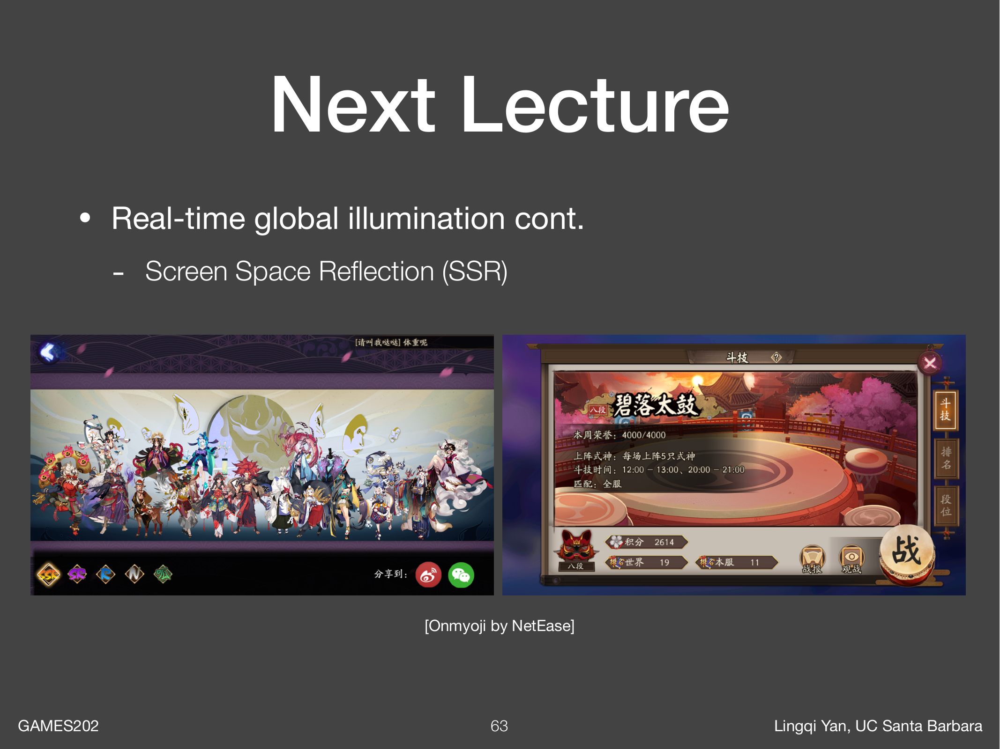

下一讲会在屏幕空间继续前进：利用当前画面的深度和颜色进行光线步进，近似 Screen Space Reflection，并进一步构建屏幕空间全局光照。
