# GAMES202 Lecture 9：Real-time Global Illumination in Screen Space

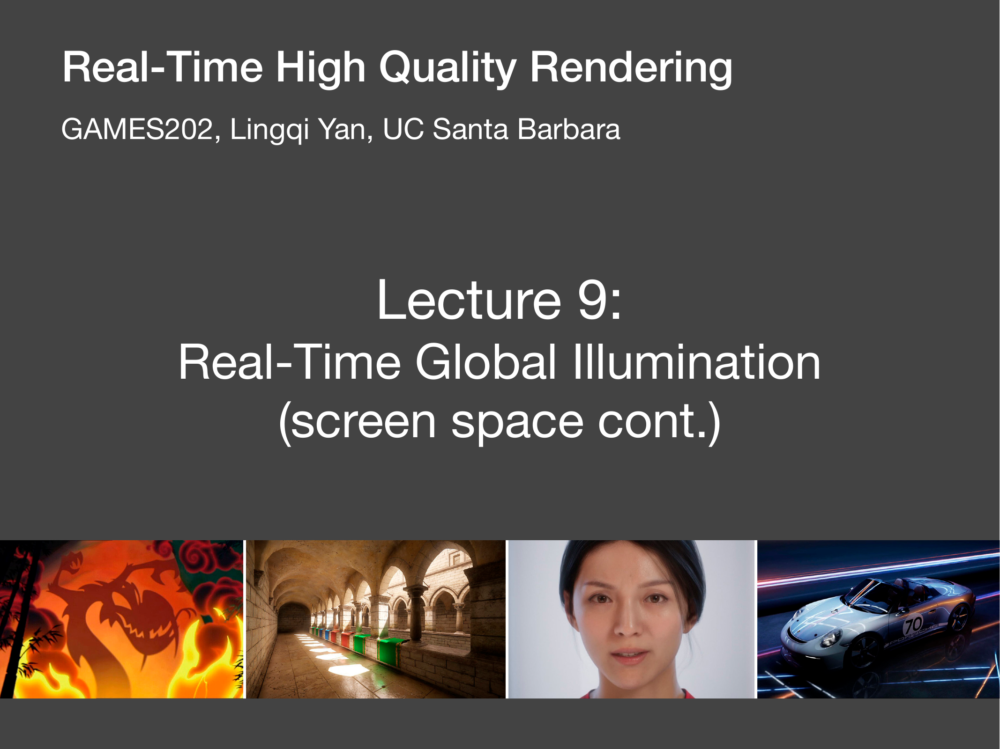

Lecture 8 用 SSAO 估计局部可见比例，但它只回答“周围有多少方向被挡住”，并不知道挡住光线的表面是什么颜色。Lecture 9 继续挖掘屏幕空间已有信息：SSDO 用可见表面的直接光近似一次间接光，SSR 则在深度缓冲中追踪反射射线。

> 本讲的核心：不访问三角形和场景加速结构，仅凭相机已经渲染出的深度、法线和颜色，能把全局光照近似到什么程度？

## 1. 本讲路线

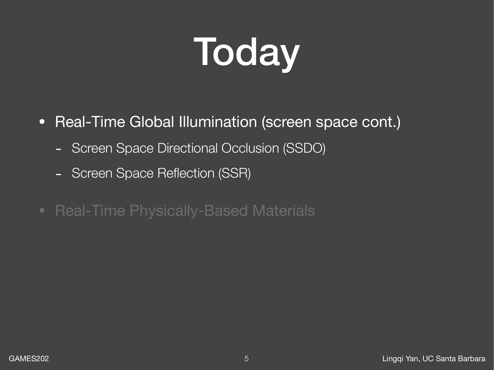

本讲分为两部分：

1. **Screen Space Directional Occlusion（SSDO）**：不再把所有间接入射光假设为同一个常量，而是读取遮挡表面的直接光照和颜色。
2. **Screen Space Reflection（SSR）**：沿反射方向在屏幕深度中寻找交点，再用交点像素的颜色为当前像素着色。

两者都把当前屏幕当作一个简化场景。优点是快，缺点是屏幕没有记录的信息无法恢复。

# 第一部分：Screen Space Directional Occlusion

## 2. SSAO 丢掉了什么

SSAO 在“均匀间接光”和“Lambert 漫反射”的假设下，把间接光照写成环境光乘可见比例：

$$
L_o^{\mathrm{indir}}(p)
\approx
k_A(p)\,L_{\mathrm{ambient}}\,\rho
$$

其中 `k_A` 只表示余弦加权的可见方向比例。两个问题随之而来：

- 被墙挡住时，SSAO 只会减光，不会计算墙反射到当前点的颜色。
- 未被挡住的方向都共享同一环境光，方向性照明被抹掉。

SSDO 的目标就是利用 G-buffer 中已经存在的颜色、法线和直接光，补回一部分方向信息。

## 3. SSDO 的关键想法

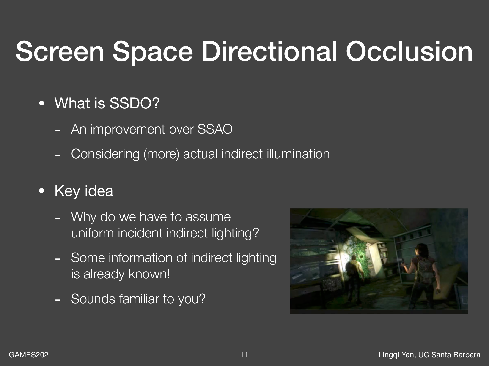

对当前着色点 `p` 发射半球样本：

- 若样本方向没有碰到屏幕中的表面，就从环境光获取直接入射光。
- 若样本方向碰到另一个可见表面 `q`，就把 `q` 视为一个小型次级光源，估计它反射到 `p` 的间接光。

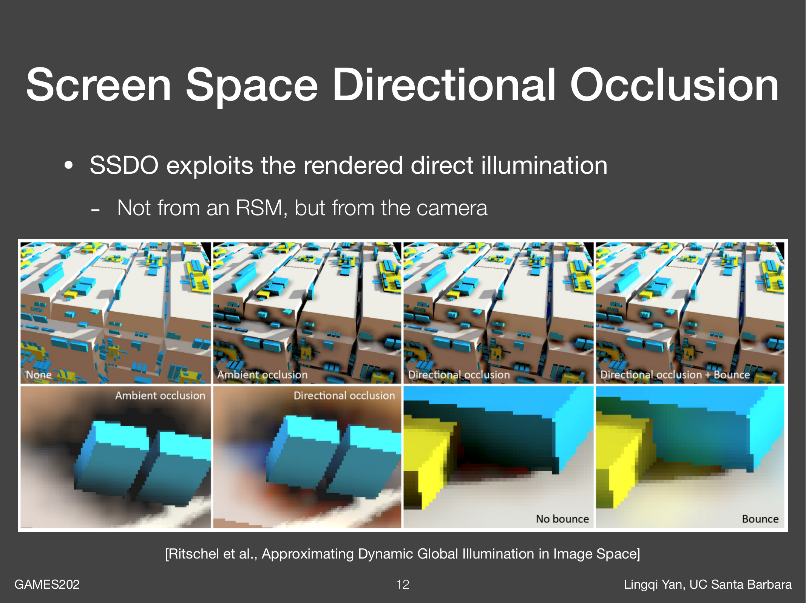

RSM 从光源视角收集直接受光表面，SSDO 则从相机视角读取已经完成直接光照的像素。它不需要额外的光源 G-buffer，但只能使用相机看得到的表面。

## 4. SSDO 与路径追踪的关系

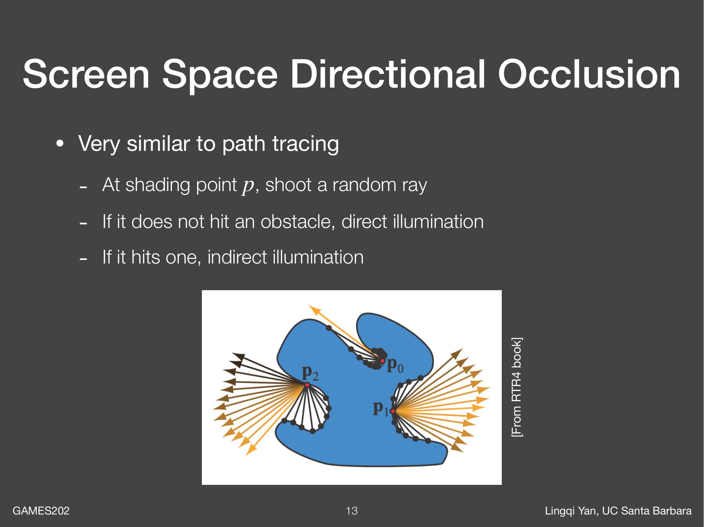

路径追踪在 `p` 处采样方向并发射射线。若命中 `q`，继续读取 `q` 沿反向路径的出射光。SSDO 的逻辑很相似，只是把真正的场景射线求交替换成深度缓冲查询，并把 `q` 的光照近似为当前帧中已知的直接光。

对一次反弹，离散估计可写为：

$$
L_o^{\mathrm{indir}}(p,\omega_o)
\approx
\frac{1}{N}
\sum_{k=1}^{N}
\frac{
L_o^{\mathrm{direct}}(q_k,q_k\rightarrow p)
f_r(p,\omega_k,\omega_o)
\max(0,\mathbf{n}_p\cdot\omega_k)
}{
p(\omega_k)
}
$$

其中 `p(omega_k)` 是方向采样的概率密度。实际实时实现常进一步简化距离、面积和概率补偿。

## 5. SSAO 与 SSDO 的本质区别

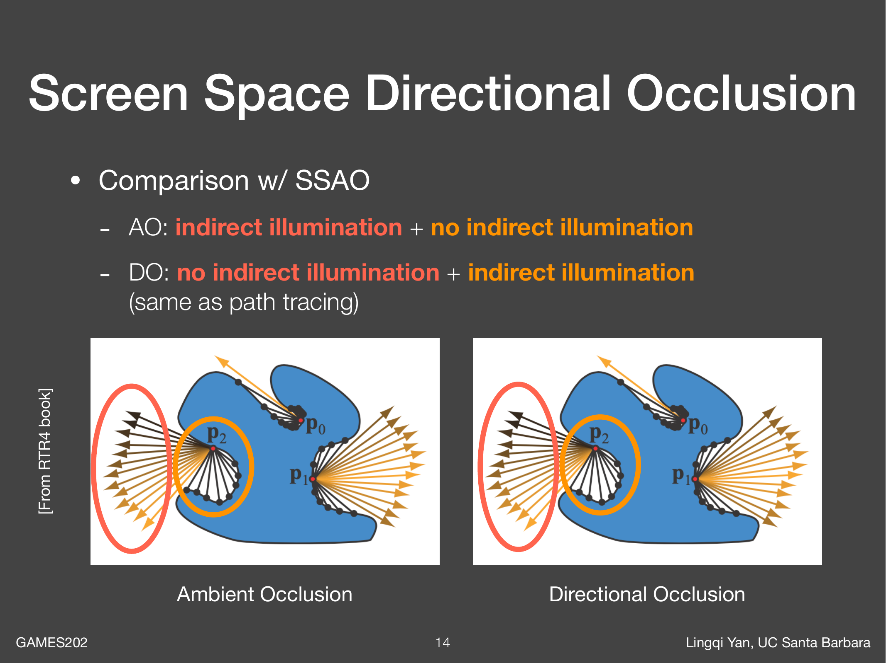

可以把半球方向分成两类：

- SSAO：未遮挡方向有统一环境光，遮挡方向贡献零。
- SSDO：未遮挡方向使用环境光，遮挡方向使用命中表面反射的间接光。

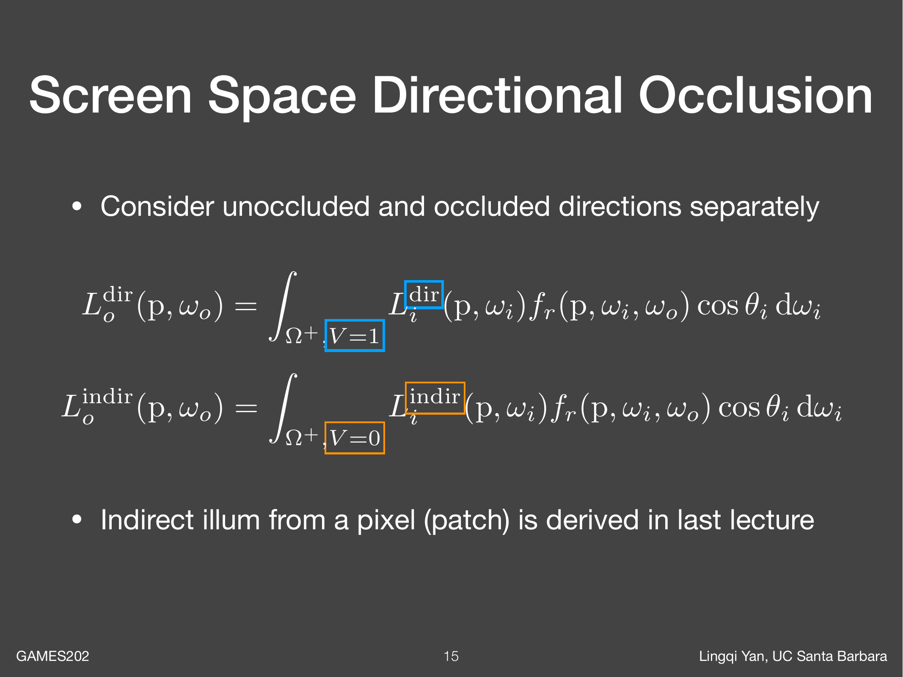

课程将两部分写为：

$$
L_o^{\mathrm{dir}}(p,\omega_o)
=
\int_{\Omega^+,\,V=1}
L_i^{\mathrm{dir}}(p,\omega_i)
f_r(p,\omega_i,\omega_o)
\cos\theta_i
\,\mathrm{d}\omega_i
$$

$$
L_o^{\mathrm{indir}}(p,\omega_o)
=
\int_{\Omega^+,\,V=0}
L_i^{\mathrm{indir}}(p,\omega_i)
f_r(p,\omega_i,\omega_o)
\cos\theta_i
\,\mathrm{d}\omega_i
$$

这里的 `V = 0` 不再等于“完全没有光”，而是表示该方向先碰到另一个表面。若能知道这个表面的出射光，就能得到一次间接光。

## 6. SSDO 如何在屏幕中取样

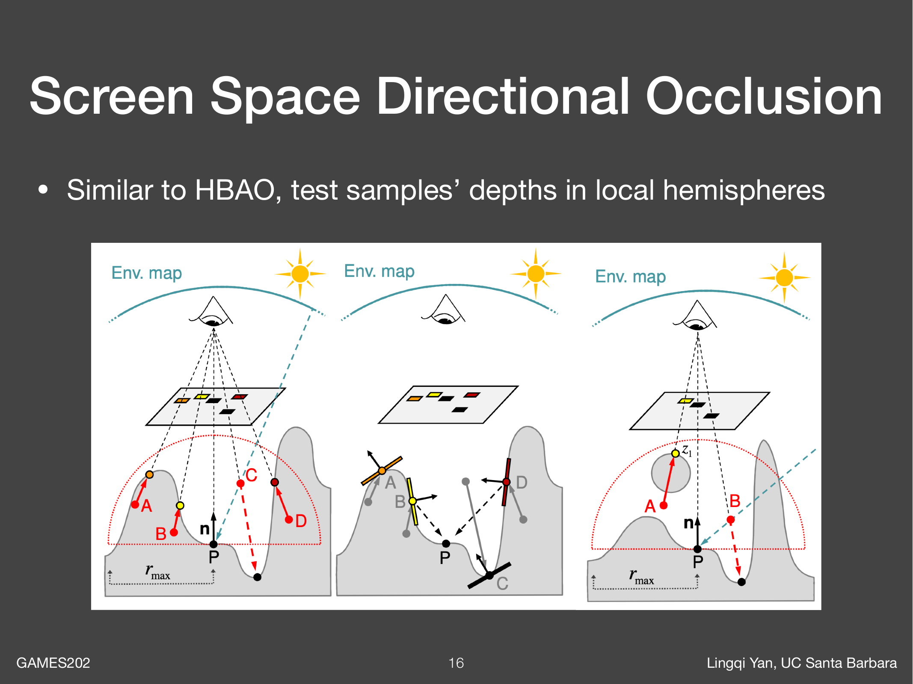

实现流程与 HBAO 类似：

1. 从深度重建 `p` 的视图空间位置。
2. 根据法线构建局部半球。
3. 在半球内生成样本位置。
4. 将样本投影到屏幕，比较深度。
5. 若命中表面，读取该像素的位置、法线、材质和直接光。
6. 用几何项与接收点 BRDF 累加间接光。

一个简化实现如下：

```glsl
vec3 evaluateSSDO(vec2 uv, vec3 p, vec3 n) {
    vec3 indirect = vec3(0.0);
    mat3 frame = buildTBN(n, randomRotation(uv));

    for (int i = 0; i < SAMPLE_COUNT; ++i) {
        vec3 samplePos = p + frame * sampleKernel[i] * radius;
        vec2 sampleUV = projectToUV(samplePos);
        vec3 q = reconstructViewPosition(sampleUV);

        if (!isLocalHit(samplePos, q, thickness)) {
            continue;
        }

        vec3 nq = normalize(texture(normalBuffer, sampleUV).xyz);
        vec3 directAtQ = texture(directLightingBuffer, sampleUV).rgb;
        vec3 d = p - q;
        float r2 = max(dot(d, d), 1e-4);
        vec3 wi = d * inversesqrt(r2);

        float fromQ = max(dot(nq, wi), 0.0);
        float atP = max(dot(n, -wi), 0.0);
        indirect += directAtQ * fromQ * atP / r2;
    }

    return indirect / float(SAMPLE_COUNT);
}
```

这段代码只说明结构。真实实现还要处理样本 PDF、像素代表的面积、BRDF、颜色空间、边界和降噪。

## 7. SSDO 的局限

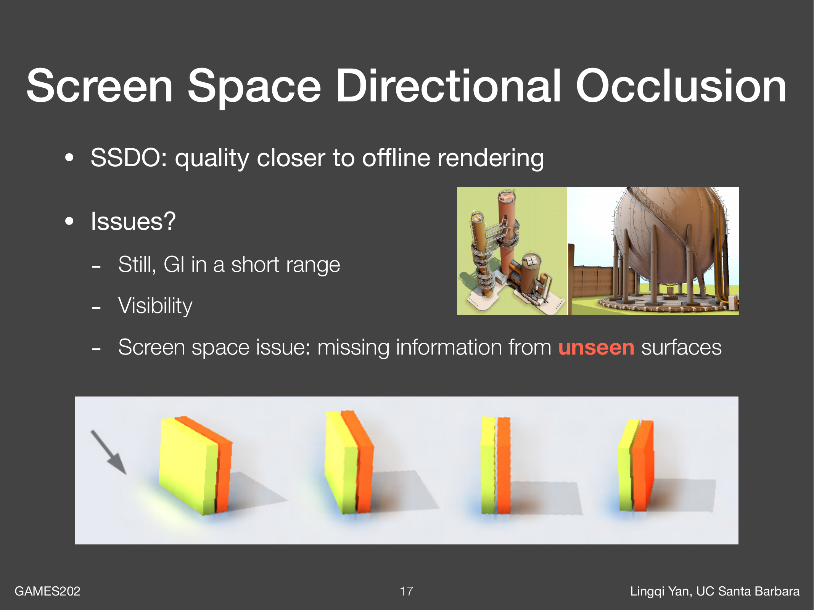

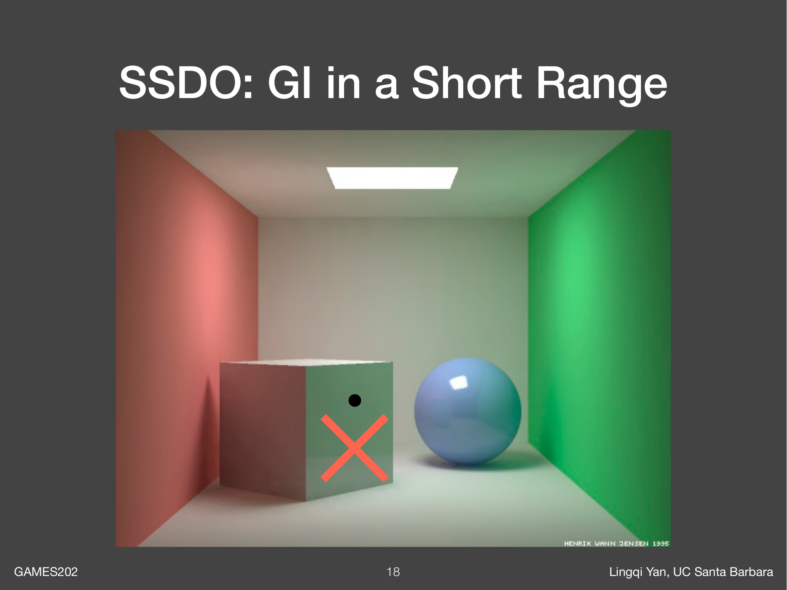

- **范围短**：采样半径有限，只能得到局部颜色渗透。
- **屏幕缺失**：相机看不到的表面不能成为次级光源。
- **深度单层**：每个像素只记录最前方表面，背后的几何被丢弃。
- **可见性近似**：屏幕深度命中不等于真实三维路径完全无遮挡。
- **噪声与闪烁**：样本少、投影离散且随视角变化。

SSDO 比 SSAO 更接近一次路径追踪，但它没有摆脱屏幕空间的根本限制。

# 第二部分：Screen Space Reflection

## 8. SSR 在做什么

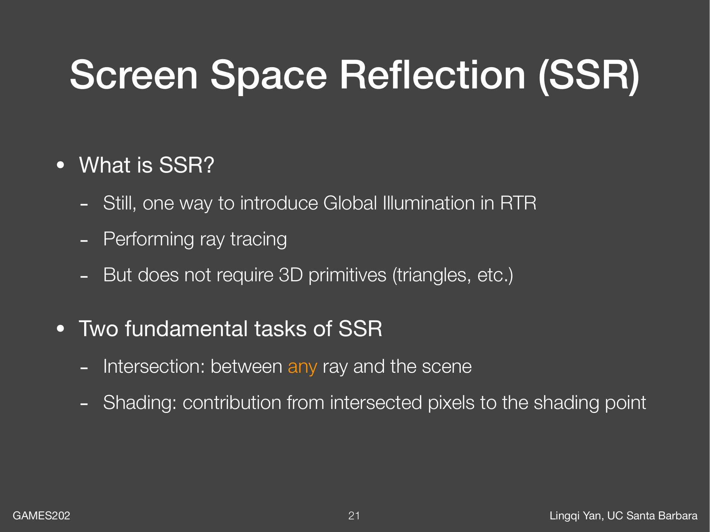

SSR 仍然是一种全局光照近似。它要完成两个任务：

1. **Intersection**：当前点的反射射线在屏幕深度中是否命中另一个像素？
2. **Shading**：命中后，这个像素向当前点贡献多少光？

与普通光线追踪不同，SSR 不访问三角形，只把深度缓冲当作场景表面。

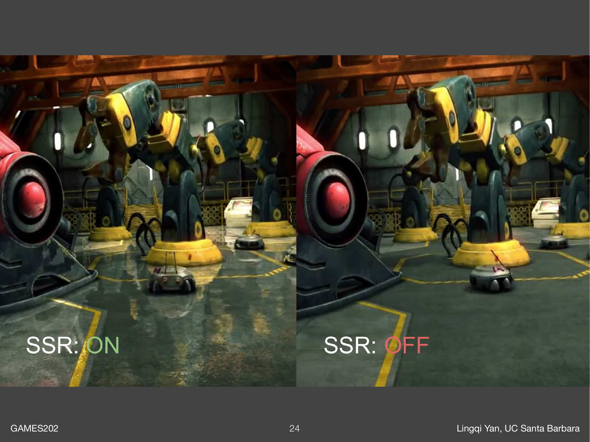

## 9. 为什么屏幕数据足够产生反射

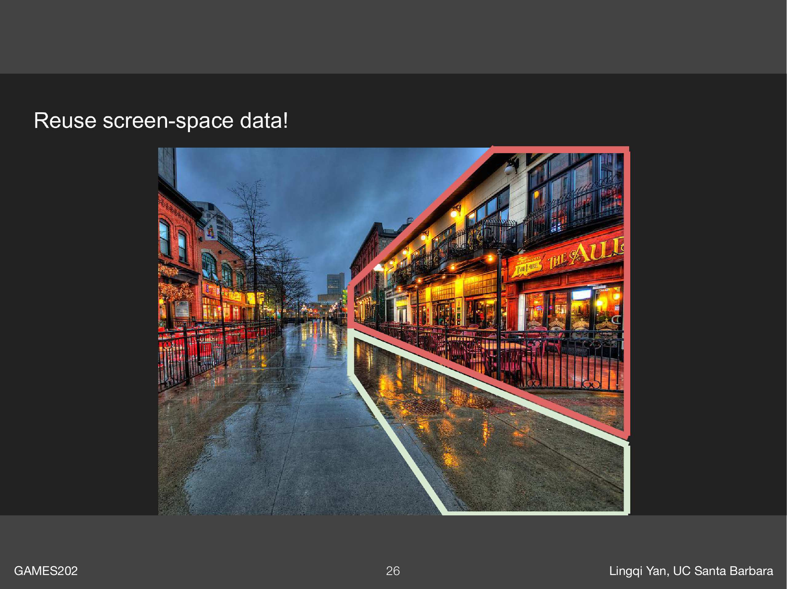

相机当前能看到的表面已经完成着色，并保存了颜色、深度和法线。若反射射线命中其中一个像素，就可以直接读取该像素的颜色作为入射辐亮度。

基本镜面 SSR：

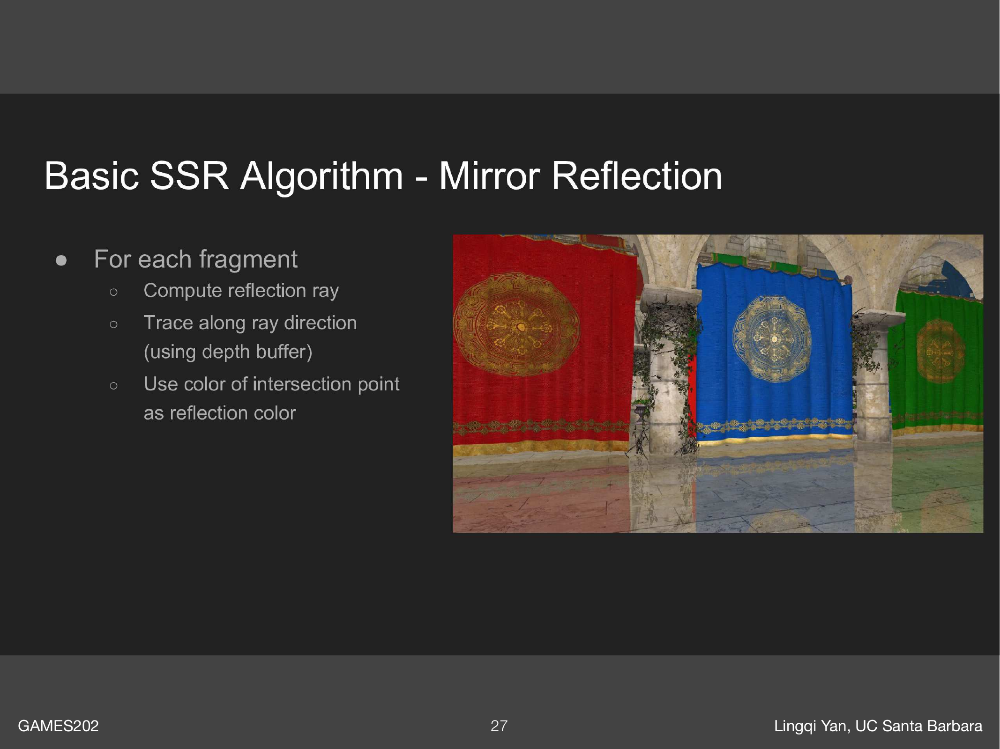

1. 从深度重建当前点 `p`。
2. 读取并转换法线 `n`。
3. 计算视线关于法线的反射方向 `r`。
4. 沿 `r` 在视图空间或屏幕空间步进。
5. 用深度缓冲检测交叉。
6. 命中后读取颜色缓冲。

反射方向为：

$$
\mathbf{r}
=
\mathbf{v}
-
2(\mathbf{v}\cdot\mathbf{n})\mathbf{n}
$$

这里 `v` 必须统一为“从当前点出发的入射方向”或其相反方向，具体符号取决于引擎约定。

## 10. 粗糙反射不是简单模糊

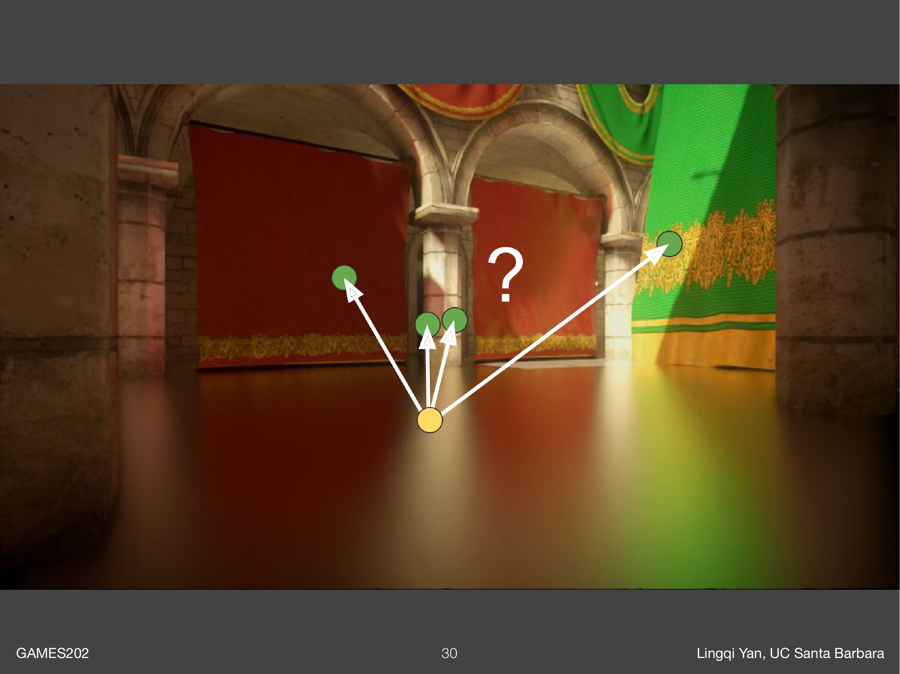

镜面只需要一个确定方向。粗糙微表面会产生一簇反射方向，应根据 BRDF 重要性采样多条射线，或使用预过滤结果近似积分。

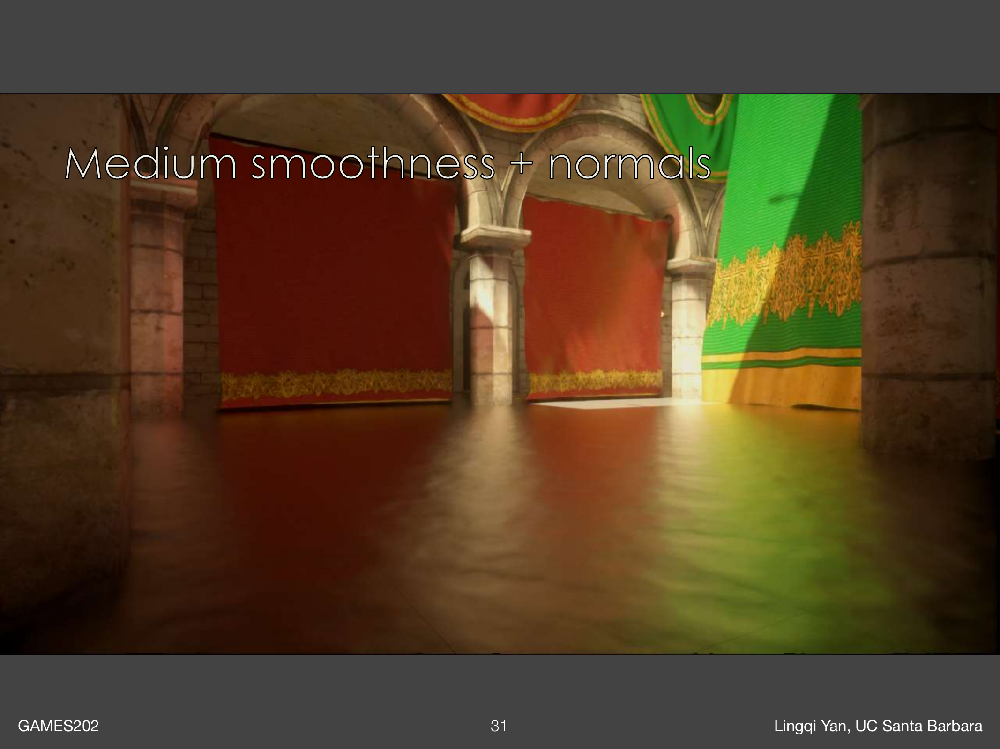

只按颜色做普通模糊会跨越几何边界，并不能反映法线、粗糙度与反射方向。合理的粗糙 SSR 应让滤波核和采样分布随材质变化。

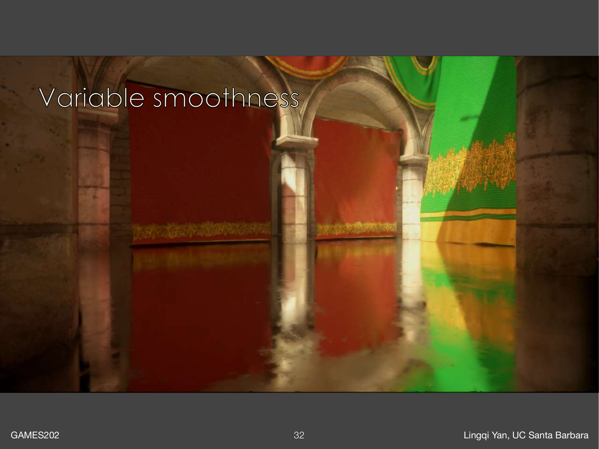

## 11. SSR 依赖哪些 G-buffer

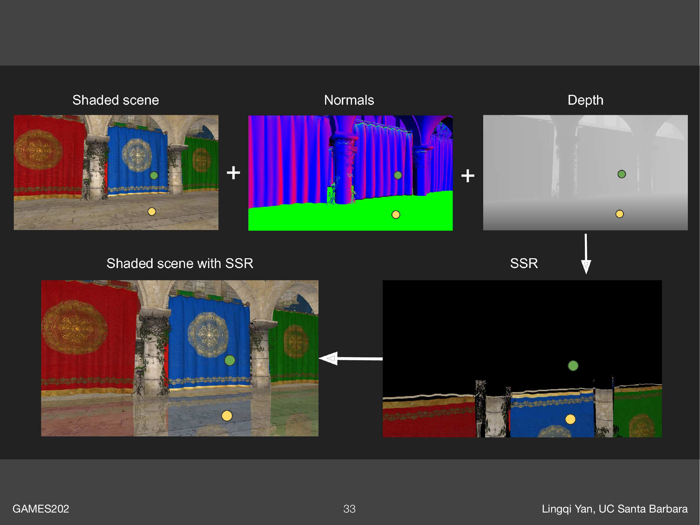

典型输入包括：

- 线性深度或可重建位置的深度
- 世界空间或视图空间法线
- 已着色场景颜色
- 材质粗糙度
- 投影矩阵及其逆矩阵

坐标空间错误是 SSR 最常见的 bug。位置、法线、视线与射线方向必须处于同一空间。

## 12. 线性 Ray March

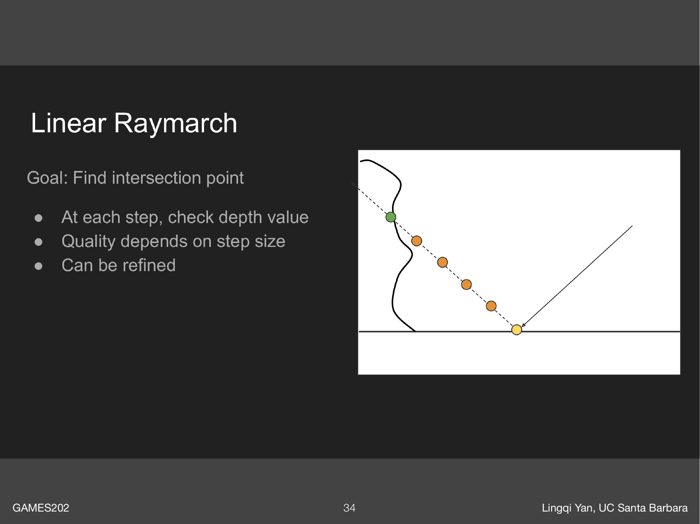

最直接的方法是沿射线按固定步长前进。对第 `k` 个样本：

$$
\mathbf{x}_k
=
\mathbf{p}
+
t_k\mathbf{r}
$$

将 `x_k` 投影到屏幕坐标，读取该像素的场景深度。若射线样本从表面前方跨到表面后方，就认为发生命中。

```glsl
bool traceLinearSSR(vec3 originVS, vec3 rayVS, out vec2 hitUV) {
    float t = startOffset;
    float previousDelta = 0.0;

    for (int i = 0; i < maxSteps; ++i) {
        vec3 rayPoint = originVS + rayVS * t;
        vec2 uv = projectToUV(rayPoint);

        if (outsideScreen(uv)) {
            return false;
        }

        float sceneZ = reconstructViewZ(uv, 0);
        float delta = rayPoint.z - sceneZ;

        if (crossedSurface(previousDelta, delta)
            && abs(delta) < thickness) {
            hitUV = refineHit(originVS, rayVS, t - stepSize, t);
            return true;
        }

        previousDelta = delta;
        t += stepSize;
    }

    return false;
}
```

固定步长的矛盾是：步长小则慢，步长大则容易跨过薄物体。命中后常用二分搜索细化交点。

## 13. 从线性步进到层次追踪

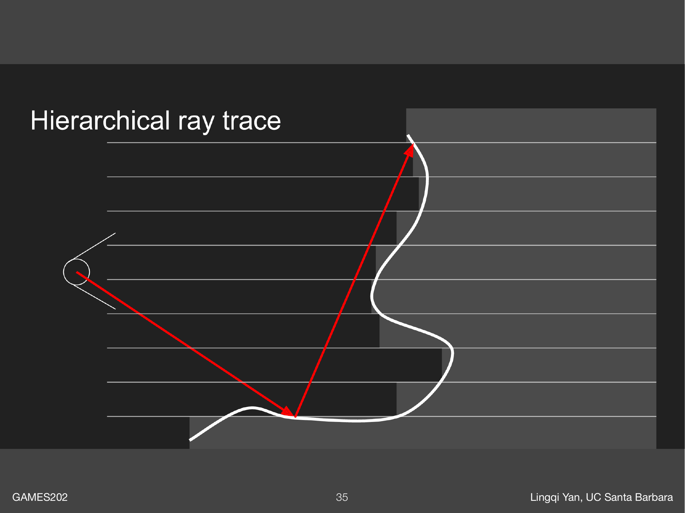

线性步进逐像素检查，而 Hi-Z 追踪先在粗层级检查一大块屏幕区域。若射线显然位于该区域所有表面之前，就可一次跳过整块区域。

这与 BVH 的思想相同：先排除大节点，再进入可能相交的子节点。

## 14. 深度金字塔为什么保存最小值

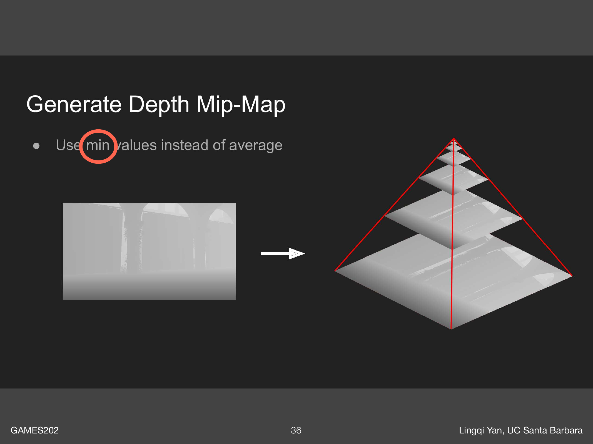

每个粗层级 texel 保存其子区域中离相机最近的深度：

$$
Z_{l+1}(x,y)
=
\min_{
(i,j)\in\mathrm{children}(x,y)
}
Z_l(i,j)
$$

这里假设深度数值越小越接近相机。使用反向 Z 时聚合操作和比较逻辑都要相应调整。

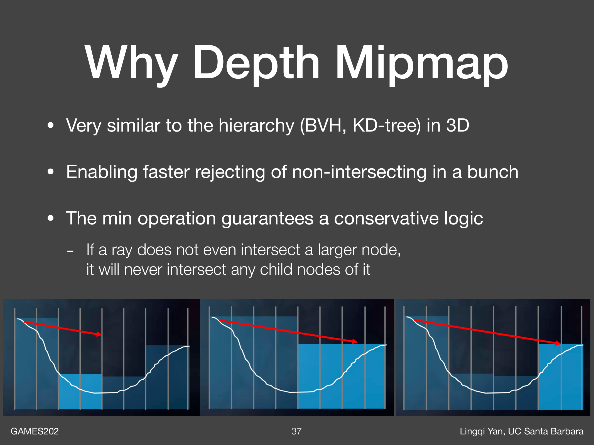

保存最近深度具有保守性：若射线连这一整块中最近的表面都没有越过，就不可能命中任何更深的子表面，可以直接跳过。

## 15. Hi-Z 追踪的升层与降层

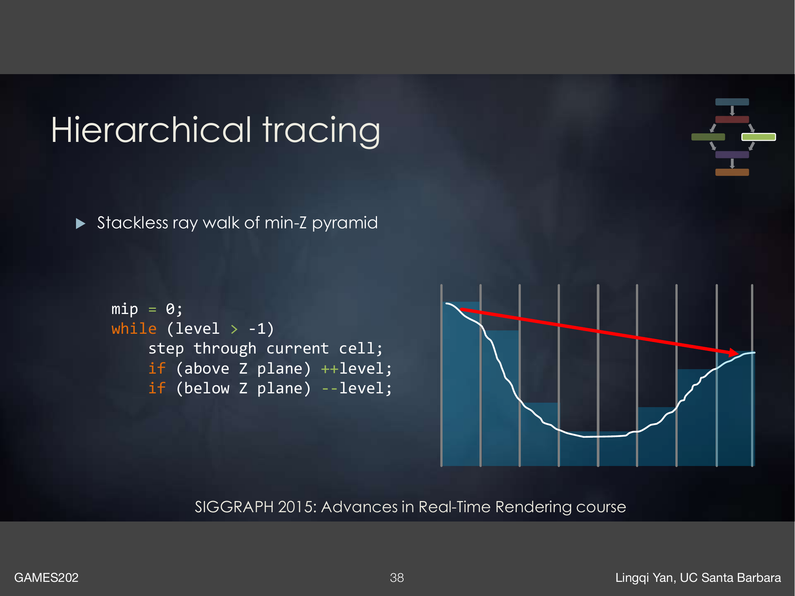

追踪时维护当前层级：

- 射线位于粗 texel 的最近深度之前，说明整块安全，可跨过当前单元并尝试升到更粗层。
- 射线可能进入表面之后，说明该区域可能有交点，需要下降到更细层检查。
- 到最细层并确认深度交叉时，得到命中。

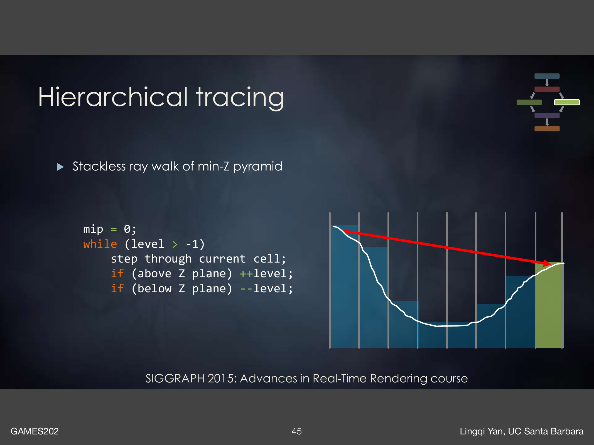

```glsl
int level = startMip;

while (level >= 0 && steps < maxSteps) {
    float nearestZ = sampleHiZ(rayUV, level);

    if (rayIsInFront(rayZ, nearestZ)) {
        advanceToNextCell(rayUV, rayZ, level);
        level = min(level + 1, maxMip);
    } else {
        level -= 1;
    }
}
```

真实实现还要处理透视投影下的射线参数化、跨单元边界、厚度容差和反向 Z。

## 16. SSR 的根本缺失信息

### 隐藏几何

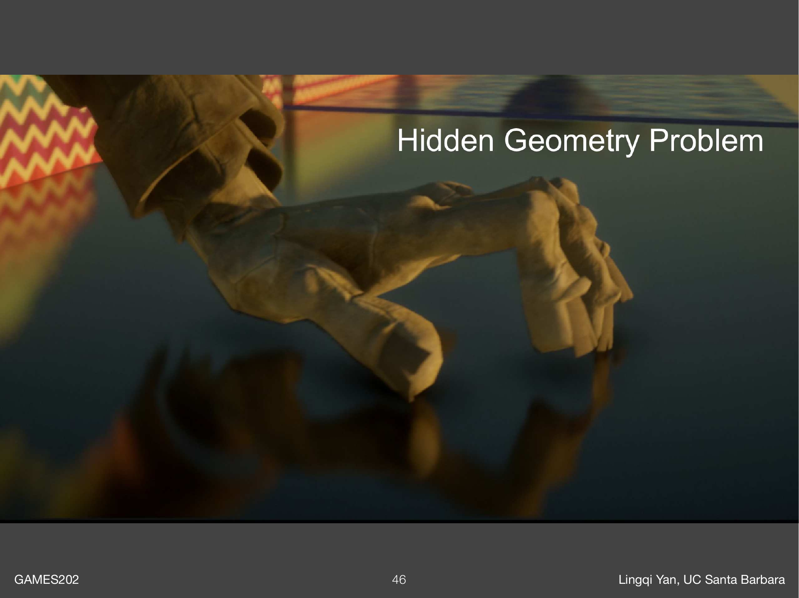

当前相机看不到的物体不会出现在深度与颜色缓冲中。反射中本应出现但被其他物体遮住的几何，会直接消失。

### 屏幕边界截断

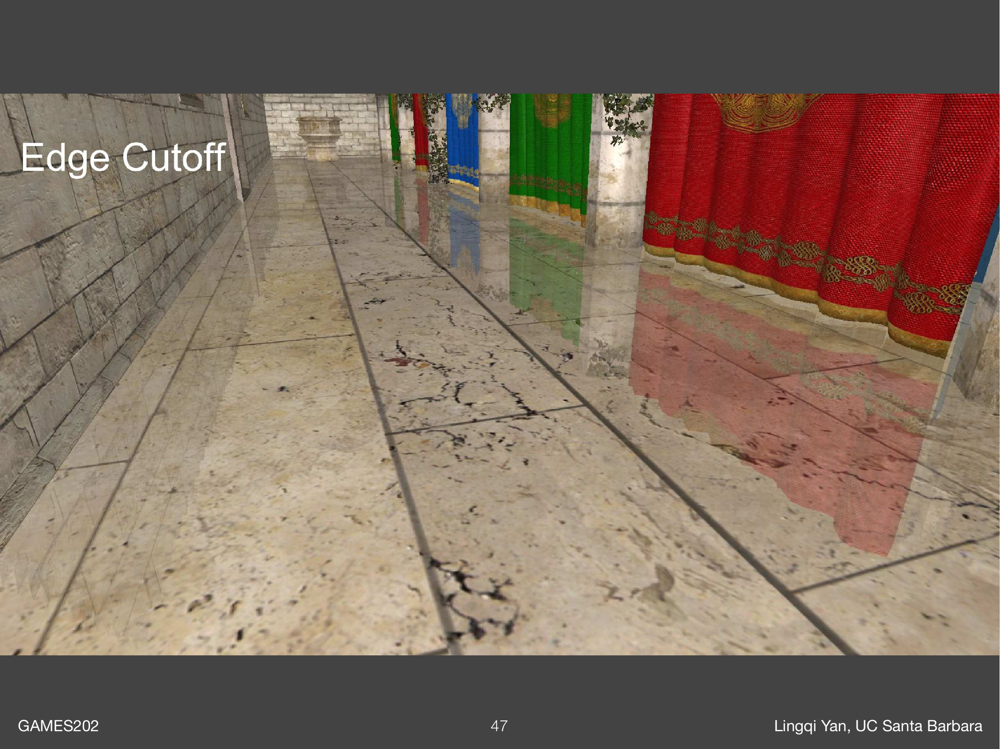

射线离开屏幕后无法继续追踪，即使真实场景中仍有反射物体，SSR 也只能返回失败。

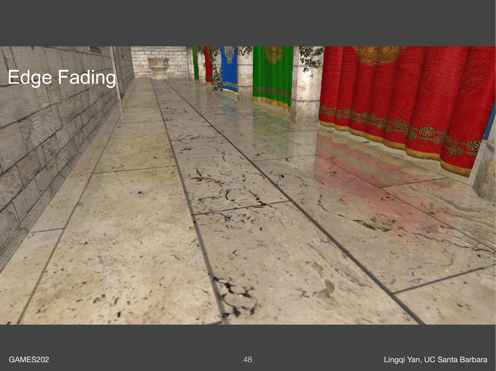

常用屏幕边缘淡出：

$$
w_{\mathrm{edge}}
=
\mathrm{smoothstep}(0,b,d_{\mathrm{edge}})
$$

其中 `d_edge` 是命中点到屏幕边界的归一化距离。淡出不能恢复信息，只是让缺失不那么突兀。

## 17. 为什么 SSR 不需要额外平方距离衰减

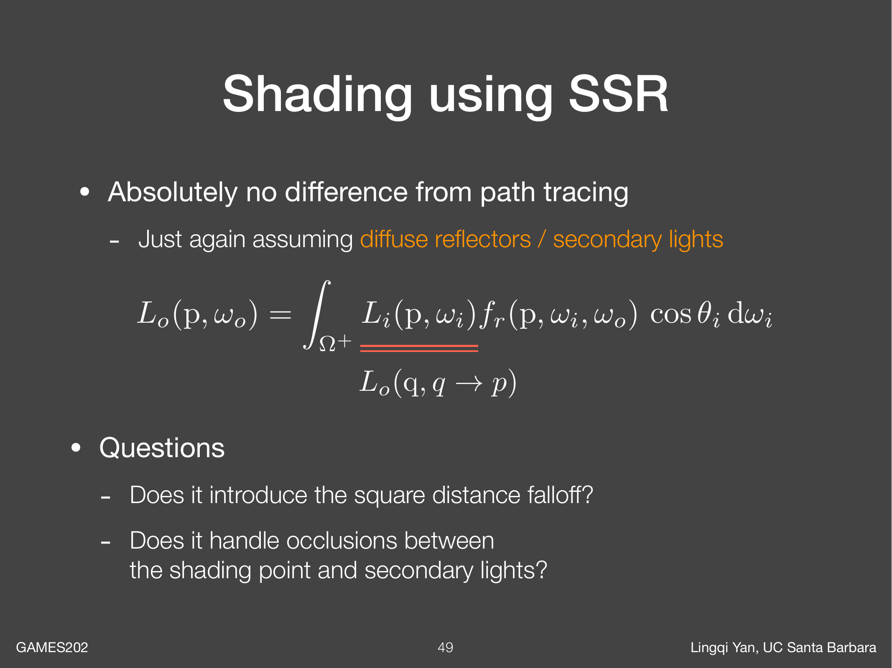

SSR 命中点 `q` 后读取的是 `q` 沿当前路径方向的出射辐亮度。辐亮度沿真空直线传播时保持不变，因此不应再人为乘一次平方距离衰减。

这与把 `q` 当作有限面积 VPL 不同。VPL 公式需要面积到立体角的转换和几何项；SSR 的方向采样直接对应渲染方程中的入射辐亮度。

另一个优势是：从 `p` 到 `q` 的可见性已经由射线深度追踪检查，因此不像基础 RSM 那样完全忽略次级路径遮挡。

## 18. 真实粗糙反射需要什么

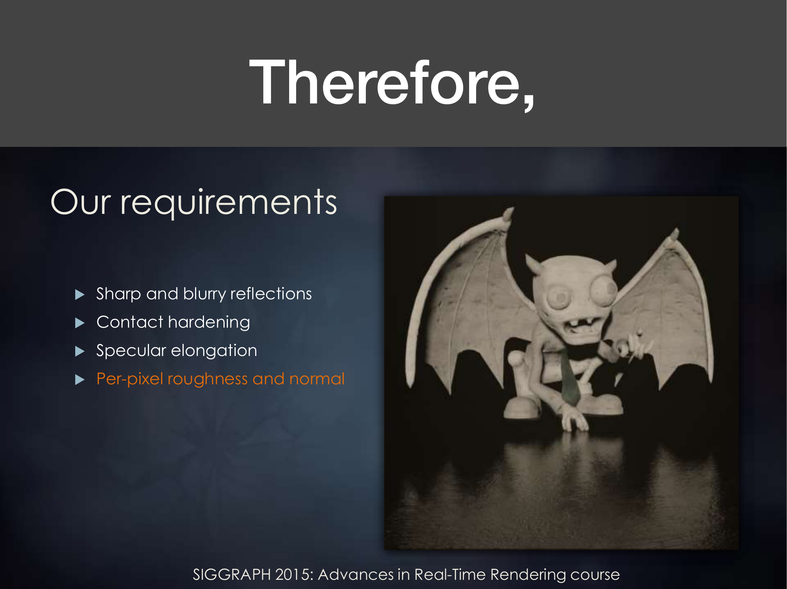

高质量反射希望同时具备：

- 清晰和模糊反射
- 接触处更清晰的 contact hardening
- 掠射角方向的高光拉伸
- 每像素粗糙度和法线

简单的“镜面 SSR 加固定高斯模糊”无法满足这些要求。

### BRDF 重要性采样

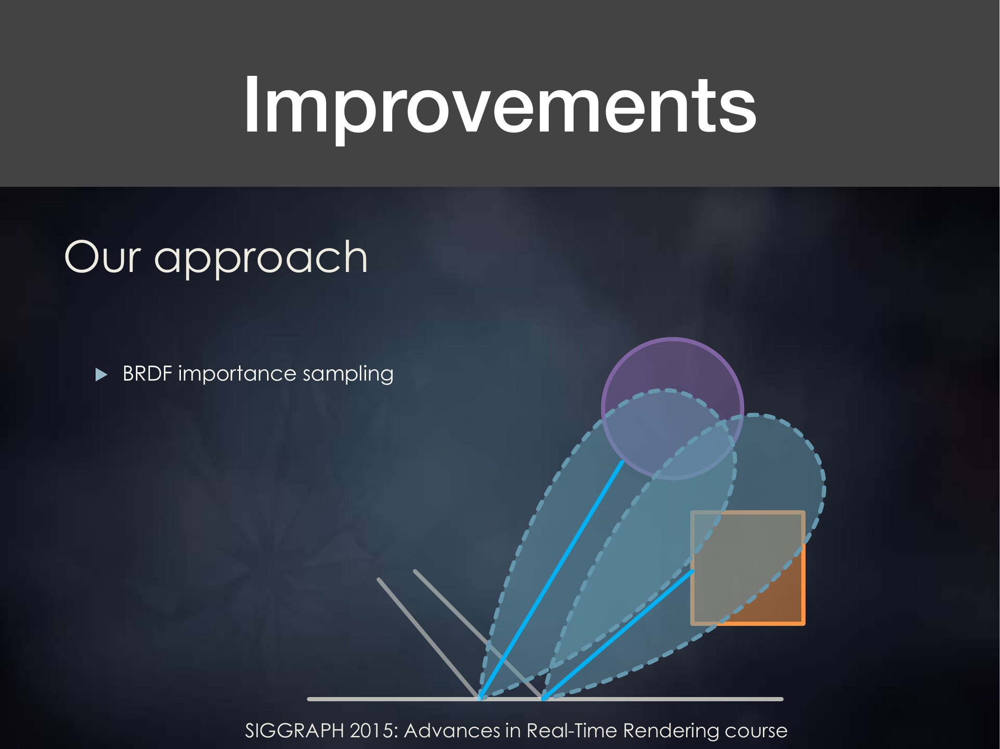

粗糙度决定微表面法线分布。根据 BRDF 采样反射方向，可以把有限射线集中到贡献大的区域。

### 邻域命中复用

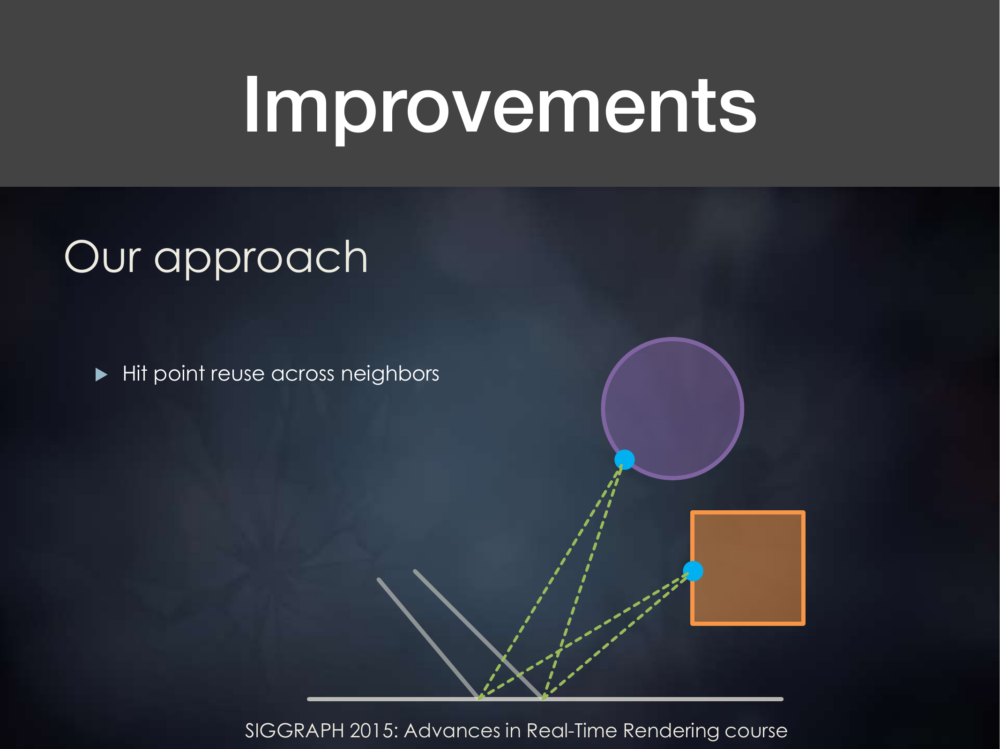

相邻像素往往具有相似材质和反射方向，可复用彼此的命中点，再按当前像素的 BRDF 重新加权。现代实时算法中的空间复用与这一思想相通。

### 预过滤样本

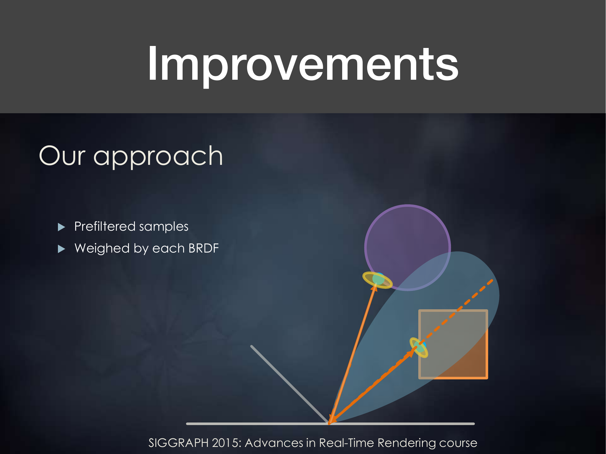

将多个命中样本预过滤，可降低每像素追踪成本。但过滤必须考虑深度、法线、粗糙度和方向，否则容易把不相关表面混合。

## 19. SSR 的优缺点

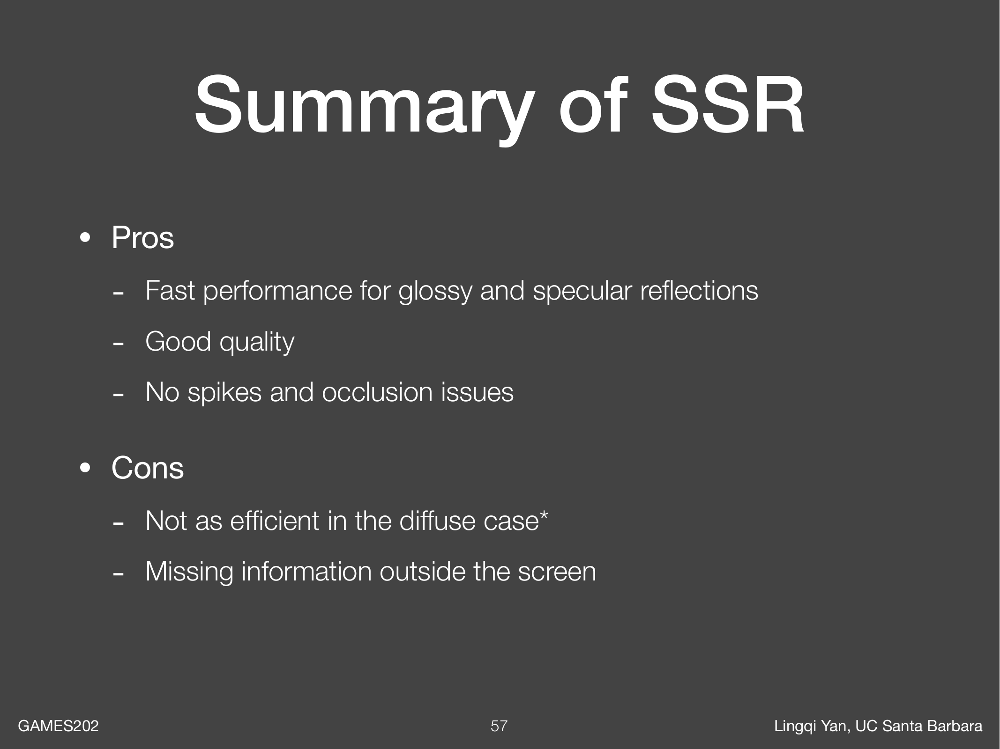

**优点：**

- 不需要场景三角形和 BVH，容易集成到延迟渲染管线。
- 对镜面和中等粗糙反射速度快、效果明显。
- 深度追踪自然检查了当前点到命中点之间的屏幕空间遮挡。
- 可直接复用已着色颜色，复杂材质和直接光已经包含在其中。

**缺点：**

- 屏幕外、相机背面和被遮挡的几何完全缺失。
- 深度缓冲只有一层，薄物体和厚度判断困难。
- 漫反射需要覆盖半球，SSR 对此效率不高。
- 视角变化会引发反射出现、消失和闪烁。
- 半透明物体、多层表面和动态分辨率会增加工程复杂度。

实际引擎常把 SSR 与环境贴图、反射探针或硬件光追混合，失败时使用其他来源补洞。

## 20. SSDO 与 SSR 对比

| 维度 | SSDO | SSR |
| --- | --- | --- |
| 主要目标 | 局部一次漫反射间接光 | 镜面与粗糙反射 |
| 采样区域 | 法线半球附近 | 反射波瓣附近 |
| 命中数据 | 深度、法线、直接光 | 深度、法线、已着色颜色 |
| 主要参数 | 半径、样本数、厚度 | 步长、层级、厚度、粗糙度 |
| 典型问题 | 局部、噪声、漏光 | 缺失反射、边缘截断、闪烁 |

两者的数学外观不同，但本质一致：在屏幕中近似发射射线，并用命中像素充当场景表面。

## 21. 常见误解

### 误解一：SSDO 只是带颜色的 SSAO

不准确。SSDO 不只是给遮蔽因子染色，而是把遮挡方向命中的表面作为一次反弹的光源，重新计算方向、法线和几何贡献。

### 误解二：SSR 命中深度就等于命中三角形

深度缓冲是从当前相机看到的一层二维表面。深度交叉只是近似三维命中，不能代表隐藏几何和背面。

### 误解三：SSR 反射越远就要再除距离平方

若读取的是命中点沿路径传播来的辐亮度，则不需要额外平方衰减。重复衰减会错误地让远处反射过暗。

### 误解四：增加厚度阈值总能修复漏命中

厚度过小会漏掉交点，过大则会把射线后方很远的表面误判为命中，产生拉伸和错误反射。

## 22. 调试清单

1. 显示线性视图空间深度，确认深度方向和反向 Z 约定。
2. 显示视图空间法线，检查法线变换是否使用正确矩阵。
3. 可视化反射方向，验证相机向量符号。
4. 逐步显示线性 ray march 的每个采样点和深度差。
5. 关闭 Hi-Z，先让线性步进得到稳定基准。
6. 可视化各 MIP 层最小深度，检查聚合规则。
7. 分别标记命中失败原因：出屏、步数耗尽、厚度不符、背向。
8. 固定相机和随机数，独立调试粗糙采样与时域滤波。
9. 用薄墙、屏幕边缘、遮挡物和反向 Z 场景建立回归测试。

## 23. 本讲小结

Lecture 9 将屏幕空间从“遮蔽后处理”推进到真正的光传输近似：

1. SSDO 把半球方向分为未遮挡与命中表面的方向，后者贡献一次间接光。
2. SSR 在深度缓冲中追踪反射射线，并读取命中像素的出射辐亮度。
3. 线性 ray march 简单但步长难以兼顾速度和精度。
4. Hi-Z 深度金字塔通过保守排除大块空区域加速追踪。
5. 屏幕空间算法最大的限制不是算力，而是当前画面根本没有保存隐藏信息。

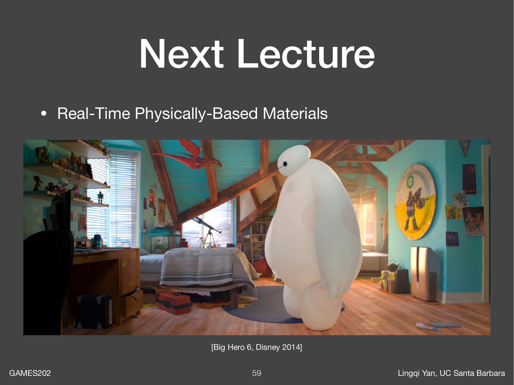

下一讲将从光传输转向表面模型，重新审视微表面 BRDF 的 Fresnel、法线分布和几何遮挡，并讨论粗糙表面为何会丢失多次反射能量。
