# GAMES202 Lecture 10：Real-time Physically-Based Materials

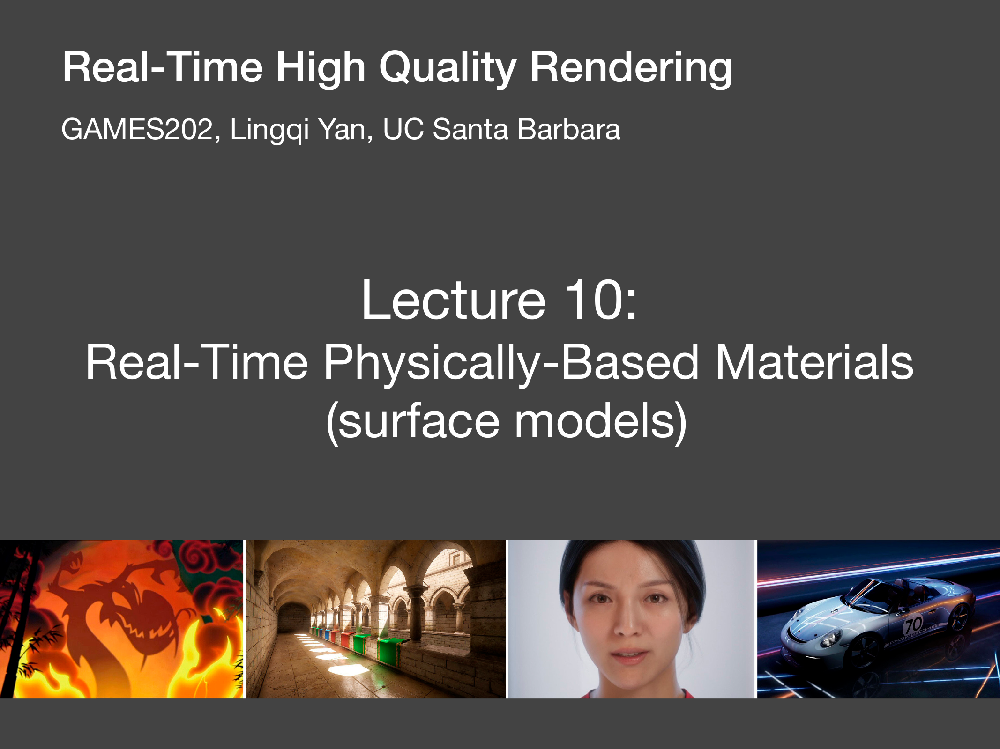

前几讲主要研究光如何到达表面，这一讲转向表面如何反射光。课程从微表面 BRDF 的 `F`、`D`、`G` 三项出发，解释常用分布和几何遮挡，再处理一个经常被忽略的问题：只计算一次微表面反射会丢失能量，尤其在粗糙材质上非常明显。

> 本讲的主线：一个公式看起来“物理正确”，不代表实时实现就自动能量守恒。必须理解每一项的统计意义和被省略的光路。

## 1. 本讲路线

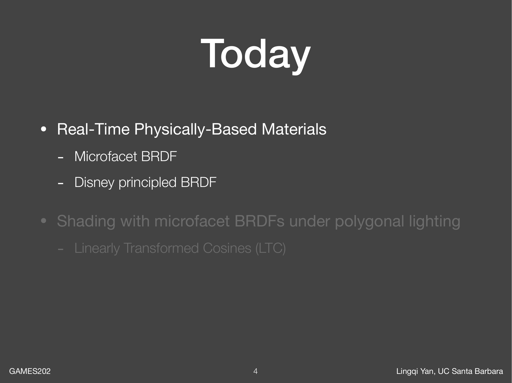

1. 回顾微表面 BRDF。
2. 认识 Fresnel、NDF 和 shadowing-masking 几何项。
3. 用 Kulla-Conty 近似补回微表面多次反射能量。
4. 理解 Disney Principled BRDF 的艺术家友好参数化。
5. 引出多边形面光源下的 LTC 着色方法。

## 2. PBR 不只是“金属度工作流”

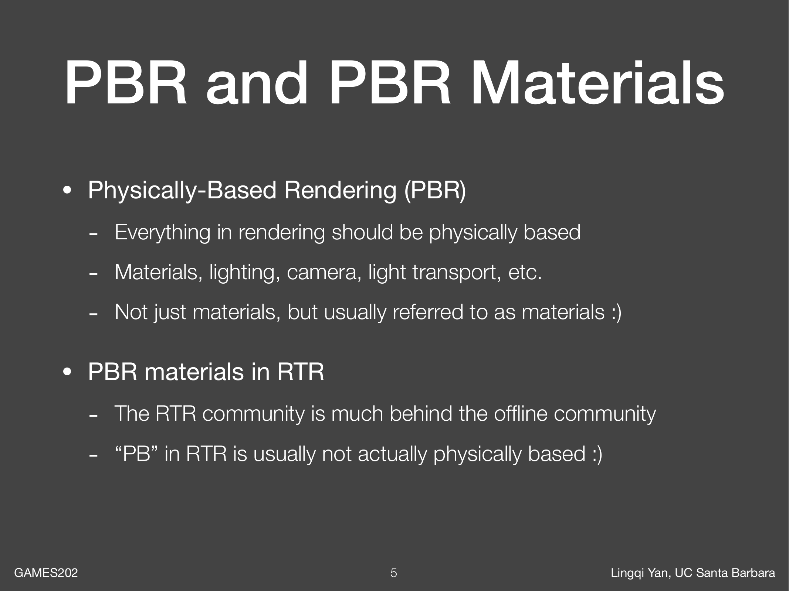

Physically-Based Rendering 指整个成像过程尽可能遵循物理规律，包括：

- 光源的能量和单位
- 材质的反射与吸收
- 相机曝光与响应
- 可见性和光传输
- 颜色空间与色调映射

实时领域常把 PBR 简称为一套材质参数，但只有材质公式并不够。错误的光源强度、Gamma 空间计算或重复能量补偿都能破坏物理一致性。

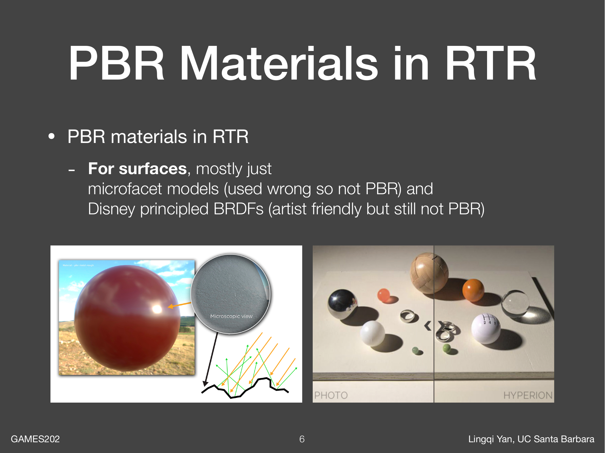

实时表面材质主要使用微表面模型和 Disney 风格的 principled 模型。前者强调物理解释，后者强调稳定、直观和覆盖广泛材质。

# 第一部分：Microfacet BRDF

## 3. 微表面假设

宏观表面在像素尺度下看似平滑，但可被理解为大量微小镜面片组成。每个微表面都做理想镜面反射，宏观粗糙外观来自微表面法线分布。

只有法线接近半程向量 `h` 的微表面，才能把入射方向 `omega_i` 反射到出射方向 `omega_o`：

$$
\mathbf{h}
=
\frac{\omega_i+\omega_o}
{\lVert\omega_i+\omega_o\rVert}
$$

## 4. 微表面 BRDF 总公式

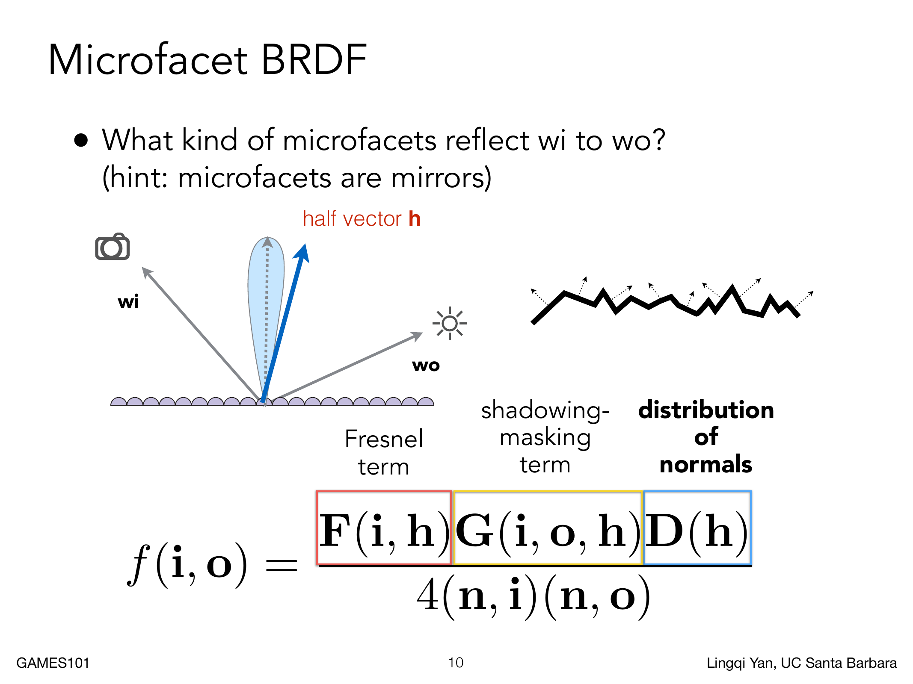

Cook-Torrance 形式为：

$$
f_r(\omega_i,\omega_o)
=
\frac{
F(\omega_i,\mathbf{h})
G(\omega_i,\omega_o,\mathbf{h})
D(\mathbf{h})
}{
4(\mathbf{n}\cdot\omega_i)
(\mathbf{n}\cdot\omega_o)
}
$$

三项分别回答：

- `F`，Fresnel：一个合适朝向的微表面反射多少能量。
- `D`，Normal Distribution Function：有多少微表面法线接近 `h`。
- `G`，Geometry：这些微表面是否被其他微表面遮挡或掩蔽。

分母来自微表面面积与宏观投影面积之间的变量转换，不是用于调亮度的经验项。

# 第二部分：Fresnel Term

## 5. Fresnel 的直观含义

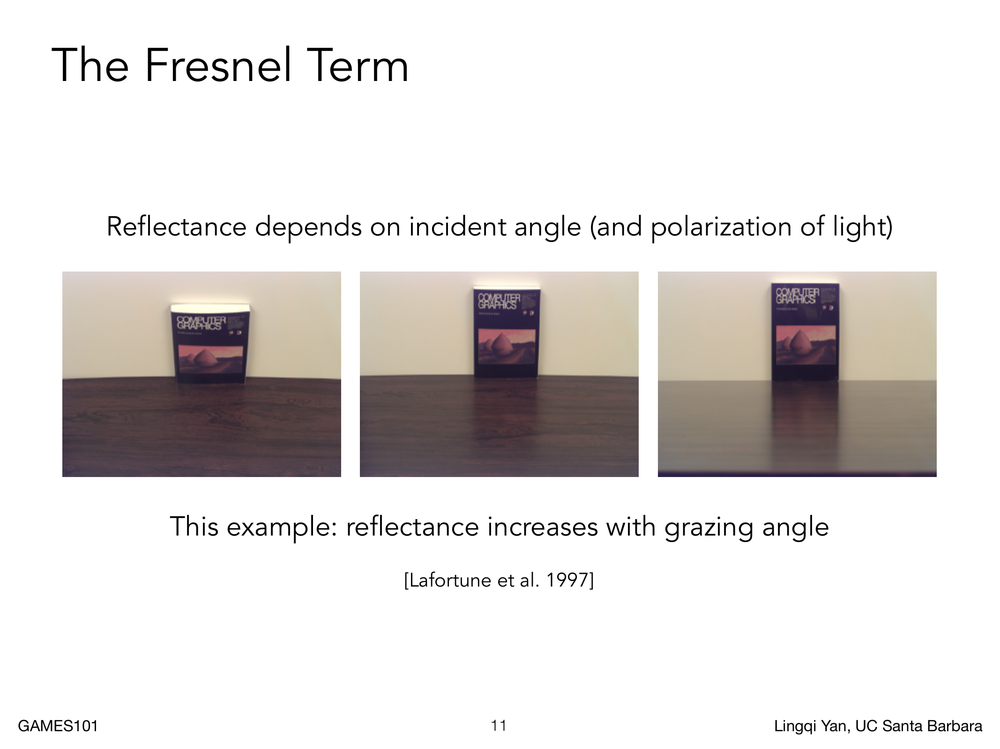

同一种材料在正面和掠射角看到的反射强度不同。大多数材料在掠射角趋近完全反射，因此物体轮廓附近常出现更强高光。

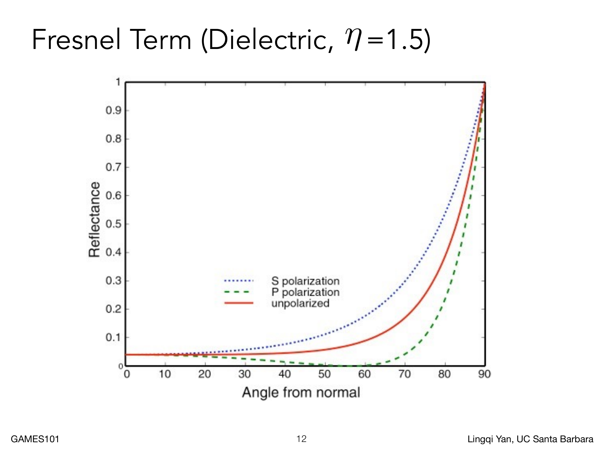

介电质在正入射时通常只反射少量能量，其余进入介质。玻璃、水、塑料的正入射反射率常较低，但在接近 90 度的掠射角会迅速升高。

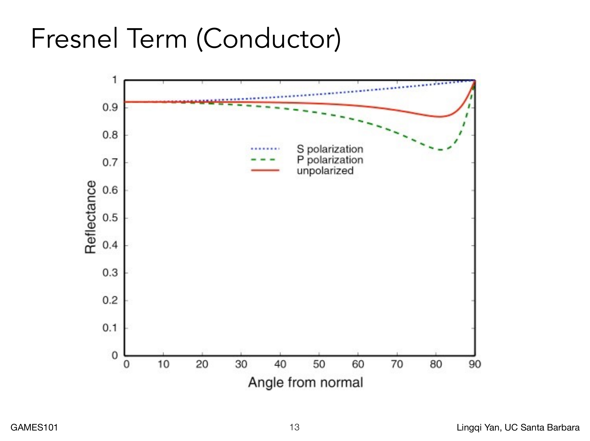

导体的复折射率导致有色反射，正入射反射率就可能很高。金、铜等金属的高光颜色来自波长相关的 Fresnel，而不是额外添加一个漫反射底色。

## 6. Schlick 近似

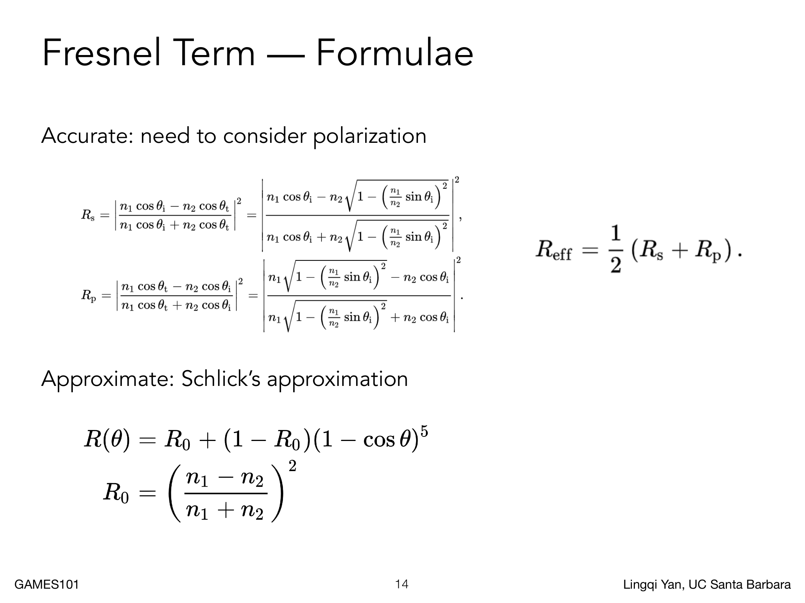

实时渲染常用 Schlick 五次近似：

$$
F(\cos\theta)
=
F_0
+
(1-F_0)(1-\cos\theta)^5
$$

对两个非吸收介质，正入射反射率为：

$$
F_0
=
\left(
\frac{\eta_1-\eta_2}
{\eta_1+\eta_2}
\right)^2
$$

在微表面 BRDF 中通常使用：

$$
\cos\theta
=
\max(0,\omega_i\cdot\mathbf{h})
$$

```glsl
vec3 fresnelSchlick(float cosTheta, vec3 F0) {
    float x = 1.0 - clamp(cosTheta, 0.0, 1.0);
    return F0 + (1.0 - F0) * pow(x, 5.0);
}
```

`F0` 对介电质通常接近灰色，对导体则是彩色。金属度工作流会在介电质 `F0` 与 base color 之间插值。

# 第三部分：Normal Distribution Function

## 7. NDF 不是统计学中的正态分布

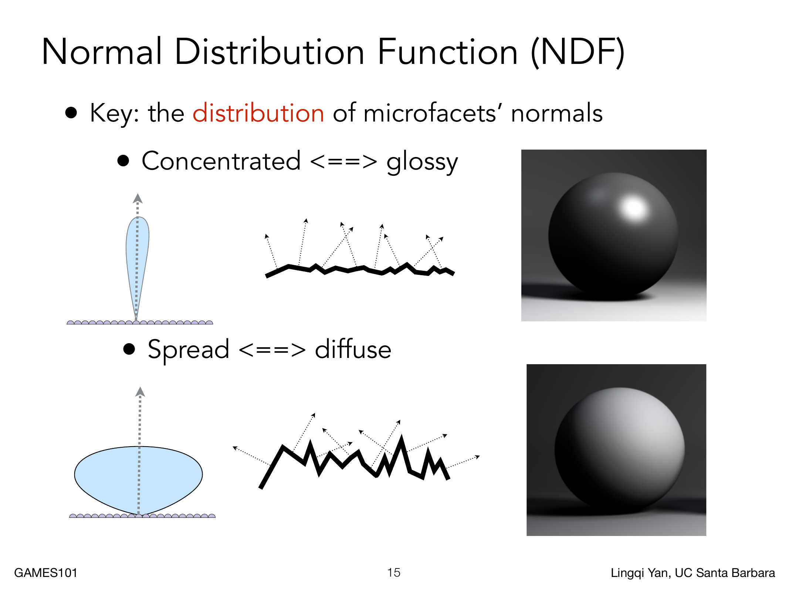

NDF 描述单位宏观面积上，微表面法线朝向某方向的密度：

- 分布集中在宏观法线附近，表面较平滑，高光小而亮。
- 分布扩散到更大角度，表面较粗糙，高光宽而暗。

NDF 有自己的归一化条件。它不是直接对球面立体角积分为 1，而要考虑投影：

$$
\int_{\Omega^+}
D(\mathbf{m})
(\mathbf{n}\cdot\mathbf{m})
\,\mathrm{d}\omega_m
=
1
$$

## 8. Beckmann 分布

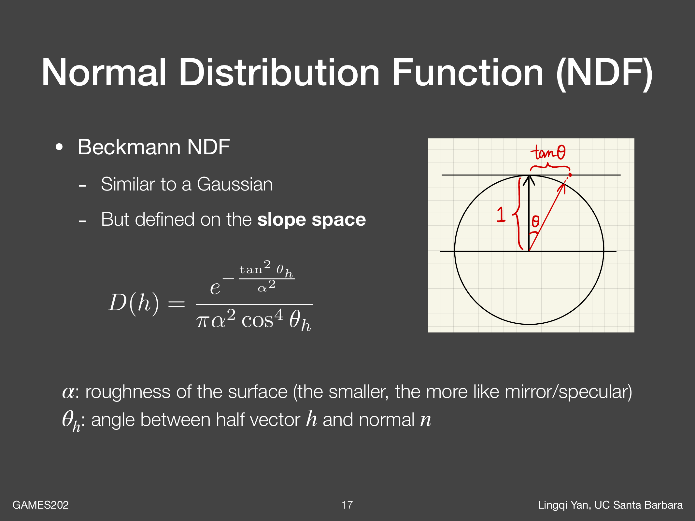

各向同性 Beckmann NDF：

$$
D_{\mathrm{Beckmann}}(\mathbf{h})
=
\frac{
\exp\left(
-\frac{\tan^2\theta_h}{\alpha^2}
\right)
}{
\pi\alpha^2\cos^4\theta_h
}
$$

`alpha` 是斜率空间粗糙度，`theta_h` 是半程向量与宏观法线夹角。它类似高斯分布，远离主峰后衰减很快。

## 9. GGX 的长尾

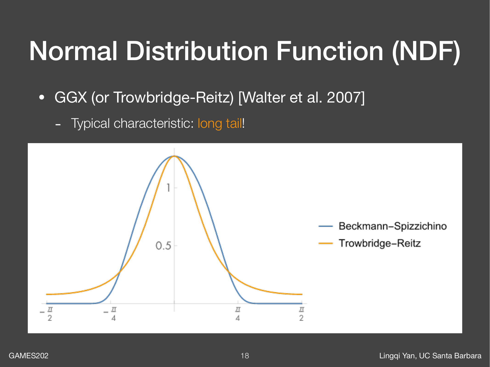

常用各向同性 GGX NDF：

$$
D_{\mathrm{GGX}}(\mathbf{h})
=
\frac{\alpha^2}
{
\pi
\left[
(\mathbf{n}\cdot\mathbf{h})^2(\alpha^2-1)+1
\right]^2
}
$$

GGX 的尾部比 Beckmann 更长。即使半程向量离宏观法线较远，仍有一定概率，因此高光周围保留更宽、更自然的亮尾。

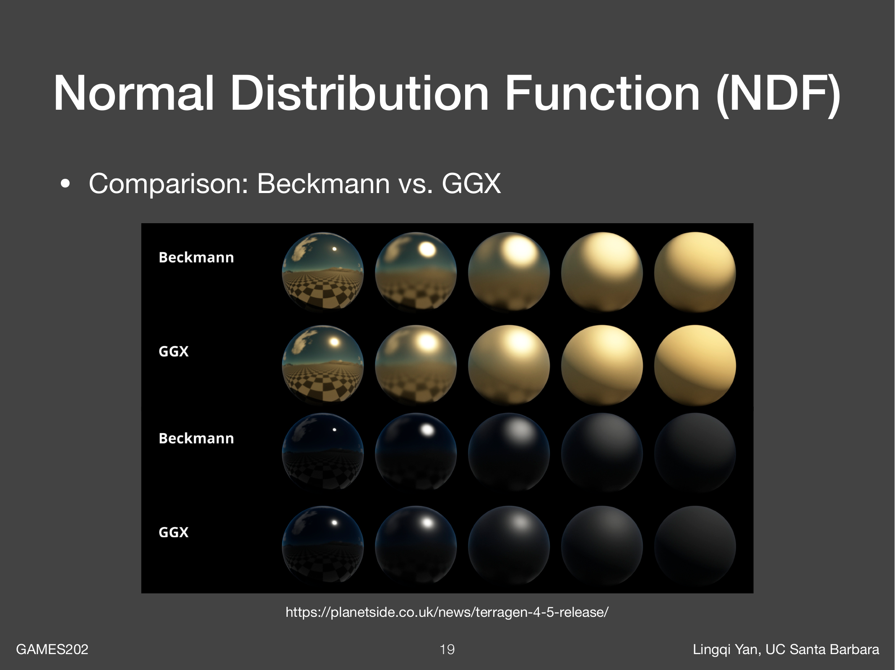

长尾不是简单让高光更模糊，而是在主高光外保留低强度、宽范围的反射。这也是 GGX 在实时渲染中广泛使用的原因。

## 10. GTR 扩展

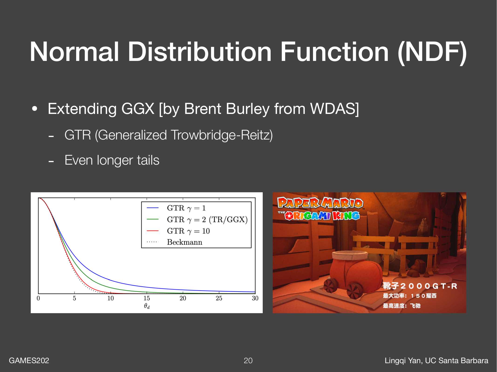

Generalized Trowbridge-Reitz（GTR）增加控制尾部形状的指数参数。Disney 模型使用不同 GTR 波瓣表示主镜面和 clearcoat，使一套模型能产生多层高光。

> 注意：引擎中的 `roughness` 不一定直接等于公式里的 `alpha`。常见映射是 `alpha = roughness^2`，但应遵循当前渲染管线的约定。

# 第四部分：Shadowing-Masking Term

## 11. Shadowing 与 Masking

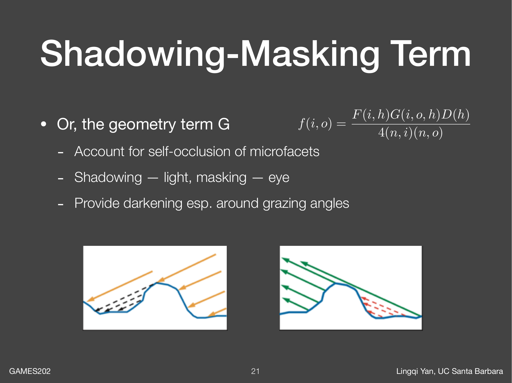

- **Shadowing**：入射光被其他微表面挡住，目标微表面没有被照亮。
- **Masking**：目标微表面已经反射，但出射光被其他微表面挡住，观察者看不到。

`G` 用于统计同时满足照明和观察可见的微表面比例。

## 12. 为什么不能省略 G

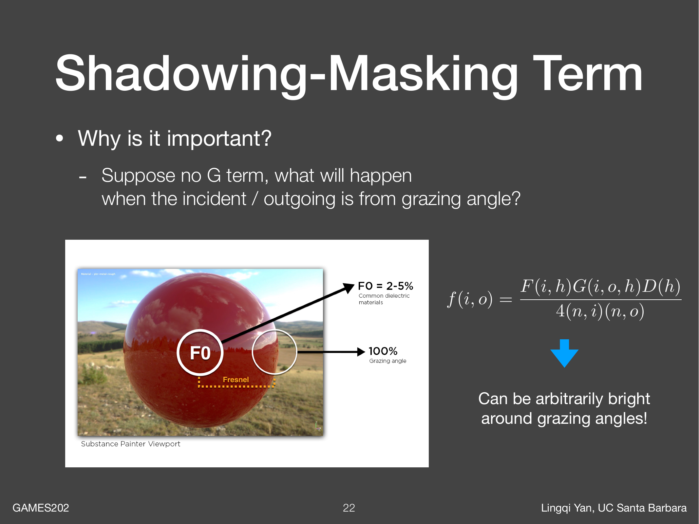

微表面 BRDF 分母包含两个余弦项。当入射或出射接近掠射角时，分母趋近零。如果没有 `G` 抑制实际不可见的微表面，结果可能异常明亮，甚至数值爆炸。

因此 `G` 不是可选的“暗角”，而是微表面模型自遮挡的必要部分。

## 13. Smith 几何项

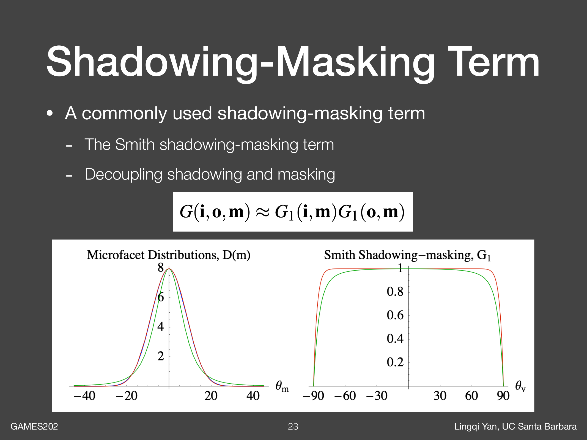

Smith 模型近似把两个方向解耦：

$$
G(\omega_i,\omega_o,\mathbf{h})
\approx
G_1(\omega_i,\mathbf{h})
G_1(\omega_o,\mathbf{h})
$$

对各向同性 GGX，一种常见形式为：

$$
G_1(\omega)
=
\frac{
2(\mathbf{n}\cdot\omega)
}{
(\mathbf{n}\cdot\omega)
+
\sqrt{
\alpha^2+(1-\alpha^2)(\mathbf{n}\cdot\omega)^2
}
}
$$

工程中还有 Smith correlated、Schlick-GGX 等变体。`D` 和 `G` 应来自一致的微表面统计假设，不能随意拼接而期待保持物理性质。

# 第五部分：微表面多次反射

## 14. 单次散射为什么丢能量

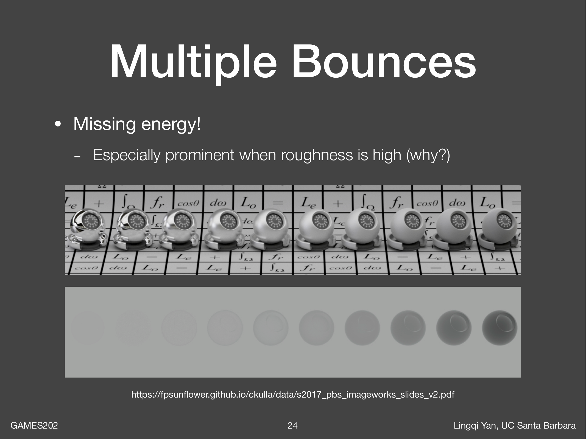

标准微表面 BRDF 只统计一次镜面反射后就成功离开表面的路径。被其他微表面挡住的光在公式中由 `G` 删除，但物理上它并未消失，而是会继续撞到其他微表面。

粗糙度越高：

- 微表面法线分布越散。
- 一次反射后再次撞到表面的概率越高。
- 单次散射模型丢失的能量越明显。

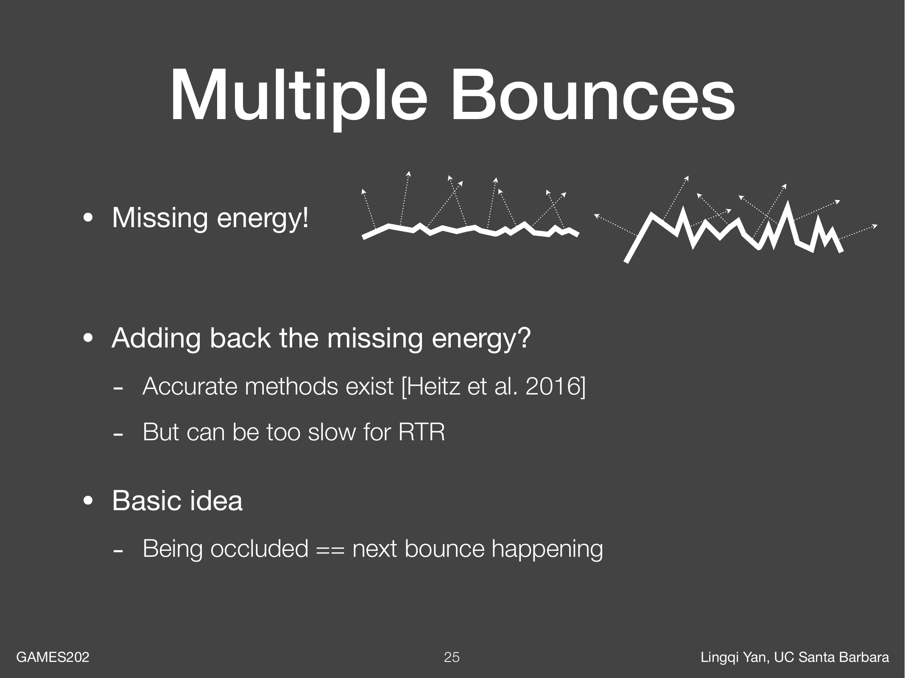

准确追踪这些微尺度多次反射很贵。Kulla-Conty 的策略是设计一个额外 BRDF 波瓣，把统计上丢失的能量补回来。

## 15. 方向反照率 E

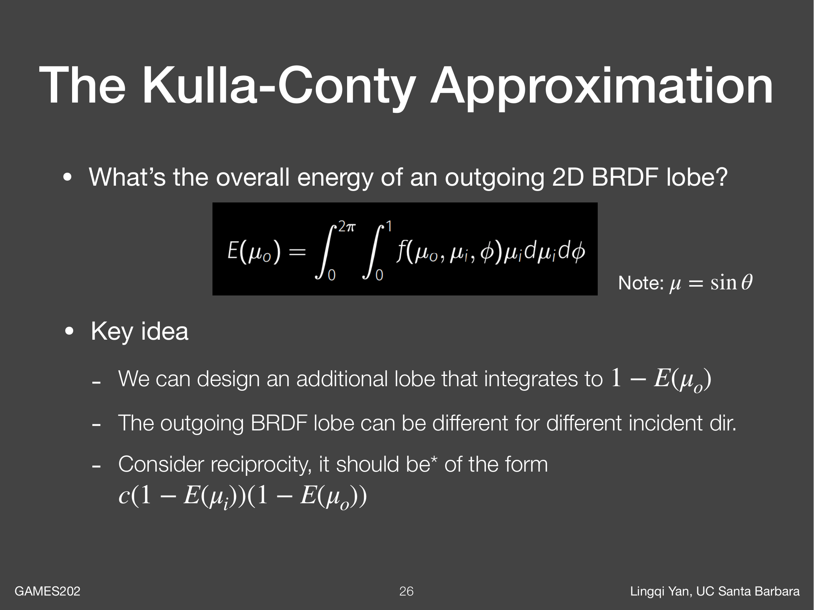

固定出射方向后，将单次散射 BRDF 在所有入射方向上积分，得到该方向能直接逃离表面的能量比例：

$$
E(\mu_o)
=
\int_0^{2\pi}
\int_0^1
f_{\mathrm{ss}}(\mu_o,\mu_i,\phi)
\mu_i
\,\mathrm{d}\mu_i
\,\mathrm{d}\phi
$$

这里令：

$$
\mu
=
\max(0,\mathbf{n}\cdot\omega)
$$

不同资料可能按相对切平面的角度写成 `sin(theta)`，按相对法线的角度则写成 `cos(theta)`；实现中直接使用 `NdotV` 最不易混淆。

`E(mu_o)` 越小，说明沿该方向单次散射能逃出的能量越少，需要补偿的多次散射越多。

## 16. 构造对称的补偿波瓣

为了同时满足入射与出射方向上的缺失，并保持互易性，附加波瓣应包含：

$$
(1-E(\mu_i))(1-E(\mu_o))
$$

定义对所有方向平均的逃逸能量：

$$
E_{\mathrm{avg}}
=
2\int_0^1 E(\mu)\mu\,\mathrm{d}\mu
$$

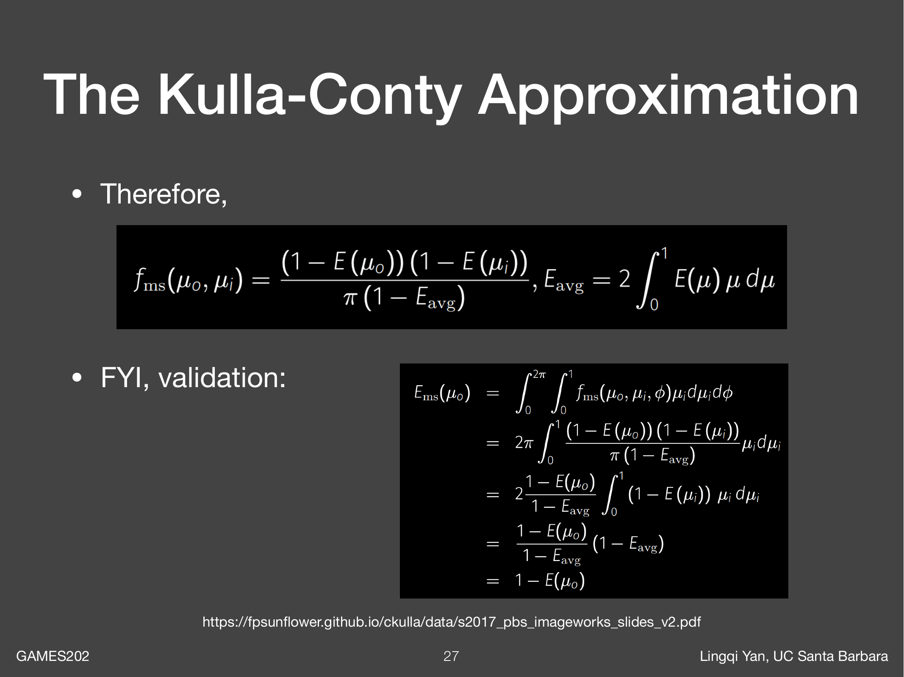

无色补偿 BRDF 为：

$$
f_{\mathrm{ms}}(\mu_o,\mu_i)
=
\frac{
(1-E(\mu_o))(1-E(\mu_i))
}{
\pi(1-E_{\mathrm{avg}})
}
$$

把它对入射半球积分，恰好得到 `1-E(mu_o)`，因此补回该出射方向缺失的能量。

## 17. 难积分怎么办：预计算查表

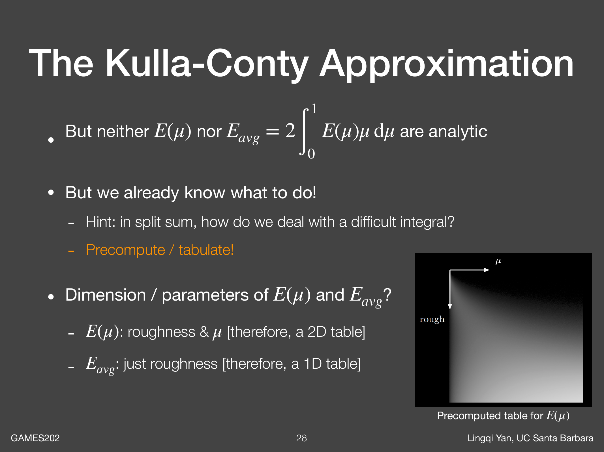

`E` 没有方便的解析式，但它只依赖少量参数：

- `E(mu)` 依赖粗糙度和 `mu`，可存成二维 LUT。
- `E_avg` 只依赖粗糙度，可存成一维 LUT，或并入二维纹理的通道。

这与环境光 split-sum 一样：离线数值积分，运行时用参数查表。

```glsl
float E = texture(energyLUT, vec2(NdotV, roughness)).r;
float Eavg = texture(energyAverageLUT, roughness).r;

float fms = (1.0 - Eo) * (1.0 - Ei)
          / (PI * max(1.0 - Eavg, 1e-4));
```

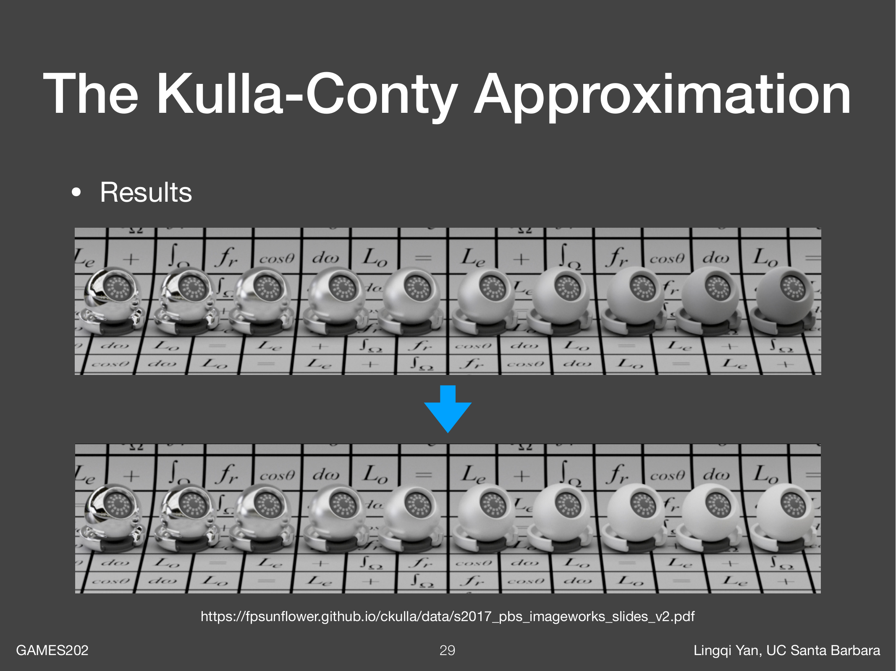

补偿后，粗糙球不再随着粗糙度升高而不合理地变黑。

## 18. 有色 Fresnel 的多次反射

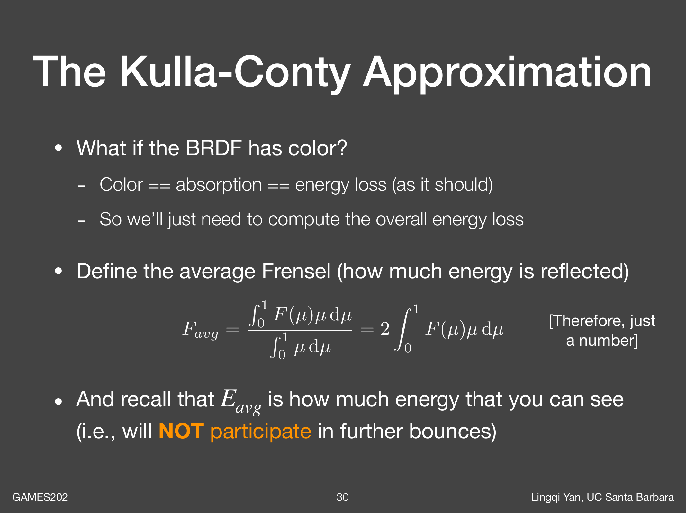

对有色导体，每次微表面反射都会按 Fresnel 颜色吸收一部分能量。定义平均 Fresnel：

$$
F_{\mathrm{avg}}
=
2\int_0^1 F(\mu)\mu\,\mathrm{d}\mu
$$

多次反射形成几何级数：

$$
F_{\mathrm{avg}}E_{\mathrm{avg}}
\sum_{k=0}^{\infty}
\left[
F_{\mathrm{avg}}(1-E_{\mathrm{avg}})
\right]^k
$$

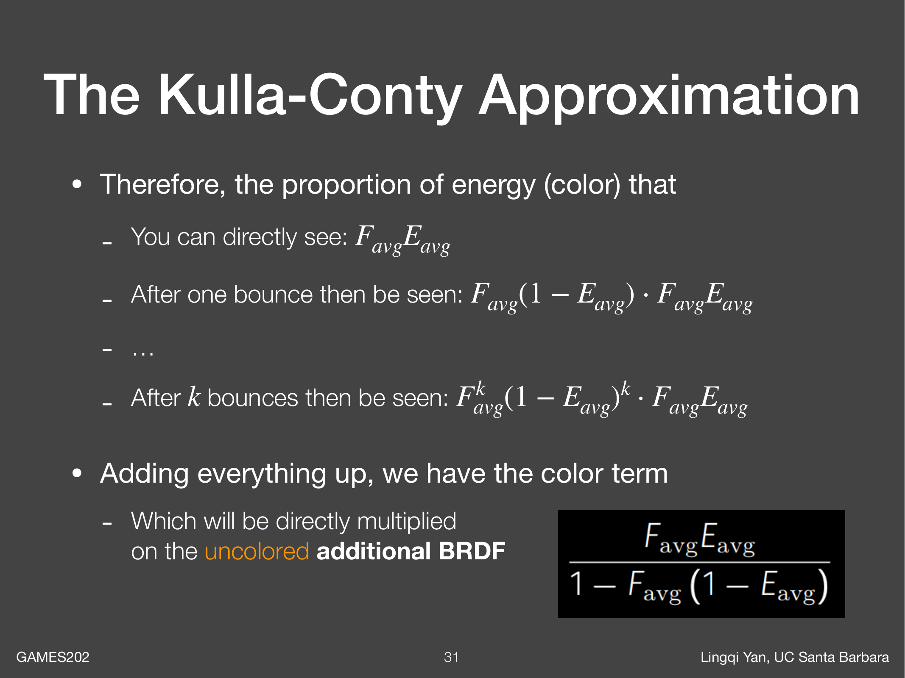

求和得到颜色补偿因子：

$$
F_{\mathrm{ms}}
=
\frac{
F_{\mathrm{avg}}E_{\mathrm{avg}}
}{
1-F_{\mathrm{avg}}(1-E_{\mathrm{avg}})
}
$$

将它乘到无色附加波瓣上，得到有色多次散射近似。

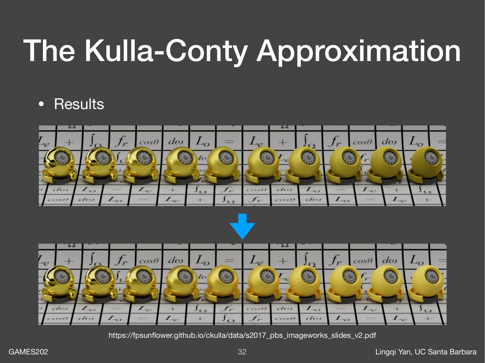

## 19. 为什么不能随便加一个 diffuse lobe

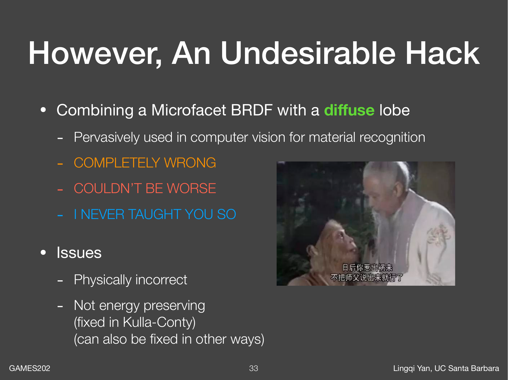

简单写成：

$$
f_r
=
f_{\mathrm{microfacet}}
+
k_d f_{\mathrm{diffuse}}
$$

并不能自动补偿丢失能量，原因是：

- 漫反射波瓣的总能量未必等于微表面项丢掉的能量。
- 它不随入射方向、出射方向和粗糙度正确变化。
- 两个波瓣可能重复使用同一份能量，破坏能量守恒。

这并不表示“任何 diffuse + specular 分层都错误”。现代材质可以组合多个物理意义明确的波瓣，但必须定义层间能量分配，例如先由 Fresnel 决定反射与透射份额，再让剩余能量进入漫反射层。

# 第六部分：Disney Principled BRDF

## 20. 为什么需要 Principled 模型

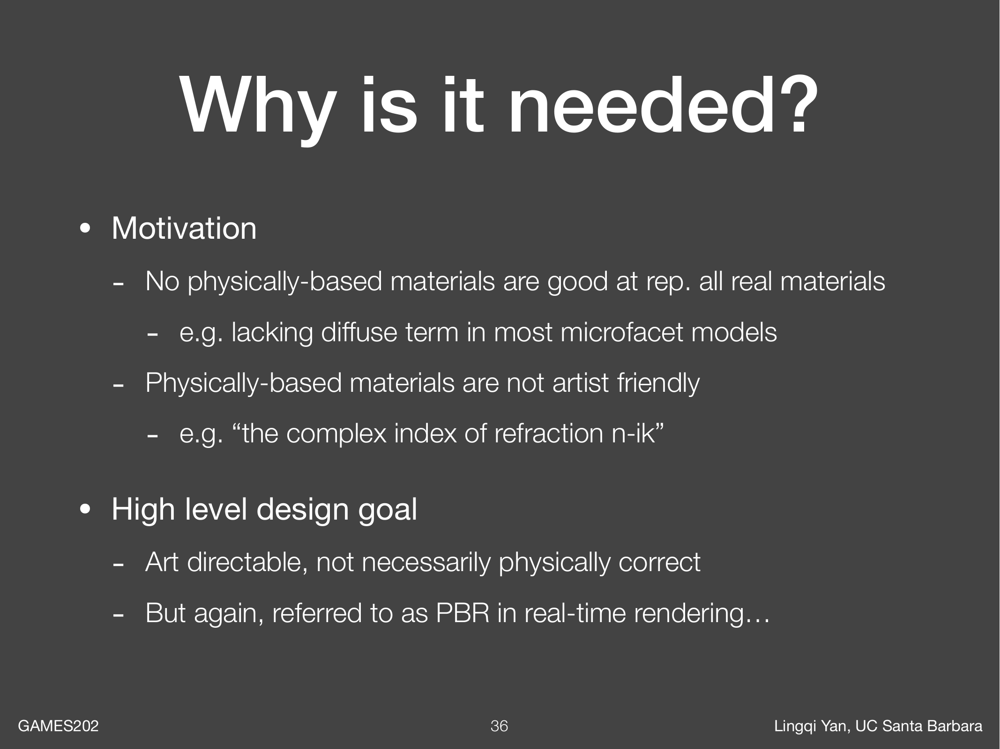

单一严格模型难以覆盖所有真实材料，而折射率、消光系数等参数也不适合美术人员直接控制。Disney 的目标是：

- 用少量直观参数覆盖广泛外观。
- 参数变化平滑、组合稳定。
- 优先 art-directable，而非每个波瓣都严格对应单一物理材料。

## 21. Principled 的设计原则

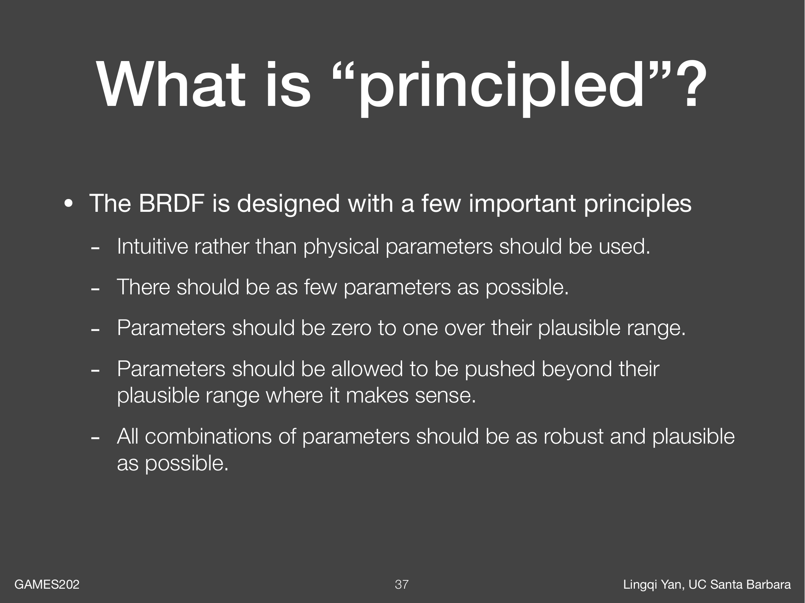

- 参数直观而不是纯物理量。
- 参数数量尽量少。
- 合理范围通常映射到 0 至 1。
- 允许在需要时超出常规范围。
- 任意参数组合尽量保持稳定、可信。

这里的“principled”指遵循一致设计原则，不等于“严格物理正确”。

## 22. 主要参数如何影响外观

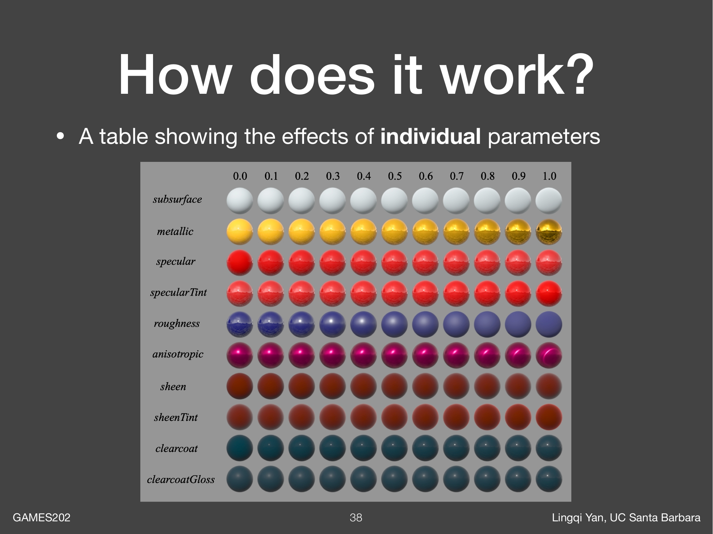

| 参数 | 主要作用 |
| --- | --- |
| `baseColor` | 基础颜色；介电质主要作用于漫反射，金属主要作用于镜面反射 |
| `metallic` | 在介电质与导体工作流之间混合 |
| `roughness` | 控制主镜面波瓣宽度和尾部 |
| `specular` | 调整介电质正入射反射率 |
| `specularTint` | 让介电质镜面颜色向 base color 偏移 |
| `anisotropic` | 让粗糙度沿切线和副切线方向不同 |
| `sheen` | 增加布料式掠射柔光 |
| `sheenTint` | 控制 sheen 的颜色倾向 |
| `clearcoat` | 增加第二层透明涂层高光 |
| `clearcoatGloss` | 控制涂层高光锐利程度 |
| `subsurface` | 在表面漫反射和次表面近似之间插值 |

## 23. Disney 模型的取舍

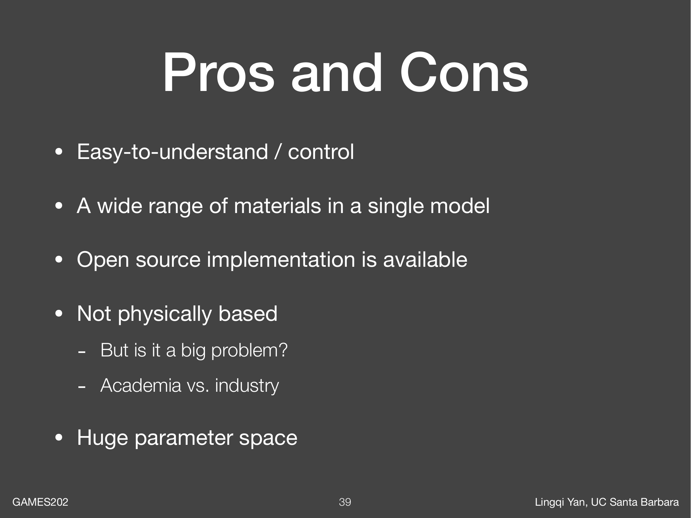

**优点：**

- 一套参数覆盖大量材质。
- 美术控制直观，资产可跨光照环境复用。
- 参数连续，适合纹理化和动画。
- 有公开实现和成熟制作流程。

**缺点：**

- 某些波瓣是经验设计，不是严格物理推导。
- 参数空间仍然很大，错误组合可能产生不可信材质。
- 不同引擎对 roughness、specular 和 clearcoat 的约定可能不同。
- “看起来像”不等于真实测量数据拟合准确。

# 第七部分：LTC 预告

## 24. 多边形面光源为何困难

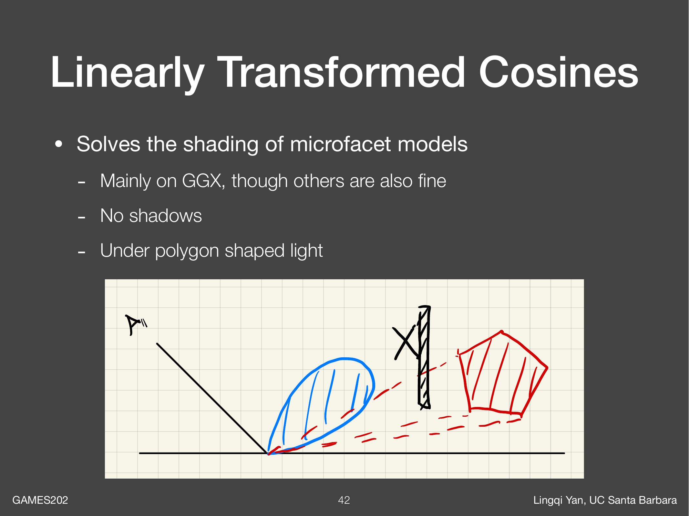

点光源只需在一个方向评估 BRDF。面光源需要在光源覆盖的立体角上积分，GGX 波瓣又会随观察方向和粗糙度改变，直接实时积分很昂贵。

## 25. LTC 的核心想法

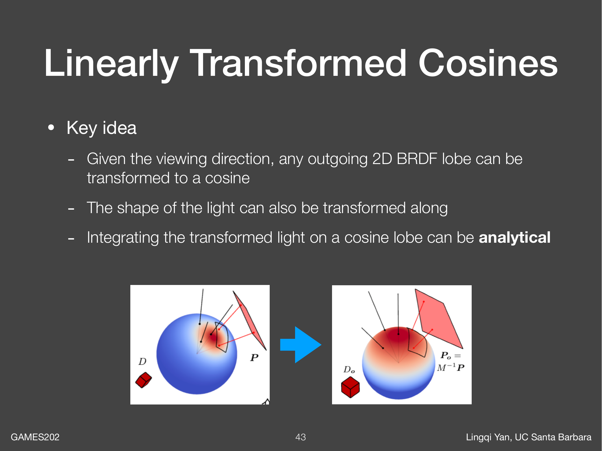

LTC 用一个线性变换把复杂 BRDF 波瓣拟合为余弦波瓣，同时对多边形光源边界做相同逆变换。变换后的余弦波瓣在球面多边形上的积分有解析解。

它把困难从运行时积分转化为：

1. 离线拟合变换矩阵。
2. 运行时按粗糙度和观察角查表。
3. 变换光源顶点并计算解析边积分。

Lecture 11 会完成这一推导。

## 26. 常见误解

### 误解一：roughness 就是微表面法线夹角

不是。roughness 是控制法线斜率分布的参数。具体到公式中的 `alpha` 还可能经过平方映射。

### 误解二：NDF 数值越高，材质总能量越高

NDF 改变能量在方向上的分布。一个合理归一化 NDF 不应凭空增加总能量。

### 误解三：G 项让材质变暗，所以删掉会更亮更好看

删掉 `G` 会把被微表面挡住的路径也算作可见，掠射角会出现严重能量错误和数值问题。

### 误解四：Kulla-Conty 是给材质添加环境光

不是。它补偿同一个微表面层内部被单次散射模型漏掉的后续反弹，与场景环境光无关。

### 误解五：Principled BRDF 就是严格物理材质

它以物理启发为基础，但首要目标是可控制、稳定和覆盖广。课程明确强调它并非完全物理。

## 27. 调试清单

1. 分别显示 `F`、`D`、`G`，不要只看最终乘积。
2. 检查所有点积在进入分母前是否有合理下限。
3. 验证 `roughness` 到 `alpha` 的映射只做一次。
4. 在正视角和掠射角比较 Fresnel，确认轮廓反射增强。
5. 用白炉测试检查材质是否凭空增能或丢能。
6. 对粗糙度从 0 到 1 扫描，观察未补偿材质是否变暗。
7. 可视化 `E(mu)` LUT 和 `E_avg`，检查坐标方向与过滤。
8. 分离 single scattering 与 multiple scattering 结果。
9. 对金属检查漫反射是否正确减到零或由分层模型控制。
10. 确认所有 BRDF 计算在线性颜色空间中进行。

## 28. 本讲小结

1. 微表面 BRDF 用 `F` 描述 Fresnel、`D` 描述法线分布、`G` 描述微表面自遮挡。
2. GGX 的长尾比 Beckmann 更能保留宽范围高光。
3. Smith 几何项避免把不可见微表面算入反射。
4. 单次散射会把被挡住的微尺度后续反弹误当成能量损失。
5. Kulla-Conty 通过方向反照率查表和附加波瓣补回能量。
6. Disney Principled BRDF 用直观参数换取统一、稳定的美术工作流。
7. LTC 将复杂面光源积分转化为线性变换后的余弦解析积分。

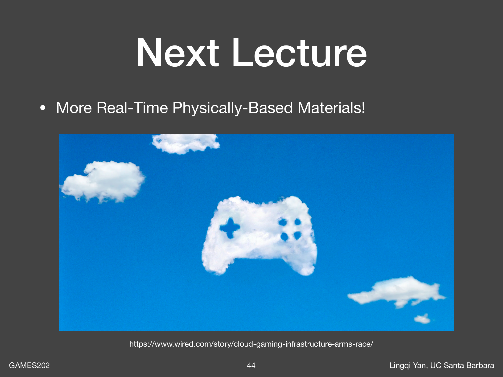
