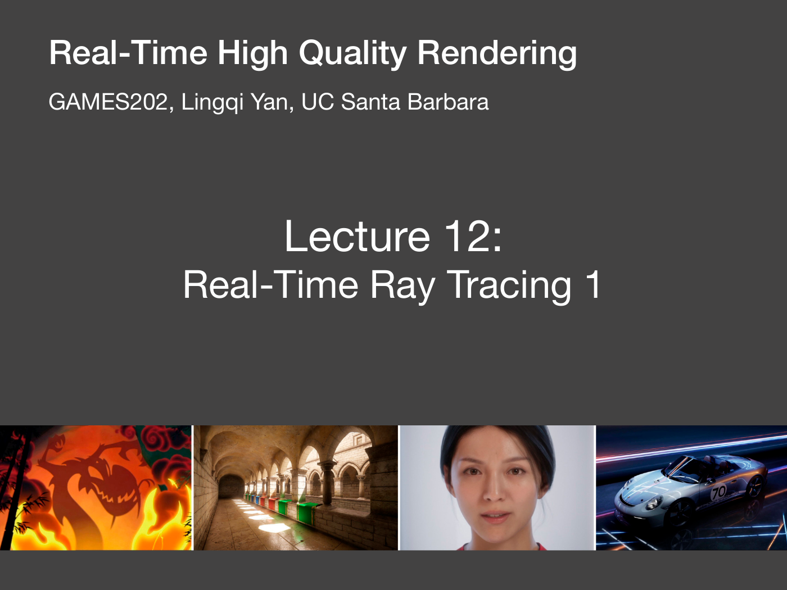
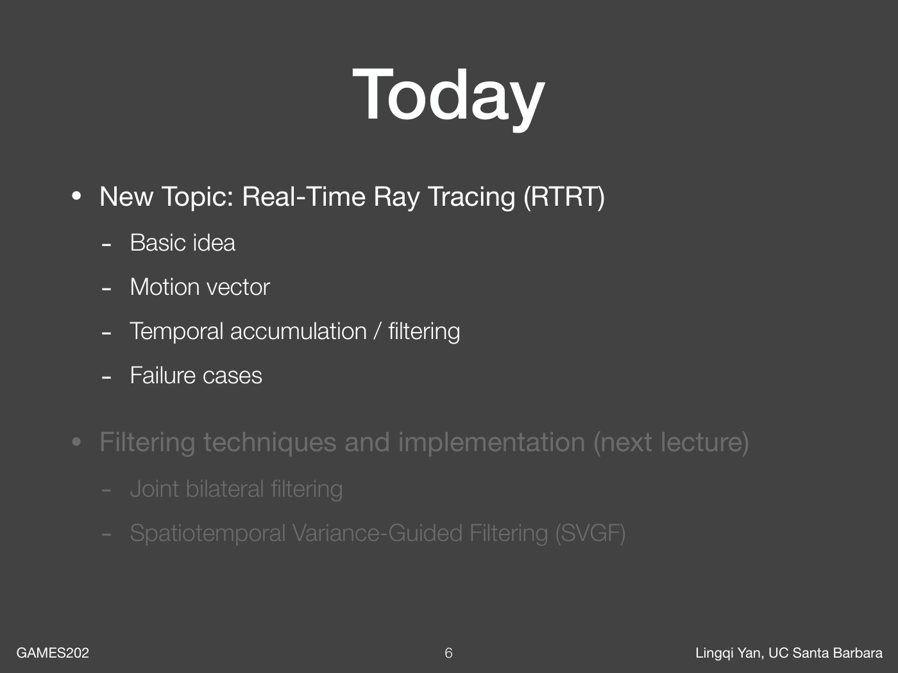
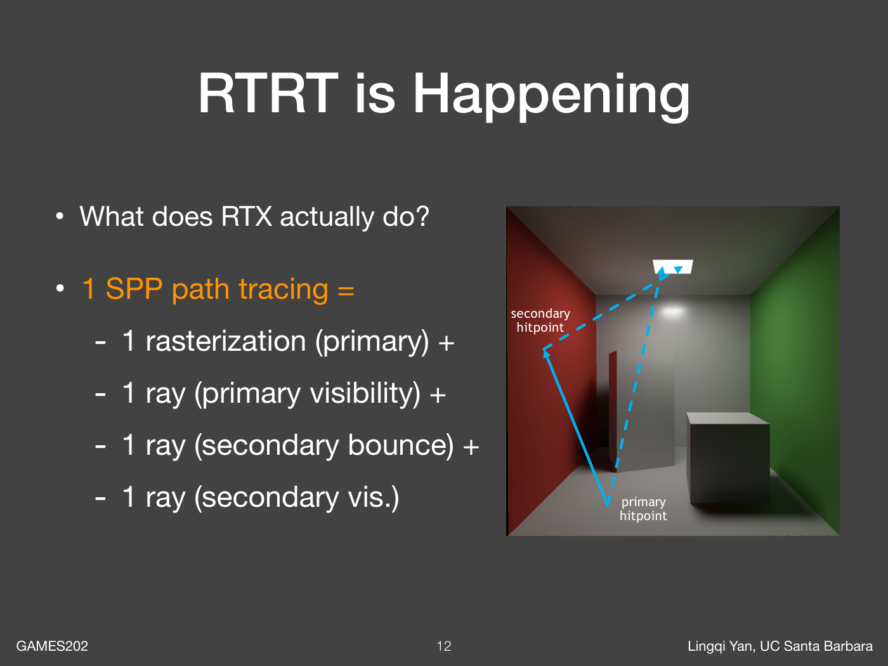
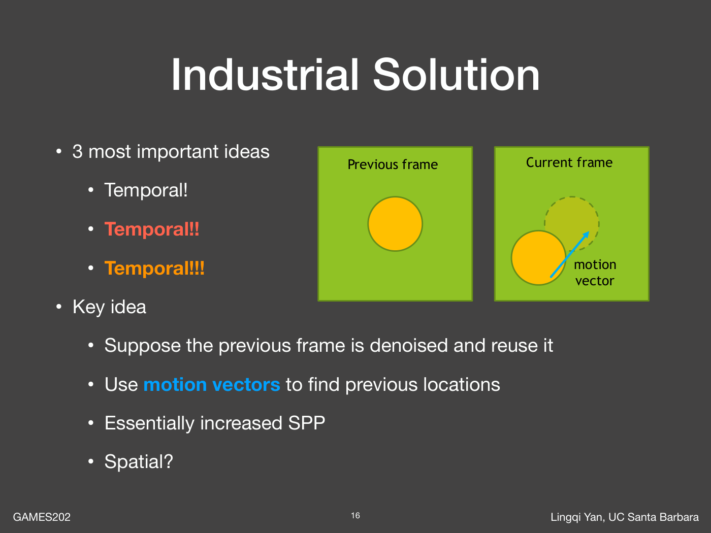
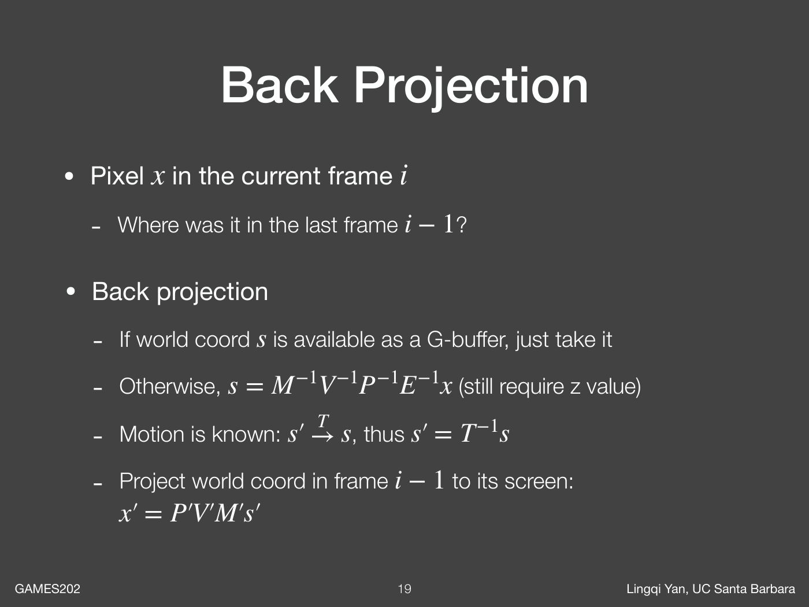
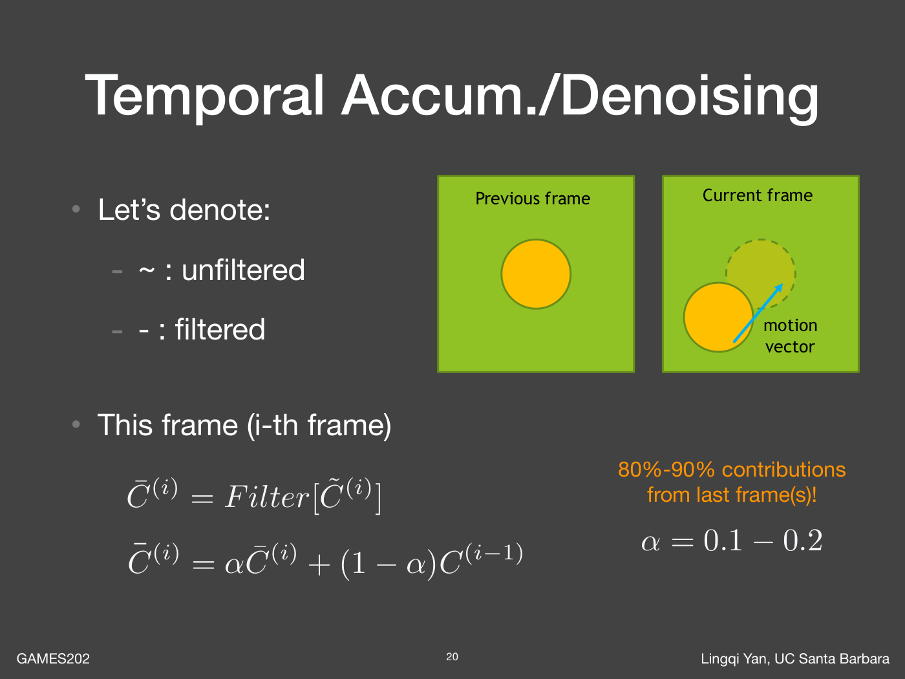
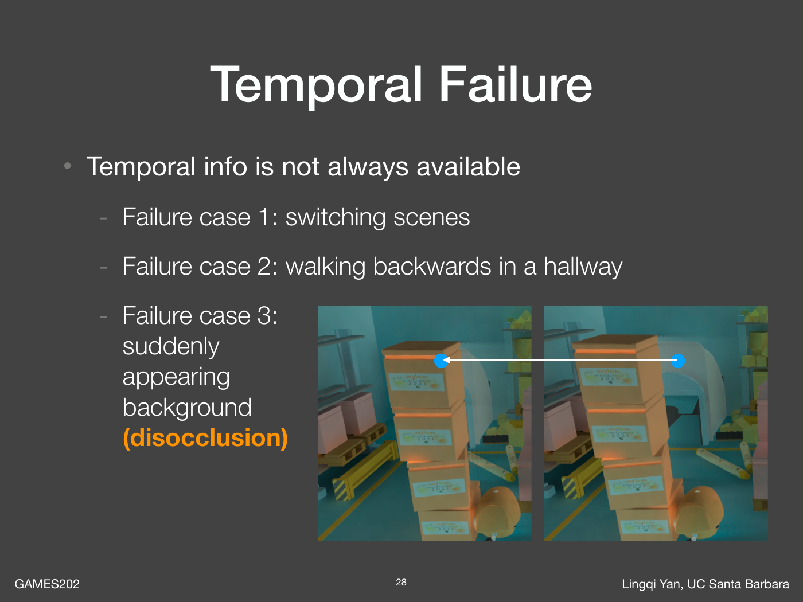
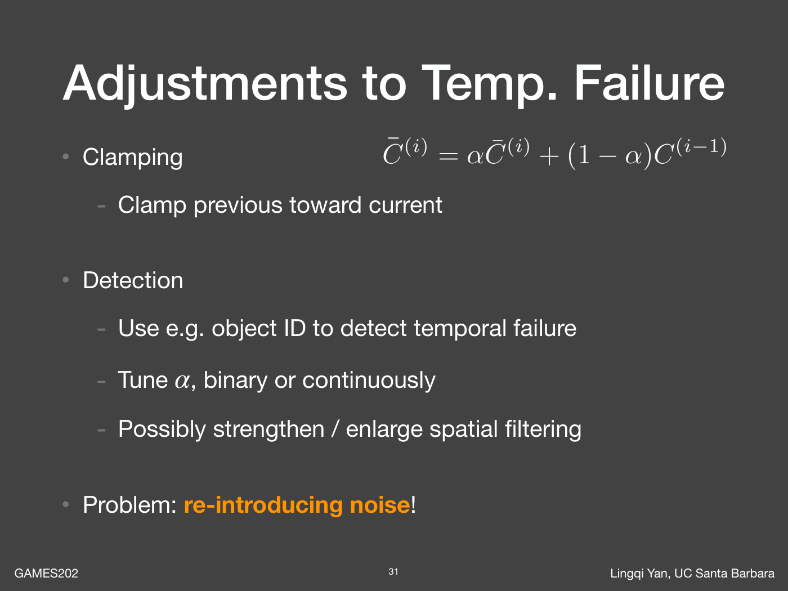
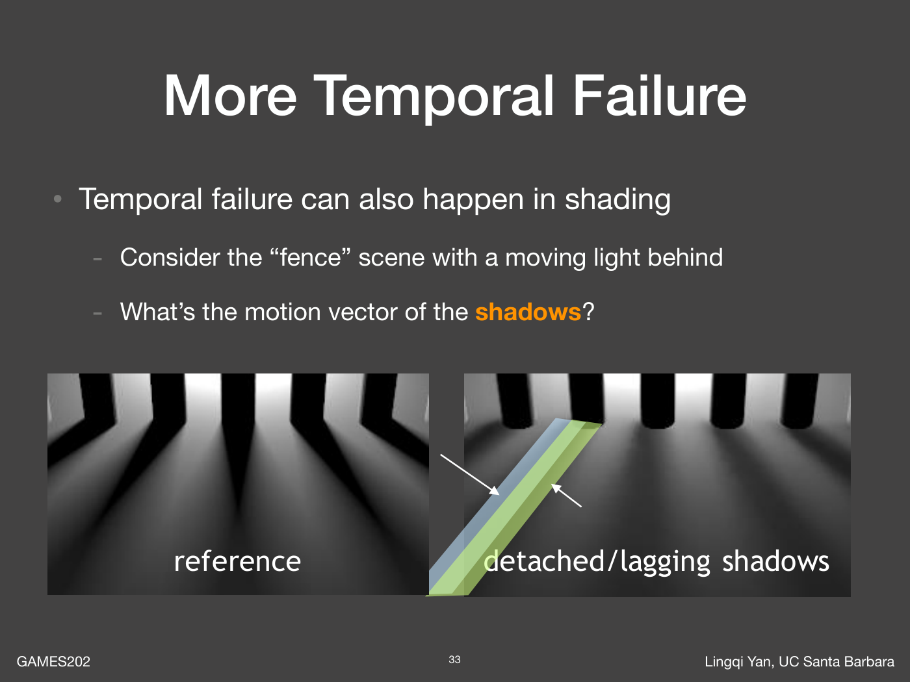
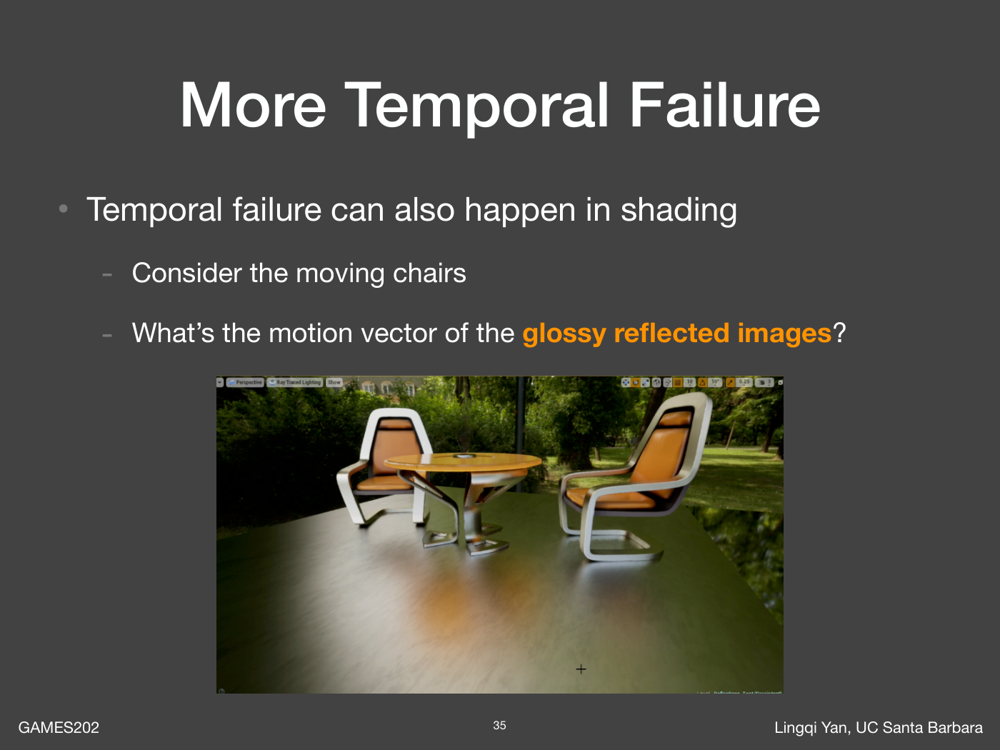

# GAMES202 Lecture 12：Real-Time Ray Tracing 1

> 视频：[第 12 节](https://www.bilibili.com/video/BV1YK4y1T7yY/?p=12) · [官方课件](https://sites.cs.ucsb.edu/~lingqi/teaching/resources/GAMES202_Lecture_12.pdf) · [课程主页](https://sites.cs.ucsb.edu/~lingqi/teaching/games202.html)
>
> 本文依据官方课件整理，配图来自对应 PDF，文件名中的数字表示 PDF 页码。B 站视频未能直接读取，因此不提供逐分钟索引或口述逐字记录；公式推导、伪代码和调试清单属于帮助理解的补充。



Lecture 11 讨论如何快速计算材质响应，Lecture 12 转向另一个瓶颈：每帧只能负担很少的光线样本时，怎样得到稳定、清晰的图像？本讲的主线是利用运动向量找到上一帧的同一表面，再复用已经降噪的历史结果。

> 实时光追的困难不止是“追得动光线”，还包括“用极少的样本重建出可信的图像”。

## 1. 本讲路线与课程调整



1. 理解实时光追与低采样率的关系。
2. 利用 G-buffer、反向投影和运动向量建立帧间对应。
3. 用递归的时域累积降低噪声。
4. 分析历史缺失、遮挡解除和着色变化带来的失败。
5. 为下一讲的空间滤波建立问题背景。

课件第 4 页明确说明：云、皮肤、头发等体积／散射材质需要 RTE、BSSRDF、单次与多次散射等前置知识，本课程不再展开。此前的预告不能当作本讲实际内容。

## 2. 硬件加速没有消除采样问题

光线追踪提供几何查询能力：给定起点和方向，求与场景的交点。它可以服务于阴影、反射、环境遮蔽和全局光照；最终要计算哪些光照项，仍由渲染算法决定。

课程以当时 RTX 硬件为背景，强调实际实时应用的样本预算非常紧张。“每像素约 1 个样本”是理解本讲降噪问题的工作条件，不是所有硬件、分辨率和算法的固定性能上限。课件中的性能数字应放在 2021 年的背景下阅读。

硬件标称的 rays/s 也不能直接换算成完整路径样本数：一条路径可能需要多次求交、阴影查询与材质求值，场景结构和射线相干性都会影响成本。

## 3. 1 SPP 不等于只发射一条光线



SPP（Samples Per Pixel）计数的是每像素估计所用的样本，并非所有几何查询次数。课件给出一种简化的混合流程：

1. 光栅化得到相机可见的主交点。
2. 从主交点向光源做可见性查询，计算直接光。
3. 从主交点采样一个方向，追踪到次级交点。
4. 从次级交点向光源查询可见性，估计一次间接贡献。

因此一个像素的一次路径估计可能包含多条 ray。这里的主交点来自光栅化，不能再把课件标注的 primary visibility 误解为必须额外追踪一次相机射线。

这只是说明采样预算的教学路径，并非通用路径追踪器的固定定义；更深的路径、多个光源和不同的直接光采样策略都会改变光线数量。

## 4. 为什么低 SPP 必须降噪

以积分的蒙特卡洛估计为例：

$$
I=\int f(x)\,\mathrm{d}x,
\qquad
\widehat I_N=\frac{1}{N}\sum_{k=1}^{N}\frac{f(X_k)}{p(X_k)}.
$$

在独立同分布且方差有限的条件下：

$$
\operatorname{Var}(\widehat I_N)=\frac{\sigma^2}{N}.
$$

标准差只按 $1/\sqrt N$ 下降，把噪声幅度减半通常需要约四倍样本。只有 1 SPP 时，相邻像素可能采到完全不同的光照方向，单帧出现强烈颗粒并不奇怪。

课程提出的目标同时包括细节保留、少伪影和极低耗时。这三者相互制约：普通模糊虽然能抑制噪声，却也会抹掉阴影边界、细小结构和高光。

## 5. 时域复用：上一帧已经帮我们采过样



假设场景随时间连续变化，同一表面在上一帧很可能已经出现，而且其颜色已经融合了更早的样本。当前帧可以递归复用这个结果，不必保存全部历史图像。

成立的条件是：

- 能找到同一个表面在上一帧的位置。
- 该位置在上一帧确实可见。
- 历史光照仍能代表当前光照。

前两个条件关乎几何对应，第三个条件关乎信号本身。运动向量正确，不代表历史颜色一定正确。

## 6. G-buffer 为降噪提供什么

G-buffer 保存首个可见表面的辅助属性。课程列出深度、法线、位置等数据，它们既可支持重投影，也可指导下一讲的空间滤波。

| 属性 | 在降噪中的作用 | 使用注意 |
| --- | --- | --- |
| 深度 | 恢复位置，判断历史遮挡关系 | 比较双方必须使用一致的深度定义 |
| 法线 | 判断表面方向是否相近 | 坐标空间一致，归一化后再比较 |
| 世界位置 | 直接参与帧间投影 | 动态物体还需要上一帧位置 |
| Albedo | 区分材质纹理和光照结构 | 不能把纹理变化全部视为噪声 |
| Object / material ID | 排除明显不同的对象或材质 | 相同 ID 不保证同一表面可见 |
| Motion vector | 定位历史采样位置 | 明确方向、单位和是否包含抖动 |

课程所说的“免费”是指渲染时已经能够取得这些属性，不是说额外缓冲、写入和读取没有成本。它们也只描述屏幕中记录的可见表面，不是整个场景。

## 7. Back Projection 要找的是同一个表面



设当前像素为 $p$，目标是求历史位置 $p'$，使两者观察到同一个物质点。下面统一使用列向量，按“局部坐标 → 世界 → 观察 → 裁剪”顺序变换，避免把课件简写中的坐标空间混用。

### 7.1 从深度恢复当前世界位置

若 G-buffer 已有世界位置，可直接读取；否则先将像素坐标和深度映射为 NDC，构造齐次坐标：

$$
\mathbf h=(P_tV_t)^{-1}
\begin{bmatrix}x_{\mathrm{ndc}}&y_{\mathrm{ndc}}&z_{\mathrm{ndc}}&1\end{bmatrix}^{T},
\qquad
\mathbf X_t=\mathbf h_{xyz}/h_w.
$$

不能省略齐次除法。OpenGL 常见 NDC 深度范围与其他 API 的约定可能不同，还要考虑 reversed-Z、Y 轴方向和投影抖动；使用的逆矩阵必须与生成深度的矩阵相配。

### 7.2 静态几何：使用上一帧相机投影

世界点不动时：

$$
\mathbf c_{t-1}=P_{t-1}V_{t-1}
\begin{bmatrix}\mathbf X_t\\1\end{bmatrix},
\qquad
\mathbf x_{t-1}^{\mathrm{ndc}}=\mathbf c_{t-1,xyz}/c_{t-1,w}.
$$

再将 NDC 映射为历史纹理 UV。即使物体不动，相机运动也会产生非零屏幕运动。

### 7.3 动态刚体：先恢复上一帧的世界位置

设模型矩阵为 $M_t$ 和 $M_{t-1}$：

$$
\mathbf X_{t-1}^{h}=M_{t-1}M_t^{-1}\mathbf X_t^{h},
\qquad
\mathbf c_{t-1}=P_{t-1}V_{t-1}\mathbf X_{t-1}^{h}.
$$

只使用上一帧相机矩阵，会把动态物体当成静态几何。蒙皮或形变模型则需要上一帧骨骼／顶点形变信息，单个刚体矩阵无法描述所有点的运动。

## 8. Motion Vector 的约定必须明确

本文把运动向量定义为从当前 UV 指向历史 UV：

$$
\mathbf m_t(p)=\operatorname{uv}_{t-1}(p)-\operatorname{uv}_t(p),
\qquad
\operatorname{uv}_{\mathrm{history}}=\operatorname{uv}_t+\mathbf m_t.
$$

如果引擎储存反方向向量，就应改为相减。错误符号会使相机运动时整幅图像拖影；像素单位与 UV 单位混用则会使误差随分辨率变化。

重投影结果通常落在非整数像素上。双线性插值能平滑读取颜色，但轮廓附近四个 texel 可能属于不同物体；实现时应检查参与插值的历史样本，而不是盲目平均。ID 数据尤其不能按连续颜色插值。

## 9. 时域累积公式



沿用课件符号，$\widetilde C_t$ 是当前原始估计，$\overline C_t$ 是空间滤波后的结果，$C_t$ 是最终时域输出：

$$
\overline C_t(p)=\operatorname{Filter}[\widetilde C_t](p),
$$

$$
C_t(p)=\alpha\overline C_t(p)+(1-\alpha)C_{t-1}(p').
$$

这里必须采样重投影位置 $p'$，而非固定读取上一帧的同一像素坐标。课件给出 $\alpha=0.1\sim0.2$，表示当前帧占 10%～20%，历史占 80%～90%。

不同实现可能将 $\alpha$ 定义为历史权重。讨论“增大 alpha”之前，必须先看公式。本笔记中增大它意味着更相信当前帧。

## 10. 递归混合如何降低噪声（补充推导）

固定 $\alpha$、对齐正确且忽略初始化时，展开递推可得：

$$
C_t=\sum_{k=0}^{\infty}\alpha(1-\alpha)^k\overline C_{t-k}.
$$

历史贡献按指数衰减，并非所有过去帧等权。若各帧信号不变、噪声独立且方差相同，则：

$$
\operatorname{Var}(C_t)
=\sigma^2\sum_{k=0}^{\infty}\alpha^2(1-\alpha)^{2k}
=\sigma^2\frac{\alpha}{2-\alpha}.
$$

对应的理想等效样本数为 $(2-\alpha)/\alpha$：$\alpha=0.1$ 时为 19，$\alpha=0.2$ 时为 9。这是用于理解的理想模型，不是实际 SPP 保证；空间滤波、重复随机序列、重投影插值都会引入相关性。

降低当前帧权重能平滑噪声，也使旧信号消退更慢。噪声与响应速度的权衡，正是后续失败案例的来源。

## 11. 历史缺失的三类情况



| 课件案例 | 历史为何不能使用 | 合理处理 |
| --- | --- | --- |
| 场景切换／镜头跳切 | 两帧没有连续对应 | 重置历史，重新积累 |
| 在走廊中后退 | 新进入视野的区域之前在屏幕外 | 屏幕边界验证，局部重新积累 |
| 前景移开露出背景 | 背景点此前被遮挡 | 检测 disocclusion，拒绝旧前景颜色 |

后两者都是历史屏幕信息不足，但一个是出画，一个是遮挡。它们不能仅凭“历史 UV 仍在屏幕内”统一判定有效。

切镜或新露出区域需要一段积累时间，即课件所说的 burn-in。历史不能凭空生成，首次出现时只能更多依靠当前样本和空间邻域。

## 12. 盲目使用历史会出现什么

当背景刚显露，却读取到旧前景颜色，旧轮廓会随时间缓慢消失；当光照改变而历史权重过大，阴影和高光会滞后。这些都是 ghosting / lagging 的表现。

它们不一定由光线求交或 BRDF 错误造成。诊断时应先比较原始单帧、空间滤波结果和时域结果，定位错误在哪一阶段被引入。

## 13. 历史验证、权重调整与钳制



课件提出 detection、调整 $\alpha$、clamping 和增强空间滤波几种办法。下面把它们整理为实现顺序：

1. 检查是否发生全局历史重置、历史 UV 是否出界。
2. 比较预测的上一帧表面深度与历史深度，确认该点此前可见。
3. 用法线、对象 ID 等信息排除不兼容的历史样本。
4. 对仍可复用的历史颜色做合理范围钳制。
5. 依据可信度分配当前与历史权重。

深度检测不能简单拿两帧的当前视空间深度相减：相机运动会改变同一世界点的深度。应把当前表面投影到上一帧坐标系，得到可比较的预测值。

历史完全失效时令 $\alpha=1$；仅部分可信时增加当前帧权重。拒绝历史会重新引入噪声，所以可以适当加强空间滤波，但这又增加模糊风险。

钳制是把历史限制在当前信号附近，不是把当前颜色强行拉回过去。第 13 讲会使用邻域均值与标准差构造这个范围。

## 14. 几何没变，阴影也可能变



课件用栅栏后移动光源说明：地面可以完全静止，但地面上的阴影在移动。地面的几何运动向量为零，并不能描述阴影的运动。

因此深度、法线、对象 ID 全部通过验证，历史也可能过时。时域降噪不仅需要判断“还是不是这个表面”，还需要判断“表面上的光照是否还相似”。

## 15. 镜面反射为什么更加困难



镜面地板上的椅子倒影会随椅子和相机运动；地板本身的运动向量只跟踪地板，不跟踪反射路径中的椅子。

粗糙反射还会覆盖一组方向，不能总用单个反射点描述。几何对应正确只是必要条件之一，不能保证所有光照分量都可长期累积。课件因此引出更可靠运动向量的研究，但没有把高级反射重投影展开为完整算法。

## 16. 与 TAA 的关系

课件指出时域累积受到 Temporal Anti-Aliasing 的启发。两者都通过帧间对应和历史融合提高有效采样率，也都会遇到遮挡解除、历史钳制和拖影。

区别在于主要重建的信号：TAA 通常处理像素覆盖与子像素采样，光追降噪处理光照积分的随机估计。拥有 TAA 并不自动解决低 SPP 间接光、移动阴影或镜面反射的噪声。

## 17. 最小时域流程（补充伪代码）

下面对应本讲“先空间滤波，再时间混合”的教学流程；真实降噪器可以采用不同的阶段顺序。辅助函数表示需要单独实现的步骤，并非可直接编译的 shader。

```text
current = spatialFilter(rawRadiance, currentGBuffer)
for each pixel p:
    uvPrev = uv(p) + motionToPrevious[p]
    valid = not historyReset and insideImage(uvPrev)
    if valid:
        valid = validatePreviousSurface(p, uvPrev, previousGBuffer)

    if not valid:
        output[p] = current[p]
        historyLength[p] = 1
        continue

    history = sampleValidatedHistory(uvPrev)
    history = clampToCurrentNeighborhood(history, current, p)
    alpha = chooseCurrentWeight(historyConfidence, historyLength)
    output[p] = alpha * current[p] + (1 - alpha) * history
    historyLength[p] = min(previousLength(uvPrev) + 1, lengthLimit)

swap(currentHistoryBuffer, previousHistoryBuffer)
saveCurrentGeometryForNextFrame()
```

历史输入与当前输出应使用不同缓冲，避免一个线程读取到另一个线程刚写入的当前结果。累积应在约定一致的线性颜色空间进行；曝光等尺度变化也需要补偿或重置。

## 18. 常见误解

- **1 SPP 就是一条 ray**：样本数不等于全部求交查询数。
- **同一个像素坐标就是同一个点**：相机和物体运动会改变投影位置。
- **上一帧相机矩阵足以处理所有运动**：动态物体还需历史模型或形变信息。
- **UV 没出界，历史就有效**：历史位置可能被别的表面遮挡。
- **几何一致就没有拖影**：阴影和反射可独立于可见表面运动。
- **历史越多越好**：错误或过时的历史会污染当前图像。
- **拒绝历史没有代价**：新区域失去有效样本，噪声会回升。

## 19. 调试清单

1. 固定相机和物体，确认运动向量接近零，随机采样随帧变化。
2. 仅移动相机，检查重投影后的几何边缘是否对齐。
3. 仅移动一个物体，检查其历史模型矩阵是否正确。
4. 显示历史 UV、有效掩码、历史长度和当前权重。
5. 用前景移开露出背景的场景检查 disocclusion。
6. 测试镜头切换，确认首帧不会读取旧场景历史。
7. 单独移动光源，观察阴影响应，而不是只测试几何运动。
8. 用反射地板和移动物体检查着色运动失效。
9. 对比 raw、spatial、temporal 三个输出，区分噪声、模糊和拖影。
10. 改变分辨率，检查 motion vector 单位和历史缓冲重建。

## 20. 本讲小结

实时低 SPP 渲染需要从时间与空间寻找额外信息。时域方法利用运动向量把当前表面对应到历史帧，用递归混合降低噪声；历史不可用或信号改变时，则需要拒绝、减权或钳制。历史复用越强，稳定性通常越好，但对变化的响应也越慢。

下一讲：[Real-Time Ray Tracing 2：空间滤波、大核实现与钳制](lecture13-real-time-ray-tracing-2.md)。
