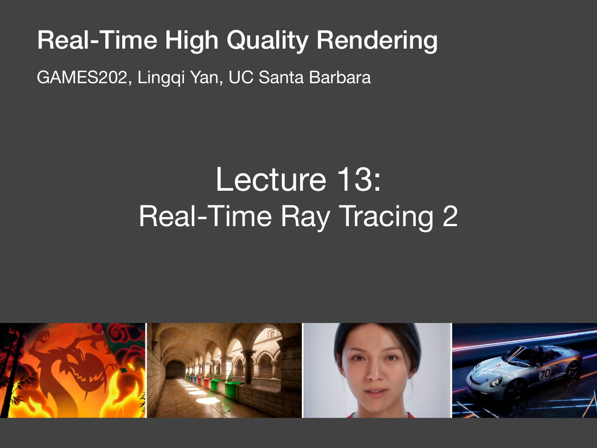
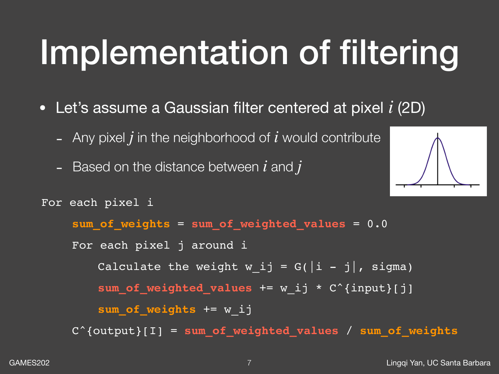
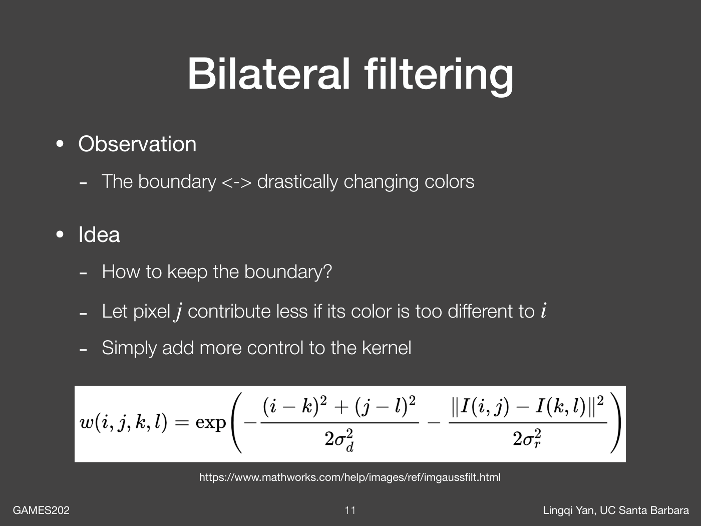
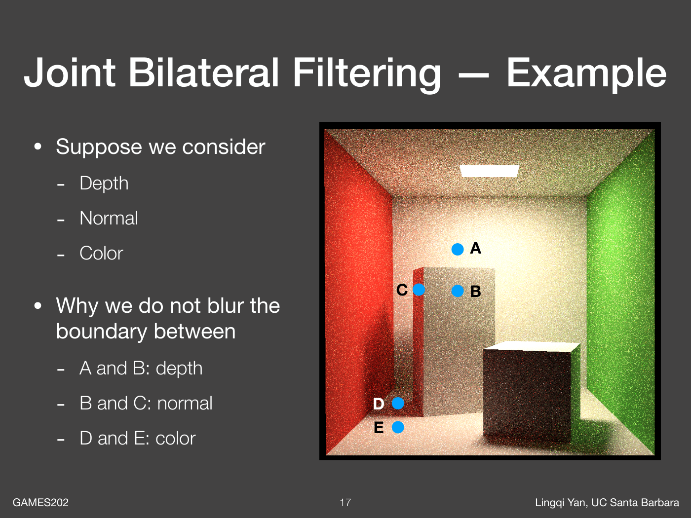
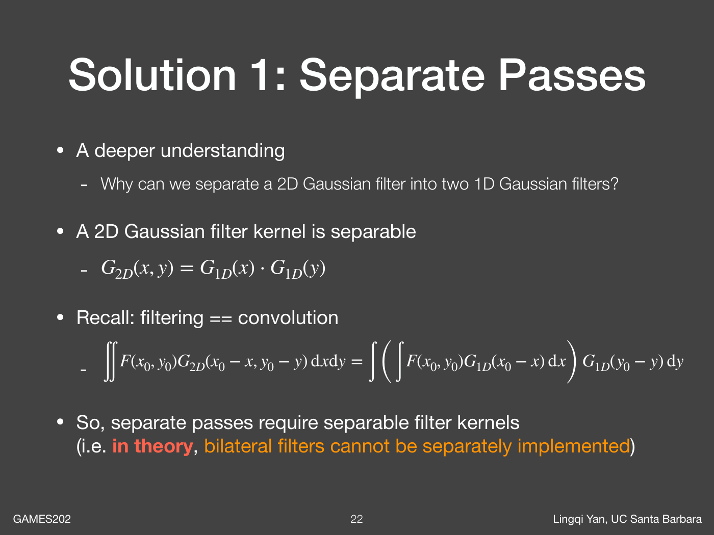
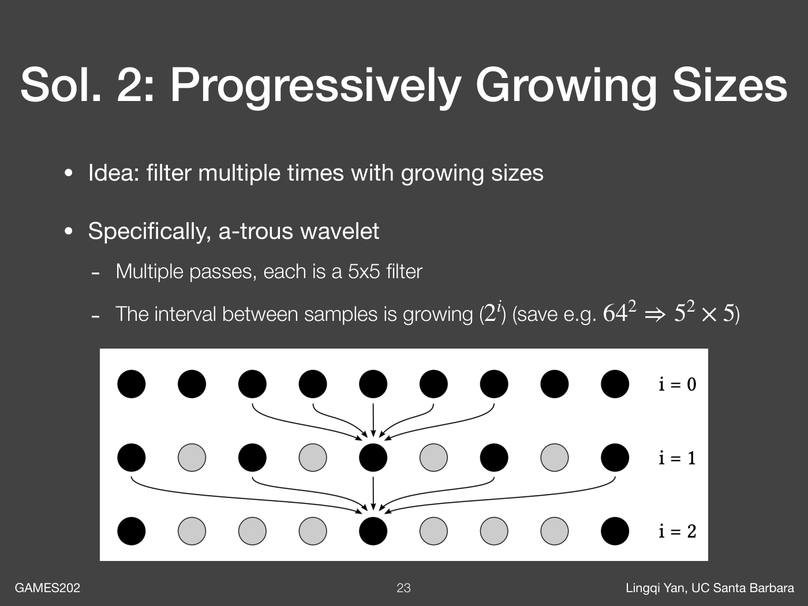
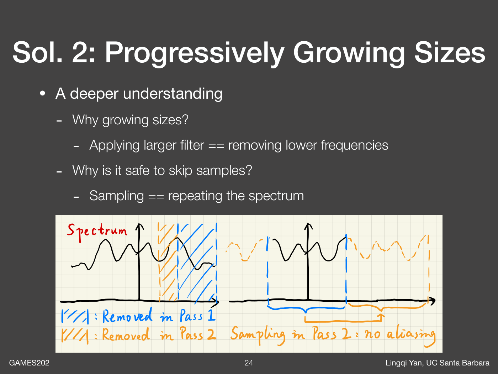
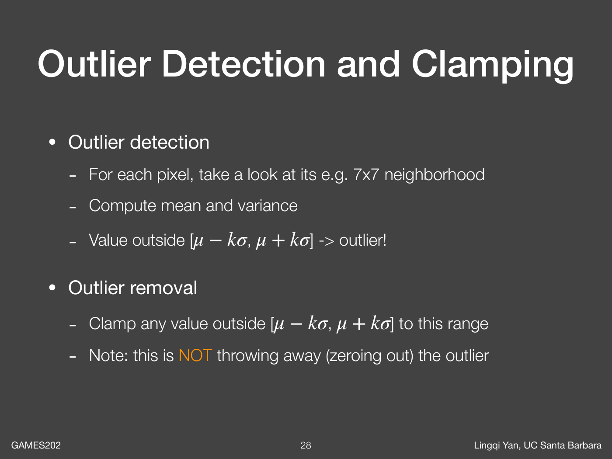
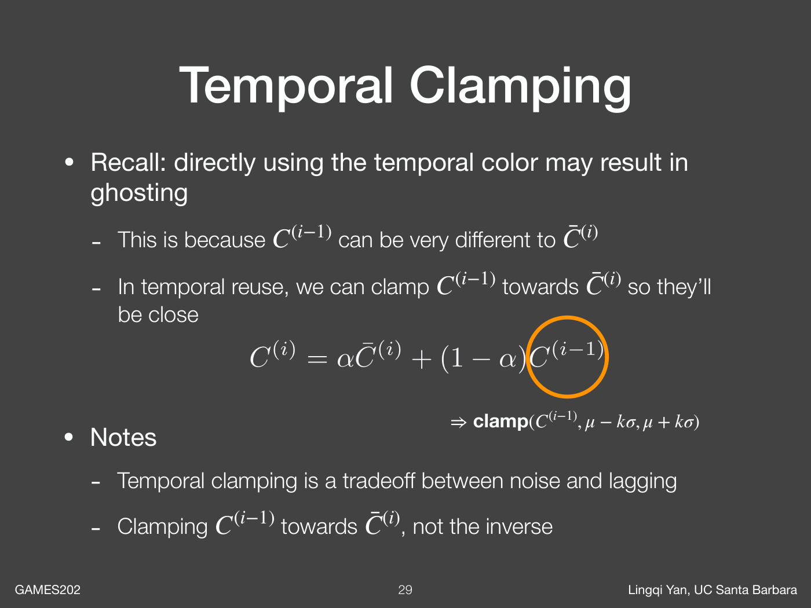

# GAMES202 Lecture 13：Real-Time Ray Tracing 2

> 视频：[第 13 节](https://www.bilibili.com/video/BV1YK4y1T7yY/?p=13) · [官方课件](https://sites.cs.ucsb.edu/~lingqi/teaching/resources/GAMES202_Lecture_13.pdf) · [课程主页](https://sites.cs.ucsb.edu/~lingqi/teaching/games202.html)
>
> 本文依据官方课件整理，配图来自对应 PDF，文件名中的数字表示 PDF 页码。B 站视频未能直接读取，因此不提供逐分钟索引或口述逐字记录；展开的公式、伪代码和工程注意事项属于理解补充。



Lecture 12 通过历史复用提高有效采样率，但历史并不总是可用。Lecture 13 回到当前帧：如何利用周围像素降噪，同时保留几何、材质和光照边界？

> 空间滤波的关键不是把邻居全部平均，而是判断哪些邻居可以共同估计当前信号。

## 1. 本讲路线与范围

1. 从归一化加权平均出发，实现普通高斯滤波。
2. 用颜色差保护边界，得到双边滤波。
3. 引入 G-buffer，得到 Cross / Joint Bilateral Filtering。
4. 用可分离核或 à-trous 多轮滤波降低大邻域开销。
5. 在空间滤波前处理异常亮点，在时域复用中钳制历史。

课件第 4 页的提纲列出 SVGF 和 Recurrent AutoEncoder（RAE），但这份 32 页 PDF 的正文止于 temporal clamping，没有展开这两种方法。本文不把它们的完整算法混写为本讲已经讲解的内容。

## 2. 空间降噪为什么是低通问题

低 SPP 图像的噪声常表现为像素间剧烈变化，空间低通可以减小这些变化。但是轮廓、细线、纹理和阴影边界也包含高频成分，不能把高频全部当作噪声。

降噪依赖一个局部假设：相邻且属性相近的像素，其真实信号有一定相关性，可以互相提供样本。如果跨越表面或材质边界，这个假设就可能失效。

因此滤波既要扩大用于估计的邻域，也要限制跨边界混合。

## 3. 所有滤波先写成归一化加权平均



设输入为 $\widetilde C$，中心像素为 $p$，邻域为 $\mathcal N(p)$：

$$
\overline C(p)=
\frac{\sum_{q\in\mathcal N(p)}w(p,q)\widetilde C(q)}
{\sum_{q\in\mathcal N(p)}w(p,q)}.
$$

核心循环只做三件事：算权重、累加加权颜色、除以权重和。颜色可以是 RGB 向量，权重通常是一个标量。

```text
for each pixel p:
    weightedColor = (0, 0, 0)
    weightSum = 0
    for q in validNeighborhood(p):
        w = weight(p, q)
        weightedColor += w * input[q]
        weightSum += w
    output[p] = weightedColor / weightSum if weightSum > epsilon else input[p]
```

若输入处处为常量 $c$，输出应仍为 $c$。这个性质是检查归一化是否正确的简单办法。屏幕边缘少了一部分邻居时，必须对实际参与的权重重新求和。

## 4. 高斯滤波：只看像素距离

二维各向同性高斯的未归一化权重为：

$$
w_s(p,q)=\exp\left(-\frac{\|p-q\|^2}{2\sigma_s^2}\right).
$$

越近的像素贡献越大，$\sigma_s$ 控制平滑尺度。因为最终会除以权重和，可以省略所有样本共有的归一化常数。

高斯滤波不关心邻居属于哪个物体：前景与背景即使深度差很大，只要屏幕位置相近就会互相混合。结果是噪声降低，同时轮廓变软、颜色串到边界另一侧。

## 5. 双边滤波：距离近，颜色也要近



加入 range weight，即颜色相似度：

$$
w_c(p,q)=\exp\left(-\frac{\|\widetilde C(p)-\widetilde C(q)\|^2}{2\sigma_c^2}\right),
\qquad
w(p,q)=w_s(p,q)w_c(p,q).
$$

这两个因子分别回答：

- 邻居在屏幕上是否足够近？
- 邻居颜色是否足够相似？

当颜色突变时，即使像素紧挨着，贡献也会减小。由于权重依赖输入颜色，双边滤波一般是非线性、随位置变化的运算，不能直接当成固定核卷积。

## 6. 两个参数怎样影响结果

| 参数变化 | 效果 | 可能的问题 |
| --- | --- | --- |
| 增大 $\sigma_s$ | 更远的邻居参与 | 细节被更多平滑，采样开销可能增大 |
| 减小 $\sigma_s$ | 更局部地估计 | 降噪能力不足 |
| 增大 $\sigma_c$ | 容许更大的颜色差 | 更容易跨颜色边界混合 |
| 减小 $\sigma_c$ | 更严格地保护颜色变化 | 可能把随机噪声本身保留下来 |

极限上，$\sigma_c$ 很大时颜色因子趋近 1，双边滤波退化为高斯滤波；$\sigma_c$ 很小时，中心像素可能只愿意与极少数邻居混合。

这揭示了直接用低 SPP 颜色做引导的问题：滤波器看到的颜色差，可能来自真实边界，也可能仅来自采样噪声。

## 7. Joint / Cross Bilateral Filtering

联合双边滤波使用额外信号指导对目标图像的滤波。一个通用写法是：

$$
w(p,q)=w_s(p,q)\prod_k w_k\bigl(F_k(p),F_k(q)\bigr),
$$

其中 $F_k$ 可以是深度、法线、位置、颜色、对象 ID 等。被平均的仍是目标颜色，辅助特征只决定能否以及多大程度上借用邻居。

对光追结果尤其有用，因为首个可见表面的 G-buffer 通常比多次反弹的颜色估计稳定。课件称其 noise-free，指它们不依赖随机多次反弹；这并不保证几何边缘、透明度、景深或随机可见性下完全没有采样问题。

## 8. 每个特征保护哪一种边界



课件 Cornell Box 示例分别用三种信息解释拒绝混合的原因：

- **A 与 B：深度不同。** 屏幕相邻，但对应前后不同表面。
- **B 与 C：法线不同。** 同一物体的两个朝向不同的面，不能无条件混合。
- **D 与 E：颜色不同。** 几何相近仍可能存在需要保留的颜色边界。

任何一个特征都不能包办全部判断。深度无法识别所有材质边界，法线也无法区分同一平面上的阴影；而有噪声的颜色又不能单独可靠地区分细节和随机变化。

## 9. 一组可实现的联合权重（补充）

下面是帮助理解的示例，并非课件规定的唯一形式：

$$
w(p,q)=w_s(p,q)w_z(p,q)w_n(p,q)w_a(p,q)w_{\mathrm{id}}(p,q).
$$

例如：

$$
w_z=\exp\left(-\frac{(z_p-z_q)^2}{2\sigma_z^2}\right),
\qquad
w_n=\max(0,\mathbf n_p\cdot\mathbf n_q)^\gamma,
$$

$$
w_a=\exp\left(-\frac{\|a_p-a_q\|^2}{2\sigma_a^2}\right),
\qquad
w_{\mathrm{id}}=\begin{cases}1,&\mathrm{id}_p=\mathrm{id}_q,\\0,&\text{否则}.\end{cases}
$$

这里 $z$ 是统一定义的线性深度，$a$ 是 albedo，$\mathbf n$ 是单位法线。按对象 ID 硬拒绝只是可选保守策略，可能让连续但分属不同对象的表面出现接缝。

深度权重也要考虑斜面：同一斜面相邻像素的深度本来就不同。固定且过严的阈值会错误地拒绝它们；实现中可使用尺度适配、深度梯度或点到切平面距离等更合适的度量。

## 10. 权重不一定必须是高斯

课件强调两个实现细节：

1. 每个相似度因子无需单独归一化，最终的权重和已经负责归一化。
2. 可以采用随差异增大而减小的其他函数，例如指数衰减或截断余弦。

重要的是选择有意义的差异度量、合理的尺度和稳定的数值范围。RGB、世界距离、深度和角度的单位不同，不能直接共享同一个阈值。

乘积中任一因子过小，邻居的最终贡献就可能接近零。特征越多不一定越好；全部条件都很严格时，滤波器可能没有足够邻居可用。

## 11. 大核为什么贵

对每个像素遍历 $N\times N$ 邻域，单像素查询数为 $N^2$。$7\times7$ 是 49 次，$64\times64$ 是 4096 次，而且联合滤波还要读取多个特征并计算权重。

总成本不仅是算术，还包括显存带宽、缓存命中和中间缓冲读写。课程给出两条不同思路：能分离的核做两个一维 pass；不能直接分离的情况，考虑逐轮扩大覆盖范围。

## 12. 方法一：可分离高斯滤波



二维轴对齐高斯核满足：

$$
G_{2D}(x,y)=G_{1D}(x)G_{1D}(y).
$$

因此二维卷积可以写成先沿水平方向、再沿竖直方向的两次一维卷积：

$$
(F*G_{2D})(x,y)
=\int\left[\int F(u,v)G_{1D}(x-u)\,\mathrm{d}u\right]
G_{1D}(y-v)\,\mathrm{d}v.
$$

查询数从 $N^2$ 降到约 $2N$。离散实现需要中间纹理，并保持核、截断范围和边界策略一致。

这不是“所有二维滤波都能拆开”的结论，而是利用该核能够分解成两个一维因子的结构。

## 13. 为什么双边滤波一般不能严格分离

双边权重依赖中心与邻居的颜色差，联合双边权重还依赖其他特征。这种二维关系通常不能写成独立的水平因子与竖直因子。

先横向双边滤波再纵向双边滤波可以作为近似，但通常不等价于原来的完整二维双边滤波：第一次已经改变了中间颜色，邻域影响路径和归一化也不同，结果可能具有方向性。

使用这种近似时，要明确它是性能与质量之间的选择，不能用高斯可分离性的证明替它保证等价。

## 14. 方法二：à-trous 逐轮扩大间隔



à-trous 的核心是每轮保持小核，但增大 tap 之间的间隔。课件示意使用 $5\times5$ 核，步长按 $2^i$ 增长：

| 轮次 $i$ | 步长 $s_i$ | 本轮 tap 的最远轴向偏移 | 本轮查询数 |
| --- | --- | --- | --- |
| 0 | 1 | 2 像素 | 25 |
| 1 | 2 | 4 像素 | 25 |
| 2 | 4 | 8 像素 | 25 |
| 3 | 8 | 16 像素 | 25 |
| 4 | 16 | 32 像素 | 25 |

五轮只需约 $25\times5=125$ 次查询／像素，且后面每一轮读取前一轮的结果，因而间接吸收了更大区域的信息。

这里“32 像素”是最后一轮单个 tap 的偏移，不是五轮合成的总半径。忽略边缘拒绝时，完整传播范围的轴向半径是：

$$
R_K=2\sum_{i=0}^{K-1}2^i=2(2^K-1).
$$

五轮为 62 像素。课件用 $64^2$ 与 $5^2\times5$ 对比计算量，并不表示两者拥有完全相同的核形状和滤波结果。

## 15. 多轮滤波的表达式

设 $C^{(0)}$ 为当前输入，第 $i$ 轮步长为 $s_i=2^i$，小核偏移为 $k\in\{-2,\ldots,2\}^2$：

$$
C^{(i+1)}(p)=
\frac{\sum_k h(k)\,g_i(p,p+s_i k)\,C^{(i)}(p+s_i k)}
{\sum_k h(k)\,g_i(p,p+s_i k)}.
$$

$h$ 是固定小核，$g_i$ 是边缘引导权重；不做边缘引导时可令 $g_i=1$。作为实现示例，可取一维核：

$$
h_{1D}=\frac{1}{16}[1,4,6,4,1],
\qquad h(k_x,k_y)=h_{1D}(k_x)h_{1D}(k_y).
$$

这个基础核可分离，不意味着乘上数据相关的 $g_i$ 之后仍能严格分离。课件本讲重点是间隔增长的策略，而非要求某一套固定核系数。

每轮仍在完整分辨率上生成结果，不是缩小图像再放大。轮与轮之间需要 ping-pong 缓冲，不能边读边覆盖同一张纹理。

## 16. 为什么不能第一轮就随意跳采样



课件从频域解释：更大的滤波尺度处理更低的频率；前面的轮次先抑制高频，后面的稀疏采样就更有依据。

若直接在原始高频噪声图像上用很大步长，会跳过大量局部结构，易出现网格感或混叠。逐轮处理的关键是后续读取已经经过前轮平滑的结果，而不是每轮都从原始输入重新取样。

这种解释给出设计直觉，不保证任何数据相关滤波都严格无混叠。细薄几何、强高光和强边缘拒绝会破坏理想低通假设，需要实际检查大步长结果。

## 17. 大核方法对比

| 方法 | 每像素查询量 | 适用条件 | 主要限制 |
| --- | --- | --- | --- |
| 直接二维滤波 | $N^2$ | 小核、任意可计算权重 | 大核成本高 |
| 两个一维 pass | 约 $2N$ | 核具有可分离结构 | 一般不与二维双边滤波严格等价 |
| à-trous 多轮 | $25K$（示例） | 允许多尺度逐步重建 | 合成核不同，需控制跨边界传播 |

查询数只是教学级比较，不能直接当作 GPU 耗时比例；联合权重读取的特征数量和多 pass 开销同样重要。

## 18. 异常亮点为什么会变成亮斑

极低概率但贡献很高的路径样本会产生 firefly。普通滤波会把这个极大的值分摊到邻域，尖锐亮点于是变成更大、更平滑的亮斑；多轮滤波可能进一步扩大污染范围。

因此课程提出在滤波前做 outlier removal，先限制极端值，再进行空间传播。

异常值不必是程序错误，也可能是无偏估计中的稀有高贡献样本。抑制它能改善有限样本下的观感，但会引入偏差，不能保证保持真实能量。

## 19. 用邻域均值和标准差检测异常值



课件举例在 $7\times7$ 邻域内计算均值和方差。以标量亮度 $Y$ 为例：

$$
\mu=\frac1M\sum_qY(q),
\qquad
\sigma^2=\frac1M\sum_q(Y(q)-\mu)^2.
$$

取阈值区间：

$$
[\mu-k\sigma,\ \mu+k\sigma],
\qquad
Y'(p)=\operatorname{clamp}(Y(p),\mu-k\sigma,\mu+k\sigma).
$$

注意区间使用的是标准差 $\sigma$，不是方差 $\sigma^2$。后者与亮度的量纲不同。数值上若采用 $E[Y^2]-E[Y]^2$ 求方差，应将微小负值截到零再开平方。

## 20. Removal 是钳制，不是清零

课件特别强调不能把异常值直接变成零：清零会制造新的暗点。钳制把超出区间的值拉回边界，保留有限贡献。

补充一个算术例子：若 $\mu=2$、$\sigma=0.5$、$k=2$，区间为 $[1,3]$；值 20 被限制为 3，而不是 0。这些数字只用于说明操作，不表示从特定邻域统计得到。

实际检测还有几个局限：

- 极端值本身可能抬高均值和方差，削弱检测能力。
- 小而真实的高光、发光体也可能被误判。
- RGB 独立钳制可能改变色相。
- 跨材质或光照边界的邻域统计可能不具代表性。

工程上可考虑亮度域限制并按比例缩放 RGB、稳健统计或特征引导的邻域选择；这些是扩展思路，不是本讲已给出的统一解决方案。

## 21. Temporal Clamping：约束的是历史



继续沿用第 12 讲的定义，$H_t(p)=C_{t-1}(p')$ 是重投影历史，$\overline C_t$ 是当前空间滤波结果。在当前帧的局部邻域计算 $\mu_t,\sigma_t$，再做：

$$
H'_t(p)=\operatorname{clamp}\left(H_t(p),\mu_t(p)-k\sigma_t(p),\mu_t(p)+k\sigma_t(p)\right),
$$

$$
C_t(p)=\alpha\overline C_t(p)+(1-\alpha)H'_t(p).
$$

方向不可颠倒：当前数据提供允许范围，旧颜色被拉向当前；如果把当前钳制向历史，会进一步阻碍对变化的响应。

钳制前仍需做重投影有效性检测。对于出画或被遮挡的历史，直接拒绝比把错误表面的颜色钳到看似合理的范围更明确。

## 22. 两种 clamping 的区别

| 操作 | 被修改的数据 | 范围来自哪里 | 主要目的 |
| --- | --- | --- | --- |
| Outlier clamping | 当前帧异常样本 | 当前邻域统计 | 阻止亮点在空间滤波中扩散 |
| Temporal clamping | 重投影历史颜色 | 当前帧邻域统计 | 减少陈旧历史造成的拖影 |

二者都可以写成 clamp，但发生的阶段和解决的问题不同。它们都会引入偏差，也都不能凭空恢复丢失的正确样本。

## 23. 钳制强度的权衡

- **较小的 $k$**：范围更窄，历史更快贴近当前，拖影较少，但当前噪声更容易传到输出。
- **较大的 $k$**：保留更多历史，稳定性更强，但旧阴影或反射也可能保留更久。

1 SPP 下的当前统计本身不可靠，不能认为当前局部范围就是真值。较可靠的当前滤波结果、历史可信度和场景变化检测应共同决定复用策略。

空间权重、时域权重和钳制范围解决不同问题：空间权重判断邻居是否兼容，时域权重决定新旧比例，钳制限制历史与当前相差多远。不能只调一个参数来掩盖所有错误。

## 24. 组合成一条可理解的管线（补充伪代码）

下面按两讲的教学顺序组合，并非 SVGF 或任何工业降噪器的完整实现。所有辅助函数都需要独立实现和验证。

```text
raw = traceLowSppRadiance()
guide = buildGBuffer()
clean = clampSpatialOutliers(raw, guide)

readBuffer = clean
for passIndex in 0 .. passCount - 1:
    stepSize = 1 << passIndex
    for each pixel p:
        sumColor = 0
        sumWeight = 0
        for offset in kernel5x5:
            q = p + offset * stepSize
            if outsideImage(q): continue
            w = baseKernel(offset) * featureWeight(guide[p], guide[q])
            sumColor += w * readBuffer[q]
            sumWeight += w
        writeBuffer[p] = sumColor / sumWeight if sumWeight > epsilon else readBuffer[p]
    swap(readBuffer, writeBuffer)

spatial = readBuffer
for each pixel p:
    uvPrev = uv(p) + motionToPrevious[p]
    if historyInvalid(p, uvPrev):
        output[p] = spatial[p]
    else:
        mu, sigma = currentNeighborhoodStatistics(spatial, p)
        history = sampleValidatedHistory(uvPrev)
        history = clamp(history, mu - k * sigma, mu + k * sigma)
        output[p] = alpha * spatial[p] + (1 - alpha) * history

storeHistory(output, guide)
```

这里特征来自当前 G-buffer，并在各轮中保持明确的语义。如果额外使用逐轮颜色差计算权重，要明确该颜色来自原始输入还是当前中间结果；二者会形成不同滤波器。

## 25. 常见错误与表现

| 错误 | 常见表现 | 检查方向 |
| --- | --- | --- |
| 忘记除以实际权重和 | 画面整体变亮、边缘变暗 | 用常量图验证 |
| 原地读写滤波图像 | 与执行顺序相关的条纹或不稳定 | 使用独立输入输出缓冲 |
| 非线性深度阈值直接通用 | 远近距离降噪程度不同 | 深度定义与尺度 |
| 法线未归一化／空间混用 | 错误保边或过度拒绝 | 显示法线和点积 |
| 颜色阈值过严 | 噪点怎么滤都不消失 | 是否把噪声当边界 |
| 所有特征阈值都过松 | 串色、轮廓发糊 | 分别显示权重因子 |
| à-trous 每轮读取原始图 | 稀疏网格感、低频噪声残留 | 检查多轮依赖关系 |
| 异常值最后才处理 | 亮点已扩散成亮斑 | 调整到空间传播之前 |
| 历史钳制方向反了 | 光照变化迟迟不生效 | 当前统计约束历史 |

## 26. 调试与验证清单

1. 常量图：任意有效邻域都应保持常量，含图像四角。
2. 台阶边缘：比较 Gaussian、bilateral、joint bilateral 的串色。
3. 同色异深度与同深度异法线：单独验证各个几何权重。
4. 平滑斜面：检查深度判据是否误拒绝同一平面。
5. 1 SPP 平坦区域：检查颜色权重是否把噪声锁住。
6. 单个亮点：查看空间钳制前后以及每轮传播范围。
7. 细线和真实高光：检查异常值处理是否错误抹除信号。
8. 逐轮显示 à-trous 输出，确认噪声尺度逐步变化。
9. 移动物体和光源：同时观察拖影、闪烁及历史拒绝率。
10. 统计各 pass 的 GPU 耗时，区分采样数估计与实测性能。

这些是学习实现时的检查项，不表示本仓库已经实现或运行过对应降噪器。

## 27. 本讲小结

空间降噪以归一化加权平均为基础：高斯只看距离，双边再看颜色，联合双边利用 G-buffer 判断哪些邻居可以共享信息。大核可以利用可分离结构降低复杂度，也可以通过 à-trous 小核多轮扩大覆盖，但两者有不同的数学前提。

异常值钳制阻止亮点在空间中扩散，历史钳制限制过时颜色继续参与累积。最终质量来自空间保边、时间复用和变化响应之间的协调，而不是把图像模糊得足够强。

上一篇：[Real-Time Ray Tracing 1：时域复用与失效分析](lecture12-real-time-ray-tracing-1.md)。课件结尾预告下一讲进入实时渲染的工业界实践。
