# GAMES202 Lecture 14：A Glimpse of Industrial Solutions

> 视频：[第 14 节](https://www.bilibili.com/video/BV1YK4y1T7yY/?p=14) · [官方课件](https://sites.cs.ucsb.edu/~lingqi/teaching/resources/GAMES202_Lecture_14.pdf) · [课程主页](https://sites.cs.ucsb.edu/~lingqi/teaching/games202.html)
>
> 本文依据官方课件整理，配图来自对应 PDF，文件名数字表示 PDF 页码。未逐段核验视频口述，不提供时间戳或逐字记录。补充推导与工程解释会明确标注；DLSS、Nanite、Lumen 的讨论按 2021 年课程背景理解，不作为当前产品实现说明。

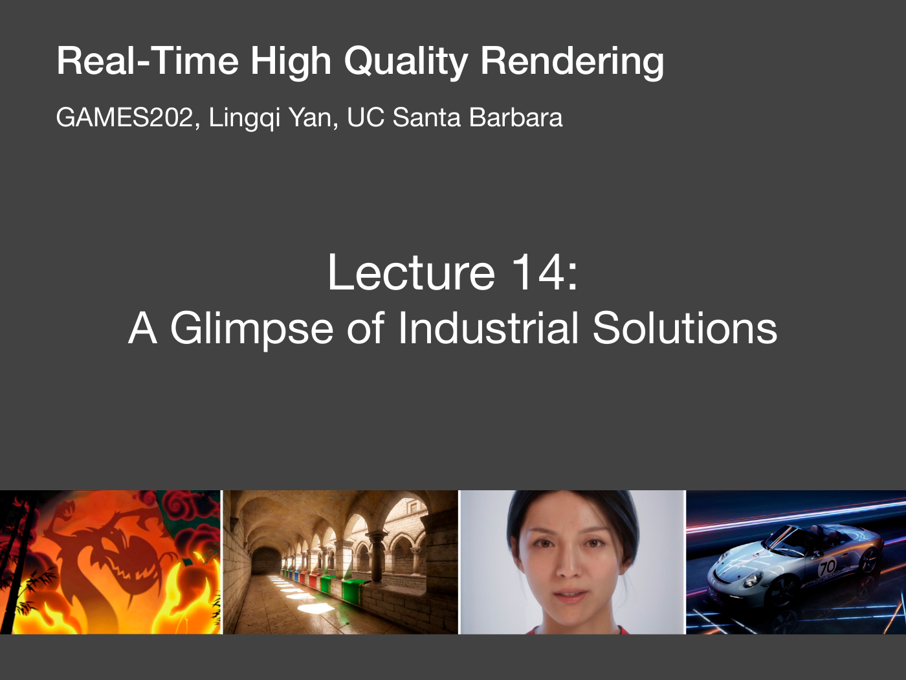

Lecture 12、13 建立了时空降噪的基本工具，本讲先说明 SVGF 与 RAE 如何组织这些信息，再把视角扩展到抗锯齿、超分辨率、多光源、层次细节与混合全局光照。这也是 GAMES202 的最后一讲。

> 工业界的实时渲染方案通常需要组合多种方法：复用已经计算的信息，并把计算预算集中到真正影响画面的地方。

## 1. 本讲路线

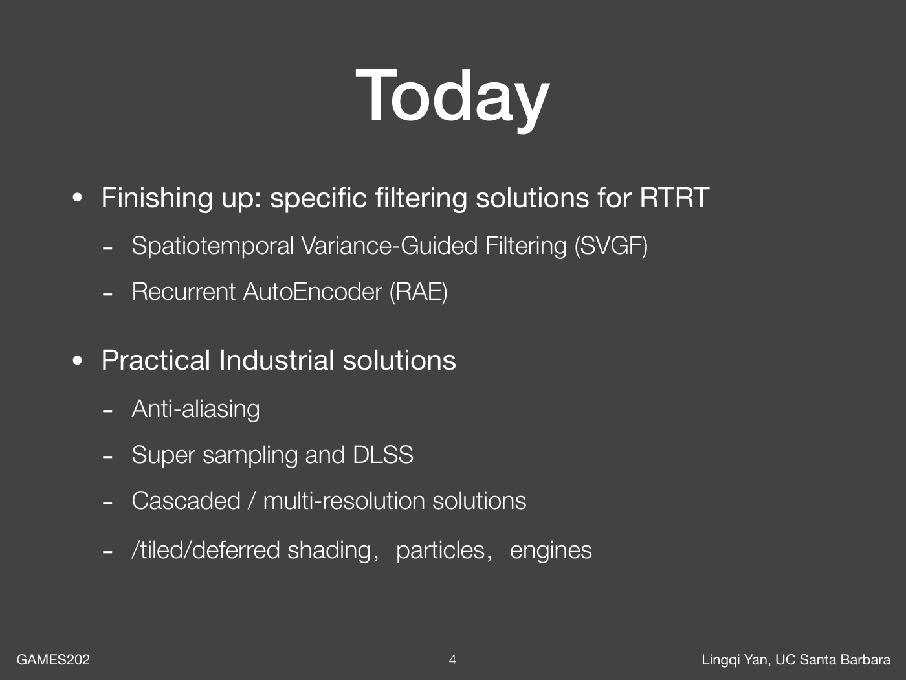

1. SVGF：以方差指导时空滤波。
2. RAE：用循环神经网络学习空间重建与历史复用。
3. TAA、MSAA、SSAA 与图像空间抗锯齿。
4. 时域超分辨率与课件中的 DLSS 2.0。
5. 可见表面着色、Tiled Shading、Clustered Shading。
6. 级联与几何 LOD，以及混合 GI。

第 13 讲提纲中的 SVGF、RAE 在这里才实际展开。课件后面的其他课程广告不属于本讲技术主线；粒子、透明材质等被列为未覆盖主题，也不应从提纲推断为已经系统讲授。

## 2. SVGF 在基础降噪上增加了什么

SVGF 全称 Spatiotemporal Variance-Guided Filtering。第 13 讲已经有联合双边滤波和 à-trous，本讲进一步回答：同样大的亮度差，什么时候应该当成噪声，什么时候应该保护为边界？

核心是结合局部不确定性：噪声大时允许更多邻居参与；信号稳定时，更严格保护差异。SVGF 用时域累积提高有效采样数，再利用时空亮度方差引导层次化图像空间滤波。[原论文项目页](https://research.nvidia.com/labs/rtr/publication/schied2017spatiotemporal/)

这里的 variance 是方差，不是简单把滤波半径设大。课程重点展示深度、法线、亮度三个引导项以及方差的稳定处理，没有逐行实现完整论文算法。

## 3. 深度权重：不要把同一斜面当作断层

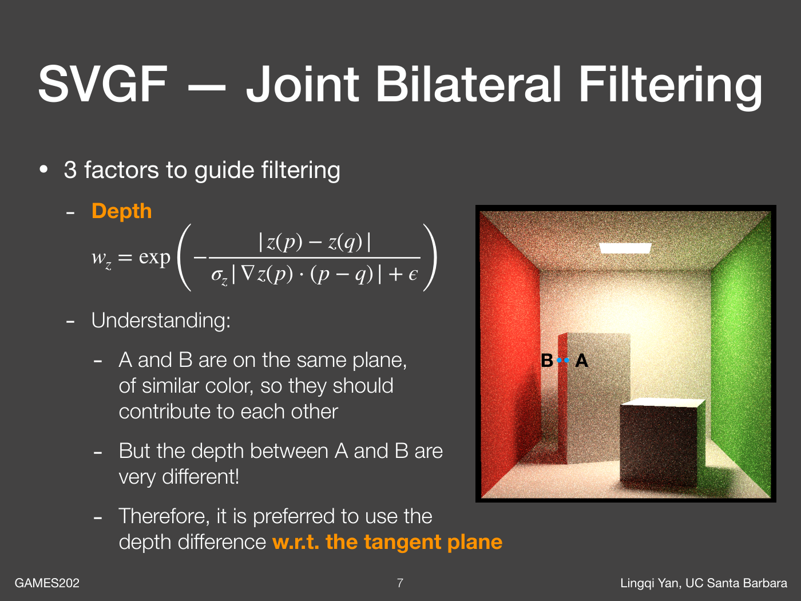

如果只比较 $|z(p)-z(q)|$，同一倾斜表面上的两个点也可能被误判为不相容。课件引入深度梯度，对局部深度变化的尺度进行补偿：

$$
w_z(p,q)=\exp\left(
-\frac{|z(p)-z(q)|}
{\sigma_z|\nabla z(p)\cdot(p-q)|+\epsilon}
\right).
$$

- $p,q$：屏幕像素坐标。
- $z$：在一致坐标约定下比较的深度。
- $\nabla z(p)$：中心像素附近的屏幕空间深度梯度。
- $\sigma_z$：允许深度变化的尺度系数。
- $\epsilon$：避免分母为零。

一阶展开给出：

$$
z(q)\approx z(p)+\nabla z(p)\cdot(q-p).
$$

因此，较大的深度差若与局部斜率相符，不应该仅因绝对差大就被完全拒绝。相反，前后两个不连续表面的差异通常无法由中心处局部斜率解释。

**公式辨析：**课件公式把梯度放在分母调节容差，并不是在分子直接计算点到切平面的残差。两种做法都能表达局部几何一致性的思想，但不能把它们写成同一个公式。深度断层附近的梯度也可能不可靠，工程实现需防止错误放宽边界。

## 4. 法线权重：使用宏观表面方向

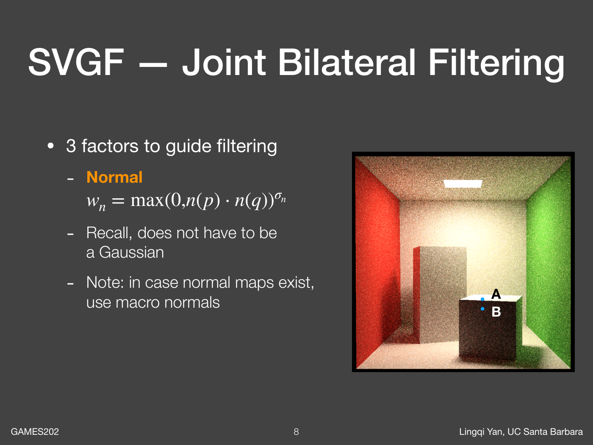

课件使用截断余弦的幂：

$$
w_n(p,q)=\max(0,\mathbf n(p)\cdot\mathbf n(q))^{\sigma_n}.
$$

两条法线必须归一化并处于相同空间。夹角越大，权重越小；对于小于 1 的点积，提高指数会使权重下降得更快。这里的 $\sigma_n$ 是指数参数，不是高斯分布的标准差。

课件特别指出：存在 normal map 时，使用宏观法线。细碎的法线纹理会让几乎每个邻居都被当成不同表面，妨碍低频光照平滑。

这不等于最终着色忽略 normal map；要区分材质着色的法线与用于判断滤波邻域的引导法线。选择哪一种法线，应与待重建的光照分量相配。

## 5. 亮度权重：用方差调节对亮度差的容忍

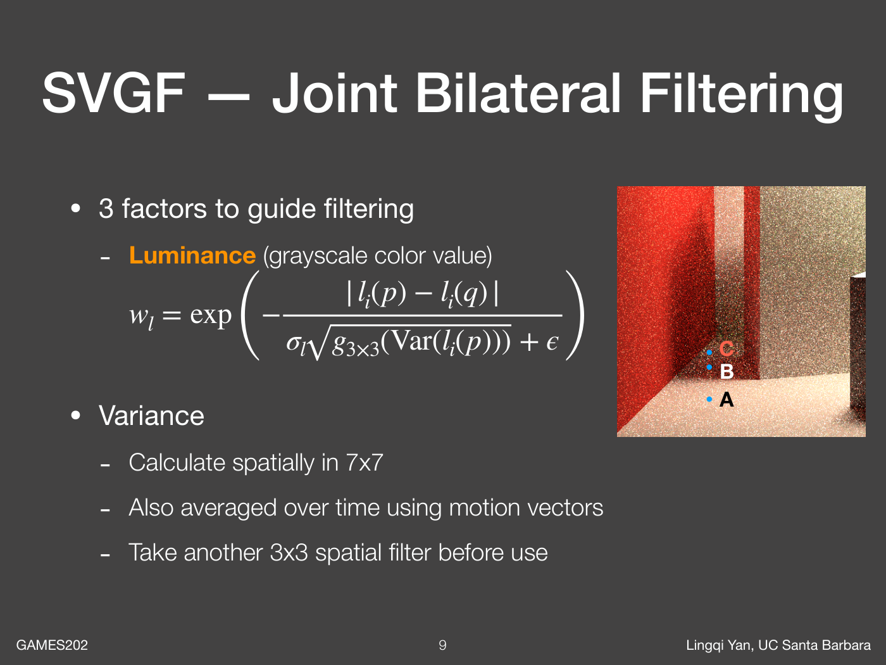

记第 $i$ 轮亮度为 $l_i$，课件中的亮度权重为：

$$
w_l(p,q)=\exp\left(
-\frac{|l_i(p)-l_i(q)|}
{\sigma_l\sqrt{g_{3\times3}(\operatorname{Var}(l_i(p)))}+\epsilon}
\right).
$$

$g_{3\times3}$ 表示对方差图做小范围空间平滑，再开平方得到标准差尺度。PDF 文本提取容易漏掉根号，应以课件图中的公式为准。

理解两个极端：

- **方差大**：分母增大，同样的亮度差受到较小惩罚，可以更积极地降噪。
- **方差小**：分母减小，稳定的亮度差更可能代表结构，应更严格地保护。

因此亮度差并非固定阈值意义上的边界，而是相对于估计噪声水平来判断。方差估计错误，也会导致该模糊的地方不模糊，或该保留的地方被抹掉。

## 6. 为什么方差还需要时空稳定

课件给出的教学流程是：在 $7\times7$ 邻域估计方差，利用运动向量在时间上平均，再在使用前做一次 $3\times3$ 空间滤波。

直接从极低 SPP 图像估计的方差同样会波动。如果权重随方差剧烈改变，降噪器本身就会产生闪烁。时间复用增加统计信息，小范围平滑则减小方差估计的局部不稳定。

**补充：一阶、二阶矩的表达。**若保存亮度的矩，可以写为：

$$
m_{1,t}=\alpha l_t+(1-\alpha)m_{1,t-1}(p'),
$$

$$
m_{2,t}=\alpha l_t^2+(1-\alpha)m_{2,t-1}(p'),
\qquad
v_t=\max(0,m_{2,t}-m_{1,t}^2).
$$

这说明为什么方差估计需要历史统计量，而不仅是最终颜色。但它不是对课件 $7\times7$ 流程的逐步复述，也不等同于完整 SVGF 实现。历史长度不足、重投影失效或光照突变时，统计量同样需要处理；只重置颜色却保留旧矩，会让滤波强度失真。

## 7. 把 SVGF 权重接回 à-trous

在第 13 讲的小核多轮框架中，可将邻居权重理解为：

$$
w_i(p,q)=h_i(p,q)\,w_z(p,q)\,w_n(p,q)\,w_l(p,q),
$$

$$
C_{i+1}(p)=\frac{\sum_qw_i(p,q)C_i(q)}{\sum_qw_i(p,q)}.
$$

$h_i$ 是第 $i$ 轮小核及采样间隔，其他因子负责保边与自适应。权重和仍然需要归一化；à-trous 仍然读取上一轮结果，逐轮扩大间隔。

课件没有给出全部历史缓冲、信号拆分与反馈位置的细节。不能把第 13 讲“先空间、再时间”的最小伪代码直接改名为完整 SVGF；真正复现论文时，应重新核对时域累积、方差估计与层次滤波的阶段顺序。

## 8. SVGF 的能力边界

方差引导改善了空间降噪的判断，但不能解决全部历史失效：移动阴影、反射运动、遮挡解除仍可能导致拖影或不稳定。很小的发光体、稀有高贡献路径和细薄几何也可能挑战统计估计与保边条件。

课件展示结果和失败案例，重点是理解“可解释的统计规则也有假设”，不能把方差看作信号正确性的证明。局部颜色差既可能来自噪声，也可能来自真实结构。

## 9. RAE：把重建规则交给网络学习

RAE 在本讲指 Recurrent Denoising Autoencoder。输入包括低样本颜色和 G-buffer，输出为重建后的图像序列；循环连接将过去信息保存在特征状态中，用于提高时间稳定性。[原论文项目页](https://research.nvidia.com/publication/2017-07_interactive-reconstruction-monte-carlo-image-sequences-using-recurrent)

与手工指定 $w_z,w_n,w_l$ 相比，它学习辅助特征与正确颜色之间的关系。不能因此认为它不需要时序信息，或天然不会产生拖影。

## 10. 编码器、解码器与循环状态

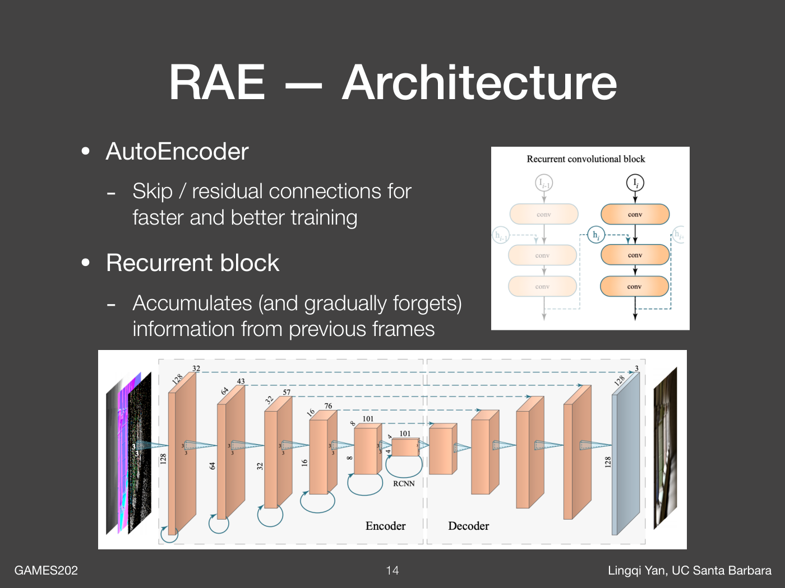

课件强调两个结构：

- **AutoEncoder / U-Net 式结构**：编码阶段在多尺度上提取信息，解码阶段恢复空间分辨率；跳跃连接帮助传递细节。
- **Recurrent block**：把前帧特征保留到当前帧，并逐渐遗忘过时信息。

可用下面的抽象表达理解：

$$
(\widehat C_t,H_t)=F_\theta(\widetilde C_t,G_t,H_{t-1}).
$$

$G_t$ 是当前辅助特征，$H_t$ 是隐藏状态。它不是简单保存一张历史 RGB 图，而是在特征空间内利用时间信息。这个表达只说明数据依赖，不指定网络层数，也不暗示其内部采用某种固定运动向量重投影算法。

**工程补充：**使用学习式模型还需考虑训练数据覆盖、HDR 数值范围、推理开销和镜头切换时的状态重置。网络在训练分布内效果好，并不保证所有材质、噪声分布和运动都能处理得同样稳定。

## 11. SVGF 与 RAE 应怎样比较

| 维度 | SVGF | 本讲的早期 RAE |
| --- | --- | --- |
| 核心规则 | 人工设计时空统计与引导权重 | 从训练数据学习重建规则 |
| 历史信息 | 显式历史、几何对应和统计量 | 循环特征状态 |
| 调试切入点 | 方差、权重、历史有效性 | 输入、状态、训练与输出表现 |
| 课件指出的问题 | Ghosting | Overblur、ghosting、当时推理较慢 |

课件第 17 页明确限定 RAE 的比较为最初提出时的情况。这是理解两种设计路线的课堂比较，不能推广为“所有神经降噪都比手工滤波慢”或当下产品的性能排名。

## 12. TAA：把子像素样本分摊到时间上

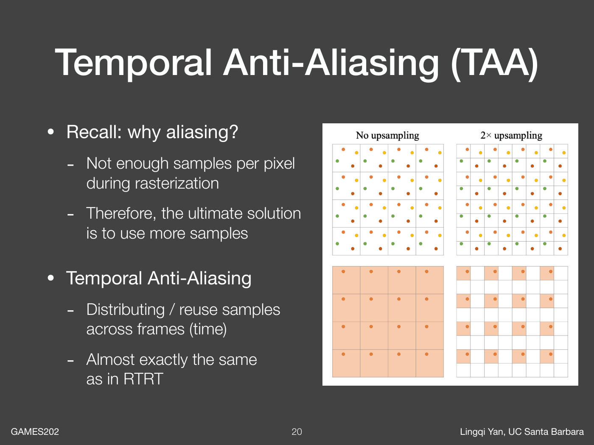

抗锯齿需要估计一个像素覆盖区域内的平均值，而不是只取一个固定位置。TAA 将不同的子像素采样位置分布到连续帧中，重投影后再融合。

补充的最小流程是：

1. 在连续帧中改变投影的子像素抖动位置。
2. 渲染当前颜色及必要的深度、运动信息。
3. 对齐上一帧历史，排除不可复用的区域。
4. 限制历史范围并混合当前结果。

它与光追时域降噪共享“利用历史增加有效采样”的思想，但主要重建的信号不同：前者处理像素覆盖及着色混叠，后者处理光照积分的随机误差。

投影抖动必须与运动向量约定一致，否则算法可能将人工采样偏移误当成物体运动。切镜、遮挡解除和快速变化也仍需要历史管理。

## 13. SSAA、MSAA 与图像空间 AA

| 方法 | 主要做法 | 成本与限制 |
| --- | --- | --- |
| SSAA | 提高采样分辨率后下采样 | 覆盖和着色都更密，成本高 |
| MSAA | 多位置测试覆盖／深度，复用部分着色结果 | 主要改善几何边缘，不能自动消除所有着色混叠 |
| FXAA / MLAA / SMAA | 分析图像边缘并重建边缘过渡 | 不能获得输入中完全缺失的真实采样信息 |
| TAA | 跨帧分配与复用样本 | 需要历史对应，可能拖影或变软 |

**MSAA 表述修正：**典型 MSAA 的着色复用主要发生在同一像素内、同一图元所覆盖的多个样本之间，不能理解为整块三角形只着色一次，或任意跨像素共享颜色。开启逐样本着色会改变这一成本特征。[Khronos Multisampling](https://wikis.khronos.org/opengl/Multisample)

## 14. 为什么不能把 G-buffer 当普通颜色做 AA

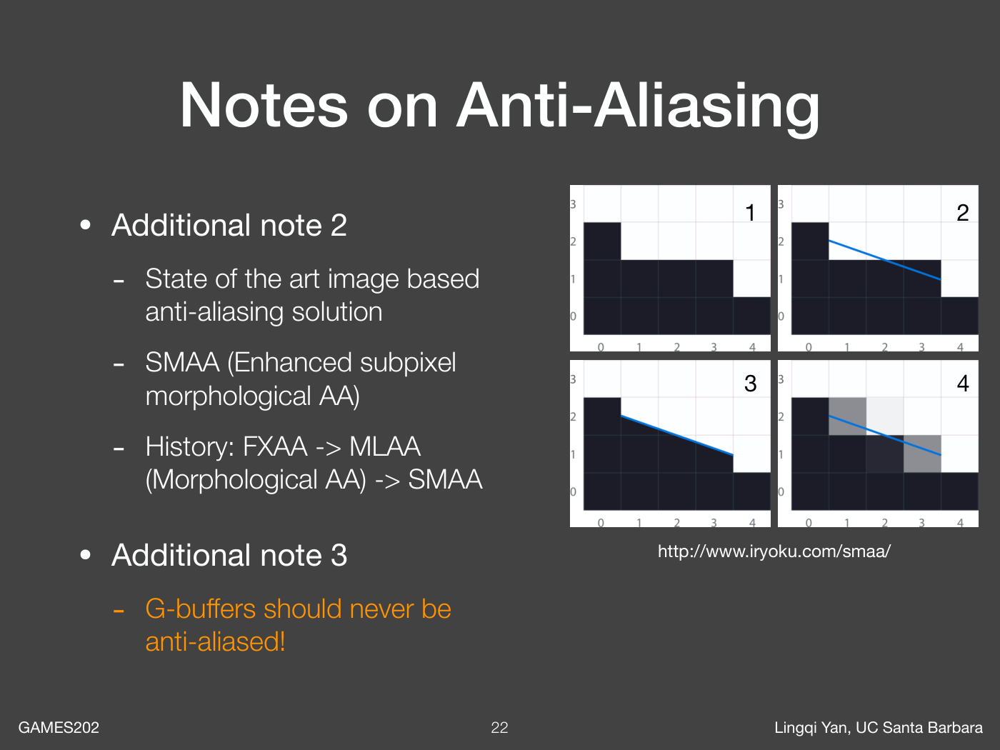

课件强调 G-buffer 不应被抗锯齿。实际要防止的是在不同表面之间无条件平均几何与身份属性：

- 前景深度 1 与背景深度 10 的平均值 5.5 可能根本不对应任何表面。
- 两个不同面的法线相加，会制造不存在的表面方向。
- 对象 ID 没有连续插值意义。

因此不能先把这些属性像最终 RGB 一样模糊，再拿去做着色或历史验证。这并不禁止多样本 G-buffer、逐样本属性或边缘感知 resolve；关键是保留样本对应的表面语义。

## 15. 时域超分辨率与 DLSS 2.0 的课堂解释

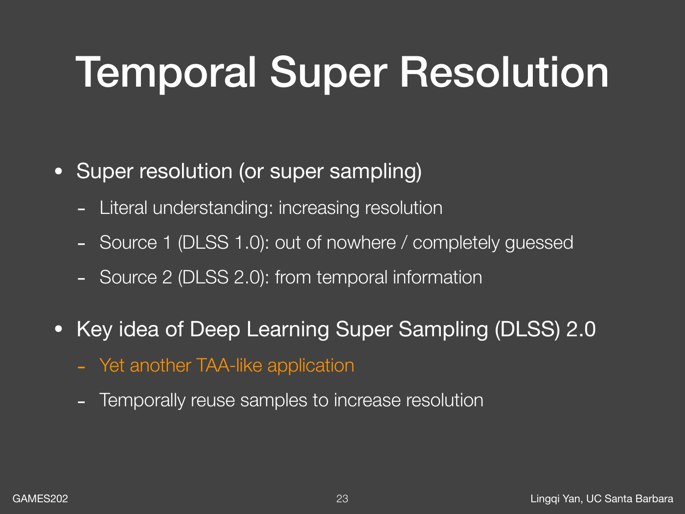

普通上采样只能依据当前低分辨率邻域插值。时域超分辨率还可以利用前几帧在不同子像素位置获得的观测，来重建更密集的输出网格。

课件将 DLSS 2.0 解释为又一种类似 TAA 的应用：从时间中取得额外信息，再进行高分辨率重建。这里讨论的是 2021 年课堂对其基本思想的解释，不是当前 DLSS 功能、模型或内部网络的完整说明。

**补充例子：**从 540p 到 1080p，宽高各扩大 2 倍，输出像素数扩大 4 倍。双线性或双三次插值不会新增真实观测；连续帧的不同采样位置则可能提供新的细节信息，但依赖可靠对齐。

## 16. 超分辨率的历史失效为何更难

普通时域降噪中，当前帧至少有目标像素网格上的观测。超分辨率却需要重建当前帧没有直接采到的细网格值。

所以课件所说“clamping 不再是选项”，应理解为：仅靠把历史钳到当前低分辨率邻域，无法补齐所有缺失的高分辨率细节。不能推导成“任何超分辨率系统都不能使用历史钳制”。

课件还强调推理必须足够快。若重建开销抵消了低分辨率渲染节省的时间，方案就没有达到实时性能目标。总预算应计算渲染、历史处理和重建之和，而非只比较输入分辨率。

## 17. 着色优化的第一步：减少不可见片元工作

传统的朴素分析把成本写成：

$$
O(F\,L),
$$

其中 $F$ 为参与着色的片元数，$L$ 为灯光数量。多层几何重叠时，最终只看到最近表面，其余工作可能浪费。

课件通过先确定可见性、再进行昂贵着色来说明优化目标：把光照成本降到更接近 $O(P\,L)$，其中 $P$ 是可见表面样本数。

**限定：**这不是说现代正向渲染一定给所有隐藏片元做完整着色。Early-Z 可以提前拒绝部分片元，是否有效取决于管线与 shader 行为。[Khronos Early Fragment Test](https://www.khronos.org/opengl/wiki/Force_Early_Depth)

## 18. 区分 Depth Prepass 与 Deferred Shading

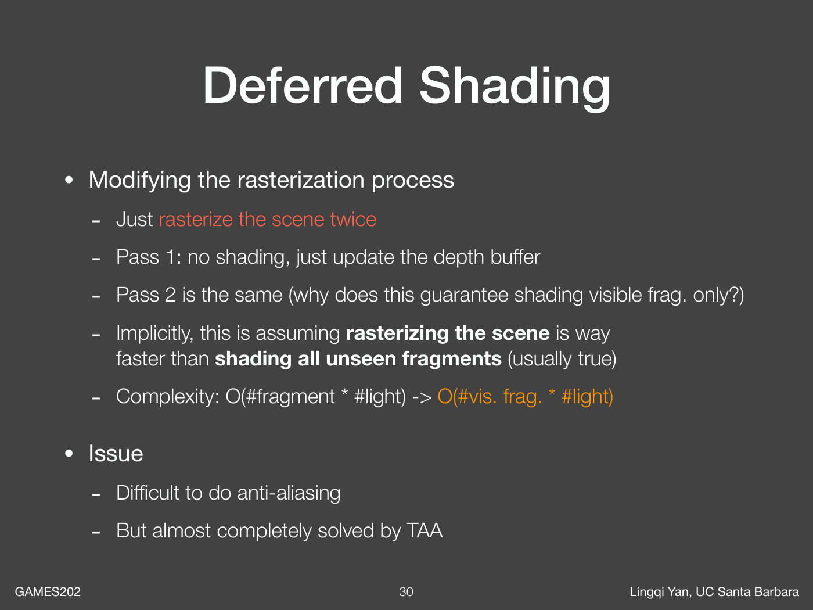

课件在 Deferred Shading 标题下采用“第一遍只写深度，第二遍着色”的教学描述。实现时要区分两种安排：

| 方案 | 第一阶段 | 第二阶段 |
| --- | --- | --- |
| Depth prepass + forward | 写入最近表面的深度 | 再画几何，用深度测试筛选后执行正向着色 |
| 常见 G-buffer deferred | 写入可见表面的深度、法线、材质等 | 读取 G-buffer，对可见样本计算光照 |

两者都可减少昂贵着色的遮挡浪费，但不等同。Deferred 的重点在于将几何／材质信息生成与光照计算分离，不是“只要画两遍就是延迟着色”。

深度预通道也不是免费：它增加几何处理与带宽成本，收益依赖 overdraw 和 shader 成本；透明度、alpha test 等需要一致的可见性处理。

## 19. Tiled Shading：减少每个区域的候选灯光

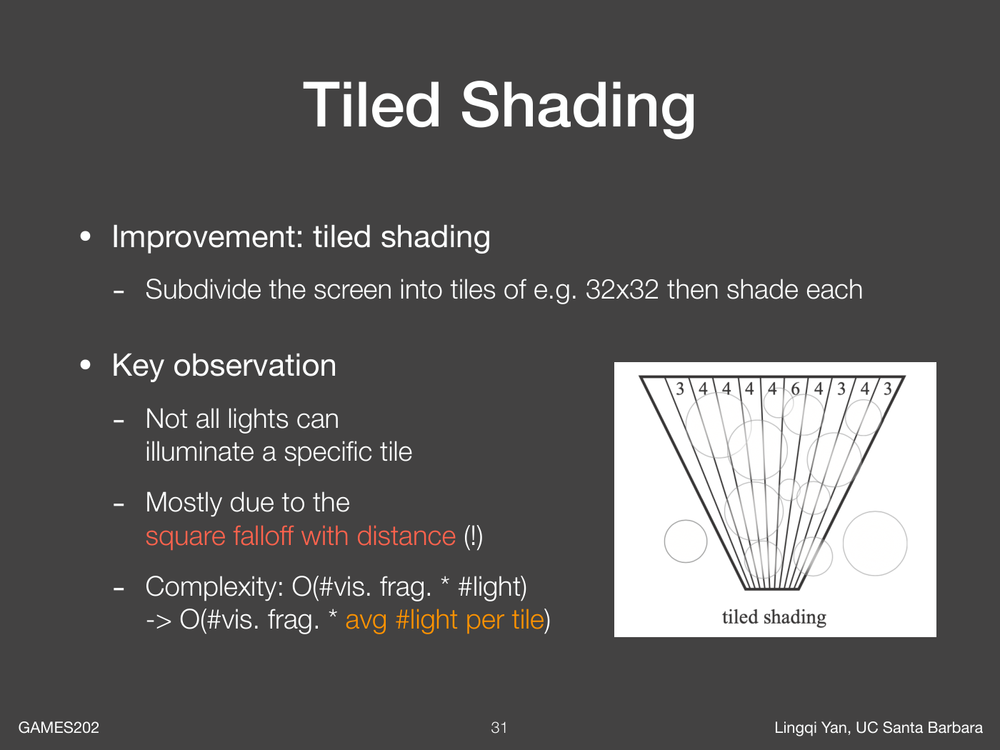

屏幕划分为例如 $32\times32$ 像素的 tile，为每块建立可能影响该区域的灯光列表。区域内像素只遍历这份列表：

$$
O(P\,L)\longrightarrow O(P\,\overline L_{\mathrm{tile}}).
$$

课件从距离衰减解释为什么远处灯光往往可忽略。需要补充：平方反比衰减不会在有限距离上自动变成零；实际剔除通常需要显式影响半径或可接受贡献阈值。

灯光列表还需包含边界相交测试、存储与构建成本。列表容量不足时不能悄悄丢灯，否则会造成闪烁或缺光。

## 20. Clustered Shading：再把深度分段

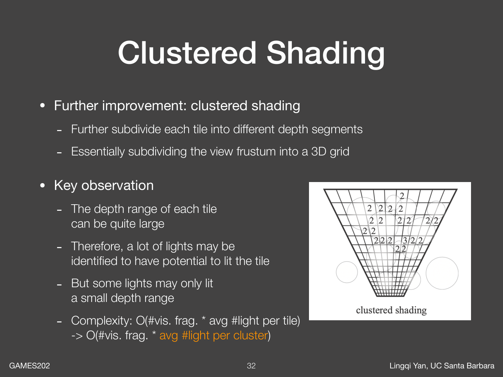

同一个 tile 中可能同时出现近处物体和远处背景。仅按二维投影生成灯光列表，会把只影响近处的灯也交给远处像素测试。

Clustered Shading 继续沿深度切分视锥：

$$
\mathrm{cluster}=(\mathrm{tile}_x,\mathrm{tile}_y,\mathrm{depthSlice}),
$$

$$
O(P\,\overline L_{\mathrm{tile}})
\longrightarrow O(P\,\overline L_{\mathrm{cluster}}).
$$

每个像素根据屏幕坐标和深度选择更局部的列表。深度切片可以采用合适的非均匀分布，但课件并未规定唯一切片公式。

Tiled / Clustered 解决灯光分配问题，Forward / Deferred 解决着色组织问题；这些概念可以组合，并非互斥的三种完整渲染器。

## 21. 多光源着色流程（补充伪代码）

```text
geometryPass():
    write visible depth, normal, material

buildLightLists():
    for each tile or cluster:
        bounds = computeRegionBounds()
        list = lightsWhoseInfluenceIntersects(bounds)
        storeListWithOverflowHandling(list)

lightingPass():
    for each visible sample p:
        region = regionFromScreenAndDepth(p)
        color = emission(p)
        for light in lightList[region]:
            color += evaluateDirectLighting(p, light)
        output[p] = color
```

这只说明工作分配，未包含阴影生成、透明物体、间接光或具体 GPU 列表构建算法。减少灯光遍历并不会自动降低所有阴影和 GI 成本。

## 22. LOD：按屏幕贡献分配细节

纹理 MIPMAP 已经体现 Level of Detail：小投影区域不需要与近处物体相同的细节密度。课程将这条思路推广到阴影、LPV 和几何。

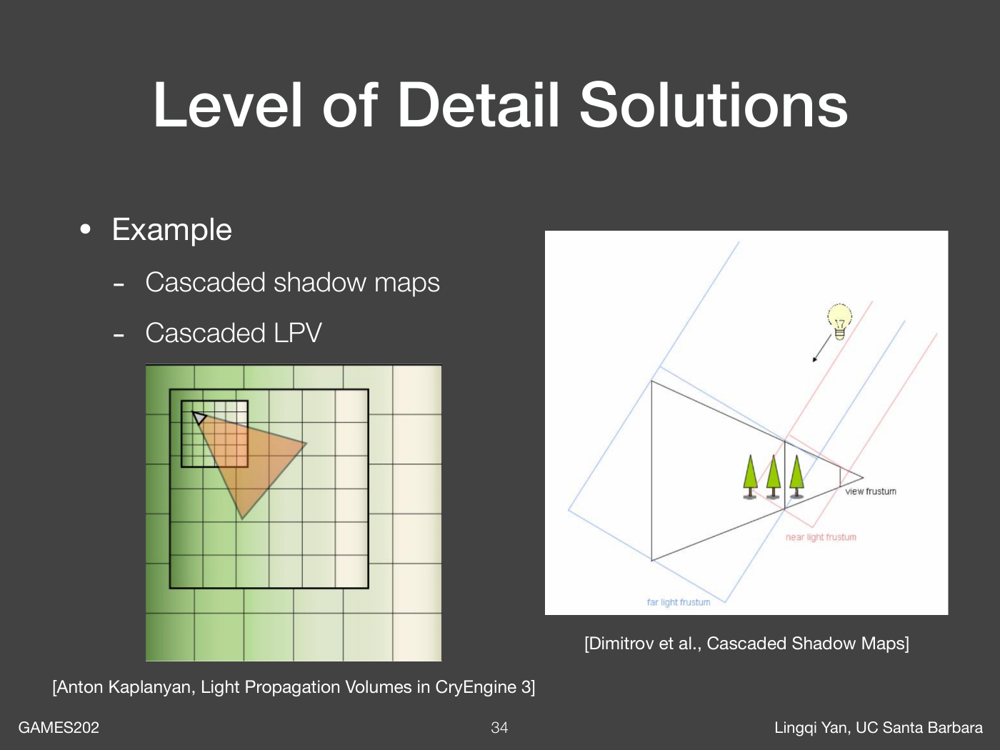

级联方案在不同空间范围使用不同精度：近处范围较小、分辨率密度较高，远处范围更大、精度较低。重点是让资源密度与观察需求匹配，而非为整个世界使用最高分辨率。

LOD 是广义的细节层次选择，cascaded 是组织多个覆盖范围的常见方式；不是所有 LOD 都必须叫级联。

## 23. 层级过渡比选择层级更容易出伪影

若相机稍一移动就从一层切到另一层，几何、阴影或光照可能突然跳变。课件指出常用办法是让相邻层在边界附近重叠并混合。

补充实现时应检查：

- 两层的空间坐标与能量尺度是否一致。
- 过渡带是否足够稳定，是否出现层级反复切换。
- 混合的是可插值的信号，还是对象 ID 等离散属性。
- 几何层级接缝是否真的闭合。

TAA 能缓和某些时间上的跳变，但无法修补不存在的几何连接或长期错误的遮挡关系。

## 24. 几何 LOD 与 Nanite 的课堂类比

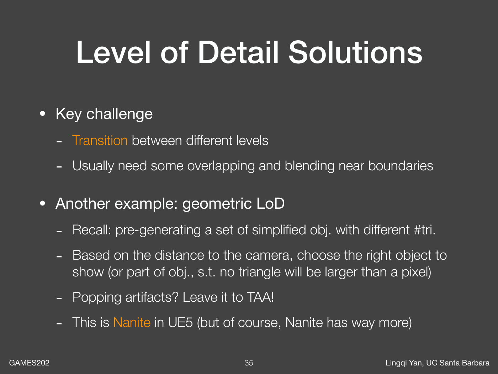

课程从预生成不同三角形数量的模型讲起，再引出局部选择细节、以屏幕投影尺度控制几何开销的思想，并以早期 UE5 Nanite 为例。

这是一种原理层面的类比，不能归纳为“Nanite 就是几个简化模型加 TAA”。课件紧接着列出更复杂的工程问题：局部层级接缝、数据动态加载、缓存与带宽、几何表示、裁剪与剔除。

理解重点是：知道 LOD 的科学依据，只是系统设计的起点；组织海量几何并保证连续、可见、可调度，仍需要大量工程工作。

## 25. 为什么 GI 往往采用混合方案

屏幕空间追踪很便宜，却没有屏幕外和被遮挡表面的信息；更完整的场景追踪信息更多，成本也更高。课件提出一种分层思路：

1. 先使用屏幕空间信息得到便宜的估计。
2. 对失败或不可靠的部分，转向更完整的场景表示。
3. 依据距离、材质与预算选择软件或硬件追踪及光照缓存。

不能把“SSR 未命中”直接理解为“该方向辐亮度为零”，它也可能仅意味着数据缺失。混合算法需要区分真实未命中与当前表示无法回答。

课件中对实时光追完整性的肯定，也应理解为几何查询更通用；有限采样、材质模型和路径截断仍会限制最终 GI 的准确度。

## 26. SDF、代理几何、RSM 与 Probe 各负责什么

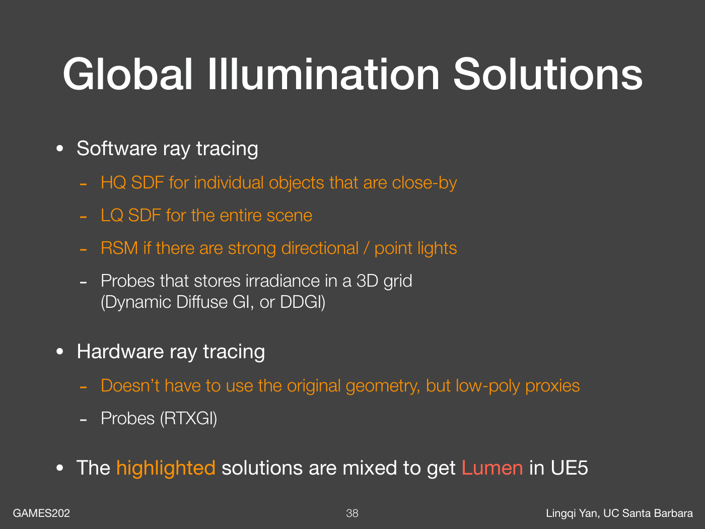

| 组件 | 能提供的信息 | 局限或成本 |
| --- | --- | --- |
| 近处对象高精度 SDF | 较细致的对象距离／几何查询 | 存储与更新成本，细薄结构精度 |
| 全场景低精度 SDF | 较大范围的粗几何查询 | 漏光、细节缺失 |
| RSM | 光源视角下的反射信息 | 受光源视角与采样覆盖限制 |
| 三维 Probe 网格 | 可插值的间接光照缓存 | 空间分辨率、遮挡泄漏、动态更新 |
| 硬件追踪代理几何 | 比全精度几何更便宜的求交表示 | 代理与真实表面不一致 |

SDF 提供距离或几何信息，不能单独给出完整的材质辐亮度。Probe 缓存光照，也不能直接替代所有方向上的精确可见性。混合系统既要找到几何，还要决定命中后从哪里取得着色信息。

课件以这些组件解释早期 Lumen 的可能组织方式。这里保留这一历史语境，不把候选组件列表当成当前 Lumen 的确定管线，也不意味着它们全部按固定顺序执行。

## 27. 混合估计要避免重复计算同一份能量

**补充理解：**两个方法估计的是同一个光照分量时，直接相加会重复计能量。可用置信度混合的概念表达：

$$
L_{\mathrm{estimate}}=c\,L_{\mathrm{screen}}+(1-c)L_{\mathrm{fallback}},
\qquad 0\le c\le1.
$$

这不是课件给出的 Lumen 公式，而是帮助区分“替补／混合”与“独立光照项相加”。置信度变化还应保持空间和时间连续，否则屏幕边界或表示切换处会闪烁。

如果两个结果表示不同的物理项，例如直接光与间接光，则可以按各自定义相加。是否相加取决于它们估计什么，不取决于它们使用了什么算法名字。

## 28. 常见误解

- **方差大就说明这里是真实边缘**：它也可能仅仅是强噪声。
- **法线权重必须采用高斯**：课件使用截断点积的幂。
- **RAE 自动利用时间，所以不会拖影**：学习式历史复用也会失败。
- **MSAA 把所有着色都算多次**：典型做法复用同一像素内部分样本的着色。
- **G-buffer 不能做 AA，所以不能有多样本 G-buffer**：关键是不能混淆不同表面的属性。
- **渲染两遍就是 Deferred Shading**：深度预通道与 G-buffer 延迟着色应区分。
- **Tiled 与 Clustered 是不同材质模型**：它们主要改变灯光候选集合。
- **TAA 可以解决所有 LOD 裂缝**：几何连接与层级连续性仍需正确处理。
- **有 SDF 就有完整 GI**：距离查询之外还需材质、光照及缓存信息。

## 29. 学习实现时的调试清单

1. SVGF：分别显示深度、法线、亮度权重和方差图。
2. 用斜平面验证深度梯度容差，用真实断层验证保边。
3. 固定相机只移动光源，检查历史颜色和统计量是否及时响应。
4. TAA：检查 jitter 与 motion vector 的约定、切镜重置和新露出区域。
5. 用 ID／深度边界检查 G-buffer 是否被错误平均。
6. 多光源：显示 tile／cluster 灯光数量，并与遍历全灯的参考结果对比。
7. 检查灯光列表溢出以及有限半径剔除的视觉误差。
8. LOD：缓慢经过分界，检查跳变、接缝和层级反复切换。
9. GI：分别显示 screen-space、fallback 和置信度，定位表示切换问题。
10. 性能：统计历史处理、滤波、灯光列表构建与带宽开销，不能只数射线或三角形。

以上是学习时可采用的验证项目，不表示本仓库已实现或执行过这些算法。

## 30. 全课程的衔接

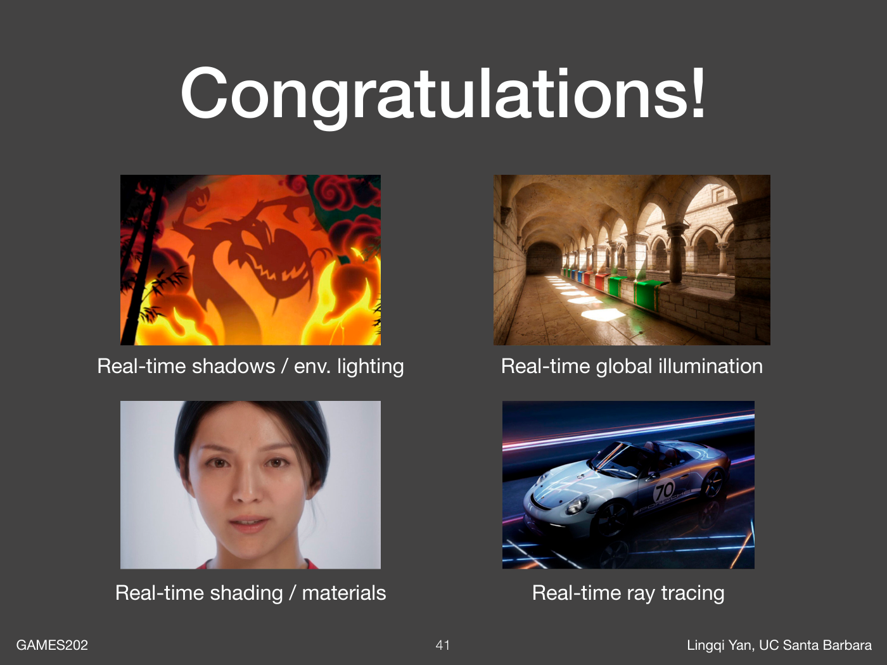

| 课程主线 | 代表内容 | 本讲如何承接 |
| --- | --- | --- |
| 阴影与环境光照 | PCSS、VSSM、SDF、PRT | 级联、几何查询与信息复用 |
| 实时全局光照 | RSM、LPV、VXGI、SSAO、SSR | 组合表示、失败回退与光照缓存 |
| 材质与着色 | Microfacet、GGX、Kulla–Conty、LTC、NPR | 在有限预算中保留重要外观 |
| 实时光追 | 重投影、时域累积、联合滤波、à-trous | SVGF、RAE、TAA 与时域重建 |

本讲把单项技术放回完整系统：降低噪声需要时空统计，抗锯齿需要更多有效样本，多光源需要局部候选集合，复杂场景需要层次表示。方法的价值既取决于近似是否合理，也取决于它在整个帧预算中的成本与失败表现。

课件最后列出的透明度、粒子、景深／运动模糊、蓝噪声、注视点渲染、ReSTIR、体积与头发等，属于继续学习的方向，并非本课程已经覆盖。

上一篇：[Real-Time Ray Tracing 2：空间滤波、大核实现与钳制](lecture13-real-time-ray-tracing-2.md)。
